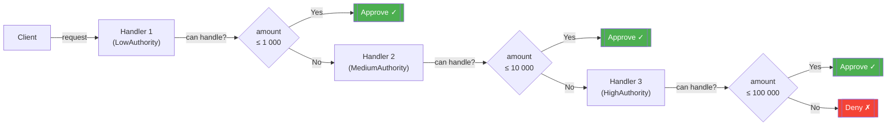

# :material-link-chain: Chain of Responsibility Pattern

!!! abstract "At a Glance"
    **Intent:** Pass a request along a chain of handlers; each handler decides to process it or forward it to the next handler.
    **C++ Equivalent:** Linked list of handler objects with virtual `handle()` method.
    **Category:** Behavioral

<div class="grid cards" markdown>
- :material-lightbulb-on: **Core Concept** — Decouple senders from receivers by giving multiple objects a chance to handle the request.
- :material-snake: **Python Way** — `Handler` ABC with `set_next()` and `handle()`; fluent chaining; can also use a plain list of callables.
- :material-alert: **Watch Out** — If no handler matches, requests silently disappear unless a default terminal handler exists.
- :material-check-circle: **When to Use** — Approval workflows, middleware pipelines, event bubbling, or any scenario where more than one object may handle a request.
</div>

---

## :material-lightbulb-on: Intuition

!!! info "Core Idea"
    Imagine a customer-service escalation path: first the chatbot tries, then a tier-1 agent, then a senior agent, then a manager.
    Each link in the chain either resolves the issue or escalates it — without the customer (sender) knowing which level ultimately handled it.
    Chain of Responsibility formalises this by letting you build the chain at runtime, swap links, and add new links without touching existing code.

!!! success "Python vs C++"
    In C++ you wire handler pointers manually and rely on virtual dispatch.
    Python lets you build the chain with a fluent API (`h1.set_next(h2).set_next(h3)`) and even replace the entire chain with a list of callables or a generator, keeping the same external interface.
    The `abc.ABC` base class removes the need for pure-virtual boilerplate, and Python's duck typing means any callable with the right signature can act as a handler.

---

## :material-transit-connection-variant: Request Flow



---

## :material-book-open-variant: Implementation

### Structure

| Role | Responsibility |
|---|---|
| `Handler` (ABC) | Declares `handle(request)` and `set_next(handler)` |
| `ConcreteHandler` | Handles requests it is responsible for; forwards others |
| `Client` | Composes the chain and triggers the first handler |

### Python Code

```python
from __future__ import annotations
from abc import ABC, abstractmethod
from typing import Optional


# ── Abstract Handler ────────────────────────────────────────────────────────

class Handler(ABC):
    """Abstract base handler with fluent set_next() support."""

    _next: Optional["Handler"] = None

    def set_next(self, handler: "Handler") -> "Handler":
        """Attach the next handler and return it for fluent chaining."""
        self._next = handler
        return handler

    @abstractmethod
    def handle(self, request: float) -> Optional[str]:
        """Process the request or forward it down the chain."""
        if self._next:
            return self._next.handle(request)
        return None  # no handler claimed the request


# ── Concrete Handlers ────────────────────────────────────────────────────────

class LowAuthorityHandler(Handler):
    """Approves purchase requests up to $1,000."""

    LIMIT = 1_000.0

    def handle(self, amount: float) -> Optional[str]:
        if amount <= self.LIMIT:
            return f"LowAuthority approved ${amount:,.2f}"
        return super().handle(amount)


class MediumAuthorityHandler(Handler):
    """Approves purchase requests up to $10,000."""

    LIMIT = 10_000.0

    def handle(self, amount: float) -> Optional[str]:
        if amount <= self.LIMIT:
            return f"MediumAuthority approved ${amount:,.2f}"
        return super().handle(amount)


class HighAuthorityHandler(Handler):
    """Approves purchase requests up to $100,000."""

    LIMIT = 100_000.0

    def handle(self, amount: float) -> Optional[str]:
        if amount <= self.LIMIT:
            return f"HighAuthority approved ${amount:,.2f}"
        return super().handle(amount)


class DenyHandler(Handler):
    """Terminal handler — denies any request that reaches it."""

    def handle(self, amount: float) -> str:
        return f"DENIED: ${amount:,.2f} exceeds all authority levels"
```

### Example Usage

```python
# ── Approval Workflow ────────────────────────────────────────────────────────

def build_approval_chain() -> Handler:
    low = LowAuthorityHandler()
    medium = MediumAuthorityHandler()
    high = HighAuthorityHandler()
    deny = DenyHandler()
    # Fluent chaining: low → medium → high → deny
    low.set_next(medium).set_next(high).set_next(deny)
    return low


if __name__ == "__main__":
    chain = build_approval_chain()
    for amount in [500, 5_000, 50_000, 500_000]:
        result = chain.handle(amount)
        print(result)
    # LowAuthority approved $500.00
    # MediumAuthority approved $5,000.00
    # HighAuthority approved $50,000.00
    # DENIED: $500,000.00 exceeds all authority levels


# ── HTTP Middleware Chain (generator-based, Pythonic alternative) ─────────────

from typing import Callable, Iterator

Middleware = Callable[[dict], Optional[dict]]


def auth_middleware(request: dict) -> Optional[dict]:
    if not request.get("token"):
        return {"error": "401 Unauthorized"}
    return None  # pass to next


def rate_limit_middleware(request: dict) -> Optional[dict]:
    if request.get("calls_today", 0) > 100:
        return {"error": "429 Too Many Requests"}
    return None


def logging_middleware(request: dict) -> Optional[dict]:
    print(f"[LOG] Handling {request.get('path', '/')}")
    return None


def final_handler(request: dict) -> dict:
    return {"status": 200, "body": f"Hello from {request['path']}"}


def run_middleware_chain(
    request: dict, middlewares: list[Middleware]
) -> dict:
    """Run a list-based middleware chain; first non-None response wins."""
    for mw in middlewares:
        response = mw(request)
        if response is not None:
            return response
    return final_handler(request)


req = {"path": "/api/data", "token": "secret", "calls_today": 5}
print(run_middleware_chain(req, [auth_middleware, rate_limit_middleware, logging_middleware]))
# [LOG] Handling /api/data
# {'status': 200, 'body': 'Hello from /api/data'}
```

---

## :material-alert: Common Pitfalls

!!! warning "Silent Request Drops"
    If you forget a terminal handler and no concrete handler claims the request, `handle()` returns `None` with no indication of failure.
    Always add a catch-all handler at the end, or assert the result is not `None`.

!!! warning "Infinite Loop Risk"
    Never make a handler set itself or an ancestor as `_next`; the chain will loop forever with no stack-overflow protection in pure Python.

!!! danger "Broken super() Call"
    Forgetting `return super().handle(request)` inside a concrete handler short-circuits the chain silently.
    Every non-terminal handler **must** delegate to `super()` when it cannot handle the request.

!!! danger "Mutable Default on Class Body"
    Defining `_next: Optional[Handler] = None` as a **class** attribute (not instance attribute) means all instances share the same `_next` until overwritten. Always initialize mutable state in `__init__` for production code.

---

## :material-help-circle: Flashcards

???+ question "What is the single-sentence intent of Chain of Responsibility?"
    Avoid coupling the sender of a request to its receiver by giving more than one object a chance to handle the request — each handler either processes or forwards it.

???+ question "How does fluent chaining work in Python?"
    `set_next()` stores the next handler in `self._next` **and returns that handler**, allowing calls to be chained: `h1.set_next(h2).set_next(h3)`.

???+ question "What is the Pythonic list-of-callables alternative?"
    Instead of linked handler objects, keep a `list[Callable]` of middleware functions. Iterate over them; the first that returns a non-`None` value wins. This is how WSGI/ASGI frameworks (e.g., Starlette) work internally.

???+ question "When would a generator-based chain outperform linked objects?"
    When handlers are lazy (computed on demand), stateful, or need to yield partial results — a generator function can `yield from` sub-chains without allocating intermediate handler objects.

---

## :material-clipboard-check: Self Test

=== "Question 1"
    You have a chain `A → B → C`. Handler `B` can process the request but accidentally omits `return`. What happens?

=== "Answer 1"
    `B` processes the request but returns `None` (implicit Python return). The caller receives `None` and may misinterpret it as "unhandled". Always use explicit `return` statements in handlers.

=== "Question 2"
    How would you add logging to every step of the chain **without** modifying existing handler classes?

=== "Answer 2"
    Wrap each handler in a decorator class that logs before/after calling `handle()`, or switch to the list-of-callables approach where a `logging_middleware` function is prepended to the list. Neither approach requires touching existing handler code.

---

## :material-check-circle: Summary

!!! success "Key Takeaways"
    - **Decoupling**: The sender never knows which handler processes its request.
    - **Fluent API**: `set_next()` returning `self._next` enables readable chain construction.
    - **Python flexibility**: Swap the OOP chain for a `list[Callable]` or generator when simplicity matters more than formal structure.
    - **Always terminate**: Add a catch-all or assert non-`None` results to prevent silent failures.
    - **Real-world use**: HTTP middleware (Django, FastAPI, Starlette), logging filters, event bubbling in GUIs, approval workflows.
