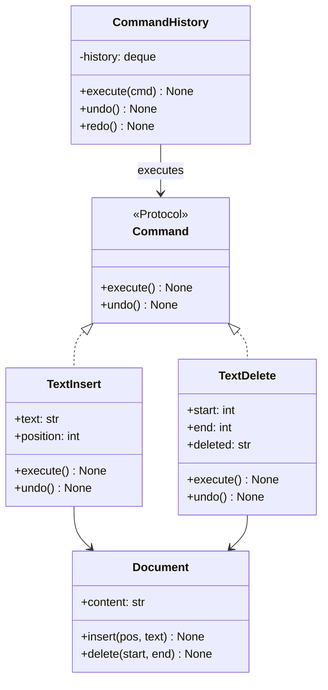

# :material-console: Command Pattern

!!! abstract "At a Glance"
    **Goal:** Encapsulate a request as an object, enabling undo/redo, queuing, and logging.
    **C++ Equivalent:** Abstract `Command` class with `execute()` and `undo()` virtual methods.

<div class="grid cards" markdown>

- :material-lightbulb-on: **Core Concept** — Encapsulate actions as objects with `execute()` and `undo()`
- :material-snake: **Python Way** — Commands can be callables, dataclasses, or namedtuples
- :material-alert: **Watch Out** — Undo requires capturing enough state to reverse the operation
- :material-check-circle: **When to Use** — Text editors, transaction systems, GUI actions, task queues

</div>

## :material-lightbulb-on: Intuition

!!! info "Core Idea"
    The Command pattern turns an action into a standalone object. This lets you: queue commands,
    log them, support undo/redo, and compose them into macros. In Python, commands can be simple
    callables for fire-and-forget, or richer objects with `execute()` + `undo()` for reversible operations.

!!! success "C++ → Python Mapping"
    | C++ | Python |
    |---|---|
    | `struct ICommand { virtual void execute() = 0; }` | `Protocol` with `execute()` |
    | `std::deque<unique_ptr<ICommand>>` | `collections.deque` of command objects |
    | `cmd->execute()` | `cmd.execute()` or `cmd()` |
    | Undo stack | `history: deque[Command]` with max length |

## :material-chart-timeline: Command Structure



## :material-book-open-variant: Protocol + Dataclass Approach

```python
from __future__ import annotations
from typing import Protocol
from dataclasses import dataclass, field
from collections import deque

class Command(Protocol):
    def execute(self) -> None: ...
    def undo(self) -> None: ...

class Document:
    def __init__(self, content: str = "") -> None:
        self.content = content

    def insert(self, position: int, text: str) -> None:
        self.content = self.content[:position] + text + self.content[position:]

    def delete(self, start: int, end: int) -> None:
        self.content = self.content[:start] + self.content[end:]

    def __str__(self) -> str:
        return self.content

@dataclass
class InsertCommand:
    document: Document
    position: int
    text: str

    def execute(self) -> None:
        self.document.insert(self.position, self.text)

    def undo(self) -> None:
        self.document.delete(self.position, self.position + len(self.text))

@dataclass
class DeleteCommand:
    document: Document
    start: int
    end: int
    _deleted: str = field(init=False, repr=False)

    def execute(self) -> None:
        self._deleted = self.document.content[self.start:self.end]
        self.document.delete(self.start, self.end)

    def undo(self) -> None:
        self.document.insert(self.start, self._deleted)

class CommandHistory:
    def __init__(self, maxlen: int = 100) -> None:
        self._done: deque[Command] = deque(maxlen=maxlen)
        self._undone: deque[Command] = deque(maxlen=maxlen)

    def execute(self, command: Command) -> None:
        command.execute()
        self._done.append(command)
        self._undone.clear()   # clear redo stack on new action

    def undo(self) -> bool:
        if not self._done:
            return False
        command = self._done.pop()
        command.undo()
        self._undone.append(command)
        return True

    def redo(self) -> bool:
        if not self._undone:
            return False
        command = self._undone.pop()
        command.execute()
        self._done.append(command)
        return True

# Usage
doc = Document("Hello!")
history = CommandHistory()

history.execute(InsertCommand(doc, 5, ", World"))
print(doc)   # "Hello, World!"

history.execute(DeleteCommand(doc, 0, 5))
print(doc)   # ", World!"

history.undo()
print(doc)   # "Hello, World!"

history.undo()
print(doc)   # "Hello!"
```

## :material-function-variant: Callable Commands (Simple Case)

```python
from collections import deque
from typing import Callable

# For simple, non-undoable commands — just use callables
CommandFn = Callable[[], None]

class TaskQueue:
    def __init__(self) -> None:
        self._queue: deque[CommandFn] = deque()

    def enqueue(self, command: CommandFn) -> None:
        self._queue.append(command)

    def run_all(self) -> int:
        count = 0
        while self._queue:
            cmd = self._queue.popleft()
            cmd()
            count += 1
        return count

# Commands are just functions or lambdas
queue = TaskQueue()
queue.enqueue(lambda: print("Task 1"))
queue.enqueue(lambda: print("Task 2"))
queue.enqueue(lambda: print("Task 3"))
executed = queue.run_all()   # 3
```

## :material-alert: Common Pitfalls

!!! warning "Capturing insufficient state for undo"
    The `DeleteCommand` must capture the deleted text **before** deleting it, or undo is
    impossible. Always capture the "before" state in `execute()` for undoable commands.
    For complex operations, consider a snapshot/memento approach.

!!! danger "Circular references in commands"
    Commands holding references to the document plus the document holding a command history
    can create reference cycles. In CPython this is usually handled by the GC, but it delays
    cleanup. Use `weakref` for the document reference in commands if memory is a concern.

## :material-help-circle: Flashcards

???+ question "What is the difference between a Command and a Strategy?"
    **Strategy** encapsulates an algorithm that runs without side effects (typically).
    **Command** encapsulates an action that has side effects and optionally supports undo.
    Commands are about **what happened** (history, logging, queuing); strategies are about
    **how to do something** (algorithm selection).

???+ question "Why use a `deque` for command history instead of a list?"
    `deque` with `maxlen` automatically discards old entries when the limit is reached —
    perfect for a bounded undo history. `deque.popleft()` is O(1) vs `list.pop(0)` which
    is O(n). For undo/redo, you use `append()` and `pop()` from both ends efficiently.

???+ question "How do you implement a macro (composite command)?"
    Use the Composite pattern: a `MacroCommand` that holds a list of commands.
    `execute()` calls each sub-command in order. `undo()` calls them in reverse order.
    ```python
    class MacroCommand:
        def __init__(self, commands: list[Command]) -> None:
            self.commands = commands
        def execute(self) -> None:
            for c in self.commands: c.execute()
        def undo(self) -> None:
            for c in reversed(self.commands): c.undo()
    ```

???+ question "How do you make commands serialisable (for persistent undo or RPC)?"
    Use `@dataclass` for commands (they have `__dict__` and can be serialised with `dataclasses.asdict()`).
    Or use a command protocol with a `to_dict()`/`from_dict()` method. For network RPC,
    serialize the command name and arguments as JSON; the receiver reconstructs and executes.

## :material-clipboard-check: Self Test

=== "Question 1"
    Add a `redo()` operation to `CommandHistory` and explain why the redo stack must be cleared on new actions.

=== "Answer 1"
    The redo stack is cleared on new `execute()` because the new action creates a diverging
    history. If you undo twice, then type something new, the "future" you undid is no longer
    applicable to the current document state. Keeping it would allow redoing to an inconsistent state.
    The implementation is shown in the `CommandHistory` class above.

=== "Question 2"
    How would you implement command logging for auditing purposes?

=== "Answer 2"
    ```python
    import json
    from datetime import datetime

    class AuditingCommandHistory(CommandHistory):
        def __init__(self, maxlen=100):
            super().__init__(maxlen)
            self.audit_log: list[dict] = []

        def execute(self, command: Command) -> None:
            super().execute(command)
            self.audit_log.append({
                "timestamp": datetime.now().isoformat(),
                "command": type(command).__name__,
                "params": {k: str(v) for k, v in vars(command).items()
                           if not k.startswith("_")},
            })
    ```

## :material-check-circle: Summary

!!! success "Key Takeaways"
    - Command encapsulates an action as an object with `execute()` and `undo()`.
    - Use `@dataclass` for commands — clean, auto-`__repr__`, serialisable.
    - `CommandHistory` with a `deque` provides bounded undo/redo.
    - Clear the redo stack when a new command is executed (avoid diverging history).
    - For simple fire-and-forget queuing, plain callables are sufficient — no class needed.
    - Composite commands (macros) are just a list of commands with reversed undo.
