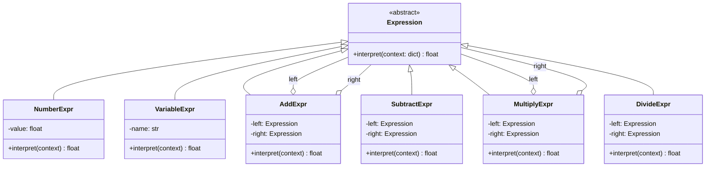

# :material-code-parentheses: Interpreter Pattern

!!! abstract "At a Glance"
    **Intent:** Given a language, define a representation for its grammar along with an interpreter that uses the representation to interpret sentences in the language.
    **C++ Equivalent:** Abstract `Expression` class with virtual `interpret()` + composite tree of concrete expressions.
    **Category:** Behavioral

<div class="grid cards" markdown>
- :material-lightbulb-on: **Core Concept** — Represent grammar rules as a class hierarchy; parse text into an AST and evaluate it recursively.
- :material-snake: **Python Way** — `Expression` ABC, `NumberExpr`/`AddExpr`/`MultiplyExpr` composites, recursive-descent parser; or use Python's built-in `ast` + `eval` for simple cases.
- :material-alert: **Watch Out** — Performance degrades for complex grammars; for production use, consider ANTLR, PLY, or `lark-parser` instead.
- :material-check-circle: **When to Use** — Domain-specific mini-languages, configuration query languages, template engines, calculator REPLs.
</div>

---

## :material-lightbulb-on: Intuition

!!! info "Core Idea"
    Think of a pocket calculator: the expression `3 + 4 * 2` is a **sentence** in the grammar of arithmetic.
    The Interpreter pattern models each grammar rule as a class.
    `AddExpr` holds a left and right sub-expression; `NumberExpr` holds a literal value.
    Calling `expr.interpret()` on the root recursively evaluates the entire tree — just like an abstract syntax tree (AST) walker in a compiler.

!!! success "Python vs C++"
    C++ requires verbose abstract base classes, raw pointers, and manual memory management for the expression tree.
    Python's `abc.ABC` removes the virtual boilerplate, and the recursive nature maps cleanly onto Python's dynamic typing — any object with an `interpret()` method qualifies.
    Better still, Python ships with the `ast` module that can parse and compile real Python expressions, and the built-in `eval()` handles safe mathematical sub-languages in one line.

---

## :material-graph: Expression Tree Structure



---

## :material-book-open-variant: Implementation

### Structure

| Role | Responsibility |
|---|---|
| `Expression` (ABC) | Declares `interpret(context)` |
| `TerminalExpression` | Leaf node — literal or variable |
| `NonTerminalExpression` | Composite — combines sub-expressions |
| `Context` | External information (`dict` of variable bindings) |
| `Parser` | Converts source text into an `Expression` tree |

### Python Code

```python
from __future__ import annotations
from abc import ABC, abstractmethod
from typing import Any


# ── Abstract Expression ──────────────────────────────────────────────────────

class Expression(ABC):
    """Every grammar rule is a subclass of Expression."""

    @abstractmethod
    def interpret(self, context: dict[str, float]) -> float:
        ...


# ── Terminal Expressions ─────────────────────────────────────────────────────

class NumberExpr(Expression):
    """Leaf: a literal numeric value."""

    def __init__(self, value: float) -> None:
        self._value = value

    def interpret(self, context: dict[str, float]) -> float:
        return self._value

    def __repr__(self) -> str:
        return f"NumberExpr({self._value})"


class VariableExpr(Expression):
    """Leaf: a named variable looked up in context."""

    def __init__(self, name: str) -> None:
        self._name = name

    def interpret(self, context: dict[str, float]) -> float:
        if self._name not in context:
            raise KeyError(f"Undefined variable: '{self._name}'")
        return context[self._name]

    def __repr__(self) -> str:
        return f"VariableExpr({self._name!r})"


# ── Non-Terminal (Composite) Expressions ────────────────────────────────────

class AddExpr(Expression):
    def __init__(self, left: Expression, right: Expression) -> None:
        self._left, self._right = left, right

    def interpret(self, context: dict[str, float]) -> float:
        return self._left.interpret(context) + self._right.interpret(context)


class SubtractExpr(Expression):
    def __init__(self, left: Expression, right: Expression) -> None:
        self._left, self._right = left, right

    def interpret(self, context: dict[str, float]) -> float:
        return self._left.interpret(context) - self._right.interpret(context)


class MultiplyExpr(Expression):
    def __init__(self, left: Expression, right: Expression) -> None:
        self._left, self._right = left, right

    def interpret(self, context: dict[str, float]) -> float:
        return self._left.interpret(context) * self._right.interpret(context)


class DivideExpr(Expression):
    def __init__(self, left: Expression, right: Expression) -> None:
        self._left, self._right = left, right

    def interpret(self, context: dict[str, float]) -> float:
        divisor = self._right.interpret(context)
        if divisor == 0:
            raise ZeroDivisionError("Division by zero in expression")
        return self._left.interpret(context) / divisor


# ── Recursive-Descent Parser ─────────────────────────────────────────────────

class Parser:
    """
    Parses a simple arithmetic expression into an Expression tree.
    Grammar (EBNF):
        expr   = term  { ('+' | '-') term  }
        term   = factor { ('*' | '/') factor }
        factor = NUMBER | VARIABLE | '(' expr ')'
    """

    def __init__(self, text: str) -> None:
        import re
        self._tokens: list[str] = re.findall(r'\d+\.?\d*|[a-zA-Z_]\w*|[+\-*/()]', text)
        self._pos = 0

    # ── helpers ──

    def _peek(self) -> str | None:
        return self._tokens[self._pos] if self._pos < len(self._tokens) else None

    def _consume(self) -> str:
        tok = self._tokens[self._pos]
        self._pos += 1
        return tok

    # ── grammar rules ──

    def parse(self) -> Expression:
        node = self._expr()
        if self._peek() is not None:
            raise SyntaxError(f"Unexpected token: {self._peek()!r}")
        return node

    def _expr(self) -> Expression:
        node = self._term()
        while self._peek() in ('+', '-'):
            op = self._consume()
            right = self._term()
            node = AddExpr(node, right) if op == '+' else SubtractExpr(node, right)
        return node

    def _term(self) -> Expression:
        node = self._factor()
        while self._peek() in ('*', '/'):
            op = self._consume()
            right = self._factor()
            node = MultiplyExpr(node, right) if op == '*' else DivideExpr(node, right)
        return node

    def _factor(self) -> Expression:
        tok = self._peek()
        if tok is None:
            raise SyntaxError("Unexpected end of expression")
        if tok == '(':
            self._consume()
            node = self._expr()
            if self._consume() != ')':
                raise SyntaxError("Expected ')'")
            return node
        self._consume()
        try:
            return NumberExpr(float(tok))
        except ValueError:
            return VariableExpr(tok)
```

### Example Usage

```python
# ── Math Expression Interpreter ───────────────────────────────────────────────

ctx: dict[str, float] = {"x": 10, "y": 3}

for src in ["3 + 4 * 2", "(3 + 4) * 2", "x * y - 2", "(x + y) / (y - 1)"]:
    tree = Parser(src).parse()
    result = tree.interpret(ctx)
    print(f"  {src:30s} = {result}")

# 3 + 4 * 2                      = 11.0
# (3 + 4) * 2                    = 14.0
# x * y - 2                      = 28.0
# (x + y) / (y - 1)              = 6.5


# ── Boolean Query Language ───────────────────────────────────────────────────
# A second mini-language: tags match items in a document store.

class BoolExpr(ABC):
    @abstractmethod
    def evaluate(self, tags: set[str]) -> bool: ...

class TagExpr(BoolExpr):
    def __init__(self, tag: str) -> None: self._tag = tag
    def evaluate(self, tags: set[str]) -> bool: return self._tag in tags

class AndExpr(BoolExpr):
    def __init__(self, a: BoolExpr, b: BoolExpr) -> None: self._a, self._b = a, b
    def evaluate(self, tags: set[str]) -> bool:
        return self._a.evaluate(tags) and self._b.evaluate(tags)

class OrExpr(BoolExpr):
    def __init__(self, a: BoolExpr, b: BoolExpr) -> None: self._a, self._b = a, b
    def evaluate(self, tags: set[str]) -> bool:
        return self._a.evaluate(tags) or self._b.evaluate(tags)

class NotExpr(BoolExpr):
    def __init__(self, expr: BoolExpr) -> None: self._expr = expr
    def evaluate(self, tags: set[str]) -> bool:
        return not self._expr.evaluate(tags)

# Query: (python AND design-patterns) OR tutorial
query = OrExpr(
    AndExpr(TagExpr("python"), TagExpr("design-patterns")),
    TagExpr("tutorial"),
)
docs = [
    {"title": "GoF in Python", "tags": {"python", "design-patterns"}},
    {"title": "Java Patterns",  "tags": {"java", "design-patterns"}},
    {"title": "Python Tutorial","tags": {"python", "tutorial"}},
]
matches = [d["title"] for d in docs if query.evaluate(d["tags"])]
print("Matches:", matches)
# Matches: ['GoF in Python', 'Python Tutorial']


# ── Python built-in alternative: ast + compile ───────────────────────────────
import ast, math

SAFE_NAMES = {k: v for k, v in vars(math).items() if not k.startswith('_')}

def safe_eval(expr: str, variables: dict[str, float]) -> float:
    """Evaluate a math expression safely using Python's own AST."""
    tree = ast.parse(expr, mode='eval')
    # Whitelist: only literals, names, and safe math ops allowed
    code = compile(tree, "<string>", "eval")
    return eval(code, {"__builtins__": {}}, {**SAFE_NAMES, **variables})

print(safe_eval("sin(x) + cos(y)", {"x": 0.0, "y": 0.0}))  # 1.0
```

---

## :material-alert: Common Pitfalls

!!! warning "Grammar Explosion"
    Each new grammar rule needs a new class. For grammars with more than ~10 rules the class count explodes. Use a proper parser library (`lark`, `pyparsing`, ANTLR) for anything non-trivial.

!!! warning "No Error Recovery"
    The recursive-descent parser above raises `SyntaxError` immediately. Production interpreters need friendly error messages with line/column numbers and recovery strategies.

!!! danger "eval() Security"
    Python's built-in `eval()` is powerful but dangerous on untrusted input. Never call `eval(user_input)` without an AST whitelist or a sandboxed environment. Use `ast.literal_eval` for data-only expressions.

!!! danger "Deep Recursion"
    Deeply nested expressions (e.g., `((((1+2)+3)+4)+...)`) hit Python's default recursion limit (~1000). Use `sys.setrecursionlimit` carefully or rewrite the evaluator with an explicit stack.

---

## :material-help-circle: Flashcards

???+ question "What two roles do Interpreter classes play?"
    **Terminal expressions** (leaves) represent grammar terminals — literals or variables.
    **Non-terminal expressions** (composites) represent grammar rules — they contain and delegate to sub-expressions.

???+ question "Why is the Interpreter pattern rarely used for large grammars?"
    One class per grammar rule → the class count scales linearly with grammar size. Maintenance, testing, and onboarding become expensive. Parser-generator tools produce the same structure automatically.

???+ question "What Python module provides a safer alternative to a hand-rolled Interpreter?"
    `ast` — Python's built-in abstract syntax tree module. Combine `ast.parse()` with a node visitor (`ast.NodeVisitor`) to evaluate or transform Python expressions safely, without using raw `eval()`.

???+ question "How does the Composite pattern relate to the Interpreter pattern?"
    Interpreter **is** a specialised Composite: the expression tree is a composite structure where `interpret()` plays the role of the component operation, recursively evaluated from leaf to root.

---

## :material-clipboard-check: Self Test

=== "Question 1"
    What is the role of the `context` dictionary passed to `interpret()`?

=== "Answer 1"
    It stores external state that terminals may need — typically variable bindings (e.g., `{"x": 10}`). The context travels down the entire expression tree so any `VariableExpr` leaf can look up its value without coupling to a global.

=== "Question 2"
    Describe how you would extend the math interpreter to support unary negation (`-x`).

=== "Answer 2"
    Add a `NegateExpr(Expression)` class whose `interpret()` returns `-self._operand.interpret(context)`.
    In the parser's `_factor()` method, detect a leading `-` token and wrap the following factor: `return NegateExpr(self._factor())`. No existing class needs modification (Open/Closed Principle).

---

## :material-check-circle: Summary

!!! success "Key Takeaways"
    - **Grammar as classes**: each rule becomes an `Expression` subclass; the tree *is* the parse result.
    - **Recursive evaluation**: `interpret()` traverses the tree top-down, delegating to children — no explicit stack needed.
    - **Python shortcut**: for safe math, `ast.parse` + `compile` + `eval` with an empty `__builtins__` replaces the entire pattern in a few lines.
    - **Scalability limit**: hand-rolled Interpreter suits small, stable DSLs; use `lark`, `pyparsing`, or ANTLR for anything larger.
    - **Real-world uses**: template engines (Jinja2 internals), SQL `WHERE` clause evaluators, rules engines, configuration query languages.
