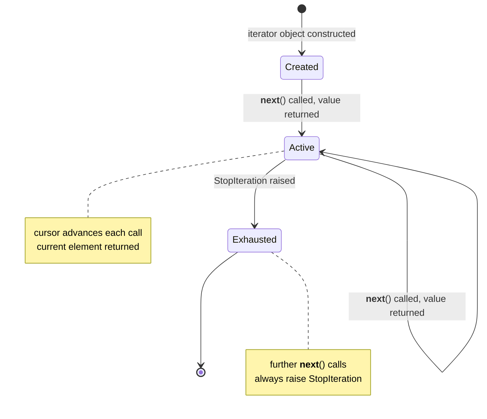

# :material-arrow-right-bold: Iterator Pattern

!!! abstract "At a Glance"
    **Intent:** Provide a way to access the elements of an aggregate object sequentially without exposing its underlying representation.
    **C++ Equivalent:** `begin()`/`end()` iterator pair with `operator++` and `operator*`; `InputIterator` concept.
    **Category:** Behavioral

<div class="grid cards" markdown>
- :material-lightbulb-on: **Core Concept** — Separate traversal logic from the collection so different traversal strategies can coexist.
- :material-snake: **Python Way** — The `__iter__`/`__next__` dunder protocol *is* the language's native Iterator; generator functions are the idiomatic shortcut.
- :material-alert: **Watch Out** — Modifying a collection while iterating over it raises `RuntimeError` (lists) or produces undefined behaviour (dicts before Python 3.7).
- :material-check-circle: **When to Use** — Any time you need multiple traversal strategies over a data structure (in-order, pre-order, reverse, filtered, paginated).
</div>

---

## :material-lightbulb-on: Intuition

!!! info "Core Idea"
    A music playlist is a collection; pressing **Next** is an iterator — it knows the current position and advances it without revealing whether the songs are stored in an array, linked list, or a streaming service API.
    The Iterator pattern extracts this "where am I?" cursor logic into its own object so the playlist can support shuffle, repeat, and normal modes simultaneously.

!!! success "Python vs C++"
    C++ iterators are low-level cursor objects; you must implement `operator++`, `operator*`, and copy semantics — six functions for a basic iterator.
    Python requires only two methods: `__iter__` (return `self`) and `__next__` (advance and return next value, raise `StopIteration` when done).
    Better yet, a `yield`-based generator automatically implements both, turning a ten-line iterator class into a two-line function.
    The `itertools` module then composes, filters, and chains iterators with zero boilerplate.

---

## :material-state-machine: Iterator State Machine



---

## :material-book-open-variant: Implementation

### Structure

| Role | Responsibility |
|---|---|
| `Iterable` | Declares `__iter__()` — returns an Iterator |
| `Iterator` | Declares `__next__()` — advances cursor, raises `StopIteration` |
| `ConcreteIterator` | Holds traversal state (stack, index, pointer) |
| `ConcreteCollection` | Stores data; `__iter__()` returns the appropriate iterator |

### Python Code

```python
from __future__ import annotations
from abc import ABC, abstractmethod
from collections.abc import Iterator, Iterable
from typing import Generic, TypeVar, Optional

T = TypeVar("T")


# ── Binary Tree Node ─────────────────────────────────────────────────────────

class TreeNode(Generic[T]):
    def __init__(
        self,
        value: T,
        left: Optional["TreeNode[T]"] = None,
        right: Optional["TreeNode[T]"] = None,
    ) -> None:
        self.value = value
        self.left = left
        self.right = right

    def __repr__(self) -> str:
        return f"TreeNode({self.value!r})"


# ── In-Order Iterator (class-based, explicit stack) ──────────────────────────

class InorderIterator(Iterator[T]):
    """
    Yields tree values in ascending order (left → root → right).
    Uses an explicit stack — O(h) memory where h is tree height.
    """

    def __init__(self, root: Optional[TreeNode[T]]) -> None:
        self._stack: list[TreeNode[T]] = []
        self._push_left(root)

    def _push_left(self, node: Optional[TreeNode[T]]) -> None:
        while node is not None:
            self._stack.append(node)
            node = node.left

    def __iter__(self) -> "InorderIterator[T]":
        return self

    def __next__(self) -> T:
        if not self._stack:
            raise StopIteration
        node = self._stack.pop()
        self._push_left(node.right)
        return node.value


# ── Pre-Order Iterator (class-based, explicit stack) ─────────────────────────

class PreorderIterator(Iterator[T]):
    """Yields values root → left → right."""

    def __init__(self, root: Optional[TreeNode[T]]) -> None:
        self._stack: list[TreeNode[T]] = [root] if root else []

    def __iter__(self) -> "PreorderIterator[T]":
        return self

    def __next__(self) -> T:
        if not self._stack:
            raise StopIteration
        node = self._stack.pop()
        # Push right first so left is processed first
        if node.right:
            self._stack.append(node.right)
        if node.left:
            self._stack.append(node.left)
        return node.value


# ── Binary Search Tree — iterable collection ─────────────────────────────────

class BinarySearchTree(Iterable[T]):
    def __init__(self) -> None:
        self._root: Optional[TreeNode[T]] = None

    def insert(self, value: T) -> None:
        if self._root is None:
            self._root = TreeNode(value)
            return
        node = self._root
        while True:
            if value < node.value:  # type: ignore[operator]
                if node.left is None:
                    node.left = TreeNode(value)
                    return
                node = node.left
            else:
                if node.right is None:
                    node.right = TreeNode(value)
                    return
                node = node.right

    def __iter__(self) -> InorderIterator[T]:
        """Default traversal: in-order (sorted)."""
        return InorderIterator(self._root)

    def preorder(self) -> PreorderIterator[T]:
        return PreorderIterator(self._root)


# ── Generator-based equivalents (Pythonic) ───────────────────────────────────

def inorder_gen(node: Optional[TreeNode[T]]):
    """Same traversal as InorderIterator — 3 lines vs 20."""
    if node:
        yield from inorder_gen(node.left)
        yield node.value
        yield from inorder_gen(node.right)


def preorder_gen(node: Optional[TreeNode[T]]):
    if node:
        yield node.value
        yield from preorder_gen(node.left)
        yield from preorder_gen(node.right)
```

### Example Usage

```python
import itertools

# Build a BST
bst: BinarySearchTree[int] = BinarySearchTree()
for v in [5, 3, 7, 1, 4, 6, 8]:
    bst.insert(v)

# In-order (class-based iterator) — yields sorted values
print("In-order :", list(bst))           # [1, 3, 4, 5, 6, 7, 8]

# Pre-order (explicit iterator)
print("Pre-order:", list(bst.preorder())) # [5, 3, 1, 4, 7, 6, 8]

# Generator-based (identical output, less code)
root = bst._root  # access for demo
print("Gen in-order :", list(inorder_gen(root)))  # [1, 3, 4, 5, 6, 7, 8]

# Python for-loop uses __iter__ transparently
for value in bst:
    print(value, end=" ")
# 1 3 4 5 6 7 8

# itertools composition — take first 3 even values ≥ 4
evens = itertools.takewhile(
    lambda x: x <= 7,
    filter(lambda x: x % 2 == 0, bst)
)
print("\nEven values ≤ 7:", list(evens))  # [4, 6]


# Custom range iterator (minimal protocol demo)
class CountDown(Iterator[int]):
    def __init__(self, start: int) -> None:
        self._current = start

    def __iter__(self) -> "CountDown":
        return self

    def __next__(self) -> int:
        if self._current <= 0:
            raise StopIteration
        val = self._current
        self._current -= 1
        return val

print(list(CountDown(5)))  # [5, 4, 3, 2, 1]

# Equivalent generator (one line)
countdown_gen = lambda n: (i for i in range(n, 0, -1))
print(list(countdown_gen(5)))  # [5, 4, 3, 2, 1]
```

---

## :material-alert: Common Pitfalls

!!! warning "Mutating During Iteration"
    Adding or removing elements from a `list` or `dict` while iterating over it with a `for` loop causes `RuntimeError: dictionary changed size during iteration` (dicts) or silently skips/repeats elements (lists). Iterate over a copy: `for item in list(my_list):`.

!!! warning "Calling __next__() on an Exhausted Iterator"
    Once `StopIteration` is raised, all subsequent `__next__()` calls should also raise `StopIteration`. Forgetting this in a custom class causes confusing restarts or infinite loops.

!!! danger "Generator One-Shot Consumption"
    A generator object can only be iterated **once**. Storing a generator in a variable and iterating twice silently yields nothing on the second pass. Wrap in a class that re-creates the generator in `__iter__` if reuse is needed.

!!! danger "Recursion Depth in Generator Trees"
    `yield from inorder_gen(node.left)` is recursive — deep trees (depth > ~500) hit Python's recursion limit. Use the class-based iterator with an explicit stack for production use on large trees.

---

## :material-help-circle: Flashcards

???+ question "What two methods must a Python Iterator implement?"
    `__iter__(self)` — returns `self` (the iterator is its own iterable).
    `__next__(self)` — returns the next element or raises `StopIteration`.

???+ question "What is the difference between an Iterable and an Iterator in Python?"
    An **Iterable** implements `__iter__()` and returns a fresh Iterator each time.
    An **Iterator** implements both `__iter__()` (returns itself) and `__next__()`. Lists are Iterables but not Iterators; `iter(my_list)` returns a `list_iterator`.

???+ question "Why do generators automatically satisfy the Iterator protocol?"
    A generator function returns a generator object that has `__iter__` (returns itself) and `__next__` (resumes execution until the next `yield` or raises `StopIteration` at the function end). Python's runtime generates both methods for you.

???+ question "Name three `itertools` functions and what they compose."
    `itertools.chain(*iterables)` — concatenates multiple iterables end-to-end.
    `itertools.islice(it, n)` — lazily takes the first `n` elements.
    `itertools.groupby(it, key)` — groups consecutive elements by a key function (like SQL `GROUP BY`).

---

## :material-clipboard-check: Self Test

=== "Question 1"
    You have a `BinarySearchTree` with 10,000 nodes. A user requests only the first 3 in-order values. What is the memory advantage of `InorderIterator` over collecting all values into a list first?

=== "Answer 1"
    `InorderIterator` is **lazy** — it only traverses nodes as `__next__()` is called.
    To retrieve 3 values from a balanced tree of 10,000 nodes, it touches at most O(log 10000) ≈ 13 nodes (the path from root to the leftmost node).
    Collecting to a list first traverses all 10,000 nodes and allocates O(n) memory.

=== "Question 2"
    A colleague wraps a generator expression in a class attribute: `class Foo: data = (x*2 for x in range(5))`. What happens on the second call to `list(Foo.data)`?

=== "Answer 2"
    The second call returns `[]`. The generator object is created **once** when the class body executes and exhausted by the first `list()` call. The fix is to make `data` a property that creates a fresh generator each time, or store `range(5)` (a reusable iterable) and apply the transformation lazily on demand.

---

## :material-check-circle: Summary

!!! success "Key Takeaways"
    - **Protocol first**: Python's `__iter__`/`__next__` dunder protocol makes every compliant object usable in a `for` loop, `list()`, `zip()`, and all `itertools` functions.
    - **Generators win on simplicity**: a `yield`-based function replaces a full iterator class with 5× less code.
    - **Explicit stack for safety**: class-based iterators with an explicit stack avoid recursion-depth limits on large structures.
    - **One-shot vs reusable**: generators are one-shot; store a factory (callable) not a generator object when reuse matters.
    - **Real-world uses**: database cursor pagination, lazy file reading (`for line in file`), infinite sequences (`itertools.count`), pipeline processing of large datasets.
