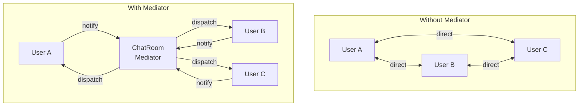

# :material-hub: Mediator Pattern

!!! abstract "At a Glance"
    **Intent:** Define an object that encapsulates how a set of objects interact, promoting loose coupling by keeping objects from referring to each other explicitly.
    **C++ Equivalent:** Central `Mediator` class holding raw pointers/references to `Colleague` objects; colleagues call `mediator->notify()` instead of calling peers directly.
    **Category:** Behavioral

<div class="grid cards" markdown>
- :material-lightbulb-on: **Core Concept** — Replace a web of N×N peer-to-peer references with N×1 references to one mediator hub.
- :material-snake: **Python Way** — `Mediator` ABC with `notify(sender, event)`; colleagues hold a mediator reference; `functools`-based callbacks as a lighter alternative.
- :material-alert: **Watch Out** — The mediator can become a "God Object" if it accumulates too much business logic; keep it as a coordinator, not a processor.
- :material-check-circle: **When to Use** — Chat systems, UI form field coordination, air-traffic control, microservice event buses, any tightly-coupled group that needs decoupling.
</div>

---

## :material-lightbulb-on: Intuition

!!! info "Core Idea"
    Imagine an airport: planes do not communicate directly with each other — they all talk to the **air traffic controller** (the mediator).
    The controller coordinates take-offs, landings, and gate assignments, so adding a new plane only requires connecting it to the control tower, not to every other plane.
    The Mediator pattern applies this hub-and-spoke topology to software objects.

!!! success "Python vs C++"
    C++ mediators use raw or smart pointers and often require forward declarations to break circular includes between mediator and colleague headers.
    Python sidesteps both problems: objects reference each other freely at runtime, and `abc.ABC` provides the abstract mediator contract without the header ceremony.
    The most idiomatic Python approach avoids subclassing altogether — colleagues store a list of callbacks (`functools.partial` or lambdas) registered by the mediator, making the coupling even looser.

---

## :material-graph: Mediator Topology



---

## :material-book-open-variant: Implementation

### Structure

| Role | Responsibility |
|---|---|
| `Mediator` (ABC) | Declares `notify(sender, event, **data)` |
| `ConcreteMediator` | Implements coordination logic; knows all colleagues |
| `Colleague` | Holds a reference to the mediator; calls `mediator.notify()` instead of peers |

### Python Code

```python
from __future__ import annotations
from abc import ABC, abstractmethod
from typing import Any


# ── Abstract Mediator ────────────────────────────────────────────────────────

class Mediator(ABC):
    @abstractmethod
    def notify(self, sender: "Colleague", event: str, **data: Any) -> None:
        """Called by colleagues to signal events to the mediator."""
        ...


# ── Abstract Colleague ───────────────────────────────────────────────────────

class Colleague(ABC):
    def __init__(self, mediator: Mediator) -> None:
        self._mediator = mediator

    def _send(self, event: str, **data: Any) -> None:
        """Convenience wrapper so subclasses don't repeat self._mediator.notify."""
        self._mediator.notify(self, event, **data)


# ════════════════════════════════════════════════════════════════════════════
# Example 1 — Chat Room
# ════════════════════════════════════════════════════════════════════════════

class ChatUser(Colleague):
    def __init__(self, name: str, mediator: Mediator) -> None:
        super().__init__(mediator)
        self.name = name

    def send_message(self, message: str) -> None:
        print(f"[{self.name}] sends: {message!r}")
        self._send("message", message=message)

    def send_dm(self, recipient: str, message: str) -> None:
        print(f"[{self.name}] DM to {recipient}: {message!r}")
        self._send("dm", recipient=recipient, message=message)

    def receive(self, sender_name: str, message: str) -> None:
        print(f"  >> [{self.name}] received from {sender_name}: {message!r}")

    def __repr__(self) -> str:
        return f"ChatUser({self.name!r})"


class ChatRoom(Mediator):
    """Concrete mediator: broadcasts messages and routes DMs."""

    def __init__(self) -> None:
        self._users: dict[str, ChatUser] = {}

    def join(self, user: ChatUser) -> None:
        self._users[user.name] = user
        print(f"  [ChatRoom] {user.name} joined the room.")

    def notify(self, sender: Colleague, event: str, **data: Any) -> None:
        assert isinstance(sender, ChatUser)

        if event == "message":
            # Broadcast to everyone except the sender
            for name, user in self._users.items():
                if name != sender.name:
                    user.receive(sender.name, data["message"])

        elif event == "dm":
            recipient_name = data["recipient"]
            if recipient_name in self._users:
                self._users[recipient_name].receive(sender.name, data["message"])
            else:
                print(f"  [ChatRoom] User {recipient_name!r} not found.")


# ════════════════════════════════════════════════════════════════════════════
# Example 2 — UI Form Validation Mediator
# ════════════════════════════════════════════════════════════════════════════

class FormField(Colleague):
    def __init__(self, name: str, mediator: Mediator) -> None:
        super().__init__(mediator)
        self.name = name
        self._value: str = ""

    @property
    def value(self) -> str:
        return self._value

    @value.setter
    def value(self, new_value: str) -> None:
        self._value = new_value
        self._send("field_changed", field=self.name, value=new_value)


class SubmitButton(Colleague):
    def __init__(self, mediator: Mediator) -> None:
        super().__init__(mediator)
        self.enabled = False

    def set_enabled(self, enabled: bool) -> None:
        if self.enabled != enabled:
            self.enabled = enabled
            state = "ENABLED" if enabled else "DISABLED"
            print(f"  [SubmitButton] {state}")


class FormMediator(Mediator):
    """Enables the submit button only when all required fields are filled."""

    def __init__(self) -> None:
        self._fields: dict[str, FormField] = {}
        self._button: SubmitButton | None = None

    def register_field(self, field: FormField) -> None:
        self._fields[field.name] = field

    def register_button(self, button: SubmitButton) -> None:
        self._button = button

    def notify(self, sender: Colleague, event: str, **data: Any) -> None:
        if event == "field_changed":
            all_filled = all(f.value.strip() for f in self._fields.values())
            if self._button:
                self._button.set_enabled(all_filled)
```

### Example Usage

```python
# ── Chat Room Demo ───────────────────────────────────────────────────────────

print("=== Chat Room ===")
room = ChatRoom()
alice = ChatUser("Alice", room)
bob   = ChatUser("Bob",   room)
carol = ChatUser("Carol", room)

room.join(alice)
room.join(bob)
room.join(carol)

alice.send_message("Hello everyone!")
bob.send_dm("Alice", "Hey, got a minute?")
carol.send_dm("Dave", "Are you there?")  # Dave not in room

# Output:
# [ChatRoom] Alice joined the room.
# [ChatRoom] Bob joined the room.
# [ChatRoom] Carol joined the room.
# [Alice] sends: 'Hello everyone!'
#   >> [Bob] received from Alice: 'Hello everyone!'
#   >> [Carol] received from Alice: 'Hello everyone!'
# [Bob] DM to Alice: 'Hey, got a minute?'
#   >> [Alice] received from Bob: 'Hey, got a minute?'
# [Carol] DM to Dave: 'Are you there?'
#   [ChatRoom] User 'Dave' not found.


# ── Form Validation Demo ─────────────────────────────────────────────────────

print("\n=== Form Validation ===")
form = FormMediator()
email_field    = FormField("email",    form)
password_field = FormField("password", form)
submit_btn     = SubmitButton(form)

form.register_field(email_field)
form.register_field(password_field)
form.register_button(submit_btn)

email_field.value = "user@example.com"      # only email filled → disabled
password_field.value = "s3cr3t"             # both filled → ENABLED
password_field.value = ""                   # password cleared → DISABLED

# Output:
#   [SubmitButton] ENABLED
#   [SubmitButton] DISABLED


# ── Pythonic: callback-based mediator ─────────────────────────────────────────
from collections import defaultdict
from typing import Callable

class EventBus:
    """
    Lightweight mediator using registered callbacks.
    No Colleague base class required — any callable can subscribe.
    """
    def __init__(self) -> None:
        self._handlers: dict[str, list[Callable[..., None]]] = defaultdict(list)

    def subscribe(self, event: str, handler: Callable[..., None]) -> None:
        self._handlers[event].append(handler)

    def publish(self, event: str, **data: Any) -> None:
        for handler in self._handlers[event]:
            handler(**data)

bus = EventBus()
bus.subscribe("login", lambda user: print(f"[Audit] {user} logged in"))
bus.subscribe("login", lambda user: print(f"[Email] Welcome back, {user}!"))
bus.publish("login", user="alice")
# [Audit] alice logged in
# [Email] Welcome back, alice!
```

---

## :material-alert: Common Pitfalls

!!! warning "God-Object Mediator"
    When the mediator accumulates business rules (pricing, validation, workflow), it becomes a monolith that is harder to test than the original peer-to-peer coupling. Keep the mediator as a pure **coordinator** — it dispatches events, it does not execute business logic itself.

!!! warning "Circular Import Risk"
    If `Mediator` imports `Colleague` for type hints and `Colleague` imports `Mediator`, you get a circular import. Use `from __future__ import annotations` and string-quoted type hints, or move shared types to a separate `interfaces.py` module.

!!! danger "Memory Leaks via Colleague References"
    If the mediator holds strong references to colleagues (`self._users` dict), colleagues are never garbage-collected even after they logically leave the system. Use `weakref.WeakValueDictionary` for colleague registries in long-running applications.

!!! danger "Thread Safety"
    In multi-threaded scenarios (e.g., an async chat server), concurrent `notify()` calls can corrupt shared state. Protect the mediator's internal collections with `threading.Lock` or use an `asyncio`-based event loop with a queue.

---

## :material-help-circle: Flashcards

???+ question "What coupling does the Mediator pattern eliminate?"
    It eliminates **many-to-many** (N×N) direct references between colleagues, replacing them with **many-to-one** (N×1) references to the mediator. Adding a new colleague requires only connecting to the mediator, not to every existing colleague.

???+ question "How does the Mediator pattern differ from the Observer pattern?"
    In **Observer**, subjects broadcast events to anonymous subscribers; direction is one-to-many.
    In **Mediator**, colleagues communicate *through* a shared hub; any colleague can trigger reactions in any other colleague — many-to-many coordination is the goal.

???+ question "What is the Pythonic lightweight alternative to the full OOP Mediator?"
    An `EventBus` (or `SignalDispatcher`) using a `dict[str, list[Callable]]`. Colleagues subscribe callables to named events; the bus dispatches them. No `Colleague` base class or `notify()` method needed — any callable qualifies as a handler.

???+ question "Why should the mediator avoid containing business logic?"
    Because it defeats the purpose of decoupling: a mediator loaded with business rules becomes the single most complex class in the system — the very "God Object" anti-pattern we were trying to avoid. Delegate computation to colleagues; let the mediator only route messages.

---

## :material-clipboard-check: Self Test

=== "Question 1"
    A `ChatRoom` mediator holds a regular `dict` of `ChatUser` objects. A user disconnects and the caller deletes its reference. Is the user garbage-collected?

=== "Answer 1"
    No. The `ChatRoom` dict still holds a strong reference to the `ChatUser`, preventing garbage collection. Use `weakref.WeakValueDictionary` so the mediator's reference does not extend the object's lifetime beyond the caller's reference.

=== "Question 2"
    How would you unit-test `ChatUser.send_message()` in isolation, without a real `ChatRoom`?

=== "Answer 2"
    Inject a **mock mediator** that records calls: `class MockMediator(Mediator): def notify(self, sender, event, **data): self.calls.append((event, data))`. Pass it to `ChatUser` in the test. Assert that `notify` was called with the correct event and message, without needing a real `ChatRoom`. This is the loose coupling benefit of the pattern.

---

## :material-check-circle: Summary

!!! success "Key Takeaways"
    - **Hub-and-spoke**: colleagues know only the mediator, not each other — N×N coupling becomes N×1.
    - **Keep it thin**: mediator = coordinator; business logic stays in colleagues.
    - **Python shortcut**: callback-based `EventBus` replaces the full OOP pattern when formal structure is overkill.
    - **Memory care**: use `weakref.WeakValueDictionary` for colleague registries in long-lived systems.
    - **Real-world uses**: Django signals, PyQt signals/slots, GUI widget coordination, microservice event buses, CQRS event dispatchers.
