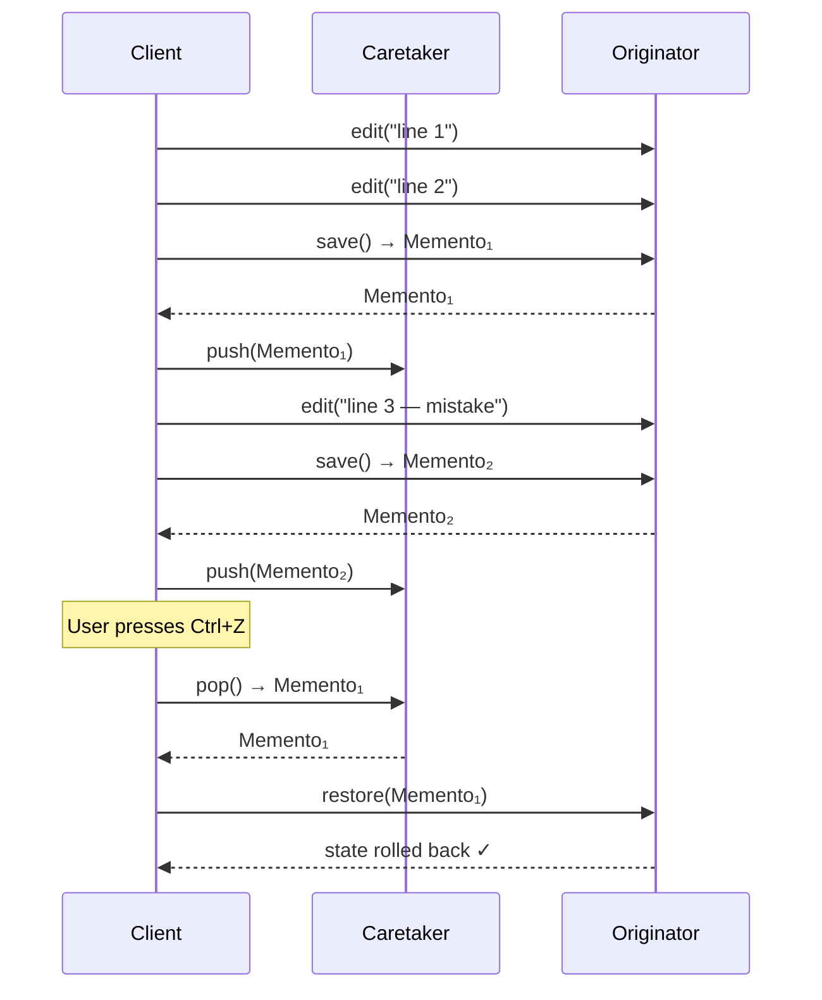

# :material-history: Memento Pattern

!!! abstract "At a Glance"
    **Intent:** Without violating encapsulation, capture and externalise an object's internal state so that the object can be restored to that state later.
    **C++ Equivalent:** Nested `Memento` class with private constructor; `Originator` declared as `friend`; `Caretaker` holds a stack of mementos.
    **Category:** Behavioral

<div class="grid cards" markdown>
- :material-lightbulb-on: **Core Concept** — Snapshot internal state into an immutable token; the caretaker stores tokens without inspecting them; the originator uses them to roll back.
- :material-snake: **Python Way** — `@dataclass(frozen=True)` memento, `Originator.save()`/`restore()`, a `Caretaker` with an undo stack; `copy.deepcopy` makes arbitrary snapshots trivial.
- :material-alert: **Watch Out** — Storing full deep-copies of large objects on every save is expensive; prefer incremental/delta snapshots for heavy state.
- :material-check-circle: **When to Use** — Undo/redo systems, game save states, configuration rollback, transactional objects that must roll back on failure.
</div>

---

## :material-lightbulb-on: Intuition

!!! info "Core Idea"
    Think of a **game save file**: you press *Save* and the game captures your position, health, inventory — everything — into an opaque file on disk.
    Later, *Load* restores the game to exactly that state without the save-file format being visible to any other subsystem.
    The Memento pattern formalises this:
    the **Originator** (the game world) creates and consumes mementos; the **Caretaker** (the save-file manager) stores them; neither exposes internal state to the other.

!!! success "Python vs C++"
    C++ uses `friend` declarations to grant `Originator` exclusive access to `Memento`'s private constructor — a language-specific workaround for encapsulation.
    Python has no `friend`, but a **frozen dataclass** achieves the same: once created, a `@dataclass(frozen=True)` instance cannot be mutated by anyone, including the caretaker.
    `copy.deepcopy()` lets any originator snapshot arbitrary nested state in one line — something that requires manual recursive copying in C++.

---

## :material-transit-connection-variant: Save / Restore Sequence



---

## :material-book-open-variant: Implementation

### Structure

| Role | Responsibility |
|---|---|
| `Memento` | Immutable snapshot of originator's state; opaque to caretaker |
| `Originator` | Creates mementos from its state; restores state from mementos |
| `Caretaker` | Stores mementos on a stack; never inspects their contents |

### Python Code

```python
from __future__ import annotations
from dataclasses import dataclass, field
from typing import Any
import copy


# ════════════════════════════════════════════════════════════════════════════
# Example 1 — Text Editor with Undo History
# ════════════════════════════════════════════════════════════════════════════

@dataclass(frozen=True)
class EditorMemento:
    """
    Immutable snapshot of editor state.
    frozen=True prevents any external mutation — the Python analogue of
    C++'s private constructor + friend declaration.
    """
    content: str
    cursor_position: int
    selection: tuple[int, int]  # (start, end)


class TextEditor:
    """Originator: knows how to save and restore its own state."""

    def __init__(self) -> None:
        self._content = ""
        self._cursor = 0
        self._selection: tuple[int, int] = (0, 0)

    # ── editing operations ──

    def type(self, text: str) -> None:
        self._content = (
            self._content[: self._cursor] + text + self._content[self._cursor :]
        )
        self._cursor += len(text)

    def select(self, start: int, end: int) -> None:
        self._selection = (start, end)

    def delete_selection(self) -> None:
        s, e = self._selection
        self._content = self._content[:s] + self._content[e:]
        self._cursor = s
        self._selection = (0, 0)

    # ── memento operations ──

    def save(self) -> EditorMemento:
        return EditorMemento(
            content=self._content,
            cursor_position=self._cursor,
            selection=self._selection,
        )

    def restore(self, memento: EditorMemento) -> None:
        self._content = memento.content
        self._cursor = memento.cursor_position
        self._selection = memento.selection

    def __str__(self) -> str:
        return (
            f"Content: {self._content!r}  "
            f"Cursor: {self._cursor}  "
            f"Selection: {self._selection}"
        )


class EditorCaretaker:
    """Stores undo/redo stacks; never inspects memento contents."""

    def __init__(self, editor: TextEditor) -> None:
        self._editor = editor
        self._undo_stack: list[EditorMemento] = []
        self._redo_stack: list[EditorMemento] = []

    def save(self) -> None:
        self._undo_stack.append(self._editor.save())
        self._redo_stack.clear()  # new action invalidates redo history

    def undo(self) -> bool:
        if not self._undo_stack:
            return False
        self._redo_stack.append(self._editor.save())
        self._editor.restore(self._undo_stack.pop())
        return True

    def redo(self) -> bool:
        if not self._redo_stack:
            return False
        self._undo_stack.append(self._editor.save())
        self._editor.restore(self._redo_stack.pop())
        return True


# ════════════════════════════════════════════════════════════════════════════
# Example 2 — Game Save State (deepcopy approach)
# ════════════════════════════════════════════════════════════════════════════

@dataclass
class PlayerState:
    level: int
    health: int
    position: tuple[float, float]
    inventory: list[str]


@dataclass(frozen=True)
class GameMemento:
    """
    Immutable deep-copy snapshot of arbitrary player state.
    Uses copy.deepcopy internally so the caretaker cannot accidentally
    mutate nested collections.
    """
    _snapshot: PlayerState = field(compare=False)

    @classmethod
    def from_state(cls, state: PlayerState) -> "GameMemento":
        return cls(_snapshot=copy.deepcopy(state))

    def restore_to(self, state: PlayerState) -> None:
        # Restore all fields back to the snapshot values
        snap = self._snapshot
        state.level = snap.level
        state.health = snap.health
        state.position = snap.position
        state.inventory = list(snap.inventory)


class Game:
    def __init__(self) -> None:
        self.state = PlayerState(level=1, health=100, position=(0.0, 0.0), inventory=[])

    def save(self) -> GameMemento:
        return GameMemento.from_state(self.state)

    def restore(self, memento: GameMemento) -> None:
        memento.restore_to(self.state)

    def pickup(self, item: str) -> None:
        self.state.inventory.append(item)

    def take_damage(self, dmg: int) -> None:
        self.state.health = max(0, self.state.health - dmg)

    def __str__(self) -> str:
        s = self.state
        return f"Lv{s.level} HP:{s.health} Pos:{s.position} Inv:{s.inventory}"
```

### Example Usage

```python
# ── Text Editor Undo Demo ─────────────────────────────────────────────────────

print("=== Text Editor ===")
editor = TextEditor()
history = EditorCaretaker(editor)

history.save()                      # snapshot 0: empty
editor.type("Hello, World!")
print(f"After type:   {editor}")
history.save()                      # snapshot 1

editor.select(7, 12)
editor.delete_selection()
print(f"After delete: {editor}")
history.save()                      # snapshot 2

editor.type("Python")
print(f"After type:   {editor}")

history.undo()                      # back to snapshot 2
print(f"After undo:   {editor}")
history.undo()                      # back to snapshot 1
print(f"After undo:   {editor}")
history.redo()                      # forward to snapshot 2
print(f"After redo:   {editor}")

# ── Game Save State Demo ──────────────────────────────────────────────────────

print("\n=== Game Save ===")
game = Game()
print(f"Start:   {game}")

game.pickup("sword")
game.take_damage(30)
save1 = game.save()                 # checkpoint 1
print(f"Save 1:  {game}")

game.pickup("shield")
game.take_damage(80)                # near death!
print(f"Danger:  {game}")

game.restore(save1)
print(f"Loaded:  {game}")           # back to checkpoint 1


# ── Configuration Rollback ───────────────────────────────────────────────────

import copy

class Config:
    def __init__(self) -> None:
        self._data: dict[str, Any] = {"debug": False, "timeout": 30, "retries": 3}
        self._history: list[dict[str, Any]] = []

    def set(self, key: str, value: Any) -> None:
        self._history.append(copy.deepcopy(self._data))
        self._data[key] = value

    def rollback(self) -> bool:
        if not self._history:
            return False
        self._data = self._history.pop()
        return True

    def __repr__(self) -> str:
        return f"Config({self._data})"

cfg = Config()
cfg.set("debug", True)
cfg.set("timeout", 5)
print(cfg)           # Config({'debug': True, 'timeout': 5, 'retries': 3})
cfg.rollback()
print(cfg)           # Config({'debug': True, 'timeout': 30, 'retries': 3})
cfg.rollback()
print(cfg)           # Config({'debug': False, 'timeout': 30, 'retries': 3})
```

---

## :material-alert: Common Pitfalls

!!! warning "Shallow Copy Leaks State"
    Using `copy.copy()` (shallow) instead of `copy.deepcopy()` for mementos means nested mutable objects (lists, dicts) are shared between the memento and the originator.
    Mutating the originator's list after saving corrupts the "saved" state. Always deep-copy nested mutable structures.

!!! warning "Unbounded Undo Stack Memory"
    Storing a full deep-copy on every keystroke in a text editor consumes O(n × m) memory (n saves, m text size).
    Mitigate with: a maximum stack depth, delta/diff mementos (store only changes), or periodic full snapshots with deltas between them.

!!! danger "Mutable Memento"
    Forgetting `frozen=True` on a dataclass memento allows any code (including the caretaker) to mutate saved state, silently corrupting the undo history. **Always freeze mementos.**

!!! danger "Serialisation Pitfalls"
    `copy.deepcopy()` does not cross process boundaries. For persistent save states (game files, config backups), serialise mementos with `pickle`, `json`, or `dataclasses.asdict()` and store them to disk explicitly.

---

## :material-help-circle: Flashcards

???+ question "What is the encapsulation invariant of the Memento pattern?"
    The **caretaker** stores mementos but must not inspect or modify their contents.
    Only the **originator** that created the memento may read from or restore it.
    In Python, `@dataclass(frozen=True)` enforces immutability; private name-mangled attributes (`__slots__`) can hide fields further.

???+ question "Why use `copy.deepcopy()` instead of a manual copy?"
    `deepcopy` recursively copies all nested objects, so the memento is fully independent of the originator's live state. Manual copying easily misses a nested list or dict, creating subtle bugs that appear only when nested state changes.

???+ question "How do you implement *redo* on top of a single undo stack?"
    Maintain a second **redo stack**. On `undo()`: pop from the undo stack and push the current state onto the redo stack before restoring. On `redo()`: reverse the operation. On any new user action: clear the redo stack, since the future is now invalid.

???+ question "What is the delta/diff approach and when does it help?"
    Instead of storing a full state snapshot, store only what changed since the last snapshot (a diff). A text editor can store `(position, inserted_text, deleted_text)` per edit — a few bytes vs. the full document. Replay deltas forward (redo) or backward (undo). Essential for large documents or frequent saves.

---

## :material-clipboard-check: Self Test

=== "Question 1"
    An `EditorMemento` is `@dataclass(frozen=True)` with a `list[str]` field for lines. A colleague modifies the list through a reference obtained before the memento was created. Is the memento corrupted?

=== "Answer 1"
    Yes — if the originator's `save()` method does `EditorMemento(lines=self._lines)` without copying, the memento holds a reference to the **same** list object. `frozen=True` prevents reassigning the field, but the list itself is still mutable. Fix: `EditorMemento(lines=list(self._lines))` or `copy.deepcopy(self._lines)`.

=== "Question 2"
    You need to persist game save states across application restarts. `copy.deepcopy()` is not sufficient. What approach would you use?

=== "Answer 2"
    Serialise the `GameMemento` to a storable format. Options:
    1. `dataclasses.asdict(memento)` + `json.dumps()` — human-readable, portable, requires all fields to be JSON-serialisable.
    2. `pickle.dumps(memento)` — handles complex Python objects but is Python-version-specific and insecure for untrusted input.
    3. A dedicated schema (e.g., `msgpack`, `protobuf`) — fastest and cross-language.
    Store the serialised bytes to disk and deserialise on load.

---

## :material-check-circle: Summary

!!! success "Key Takeaways"
    - **Encapsulation preserved**: caretakers store opaque tokens; only the originator reads them.
    - **Frozen dataclasses**: `@dataclass(frozen=True)` is Python's idiomatic immutable memento — no `friend` hack required.
    - **`copy.deepcopy()`**: one-line full-state snapshot; always use it for nested mutable state.
    - **Undo + Redo**: two stacks; new actions clear the redo stack.
    - **Memory discipline**: cap stack depth or use delta mementos for large or frequently-saved state.
    - **Real-world uses**: text editors (VS Code undo), game checkpoints, database transaction savepoints, configuration management rollback, drawing application history.
