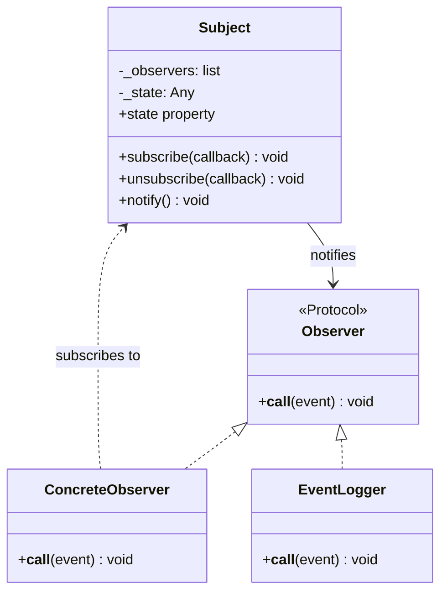

# :material-eye: Observer Pattern

!!! abstract "At a Glance"
    **Goal:** Notify multiple dependents when an object's state changes, without coupling them.
    **C++ Equivalent:** Pure virtual `IObserver` with `update()`, `Subject::notify()` loop.

<div class="grid cards" markdown>

- :material-lightbulb-on: **Core Concept** — One subject, many observers; decouple change from reaction
- :material-snake: **Python Way** — Use a list of callables; no Observer class needed
- :material-alert: **Watch Out** — Infinite loops if an observer triggers another state change
- :material-check-circle: **When to Use** — Event systems, UI updates, pub/sub, reactive streams

</div>

## :material-lightbulb-on: Intuition

!!! info "Core Idea"
    The Observer pattern defines a one-to-many dependency. When the Subject changes state,
    all registered observers are notified automatically. In Python this is most naturally
    expressed as a list of **callable** observers — no Observer base class required.

!!! success "C++ → Python Mapping"
    | C++ | Python |
    |---|---|
    | `class IObserver { virtual void update() = 0; }` | `Callable[[], None]` |
    | `observers_.push_back(&obs)` | `observers.append(callback)` |
    | `for (auto& o : observers_) o.update()` | `for cb in observers: cb()` |
    | Pure virtual interface | `Protocol` or just `Callable` |

## :material-chart-timeline: Subject/Observer Class Diagram



## :material-book-open-variant: Pythonic Implementation — Callables

```python
from __future__ import annotations
from typing import Callable, Any
from dataclasses import dataclass, field

@dataclass
class Event:
    name: str
    data: Any = None

# Type alias for observer callback
Observer = Callable[[Event], None]

class EventEmitter:
    """Subject — maintains list of callable observers."""

    def __init__(self) -> None:
        self._listeners: dict[str, list[Observer]] = {}

    def on(self, event_name: str, callback: Observer) -> None:
        self._listeners.setdefault(event_name, []).append(callback)

    def off(self, event_name: str, callback: Observer) -> None:
        listeners = self._listeners.get(event_name, [])
        listeners.remove(callback)

    def emit(self, event_name: str, data: Any = None) -> None:
        event = Event(event_name, data)
        for callback in list(self._listeners.get(event_name, [])):
            callback(event)

    def emit_all(self, event_name: str, data: Any = None) -> None:
        """Emit to both specific listeners and wildcard '*' listeners."""
        self.emit(event_name, data)
        self.emit("*", data)

# Usage — observers are just functions
def log_event(event: Event) -> None:
    print(f"[LOG] {event.name}: {event.data}")

def send_email(event: Event) -> None:
    print(f"[EMAIL] Sending notification for: {event.name}")

emitter = EventEmitter()
emitter.on("user.created", log_event)
emitter.on("user.created", send_email)
emitter.on("*", lambda e: print(f"[AUDIT] {e.name}"))

emitter.emit("user.created", {"name": "Alice", "email": "alice@example.com"})
```

## :material-code-tags: ABC Approach (for documentation/contracts)

```python
from abc import ABC, abstractmethod
from typing import Any

class IObserver(ABC):
    @abstractmethod
    def update(self, subject: "Subject", event: str, data: Any = None) -> None: ...

class Subject:
    def __init__(self) -> None:
        self._observers: list[IObserver] = []
        self._state: Any = None

    def attach(self, observer: IObserver) -> None:
        self._observers.append(observer)

    def detach(self, observer: IObserver) -> None:
        self._observers.remove(observer)

    def _notify(self, event: str, data: Any = None) -> None:
        for observer in list(self._observers):
            observer.update(self, event, data)

    @property
    def state(self) -> Any:
        return self._state

    @state.setter
    def state(self, value: Any) -> None:
        self._state = value
        self._notify("state_changed", value)

class LogObserver(IObserver):
    def update(self, subject: Subject, event: str, data: Any = None) -> None:
        print(f"[LOG] Event={event}, Data={data}")

class MetricsObserver(IObserver):
    def __init__(self) -> None:
        self.change_count = 0

    def update(self, subject: Subject, event: str, data: Any = None) -> None:
        self.change_count += 1

subj = Subject()
subj.attach(LogObserver())
metrics = MetricsObserver()
subj.attach(metrics)
subj.state = "active"
subj.state = "idle"
print(f"Total changes: {metrics.change_count}")   # 2
```

## :material-alert: Common Pitfalls

!!! warning "Modifying observer list during notification"
    ```python
    # If an observer calls detach() during emit(), the list changes under iteration.
    # Fix: iterate over a copy: `for cb in list(self._listeners):`
    def emit(self, event_name: str) -> None:
        for callback in list(self._listeners.get(event_name, [])):  # copy!
            callback()
    ```

!!! danger "Circular notifications"
    If observer A modifies subject state in its `update()`, which notifies observer B,
    which modifies state again... you get infinite recursion. Add a `_notifying` guard flag
    or use an event queue to decouple notification from processing.

## :material-help-circle: Flashcards

???+ question "Why prefer callables over ABC observers in Python?"
    Callables (functions, lambdas, class instances with `__call__`) are more flexible — any
    callable conforms, no inheritance needed. This follows the **open/closed principle** naturally.
    The ABC approach is useful when you want to document the contract explicitly or enforce
    that observers implement multiple methods (e.g., `update` + `on_error`).

???+ question "What is the difference between Observer and Pub/Sub?"
    In Observer, the Subject holds direct references to Observers and calls them synchronously.
    In Pub/Sub, there is a **message broker** (event bus) between publishers and subscribers.
    Publishers do not know who the subscribers are; subscribers subscribe to topics/channels.
    Pub/Sub decouples publishers and subscribers more completely; Observer is simpler.

???+ question "How do you remove an observer that was registered as a lambda?"
    You cannot — lambdas create new function objects each time, so you cannot find it later.
    Solution: assign the lambda to a variable before registering: `handler = lambda e: ...;
    emitter.on("event", handler)`. Then `emitter.off("event", handler)` works.

???+ question "What is a WeakReference observer and why use it?"
    Using `weakref.WeakSet` or `weakref.ref` for observer storage prevents the Subject from
    keeping observers alive after they would otherwise be garbage collected. This avoids
    memory leaks when observers have a shorter lifetime than the subject.

## :material-clipboard-check: Self Test

=== "Question 1"
    Implement a `Stock` class that notifies price watchers when its price changes by more than a threshold.

=== "Answer 1"
    ```python
    from typing import Callable

    PriceWatcher = Callable[[str, float, float], None]

    class Stock:
        def __init__(self, symbol: str, price: float, threshold: float = 0.05) -> None:
            self.symbol = symbol
            self._price = price
            self.threshold = threshold
            self._watchers: list[PriceWatcher] = []

        def add_watcher(self, watcher: PriceWatcher) -> None:
            self._watchers.append(watcher)

        @property
        def price(self) -> float:
            return self._price

        @price.setter
        def price(self, new_price: float) -> None:
            change = abs(new_price - self._price) / self._price
            old = self._price
            self._price = new_price
            if change >= self.threshold:
                for w in list(self._watchers):
                    w(self.symbol, old, new_price)

    def alert(symbol, old, new):
        print(f"ALERT: {symbol} moved from {old:.2f} to {new:.2f}")

    aapl = Stock("AAPL", 180.0, threshold=0.03)
    aapl.add_watcher(alert)
    aapl.price = 182.0   # no alert (1.1% change)
    aapl.price = 170.0   # alert! (6.6% change)
    ```

=== "Question 2"
    How would you implement an async observer that does not block the subject?

=== "Answer 2"
    Use an **asyncio event queue** or `asyncio.create_task()`:
    ```python
    import asyncio
    from typing import Callable, Awaitable

    AsyncObserver = Callable[[Event], Awaitable[None]]

    class AsyncEventEmitter:
        def __init__(self) -> None:
            self._listeners: dict[str, list[AsyncObserver]] = {}

        def on(self, name: str, coro_fn: AsyncObserver) -> None:
            self._listeners.setdefault(name, []).append(coro_fn)

        async def emit(self, name: str, data=None) -> None:
            event = Event(name, data)
            tasks = [
                asyncio.create_task(cb(event))
                for cb in self._listeners.get(name, [])
            ]
            await asyncio.gather(*tasks)   # run all observers concurrently
    ```

## :material-check-circle: Summary

!!! success "Key Takeaways"
    - Observer defines a one-to-many dependency; Subject notifies all registered observers on change.
    - The Pythonic approach uses a list of callables — no Observer base class needed.
    - Use ABC form when you need to document multi-method contracts or enforce conformance.
    - Always iterate over a copy of the observer list to avoid mutation-during-iteration bugs.
    - For async systems, use an event queue or `asyncio.gather()` to notify concurrently.
