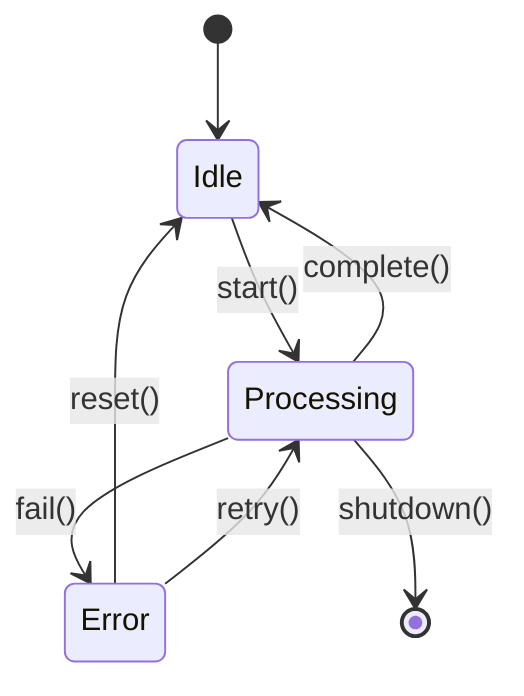

# :material-state-machine: State Pattern

!!! abstract "At a Glance"
    **Goal:** Allow an object to alter its behaviour when its internal state changes.
    **C++ Equivalent:** Virtual dispatch via `State*` pointer; `std::variant` + `std::visit`.

<div class="grid cards" markdown>

- :material-lightbulb-on: **Core Concept** — Object behaviour depends on its current state
- :material-snake: **Python Way** — ABC state objects OR enum + dispatch table (more Pythonic)
- :material-alert: **Watch Out** — State transitions must be explicit and consistent
- :material-check-circle: **When to Use** — Traffic lights, vending machines, TCP connections, game entities

</div>

## :material-lightbulb-on: Intuition

!!! info "Core Idea"
    State-dependent behaviour can be expressed as:
    1. **ABC approach** — each state is an object; the context delegates to the current state.
    2. **Enum + dispatch table** — state is an enum value; transitions are in a dict.
    3. **`__init_subclass__` trick** — states self-register into a registry.

!!! success "C++ → Python Mapping"
    | C++ | Python |
    |---|---|
    | `State* current_state_` | `self._state: State` |
    | `current_state_->handle(ctx)` | `self._state.handle(self)` |
    | `std::variant<S1,S2,S3>` + `std::visit` | `enum` + `match` / dispatch dict |

## :material-chart-timeline: State Machine Diagram



## :material-book-open-variant: ABC State Approach

```python
from __future__ import annotations
from abc import ABC, abstractmethod

class TrafficLightState(ABC):
    @abstractmethod
    def next_state(self, light: "TrafficLight") -> None: ...

    @abstractmethod
    def display(self) -> str: ...

class RedState(TrafficLightState):
    def next_state(self, light: "TrafficLight") -> None:
        light.state = GreenState()

    def display(self) -> str:
        return "RED — Stop"

class GreenState(TrafficLightState):
    def next_state(self, light: "TrafficLight") -> None:
        light.state = YellowState()

    def display(self) -> str:
        return "GREEN — Go"

class YellowState(TrafficLightState):
    def next_state(self, light: "TrafficLight") -> None:
        light.state = RedState()

    def display(self) -> str:
        return "YELLOW — Slow"

class TrafficLight:
    def __init__(self) -> None:
        self.state: TrafficLightState = RedState()

    def advance(self) -> None:
        self.state.next_state(self)

    def display(self) -> str:
        return self.state.display()

light = TrafficLight()
for _ in range(6):
    print(light.display())
    light.advance()
```

## :material-table: Enum + Dispatch Table (Pythonic)

```python
from enum import Enum, auto
from typing import Callable

class State(Enum):
    IDLE = auto()
    PROCESSING = auto()
    ERROR = auto()

# Transition table: {(current_state, event): new_state}
Transition = dict[tuple[State, str], State]

TRANSITIONS: Transition = {
    (State.IDLE, "start"):       State.PROCESSING,
    (State.PROCESSING, "complete"): State.IDLE,
    (State.PROCESSING, "fail"):  State.ERROR,
    (State.ERROR, "reset"):      State.IDLE,
    (State.ERROR, "retry"):      State.PROCESSING,
}

# Actions: {(current_state, event): action_fn}
def on_start():     print("Starting processing...")
def on_complete():  print("Processing complete.")
def on_fail():      print("ERROR: processing failed!")
def on_reset():     print("Resetting to idle.")
def on_retry():     print("Retrying...")

ACTIONS: dict[tuple[State, str], Callable] = {
    (State.IDLE, "start"):       on_start,
    (State.PROCESSING, "complete"): on_complete,
    (State.PROCESSING, "fail"):  on_fail,
    (State.ERROR, "reset"):      on_reset,
    (State.ERROR, "retry"):      on_retry,
}

class StateMachine:
    def __init__(self) -> None:
        self._state = State.IDLE

    @property
    def state(self) -> State:
        return self._state

    def trigger(self, event: str) -> bool:
        key = (self._state, event)
        if key not in TRANSITIONS:
            print(f"Invalid event '{event}' in state {self._state.name}")
            return False
        if key in ACTIONS:
            ACTIONS[key]()
        self._state = TRANSITIONS[key]
        return True

sm = StateMachine()
sm.trigger("start")       # IDLE → PROCESSING
sm.trigger("fail")        # PROCESSING → ERROR
sm.trigger("retry")       # ERROR → PROCESSING
sm.trigger("complete")    # PROCESSING → IDLE
```

## :material-hook: `__init_subclass__` State Registration

```python
from typing import ClassVar

class BaseState:
    """State base with auto-registration via __init_subclass__."""
    _registry: ClassVar[dict[str, type["BaseState"]]] = {}

    def __init_subclass__(cls, state_name: str = "", **kwargs) -> None:
        super().__init_subclass__(**kwargs)
        if state_name:
            BaseState._registry[state_name] = cls

    @classmethod
    def create(cls, name: str) -> "BaseState":
        if name not in cls._registry:
            raise ValueError(f"Unknown state: {name!r}")
        return cls._registry[name]()

class IdleState(BaseState, state_name="idle"):
    def on_enter(self) -> None:
        print("Entering idle state")

class ActiveState(BaseState, state_name="active"):
    def on_enter(self) -> None:
        print("Entering active state")

# Automatic registry
state = BaseState.create("idle")   # IdleState instance
state.on_enter()
```

## :material-alert: Common Pitfalls

!!! warning "State transition without updating the context"
    In the ABC approach, `State.next_state()` must set `context.state = NewState()`.
    If you forget to pass the context or set a wrong attribute, transitions silently fail.

!!! danger "Missing invalid-transition handling"
    Always handle invalid state/event combinations explicitly. In the dispatch table approach,
    check if the key exists before accessing it. In the ABC approach, provide a default
    `handle_invalid()` that logs or raises an error.

## :material-help-circle: Flashcards

???+ question "What is the difference between State and Strategy patterns?"
    Both delegate behaviour to an encapsulated object. The key difference:
    **Strategy** objects are usually stateless and interchangeable algorithms.
    **State** objects represent a machine's current condition and manage transitions to other states.
    In State, the state objects know about each other (for transitions). In Strategy, strategies
    are independent.

???+ question "When is the enum + dispatch table approach better than ABC states?"
    Use the dispatch table when: (1) the state machine has many states and transitions (tables
    are easier to read and modify), (2) you want to serialise/load the FSM from a config file,
    (3) the transitions are simple (no complex per-state logic). Use ABC states when each state
    has significant, distinct behaviour that cannot be expressed as a simple lookup.

???+ question "How do you handle entry and exit actions in a state machine?"
    Add `on_enter()` and `on_exit()` methods to each state. The context calls `current_state.on_exit()`
    before the transition and `new_state.on_enter()` after. For the dispatch table approach,
    add `ENTRY_ACTIONS` and `EXIT_ACTIONS` dicts alongside `TRANSITIONS` and `ACTIONS`.

???+ question "What is a hierarchical state machine (HSM)?"
    An HSM has nested states — a state can itself contain sub-states. A `Processing` state
    might have sub-states `Uploading`, `Validating`, `Saving`. Events not handled by a
    sub-state bubble up to the parent state. Python's `enum` + dispatch table can handle
    HSMs with a parent-state fallback lookup.

## :material-clipboard-check: Self Test

=== "Question 1"
    Implement a simple vending machine state machine with states: IDLE, COIN_INSERTED, DISPENSING.

=== "Answer 1"
    ```python
    from enum import Enum, auto

    class VM(Enum):
        IDLE = auto()
        COIN_INSERTED = auto()
        DISPENSING = auto()

    TRANSITIONS = {
        (VM.IDLE, "insert_coin"):    VM.COIN_INSERTED,
        (VM.COIN_INSERTED, "select"): VM.DISPENSING,
        (VM.COIN_INSERTED, "cancel"): VM.IDLE,
        (VM.DISPENSING, "done"):      VM.IDLE,
    }

    class VendingMachine:
        def __init__(self):
            self.state = VM.IDLE

        def event(self, name: str) -> bool:
            key = (self.state, name)
            if key not in TRANSITIONS:
                print(f"Invalid: {name!r} in {self.state.name}")
                return False
            self.state = TRANSITIONS[key]
            print(f"→ {self.state.name}")
            return True

    vm = VendingMachine()
    vm.event("insert_coin")   # → COIN_INSERTED
    vm.event("select")        # → DISPENSING
    vm.event("done")          # → IDLE
    ```

=== "Question 2"
    How would you persist and restore state machine state (e.g., across restarts)?

=== "Answer 2"
    For the enum approach: store `state.name` (a string) and restore with `State[name]`.
    ```python
    import json

    def save_state(sm: StateMachine, path: str) -> None:
        with open(path, "w") as f:
            json.dump({"state": sm.state.name}, f)

    def load_state(sm: StateMachine, path: str) -> None:
        with open(path) as f:
            data = json.load(f)
        sm._state = State[data["state"]]
    ```
    For the ABC approach, use `type(state).__name__` to save and a registry to restore.

## :material-check-circle: Summary

!!! success "Key Takeaways"
    - State pattern encapsulates state-dependent behaviour; the context delegates to the current state.
    - ABC approach: each state is a class with polymorphic behaviour; clean but verbose.
    - Enum + dispatch table: states are enum values; transitions and actions in dicts — easy to serialise.
    - `__init_subclass__` enables automatic state registration without a metaclass.
    - Always handle invalid state/event combinations explicitly.
    - State machines are serialisable by storing the state name; restore via enum lookup.
