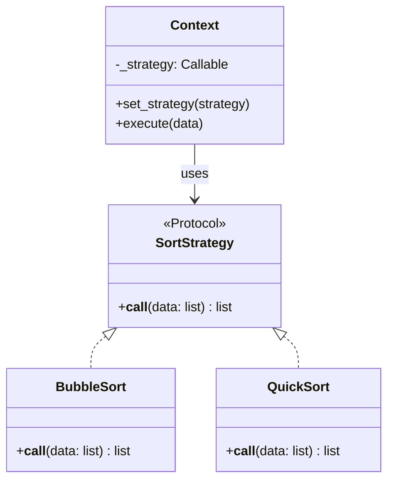

# :material-strategy: Strategy Pattern

!!! abstract "At a Glance"
    **Goal:** Define a family of algorithms, encapsulate each, and make them interchangeable.
    **C++ Equivalent:** Pointer/reference to a base class with `virtual execute()`.

<div class="grid cards" markdown>

- :material-lightbulb-on: **Core Concept** — Strategy = an algorithm encapsulated as an object
- :material-snake: **Python Way** — Strategy = just a callable! `Callable[[Input], Output]`
- :material-alert: **Watch Out** — Don't over-engineer; a simple callable often beats a class hierarchy
- :material-check-circle: **When to Use** — Sorting keys, validation rules, pricing algorithms, render pipelines

</div>

## :material-lightbulb-on: Intuition

!!! info "Core Idea"
    In C++, Strategy requires an abstract base class and virtual dispatch. In Python, **a callable
    is already a strategy**. A function, lambda, or any object with `__call__` can serve as a
    strategy. The ABC approach is still useful for documentation and type safety.

!!! success "C++ → Python Mapping"
    ```cpp
    // C++ — strategy as virtual class
    struct Sorter { virtual void sort(vector<int>&) = 0; };
    struct BubbleSort : Sorter { void sort(vector<int>& v) override {...} };
    ```
    ```python
    # Python — strategy as callable (simplest)
    from typing import Callable
    SortStrategy = Callable[[list[int]], list[int]]

    def bubble_sort(data: list[int]) -> list[int]: ...
    def quick_sort(data: list[int]) -> list[int]: ...
    # Use: sorter = bubble_sort; result = sorter(data)
    ```

## :material-chart-timeline: Strategy Structure



## :material-book-open-variant: Callable Strategy (Pythonic)

```python
from typing import Callable, TypeVar
from functools import singledispatch

T = TypeVar("T")

# Strategy as a type alias for a callable
ValidationStrategy = Callable[[str], bool]
PricingStrategy = Callable[[float, int], float]

# Concrete strategies — just functions
def is_non_empty(value: str) -> bool:
    return bool(value.strip())

def is_email(value: str) -> bool:
    return "@" in value and "." in value.split("@")[-1]

def is_min_length(min_len: int) -> ValidationStrategy:
    """Factory for parameterised strategies."""
    def validate(value: str) -> bool:
        return len(value) >= min_len
    return validate

# Context that uses strategies
class FormField:
    def __init__(self, name: str, *validators: ValidationStrategy) -> None:
        self.name = name
        self._validators = list(validators)

    def add_validator(self, v: ValidationStrategy) -> None:
        self._validators.append(v)

    def validate(self, value: str) -> list[str]:
        errors = []
        for v in self._validators:
            if not v(value):
                errors.append(f"Failed: {v.__name__ if hasattr(v, '__name__') else v}")
        return errors

# Compose strategies
email_field = FormField(
    "email",
    is_non_empty,
    is_email,
    is_min_length(5),
)
print(email_field.validate("alice@example.com"))  # []
print(email_field.validate("bad"))                # [errors...]
```

## :material-code-tags: ABC Strategy Approach

```python
from abc import ABC, abstractmethod

class DiscountStrategy(ABC):
    @abstractmethod
    def apply(self, price: float, quantity: int) -> float: ...

    def __call__(self, price: float, quantity: int) -> float:
        return self.apply(price, quantity)

class NoDiscount(DiscountStrategy):
    def apply(self, price: float, quantity: int) -> float:
        return price * quantity

class BulkDiscount(DiscountStrategy):
    def __init__(self, threshold: int, discount: float) -> None:
        self.threshold = threshold
        self.discount = discount  # e.g., 0.1 = 10%

    def apply(self, price: float, quantity: int) -> float:
        total = price * quantity
        if quantity >= self.threshold:
            total *= (1 - self.discount)
        return total

class SeasonalDiscount(DiscountStrategy):
    def apply(self, price: float, quantity: int) -> float:
        return price * quantity * 0.85   # 15% off

class Order:
    def __init__(self, price: float, qty: int, strategy: DiscountStrategy) -> None:
        self.price = price
        self.qty = qty
        self.strategy = strategy

    @property
    def total(self) -> float:
        return self.strategy(self.price, self.qty)

order = Order(10.0, 50, BulkDiscount(threshold=20, discount=0.1))
print(f"Total: ${order.total:.2f}")  # $450.00

order.strategy = SeasonalDiscount()  # swap at runtime
print(f"Total: ${order.total:.2f}")  # $425.00
```

## :material-function-variant: `functools.singledispatch` as Alternative

```python
from functools import singledispatch

@singledispatch
def process(data):
    raise NotImplementedError(f"No strategy for {type(data)}")

@process.register(list)
def _(data: list) -> str:
    return f"List strategy: {sorted(data)}"

@process.register(dict)
def _(data: dict) -> str:
    return f"Dict strategy: {list(data.keys())}"

@process.register(str)
def _(data: str) -> str:
    return f"String strategy: {data.upper()}"

print(process([3, 1, 2]))          # List strategy: [1, 2, 3]
print(process({"b": 2, "a": 1}))  # Dict strategy: ['b', 'a']
```

## :material-alert: Common Pitfalls

!!! warning "Over-engineering with classes when callables suffice"
    ```python
    # OVER-ENGINEERED — Strategy class with one method
    class UpperCaseStrategy:
        def execute(self, text: str) -> str:
            return text.upper()

    # PYTHONIC — just use the function
    def upper_case(text: str) -> str:
        return text.upper()

    transform = upper_case   # strategy IS the function
    ```

!!! danger "Strategy with mutable shared state"
    If a Strategy object has mutable state and is shared between contexts, concurrent usage
    causes race conditions. Either make strategies stateless (pure functions) or create a new
    strategy instance per context.

## :material-help-circle: Flashcards

???+ question "Why is a callable already a Strategy in Python?"
    Python functions are first-class objects — they can be stored, passed, and called like any
    other object. The Strategy pattern's core requirement is an interchangeable algorithm unit.
    A callable satisfies this without a class hierarchy. You can swap strategies by assigning
    a different function/lambda/callable to the strategy slot.

???+ question "When should you use the ABC Strategy form over a plain callable?"
    Use the ABC form when: (1) strategies require **multiple methods** (not just one), (2) you
    want **type-checked contracts** that mypy enforces, (3) strategies need **shared behaviour**
    in the abstract class (template method pattern), (4) you need `isinstance` checks to
    dispatch logic based on strategy type.

???+ question "How does `functools.singledispatch` relate to Strategy?"
    `singledispatch` is Python's **tag dispatch** — it selects an implementation based on the
    type of the first argument. This is an alternative to the Strategy pattern for type-based
    dispatch without an explicit strategy object. Use it when the "strategy" is implicitly
    determined by the data type.

???+ question "What is the difference between Strategy and Template Method?"
    **Strategy** uses **composition** — the algorithm is injected into the context.
    **Template Method** uses **inheritance** — the algorithm skeleton is in the base class,
    and subclasses fill in the steps. Strategy is more flexible (swap at runtime);
    Template Method is simpler (subclass and override specific steps).

## :material-clipboard-check: Self Test

=== "Question 1"
    Implement a `Sorter` that accepts any sort strategy and benchmarks it.

=== "Answer 1"
    ```python
    import time
    from typing import Callable

    SortFn = Callable[[list[int]], list[int]]

    class Sorter:
        def __init__(self, strategy: SortFn) -> None:
            self.strategy = strategy

        def sort_and_time(self, data: list[int]) -> tuple[list[int], float]:
            start = time.perf_counter()
            result = self.strategy(data[:])   # copy so original not modified
            elapsed = time.perf_counter() - start
            return result, elapsed

    import random
    data = random.sample(range(100_000), 10_000)

    sorter = Sorter(sorted)
    result, t = sorter.sort_and_time(data)
    print(f"Built-in sort: {t:.4f}s")
    ```

=== "Question 2"
    How do you make a strategy configurable at import time vs runtime?

=== "Answer 2"
    **Import time** (module-level default): set the strategy as a module-level constant or
    class attribute — consumers import the module and use the default.

    **Runtime** (dependency injection): pass the strategy as a constructor argument or method
    parameter. This is more testable and flexible:
    ```python
    class Processor:
        def __init__(self, strategy=default_strategy):
            self.strategy = strategy

    # In tests: Processor(strategy=mock_strategy)
    # In production: Processor()  # uses default
    ```

## :material-check-circle: Summary

!!! success "Key Takeaways"
    - In Python, a Strategy is most naturally expressed as a callable (function, lambda, or `__call__`).
    - Use the ABC form for multi-method contracts, type safety, or shared base behaviour.
    - `functools.singledispatch` is Python's built-in type-based strategy dispatch.
    - Strategies should be stateless (pure functions) to avoid shared-state concurrency bugs.
    - Prefer simple callables over Strategy classes unless the extra structure is warranted.
