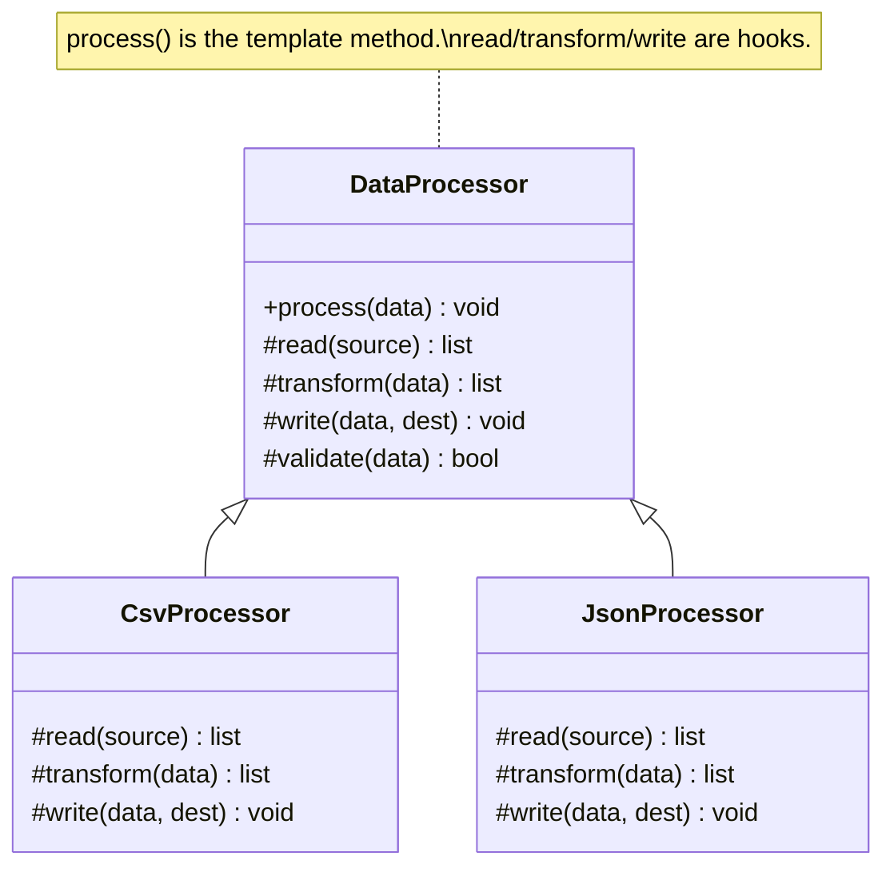

# :material-file-tree: Template Method Pattern

!!! abstract "At a Glance"
    **Goal:** Define an algorithm skeleton in a base class; let subclasses fill in specific steps.
    **C++ Equivalent:** Non-virtual template method calling virtual hook methods.

<div class="grid cards" markdown>

- :material-lightbulb-on: **Core Concept** — Algorithm structure in base class; variable steps in subclasses
- :material-snake: **Python Way** — ABC with abstract hook methods; or `__init_subclass__` for hooks
- :material-alert: **Watch Out** — Do not let subclasses override the template method itself
- :material-check-circle: **When to Use** — Data processing pipelines, game loops, report generators

</div>

## :material-lightbulb-on: Intuition

!!! info "Core Idea"
    Template Method defines the **invariant part** of an algorithm in a base class method,
    and leaves the **variant steps** as abstract methods that subclasses must implement.
    The base class controls the algorithm; subclasses provide the parts that differ.

!!! success "Python vs C++ Non-Virtual Interface"
    In C++, the NVI idiom uses a public non-virtual function calling private virtual hooks.
    Python has no `private virtual` distinction, but the pattern is the same: the template
    method calls abstract hook methods, and only the hooks are overridden.

## :material-chart-timeline: Template Method Structure



## :material-book-open-variant: ABC Template Method

```python
from abc import ABC, abstractmethod
from typing import Any

class DataProcessor(ABC):
    """Template: defines the pipeline; subclasses fill in the steps."""

    def process(self, source: str, destination: str) -> None:
        """Template method — do NOT override in subclasses."""
        raw_data = self.read(source)
        if not self.validate(raw_data):
            raise ValueError(f"Invalid data from {source}")
        transformed = self.transform(raw_data)
        self.write(transformed, destination)
        self.on_complete(source, destination)   # hook with default impl

    @abstractmethod
    def read(self, source: str) -> list[Any]:
        """Hook: read raw data from source."""
        ...

    @abstractmethod
    def transform(self, data: list[Any]) -> list[Any]:
        """Hook: transform data."""
        ...

    @abstractmethod
    def write(self, data: list[Any], destination: str) -> None:
        """Hook: write processed data."""
        ...

    def validate(self, data: list[Any]) -> bool:
        """Optional hook with default implementation."""
        return len(data) > 0

    def on_complete(self, source: str, destination: str) -> None:
        """Optional hook — override to add logging, etc."""
        print(f"Processed {source} → {destination}")

class CsvProcessor(DataProcessor):
    def read(self, source: str) -> list[dict]:
        import csv
        with open(source) as f:
            return list(csv.DictReader(f))

    def transform(self, data: list[dict]) -> list[dict]:
        return [
            {k: v.strip().upper() for k, v in row.items()}
            for row in data
        ]

    def write(self, data: list[dict], destination: str) -> None:
        import csv
        if not data:
            return
        with open(destination, "w", newline="") as f:
            writer = csv.DictWriter(f, fieldnames=data[0].keys())
            writer.writeheader()
            writer.writerows(data)

class InMemoryProcessor(DataProcessor):
    """For testing — operates on in-memory data."""
    def __init__(self, data: list[Any]) -> None:
        self._data = data
        self.result: list[Any] = []

    def read(self, source: str) -> list[Any]:
        return self._data[:]

    def transform(self, data: list[Any]) -> list[Any]:
        return [item * 2 for item in data]

    def write(self, data: list[Any], destination: str) -> None:
        self.result = data

proc = InMemoryProcessor([1, 2, 3])
proc.process("memory", "memory_out")
print(proc.result)   # [2, 4, 6]
```

## :material-hook: `__init_subclass__` as a Hook Alternative

```python
from typing import Any, ClassVar

class PipelineBase:
    """
    Alternative to Template Method using __init_subclass__.
    Subclasses declare their steps as class attributes;
    the base class assembles the pipeline.
    """

    _steps: ClassVar[list[str]] = []

    def __init_subclass__(cls, steps: list[str] = (), **kwargs: Any) -> None:
        super().__init_subclass__(**kwargs)
        cls._steps = list(steps)

    def run(self, data: Any) -> Any:
        for step_name in self._steps:
            step = getattr(self, step_name)
            data = step(data)
        return data

class TextPipeline(PipelineBase, steps=["strip", "lower", "split"]):
    def strip(self, data: str) -> str:
        return data.strip()

    def lower(self, data: str) -> str:
        return data.lower()

    def split(self, data: str) -> list[str]:
        return data.split()

pipeline = TextPipeline()
result = pipeline.run("  Hello World  ")
print(result)   # ['hello', 'world']
```

## :material-alert: Common Pitfalls

!!! warning "Subclasses overriding the template method"
    In Python there is no `final` keyword. By convention, document that the template method
    should not be overridden. For enforcement, use `__init_subclass__` to check:
    ```python
    def __init_subclass__(cls, **kwargs):
        super().__init_subclass__(**kwargs)
        if "process" in cls.__dict__:
            raise TypeError(f"{cls.__name__} must not override 'process()'")
    ```

!!! danger "Too many abstract hooks makes the pattern brittle"
    If you have 7 abstract methods, every subclass must implement all 7 — even if some are
    irrelevant. Provide sensible default implementations for optional hooks (`def hook(self): pass`)
    and only make the truly required steps `@abstractmethod`.

## :material-help-circle: Flashcards

???+ question "What is the Hollywood Principle and how does Template Method implement it?"
    The Hollywood Principle: "Don't call us, we'll call you." The base class calls the subclass
    hooks — the subclass does not call the parent algorithm. Template Method implements this by
    having the base class template method invoke the abstract hook methods, not the reverse.

???+ question "What is the difference between Template Method and Strategy?"
    Both vary part of an algorithm. **Template Method** uses inheritance — the variant part is
    overridden in a subclass; the algorithm structure is in the base class. **Strategy** uses
    composition — the algorithm is injected as an external object. Template Method is simpler
    (just subclass); Strategy is more flexible (swap at runtime without subclassing).

???+ question "How do you prevent a template method from being overridden in Python?"
    Python 3.8+ does not have a `final` method decorator in the standard library, but
    `typing.final` marks a method as not to be overridden (mypy enforces it).
    Use `__init_subclass__` for runtime enforcement.

???+ question "What is the Non-Virtual Interface (NVI) idiom in C++ and its Python equivalent?"
    NVI: public non-virtual function calls private virtual functions. This lets the base class
    add pre/post logic without the subclass being able to bypass it. Python equivalent: the
    template method calls abstract hook methods. Subclasses can only override the hooks,
    not the template method (by convention/enforcement).

## :material-clipboard-check: Self Test

=== "Question 1"
    Design a `ReportGenerator` template that has steps: `gather_data`, `format_data`, `render`.
    Implement HTML and Markdown subclasses.

=== "Answer 1"
    ```python
    from abc import ABC, abstractmethod

    class ReportGenerator(ABC):
        def generate(self, title: str) -> str:
            data = self.gather_data()
            formatted = self.format_data(data)
            return self.render(title, formatted)

        @abstractmethod
        def gather_data(self) -> list[dict]: ...

        @abstractmethod
        def format_data(self, data: list[dict]) -> list[str]: ...

        @abstractmethod
        def render(self, title: str, lines: list[str]) -> str: ...

    class HtmlReport(ReportGenerator):
        def gather_data(self): return [{"item": "A", "value": 1}]
        def format_data(self, data): return [f"<li>{d['item']}: {d['value']}</li>" for d in data]
        def render(self, title, lines): return f"<h1>{title}</h1><ul>{''.join(lines)}</ul>"

    class MarkdownReport(ReportGenerator):
        def gather_data(self): return [{"item": "A", "value": 1}]
        def format_data(self, data): return [f"- {d['item']}: {d['value']}" for d in data]
        def render(self, title, lines): return f"# {title}\n" + "\n".join(lines)
    ```

=== "Question 2"
    How would you add a timing step to the template method without modifying each subclass?

=== "Answer 2"
    Override the template method in the base class to wrap the hooks with timing:
    ```python
    import time

    class TimedDataProcessor(DataProcessor):
        """Adds timing to each step without touching subclasses."""
        def process(self, source: str, destination: str) -> None:
            steps = [
                ("read", lambda: self.read(source)),
                ("validate/transform", lambda: self.transform(self.read(source))),
            ]
            for name, step in steps:
                start = time.perf_counter()
                step()
                print(f"  {name}: {time.perf_counter() - start:.3f}s")
            super().process(source, destination)
    ```

## :material-check-circle: Summary

!!! success "Key Takeaways"
    - Template Method defines the algorithm skeleton; subclasses implement the variant steps.
    - Use `@abstractmethod` for required hooks; provide defaults for optional ones.
    - The template method itself should not be overridable (use `typing.final` or `__init_subclass__` enforcement).
    - `__init_subclass__` offers a declarative alternative for assembling step pipelines.
    - Template Method uses inheritance (static); Strategy uses composition (dynamic).
    - Apply the Hollywood Principle: the base class calls the subclass, not the reverse.
