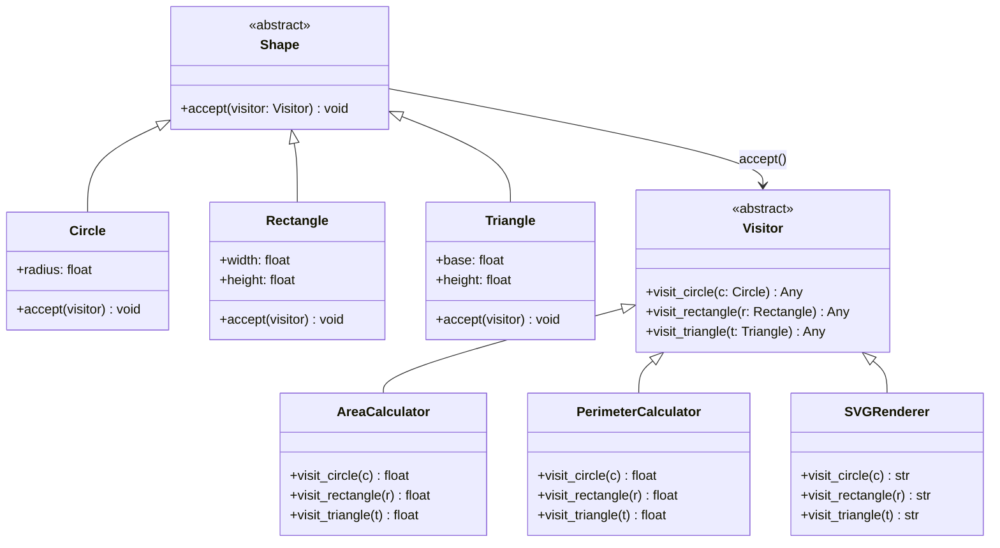

# :material-account-arrow-right: Visitor Pattern

!!! abstract "At a Glance"
    **Intent:** Represent an operation to be performed on elements of an object structure; Visitor lets you add new operations without changing the element classes.
    **C++ Equivalent:** Abstract `Visitor` with `visit(ConcreteElement&)` overloads; elements call `visitor.visit(*this)` — classic double dispatch via virtual functions.
    **Category:** Behavioral

<div class="grid cards" markdown>
- :material-lightbulb-on: **Core Concept** — Separate algorithms from the objects they operate on; add new algorithms by adding new Visitor classes, never touching element classes.
- :material-snake: **Python Way** — `Visitor` ABC with `visit_*` methods; `Shape.accept(visitor)`; or use `functools.singledispatch` as a built-in double-dispatch alternative.
- :material-alert: **Watch Out** — Adding a **new element type** requires updating every existing visitor — the inverse of the Open/Closed Principle for elements.
- :material-check-circle: **When to Use** — When you need many unrelated operations over a stable class hierarchy (compilers, renderers, serialisers, analytics over ASTs).
</div>

---

## :material-lightbulb-on: Intuition

!!! info "Core Idea"
    Imagine a tax inspector visiting different types of business assets: cash, property, stock.
    Each asset type knows how to *accept* the inspector, but the inspector carries all the tax-calculation logic.
    Next year, when the rules change, you write a new inspector — the asset classes stay untouched.
    The Visitor pattern captures this: elements expose an `accept(visitor)` hook; visitors carry the operations.

!!! success "Python vs C++"
    C++ achieves double dispatch through two virtual calls: `element.accept(visitor)` dispatches on element type, then `visitor.visit(*this)` dispatches on visitor type.
    Python's dynamic typing makes this simpler: `isinstance()` checks or `functools.singledispatch` handle the second dispatch without any `accept()` boilerplate.
    `singledispatch` registers handlers per type; Python chooses the right handler at call time — visitor-like dispatch with zero class hierarchy overhead.

---

## :material-view-grid: Double Dispatch Class Diagram



---

## :material-book-open-variant: Implementation

### Structure

| Role | Responsibility |
|---|---|
| `Visitor` (ABC) | Declares a `visit_X()` method for each element type |
| `ConcreteVisitor` | Implements operations for every element type |
| `Element` (ABC) | Declares `accept(visitor)` |
| `ConcreteElement` | Calls the correct `visitor.visit_X(self)` in `accept()` |
| `ObjectStructure` | Holds elements and lets visitors traverse them |

### Python Code

```python
from __future__ import annotations
from abc import ABC, abstractmethod
import math
from functools import singledispatch
from typing import Any


# ── Element Hierarchy ────────────────────────────────────────────────────────

class Shape(ABC):
    @abstractmethod
    def accept(self, visitor: "Visitor") -> Any:
        """Double-dispatch hook — call visitor.visit_<type>(self)."""
        ...


class Circle(Shape):
    def __init__(self, radius: float) -> None:
        self.radius = radius

    def accept(self, visitor: "Visitor") -> Any:
        return visitor.visit_circle(self)

    def __repr__(self) -> str:
        return f"Circle(r={self.radius})"


class Rectangle(Shape):
    def __init__(self, width: float, height: float) -> None:
        self.width = width
        self.height = height

    def accept(self, visitor: "Visitor") -> Any:
        return visitor.visit_rectangle(self)

    def __repr__(self) -> str:
        return f"Rectangle({self.width}×{self.height})"


class Triangle(Shape):
    def __init__(self, base: float, height: float, side_b: float, side_c: float) -> None:
        self.base = base
        self.height = height
        self.side_b = side_b
        self.side_c = side_c

    def accept(self, visitor: "Visitor") -> Any:
        return visitor.visit_triangle(self)

    def __repr__(self) -> str:
        return f"Triangle(b={self.base}, h={self.height})"


# ── Visitor Hierarchy ────────────────────────────────────────────────────────

class Visitor(ABC):
    @abstractmethod
    def visit_circle(self, circle: Circle) -> Any: ...

    @abstractmethod
    def visit_rectangle(self, rect: Rectangle) -> Any: ...

    @abstractmethod
    def visit_triangle(self, tri: Triangle) -> Any: ...


class AreaCalculator(Visitor):
    """Computes the area of each shape."""

    def visit_circle(self, c: Circle) -> float:
        return math.pi * c.radius ** 2

    def visit_rectangle(self, r: Rectangle) -> float:
        return r.width * r.height

    def visit_triangle(self, t: Triangle) -> float:
        return 0.5 * t.base * t.height


class PerimeterCalculator(Visitor):
    """Computes the perimeter of each shape."""

    def visit_circle(self, c: Circle) -> float:
        return 2 * math.pi * c.radius

    def visit_rectangle(self, r: Rectangle) -> float:
        return 2 * (r.width + r.height)

    def visit_triangle(self, t: Triangle) -> float:
        return t.base + t.side_b + t.side_c


class SVGRenderer(Visitor):
    """Renders each shape as an SVG element string."""

    def visit_circle(self, c: Circle) -> str:
        return f'<circle cx="50" cy="50" r="{c.radius}" fill="blue"/>'

    def visit_rectangle(self, r: Rectangle) -> str:
        return f'<rect width="{r.width}" height="{r.height}" fill="red"/>'

    def visit_triangle(self, t: Triangle) -> str:
        # Simplified isoceles triangle SVG path
        half = t.base / 2
        return (
            f'<polygon points="50,{50-t.height} {50-half},{50} {50+half},{50}" '
            f'fill="green"/>'
        )


class JSONExporter(Visitor):
    """Serialises each shape to a dict (no element class modification needed)."""

    def visit_circle(self, c: Circle) -> dict:
        return {"type": "circle", "radius": c.radius}

    def visit_rectangle(self, r: Rectangle) -> dict:
        return {"type": "rectangle", "width": r.width, "height": r.height}

    def visit_triangle(self, t: Triangle) -> dict:
        return {"type": "triangle", "base": t.base, "height": t.height}


# ── singledispatch Alternative (no Visitor ABC, no accept()) ─────────────────

@singledispatch
def compute_area(shape: Shape) -> float:
    raise NotImplementedError(f"compute_area not implemented for {type(shape)}")

@compute_area.register
def _(shape: Circle) -> float:
    return math.pi * shape.radius ** 2

@compute_area.register
def _(shape: Rectangle) -> float:
    return shape.width * shape.height

@compute_area.register
def _(shape: Triangle) -> float:
    return 0.5 * shape.base * shape.height
```

### Example Usage

```python
import json

# Build a shape collection
shapes: list[Shape] = [
    Circle(5),
    Rectangle(4, 6),
    Triangle(base=3, height=4, side_b=4, side_c=5),
]

# ── Apply multiple visitors ──────────────────────────────────────────────────
area_calc = AreaCalculator()
perim_calc = PerimeterCalculator()
renderer = SVGRenderer()
exporter = JSONExporter()

print(f"{'Shape':<25} {'Area':>10} {'Perimeter':>12} SVG")
print("-" * 70)
for shape in shapes:
    area  = shape.accept(area_calc)
    perim = shape.accept(perim_calc)
    svg   = shape.accept(renderer)
    print(f"{str(shape):<25} {area:>10.2f} {perim:>12.2f}  {svg[:40]}...")

# Shape                          Area    Perimeter SVG
# Circle(r=5)                   78.54        31.42  <circle cx="50" cy="50" r="5" fill=...
# Rectangle(4×6)                24.00        20.00  <rect width="4" height="6" fill="re...
# Triangle(b=3, h=4)             6.00        12.00  <polygon points="50,46.0 48.5,50 51...

# Export all shapes to JSON
data = [shape.accept(exporter) for shape in shapes]
print(json.dumps(data, indent=2))

# ── singledispatch alternative (no accept() boilerplate) ─────────────────────
print("\n=== singledispatch ===")
for shape in shapes:
    print(f"  {shape}: area = {compute_area(shape):.2f}")


# ── Traversal over an object structure ──────────────────────────────────────
class Drawing:
    """Object structure that lets visitors traverse all contained shapes."""

    def __init__(self) -> None:
        self._shapes: list[Shape] = []

    def add(self, shape: Shape) -> None:
        self._shapes.append(shape)

    def accept(self, visitor: Visitor) -> list[Any]:
        return [shape.accept(visitor) for shape in self._shapes]

    def total_area(self) -> float:
        return sum(self.accept(AreaCalculator()))


drawing = Drawing()
for s in shapes:
    drawing.add(s)

print(f"\nTotal area of drawing: {drawing.total_area():.2f}")
# Total area of drawing: 108.54
```

---

## :material-alert: Common Pitfalls

!!! warning "Adding New Element Types is Expensive"
    Every new element class (e.g., `Ellipse`) requires updating **every** existing visitor with a new `visit_ellipse()` method. If your element hierarchy changes frequently, consider the Strategy pattern instead.

!!! warning "visit_* Method Name Mismatch"
    `accept()` calls `visitor.visit_circle(self)` — if you rename the method in the visitor but not in `accept()`, Python raises `AttributeError` at runtime with no compile-time safety. Use an ABC to get a `TypeError` at class instantiation time if any method is missing.

!!! danger "Breaking Encapsulation"
    Visitors need access to element internals (e.g., `circle.radius`) to do their work. This can expose implementation details that were previously private. Provide read-only properties instead of public attributes to maintain a clean API boundary.

!!! danger "singledispatch and Inheritance"
    `singledispatch` dispatches on the **MRO** (Method Resolution Order). If `ColoredCircle(Circle)` is not explicitly registered, calls fall through to the `Circle` handler — which may or may not be correct. Always register specialised subclass handlers explicitly.

---

## :material-help-circle: Flashcards

???+ question "What is double dispatch and why does Visitor need it?"
    Single dispatch (normal virtual call) selects a method based on **one** object's type.
    Visitor needs dispatch on **two** types: the element type *and* the visitor type.
    `element.accept(visitor)` dispatches on element; inside `accept()`, `visitor.visit_X(self)` dispatches on visitor. Two virtual calls = double dispatch.

???+ question "What is the key trade-off of the Visitor pattern?"
    **Easy to add new operations** (new `Visitor` subclass) but **hard to add new element types** (every existing visitor must be updated). It inverts the Open/Closed trade-off relative to adding methods directly to elements.

???+ question "How does `functools.singledispatch` replace the Visitor pattern?"
    `singledispatch` registers handler functions per element type. Calling `compute_area(shape)` selects the correct function based on `type(shape)` — the same second-dispatch that `visitor.visit_X()` performs. No `accept()` method on elements is needed.

???+ question "When would you choose classic Visitor over `singledispatch`?"
    Choose classic Visitor when: (1) you need the visitor to accumulate state across calls (e.g., a running total), (2) you want a formal interface contract enforced by ABC, or (3) you have multiple related operations that belong together in one cohesive class (e.g., `HTMLRenderer` with visit methods for a dozen element types).

---

## :material-clipboard-check: Self Test

=== "Question 1"
    You have 5 element classes and 3 visitor classes. How many `visit_*` methods must be implemented in total? What happens if you add a 6th element class?

=== "Answer 1"
    Currently: 5 element types × 3 visitors = **15** `visit_*` methods total.
    Adding a 6th element class: you need 3 new `visit_sixth()` methods (one per visitor) plus the `accept()` method on the new element class — touching 4 files. This is the core scalability problem of the Visitor pattern when elements change frequently.

=== "Question 2"
    A `TaxCalculator` visitor needs different logic for `GoodsItem` vs `ServiceItem`, but both inherit from `LineItem`. How do you use `singledispatch` to handle this correctly?

=== "Answer 2"
    Register both subclasses explicitly:
    ```python
    @compute_tax.register(GoodsItem)
    def _(item): return item.price * 0.10   # 10% GST

    @compute_tax.register(ServiceItem)
    def _(item): return item.price * 0.18   # 18% service tax
    ```
    `singledispatch` checks the MRO and picks the most specific registered type. Without explicit registration, both would fall through to the `LineItem` handler (if one exists) or raise `NotImplementedError`.

---

## :material-check-circle: Summary

!!! success "Key Takeaways"
    - **Open/Closed for operations**: add new algorithms (visitors) without modifying element classes.
    - **Double dispatch**: `accept()` on the element + `visit_X()` on the visitor = type-safe dispatch on both dimensions.
    - **Python shortcut**: `functools.singledispatch` delivers visitor-like dispatch without `accept()` boilerplate — ideal for stable element types with rapidly evolving operations.
    - **Trade-off**: adding new element types is expensive — update all visitors. Best for **stable** element hierarchies.
    - **Real-world uses**: compiler AST passes (type checking, code generation, optimisation), document exporters (HTML/PDF/JSON), tax/pricing rules engines, graphics renderers, static analysis tools.
