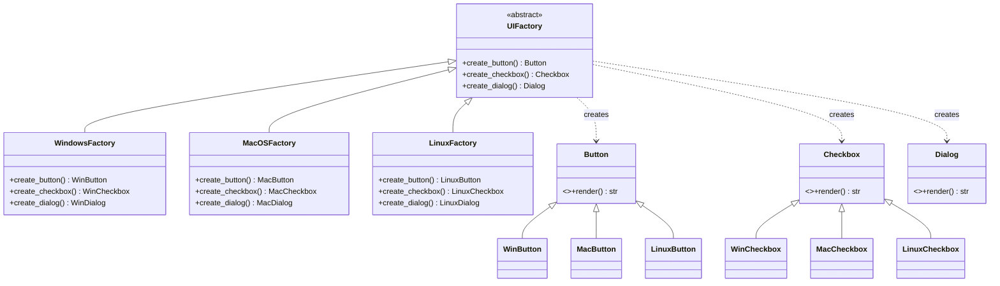

# :material-factory: Abstract Factory Pattern

!!! abstract "At a Glance"
    **Intent:** Provide an interface for creating families of related or dependent objects without specifying their concrete classes.
    **C++ Equivalent:** Abstract factory base class with pure-virtual `createButton()`, `createCheckbox()` etc.; concrete factories override each method.
    **Category:** Creational

<div class="grid cards" markdown>
- :material-lightbulb-on: **Core Concept** — Group related object creation behind a single factory interface so the entire product family can be swapped atomically.
- :material-snake: **Python Way** — `UIFactory` ABC with `create_button()`/`create_checkbox()`/`create_dialog()`; `WindowsFactory`/`MacOSFactory`/`LinuxFactory`; `Protocol` makes the interface structural.
- :material-alert: **Watch Out** — Adding a new product type (e.g., `create_tooltip()`) requires updating **every** concrete factory — interface changes are expensive.
- :material-check-circle: **When to Use** — Cross-platform UI toolkits, database driver families, theme engines, test doubles that replace entire subsystems.
</div>

---

## :material-lightbulb-on: Intuition

!!! info "Core Idea"
    Think of a furniture store that sells sets: a **Victorian** range (Victorian sofa, Victorian chair, Victorian table) and a **Modern** range.
    You never mix a Victorian sofa with a Modern chair — they must be from the same family for the room to look coherent.
    The Abstract Factory enforces this constraint: you pick one factory object (`VictorianFactory` or `ModernFactory`), and every `create_*` call on it returns matching products from the same family.

!!! success "Python vs C++"
    C++ requires pure-virtual factory methods and a parallel hierarchy of abstract product classes — many files, many virtual tables.
    Python achieves the same with `abc.ABC` base classes or, more idiomatically, `typing.Protocol`.
    A `Protocol`-based factory is **structurally typed**: any class with the right `create_*` signatures qualifies as a factory without inheriting from anything — great for test doubles and third-party integrations.

---

## :material-graph: Factory and Product Hierarchy



---

## :material-book-open-variant: Implementation

### Structure

| Role | Responsibility |
|---|---|
| `AbstractFactory` | Declares creation methods for each product type |
| `ConcreteFactory` | Implements creation — returns products from one family |
| `AbstractProduct` | Declares the interface for a product type |
| `ConcreteProduct` | Implements a specific product variant |
| `Client` | Uses only abstract factory and product interfaces |

### Python Code

```python
from __future__ import annotations
from abc import ABC, abstractmethod
from typing import Protocol, runtime_checkable


# ════════════════════════════════════════════════════════════════════════════
# Abstract Products
# ════════════════════════════════════════════════════════════════════════════

class Button(ABC):
    @abstractmethod
    def render(self) -> str: ...

    @abstractmethod
    def on_click(self, callback) -> None: ...


class Checkbox(ABC):
    @abstractmethod
    def render(self) -> str: ...

    @abstractmethod
    def is_checked(self) -> bool: ...


class Dialog(ABC):
    @abstractmethod
    def render(self) -> str: ...

    @abstractmethod
    def show(self, message: str) -> None: ...


# ════════════════════════════════════════════════════════════════════════════
# Windows Product Family
# ════════════════════════════════════════════════════════════════════════════

class WinButton(Button):
    def render(self) -> str:
        return "[Win32 Button]"

    def on_click(self, callback) -> None:
        print(f"WinButton: registered click handler {callback.__name__}")


class WinCheckbox(Checkbox):
    def __init__(self) -> None:
        self._checked = False

    def render(self) -> str:
        mark = "X" if self._checked else " "
        return f"[{mark}] Win32 Checkbox"

    def is_checked(self) -> bool:
        return self._checked


class WinDialog(Dialog):
    def render(self) -> str:
        return "╔══════════════╗\n║  Win Dialog  ║\n╚══════════════╝"

    def show(self, message: str) -> None:
        print(f"[Win32 MessageBox] {message}")


# ════════════════════════════════════════════════════════════════════════════
# macOS Product Family
# ════════════════════════════════════════════════════════════════════════════

class MacButton(Button):
    def render(self) -> str:
        return "( macOS Button )"

    def on_click(self, callback) -> None:
        print(f"MacButton: NSButton target-action → {callback.__name__}")


class MacCheckbox(Checkbox):
    def __init__(self) -> None:
        self._checked = False

    def render(self) -> str:
        mark = "✓" if self._checked else "○"
        return f"{mark} macOS Checkbox"

    def is_checked(self) -> bool:
        return self._checked


class MacDialog(Dialog):
    def render(self) -> str:
        return "┌──────────────┐\n│  Mac Sheet   │\n└──────────────┘"

    def show(self, message: str) -> None:
        print(f"[NSAlert] {message}")


# ════════════════════════════════════════════════════════════════════════════
# Linux (GTK) Product Family
# ════════════════════════════════════════════════════════════════════════════

class LinuxButton(Button):
    def render(self) -> str:
        return "<GtkButton />"

    def on_click(self, callback) -> None:
        print(f"GtkButton: g_signal_connect 'clicked' → {callback.__name__}")


class LinuxCheckbox(Checkbox):
    def __init__(self) -> None:
        self._checked = False

    def render(self) -> str:
        mark = "☑" if self._checked else "☐"
        return f"{mark} GtkCheckButton"

    def is_checked(self) -> bool:
        return self._checked


class LinuxDialog(Dialog):
    def render(self) -> str:
        return "<GtkDialog />"

    def show(self, message: str) -> None:
        print(f"[GtkMessageDialog] {message}")


# ════════════════════════════════════════════════════════════════════════════
# Abstract Factory (ABC variant)
# ════════════════════════════════════════════════════════════════════════════

class UIFactory(ABC):
    @abstractmethod
    def create_button(self) -> Button: ...

    @abstractmethod
    def create_checkbox(self) -> Checkbox: ...

    @abstractmethod
    def create_dialog(self) -> Dialog: ...


class WindowsFactory(UIFactory):
    def create_button(self)   -> Button:   return WinButton()
    def create_checkbox(self) -> Checkbox: return WinCheckbox()
    def create_dialog(self)   -> Dialog:   return WinDialog()


class MacOSFactory(UIFactory):
    def create_button(self)   -> Button:   return MacButton()
    def create_checkbox(self) -> Checkbox: return MacCheckbox()
    def create_dialog(self)   -> Dialog:   return MacDialog()


class LinuxFactory(UIFactory):
    def create_button(self)   -> Button:   return LinuxButton()
    def create_checkbox(self) -> Checkbox: return LinuxCheckbox()
    def create_dialog(self)   -> Dialog:   return LinuxDialog()


# ── Factory registry (select at runtime) ─────────────────────────────────────

FACTORIES: dict[str, type[UIFactory]] = {
    "windows": WindowsFactory,
    "macos":   MacOSFactory,
    "linux":   LinuxFactory,
}

def get_factory(platform: str) -> UIFactory:
    try:
        return FACTORIES[platform.lower()]()
    except KeyError:
        raise ValueError(f"Unknown platform: {platform!r}. Choose from {list(FACTORIES)}")


# ════════════════════════════════════════════════════════════════════════════
# Protocol variant — structural typing, no inheritance required
# ════════════════════════════════════════════════════════════════════════════

@runtime_checkable
class UIFactoryProtocol(Protocol):
    def create_button(self)   -> Button:   ...
    def create_checkbox(self) -> Checkbox: ...
    def create_dialog(self)   -> Dialog:   ...


# Any class with these three methods qualifies — useful for test doubles:
class MockFactory:
    """Test double — no ABC inheritance needed."""
    def create_button(self)   -> Button:   return WinButton()
    def create_checkbox(self) -> Checkbox: return WinCheckbox()
    def create_dialog(self)   -> Dialog:   return WinDialog()

assert isinstance(MockFactory(), UIFactoryProtocol)  # structural check passes
```

### Example Usage

```python
# ── Cross-Platform UI Application ────────────────────────────────────────────

def build_ui(factory: UIFactory) -> None:
    """Client code: talks only to abstract factory and product interfaces."""
    button   = factory.create_button()
    checkbox = factory.create_checkbox()
    dialog   = factory.create_dialog()

    print(button.render())
    button.on_click(lambda: None)
    print(checkbox.render())
    print(dialog.render())
    dialog.show("Operation completed successfully.")
    print()


import sys, platform as _platform

# Auto-detect at runtime
os_name = _platform.system().lower()
mapping = {"windows": "windows", "darwin": "macos", "linux": "linux"}
detected = mapping.get(os_name, "linux")

print(f"Detected platform: {detected}")
factory = get_factory(detected)
build_ui(factory)

# Force a specific platform for demo
print("=== Windows UI ===")
build_ui(get_factory("windows"))
print("=== macOS UI ===")
build_ui(get_factory("macos"))
print("=== Linux UI ===")
build_ui(get_factory("linux"))


# ── Database Driver Abstract Factory ─────────────────────────────────────────

from abc import ABC, abstractmethod

class Connection(ABC):
    @abstractmethod
    def execute(self, sql: str) -> list[dict]: ...
    @abstractmethod
    def close(self) -> None: ...

class Cursor(ABC):
    @abstractmethod
    def fetchall(self) -> list[dict]: ...

class DBFactory(ABC):
    @abstractmethod
    def create_connection(self, dsn: str) -> Connection: ...
    @abstractmethod
    def create_cursor(self, conn: Connection) -> Cursor: ...


class SQLiteConnection(Connection):
    def __init__(self, dsn: str) -> None:
        print(f"[SQLite] Connected to {dsn}")
    def execute(self, sql: str) -> list[dict]:
        print(f"[SQLite] Executing: {sql}")
        return []
    def close(self) -> None:
        print("[SQLite] Connection closed")

class SQLiteFactory(DBFactory):
    def create_connection(self, dsn: str) -> Connection:
        return SQLiteConnection(dsn)
    def create_cursor(self, conn: Connection):
        return None  # simplified


def run_query(db: DBFactory, dsn: str, sql: str) -> None:
    conn = db.create_connection(dsn)
    conn.execute(sql)
    conn.close()

run_query(SQLiteFactory(), ":memory:", "SELECT * FROM users WHERE active = 1")
# [SQLite] Connected to :memory:
# [SQLite] Executing: SELECT * FROM users WHERE active = 1
# [SQLite] Connection closed
```

---

## :material-alert: Common Pitfalls

!!! warning "Interface Freeze"
    Adding a new product method (e.g., `create_tooltip()`) to the abstract factory forces you to update **every** concrete factory. Mitigate with a default implementation in the ABC that raises `NotImplementedError`, or by splitting the factory into smaller focused protocols.

!!! warning "Factory Selection Coupling"
    Hard-coding `factory = WindowsFactory()` in application code defeats the pattern. Always select the factory via a registry, environment variable, config file, or dependency injection so the platform can be swapped at runtime.

!!! danger "Product Interface Leakage"
    If `build_ui()` uses `isinstance(button, WinButton)` to add platform-specific behaviour, the abstraction is broken. Client code must use **only** the abstract product interface; concrete types must not leak through.

!!! danger "Too-Fine-Grained Factories"
    Creating a separate factory for every minor variant (e.g., `LightThemeWindowsFactory`, `DarkThemeWindowsFactory`) leads to a combinatorial explosion. Prefer composing factories (pass a `Theme` object) or using the Builder pattern for complex configuration.

---

## :material-help-circle: Flashcards

???+ question "What is the core guarantee the Abstract Factory pattern provides?"
    It guarantees that all products created by one factory instance belong to the **same family** and are compatible with each other. You can never accidentally mix a macOS button with a Windows dialog if you always obtain both from the same factory.

???+ question "How does `typing.Protocol` improve on ABC for abstract factories?"
    `Protocol` enables **structural subtyping**: a class satisfies a factory protocol by having the right methods, without inheriting from any base class. This is ideal for test doubles, third-party adapters, and hot-swappable plugins that should not depend on your internal ABC hierarchy.

???+ question "What is the difference between Abstract Factory and Factory Method?"
    **Factory Method** has one creation method; subclasses override it. Good for creating one product.
    **Abstract Factory** has multiple creation methods; a concrete factory produces a whole **family** of products. Use Abstract Factory when products must be consistent with each other.

???+ question "How would you select a concrete factory at runtime from a config file?"
    Store a `dict[str, type[UIFactory]]` registry and read a key from config: `factory_class = FACTORIES[config['platform']]`. Instantiate it: `factory = factory_class()`. The rest of the application never sees the string key again.

---

## :material-clipboard-check: Self Test

=== "Question 1"
    Your team adds a `Tooltip` product to the UI family. List every code location that must be changed.

=== "Answer 1"
    1. Add `create_tooltip() -> Tooltip` to the `UIFactory` ABC (or Protocol).
    2. Add a `Tooltip` ABC with `show(text: str)`.
    3. Add `WinTooltip`, `MacTooltip`, `LinuxTooltip` concrete product classes.
    4. Add `create_tooltip()` to `WindowsFactory`, `MacOSFactory`, and `LinuxFactory`.
    5. Optionally add `MockTooltip` to any test doubles.
    This is the "interface freeze" cost of Abstract Factory.

=== "Question 2"
    A colleague suggests replacing the entire Abstract Factory with a module-level `import` that uses `if sys.platform == 'win32':`. What are the trade-offs?

=== "Answer 2"
    **Pros**: simpler, no class hierarchy, easy to read.
    **Cons**: cannot be injected (testing requires `monkeypatching`), cannot be selected at runtime without `importlib` hacks, no static type safety across families, violates Open/Closed (must edit the `if/elif` chain for each new platform). Abstract Factory wins when testability, multiple platforms, or runtime selection are required.

---

## :material-check-circle: Summary

!!! success "Key Takeaways"
    - **Family consistency**: one factory, one product family — mixing families is structurally impossible.
    - **Open for factories, closed for clients**: add a new platform by adding a new factory class; no client code changes.
    - **Protocol over ABC**: prefer structural typing for test doubles and third-party integrations.
    - **Registry pattern**: a `dict[str, type[Factory]]` enables runtime factory selection from config or CLI flags.
    - **Real-world uses**: `tkinter`/`PyQt`/`wxPython` widget toolkits, database driver abstraction layers (PEP 249), cloud provider SDKs (AWS/GCP/Azure client families), theme engines.
