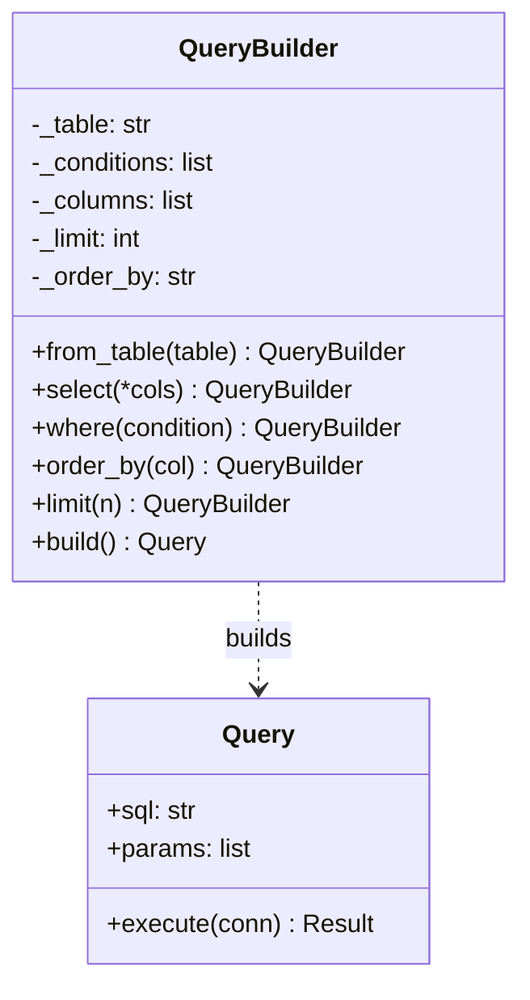

# :material-hammer-wrench: Builder Pattern

!!! abstract "At a Glance"
    **Goal:** Construct complex objects step by step, separating construction from representation.
    **C++ Equivalent:** Named parameter idiom, builder classes with method chaining.

<div class="grid cards" markdown>

- :material-lightbulb-on: **Core Concept** — Build complex objects incrementally with a fluent API
- :material-snake: **Python Way** — Fluent builder OR `@dataclass` + `replace()` for immutable builds
- :material-alert: **Watch Out** — Builder state must be reset between builds if the builder is reused
- :material-check-circle: **When to Use** — Complex config objects, query builders, document generation

</div>

## :material-lightbulb-on: Intuition

!!! info "Core Idea"
    When constructing an object requires many optional parameters or a specific sequence of steps,
    a builder separates the "what to build" from "how to build it". The fluent interface (method
    chaining) makes the construction code read like a sentence.

!!! success "C++ → Python Mapping"
    | C++ | Python |
    |---|---|
    | Named parameter idiom | `@dataclass` with defaults |
    | `Builder& setX(int x) { x_=x; return *this; }` | `def x(self, v): self._x=v; return self` |
    | Director class | Optional; often just the builder itself |
    | `build()` returns the product | Same |

## :material-chart-timeline: Builder Structure



## :material-book-open-variant: Fluent Builder — SQL Query Builder

```python
from __future__ import annotations
from dataclasses import dataclass, field

@dataclass(frozen=True)
class Query:
    """Immutable product built by QueryBuilder."""
    table: str
    columns: tuple[str, ...] = ("*",)
    conditions: tuple[str, ...] = ()
    order_by: str | None = None
    limit: int | None = None
    offset: int | None = None

    @property
    def sql(self) -> str:
        cols = ", ".join(self.columns)
        q = f"SELECT {cols} FROM {self.table}"
        if self.conditions:
            q += " WHERE " + " AND ".join(self.conditions)
        if self.order_by:
            q += f" ORDER BY {self.order_by}"
        if self.limit is not None:
            q += f" LIMIT {self.limit}"
        if self.offset is not None:
            q += f" OFFSET {self.offset}"
        return q

class QueryBuilder:
    """Fluent builder for SQL queries."""

    def __init__(self, table: str) -> None:
        self._table = table
        self._columns: list[str] = ["*"]
        self._conditions: list[str] = []
        self._order_by: str | None = None
        self._limit: int | None = None
        self._offset: int | None = None

    def select(self, *columns: str) -> QueryBuilder:
        self._columns = list(columns)
        return self   # return self enables method chaining

    def where(self, condition: str) -> QueryBuilder:
        self._conditions.append(condition)
        return self

    def order_by(self, column: str) -> QueryBuilder:
        self._order_by = column
        return self

    def limit(self, n: int) -> QueryBuilder:
        self._limit = n
        return self

    def offset(self, n: int) -> QueryBuilder:
        self._offset = n
        return self

    def build(self) -> Query:
        return Query(
            table=self._table,
            columns=tuple(self._columns),
            conditions=tuple(self._conditions),
            order_by=self._order_by,
            limit=self._limit,
            offset=self._offset,
        )

# Fluent usage
query = (
    QueryBuilder("users")
    .select("id", "name", "email")
    .where("active = true")
    .where("age > 18")
    .order_by("name")
    .limit(20)
    .offset(40)
    .build()
)
print(query.sql)
# SELECT id, name, email FROM users WHERE active = true AND age > 18 ORDER BY name LIMIT 20 OFFSET 40
```

## :material-snowflake: `@dataclass` + `replace()` — Immutable Builder

```python
from dataclasses import dataclass, replace

@dataclass(frozen=True)
class HttpRequest:
    method: str = "GET"
    url: str = "/"
    headers: tuple[tuple[str, str], ...] = ()
    body: bytes = b""
    timeout: float = 30.0

    def with_header(self, name: str, value: str) -> "HttpRequest":
        """Returns a new request with the header added."""
        return replace(self, headers=self.headers + ((name, value),))

    def with_body(self, body: bytes) -> "HttpRequest":
        return replace(self, body=body, method="POST" if self.method == "GET" else self.method)

    def with_timeout(self, seconds: float) -> "HttpRequest":
        return replace(self, timeout=seconds)

# Fluent immutable build
request = (
    HttpRequest(url="https://api.example.com/users")
    .with_header("Authorization", "Bearer token123")
    .with_header("Content-Type", "application/json")
    .with_body(b'{"name": "Alice"}')
    .with_timeout(10.0)
)
```

!!! info "Why `replace()` for immutable builders"
    `dataclasses.replace(obj, field=value)` creates a shallow copy with specified fields changed.
    Each `.with_*()` call returns a **new object** — the original is unchanged. This is the
    functional/immutable pattern and is perfect for configuration objects passed through layers.

## :material-cog: Director Pattern

```python
from abc import ABC, abstractmethod

@dataclass
class Pizza:
    dough: str = ""
    sauce: str = ""
    toppings: list[str] = field(default_factory=list)
    size: str = "medium"

class PizzaBuilder:
    def __init__(self) -> None:
        self._pizza = Pizza()

    def dough(self, d: str) -> "PizzaBuilder":
        self._pizza.dough = d
        return self

    def sauce(self, s: str) -> "PizzaBuilder":
        self._pizza.sauce = s
        return self

    def topping(self, t: str) -> "PizzaBuilder":
        self._pizza.toppings.append(t)
        return self

    def size(self, s: str) -> "PizzaBuilder":
        self._pizza.size = s
        return self

    def build(self) -> Pizza:
        pizza = self._pizza
        self._pizza = Pizza()   # reset for next build
        return pizza

class PizzaDirector:
    """Director encapsulates common construction recipes."""

    def __init__(self, builder: PizzaBuilder) -> None:
        self.builder = builder

    def make_margherita(self) -> Pizza:
        return (
            self.builder
            .dough("thin crust")
            .sauce("tomato")
            .topping("mozzarella")
            .topping("basil")
            .build()
        )

    def make_pepperoni(self) -> Pizza:
        return (
            self.builder
            .dough("thick crust")
            .sauce("tomato")
            .topping("mozzarella")
            .topping("pepperoni")
            .size("large")
            .build()
        )

director = PizzaDirector(PizzaBuilder())
print(director.make_margherita())
```

## :material-alert: Common Pitfalls

!!! warning "Not resetting builder state between builds"
    ```python
    builder = QueryBuilder("users")
    q1 = builder.where("active=true").build()
    q2 = builder.where("admin=true").build()
    # q2 has BOTH conditions if you didn't reset!
    # Fix: reset in build(), or create a new builder each time
    ```

!!! danger "Forgetting `return self` in fluent methods"
    ```python
    def where(self, condition):
        self._conditions.append(condition)
        # forgot return self!
    # Result: builder.where("x=1").limit(5) raises AttributeError
    # (None has no .limit method)
    ```

## :material-help-circle: Flashcards

???+ question "When is the Builder pattern needed in Python vs a simple constructor?"
    Use Builder when: (1) construction requires more than ~4-5 parameters, (2) parameters have
    complex interdependencies, (3) you want to reuse construction steps (via Director),
    (4) construction must happen in a specific sequence. For simple objects with defaults,
    `@dataclass` with default values is usually sufficient.

???+ question "What is the difference between Builder and Factory Method?"
    **Factory Method** creates objects in one step and hides the class behind an interface.
    **Builder** creates objects **incrementally** across multiple steps. Factory Method is
    about which class to instantiate; Builder is about how to assemble a complex object.

???+ question "How does `dataclasses.replace()` implement the Builder pattern?"
    `replace()` creates a new instance with specified fields changed, leaving others unchanged.
    By defining `with_*()` methods that call `replace()`, each method returns a new (immutable)
    object with one change applied. The final object is the accumulated result of all `.with_*()`
    calls. This is the **functional builder** (or **copy-on-write builder**) pattern.

???+ question "What is the Director and is it always needed?"
    The Director encapsulates construction recipes — it knows which steps to call in which order.
    It is optional: for one-off construction, call the builder methods directly. Use a Director
    when you have several standard configurations (like `margherita`, `pepperoni` in the pizza
    example) that you want to name and reuse without duplicating the builder steps.

## :material-clipboard-check: Self Test

=== "Question 1"
    Implement an `EmailBuilder` that constructs an email with `to`, `cc`, `subject`, `body`, and `attachments`.

=== "Answer 1"
    ```python
    from dataclasses import dataclass, field

    @dataclass
    class Email:
        to: list[str]
        subject: str
        body: str
        cc: list[str] = field(default_factory=list)
        attachments: list[str] = field(default_factory=list)

    class EmailBuilder:
        def __init__(self) -> None:
            self._to: list[str] = []
            self._cc: list[str] = []
            self._subject = ""
            self._body = ""
            self._attachments: list[str] = []

        def to(self, *addrs: str) -> "EmailBuilder":
            self._to.extend(addrs); return self

        def cc(self, *addrs: str) -> "EmailBuilder":
            self._cc.extend(addrs); return self

        def subject(self, s: str) -> "EmailBuilder":
            self._subject = s; return self

        def body(self, b: str) -> "EmailBuilder":
            self._body = b; return self

        def attach(self, path: str) -> "EmailBuilder":
            self._attachments.append(path); return self

        def build(self) -> Email:
            if not self._to: raise ValueError("At least one recipient required")
            return Email(self._to, self._subject, self._body, self._cc, self._attachments)

    email = (
        EmailBuilder()
        .to("alice@example.com", "bob@example.com")
        .cc("manager@example.com")
        .subject("Q4 Report")
        .body("Please find the Q4 report attached.")
        .attach("/reports/q4.pdf")
        .build()
    )
    ```

=== "Question 2"
    Compare: `QueryBuilder` (mutable builder) vs `HttpRequest` with `replace()` (immutable).
    When would you choose each?

=== "Answer 2"
    **Mutable builder** (`QueryBuilder`): good for building up a single complex object where
    partial builds are not needed, where the built object is a different type from the builder,
    and where performance matters (no copy overhead).

    **Immutable builder** (`replace()`): good for configuration objects that are passed through
    multiple layers, for thread safety (no shared mutable state), for building variations
    from a base (`base_config.with_timeout(5)` for test vs `base_config.with_timeout(30)` for prod).
    Choose immutable when the built object and the "builder" should be the same type.

## :material-check-circle: Summary

!!! success "Key Takeaways"
    - Builder separates complex object construction from its representation.
    - Fluent interface (method chaining) makes construction code read naturally.
    - `@dataclass` + `replace()` is Python's immutable builder — clean for config objects.
    - Always `return self` in builder methods to enable chaining.
    - Reset builder state in `build()` if the builder is reused.
    - Use a Director to encapsulate named construction recipes.
    - Choose mutable builder for performance; immutable builder for thread safety and variation.
