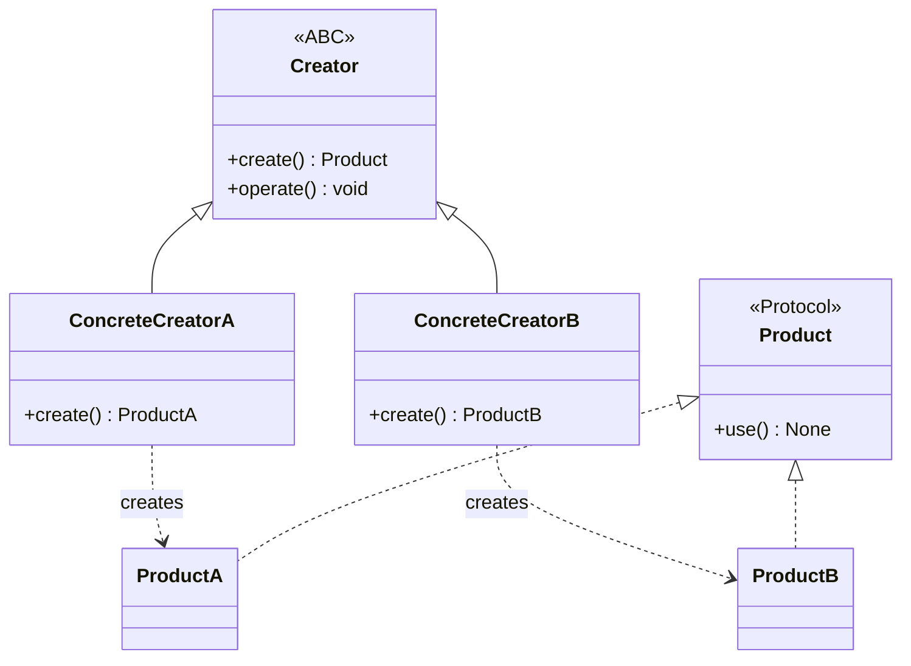

# :material-factory: Factory Method Pattern

!!! abstract "At a Glance"
    **Goal:** Define an interface for creating objects; let subclasses decide which class to instantiate.
    **C++ Equivalent:** Virtual `create()` factory method; `std::unique_ptr<Base> create()`.

<div class="grid cards" markdown>

- :material-lightbulb-on: **Core Concept** — Delegate object creation to subclasses or class methods
- :material-snake: **Python Way** — `@classmethod` is Python's natural factory method
- :material-alert: **Watch Out** — Don't use Factory Method when a simple constructor suffices
- :material-check-circle: **When to Use** — Object creation logic belongs with the class; multiple construction paths

</div>

## :material-lightbulb-on: Intuition

!!! info "Core Idea"
    Python does not support constructor overloading (no multiple `__init__` signatures).
    The idiomatic solution is **`@classmethod` factories** with descriptive names:
    `from_string`, `from_dict`, `create_empty`. The ABC Factory Method pattern is also valid
    for frameworks that need plugin-style creation.

!!! success "C++ → Python Mapping"
    | C++ | Python |
    |---|---|
    | Multiple constructors: `Point(int,int)`, `Point(float,float)` | `@classmethod from_ints`, `from_floats` |
    | `static unique_ptr<Shape> create(string type)` | `@classmethod` + registry dict |
    | `virtual Shape* createShape()` ABC | `ABC` with `@abstractmethod create()` |

## :material-chart-timeline: Factory Method Structure



## :material-book-open-variant: `@classmethod` Factories (Pythonic)

```python
from __future__ import annotations
from dataclasses import dataclass
from datetime import date, datetime
import json

@dataclass
class Connection:
    host: str
    port: int
    username: str
    password: str
    use_ssl: bool = True

    @classmethod
    def from_url(cls, url: str) -> Connection:
        """Parse 'user:pass@host:port' format."""
        # e.g., "admin:secret@db.example.com:5432"
        creds, hostport = url.split("@")
        username, password = creds.split(":")
        host, port = hostport.split(":")
        return cls(host=host, port=int(port), username=username, password=password)

    @classmethod
    def from_dict(cls, d: dict) -> Connection:
        return cls(**d)

    @classmethod
    def from_env(cls) -> Connection:
        import os
        return cls(
            host=os.environ["DB_HOST"],
            port=int(os.environ.get("DB_PORT", "5432")),
            username=os.environ["DB_USER"],
            password=os.environ["DB_PASS"],
        )

    @classmethod
    def create_local(cls) -> Connection:
        """Named constructor for common case."""
        return cls("localhost", 5432, "dev", "dev", use_ssl=False)

# Usage — all creation paths are clear and named
conn1 = Connection.from_url("admin:secret@db.example.com:5432")
conn2 = Connection.create_local()
conn3 = Connection.from_dict({"host": "h", "port": 5432, "username": "u", "password": "p"})
```

## :material-code-tags: ABC Creator Approach

```python
from abc import ABC, abstractmethod
from typing import Any

class Notification(ABC):
    @abstractmethod
    def send(self, message: str, recipient: str) -> None: ...

class EmailNotification(Notification):
    def __init__(self, smtp_host: str) -> None:
        self.smtp_host = smtp_host

    def send(self, message: str, recipient: str) -> None:
        print(f"Email via {self.smtp_host} to {recipient}: {message}")

class SmsNotification(Notification):
    def __init__(self, api_key: str) -> None:
        self.api_key = api_key

    def send(self, message: str, recipient: str) -> None:
        print(f"SMS [{self.api_key}] to {recipient}: {message}")

class NotificationCreator(ABC):
    """Abstract Creator — subclasses decide which product to create."""

    @abstractmethod
    def create_notification(self) -> Notification:
        """Factory Method."""
        ...

    def notify(self, message: str, recipient: str) -> None:
        """Template using the factory method."""
        notification = self.create_notification()
        notification.send(message, recipient)

class EmailCreator(NotificationCreator):
    def __init__(self, smtp_host: str) -> None:
        self.smtp_host = smtp_host

    def create_notification(self) -> Notification:
        return EmailNotification(self.smtp_host)

class SmsCreator(NotificationCreator):
    def __init__(self, api_key: str) -> None:
        self.api_key = api_key

    def create_notification(self) -> Notification:
        return SmsNotification(self.api_key)
```

## :material-registry: Registry Pattern

```python
from typing import ClassVar, Type

class ShapeRegistry:
    """Self-registering factory using metaclass / __init_subclass__."""

    _registry: ClassVar[dict[str, Type["ShapeRegistry"]]] = {}

    def __init_subclass__(cls, shape_name: str = "", **kwargs) -> None:
        super().__init_subclass__(**kwargs)
        if shape_name:
            ShapeRegistry._registry[shape_name] = cls

    @classmethod
    def create(cls, name: str, **kwargs) -> "ShapeRegistry":
        if name not in cls._registry:
            raise ValueError(f"Unknown shape: {name!r}. Known: {list(cls._registry)}")
        return cls._registry[name](**kwargs)

class Circle(ShapeRegistry, shape_name="circle"):
    def __init__(self, radius: float) -> None:
        self.radius = radius

class Rectangle(ShapeRegistry, shape_name="rectangle"):
    def __init__(self, width: float, height: float) -> None:
        self.width = width
        self.height = height

# Usage
circle = ShapeRegistry.create("circle", radius=5.0)
rect = ShapeRegistry.create("rectangle", width=3.0, height=4.0)

# Can also drive from configuration:
config = [
    {"type": "circle", "radius": 1.0},
    {"type": "rectangle", "width": 2.0, "height": 3.0},
]
shapes = [ShapeRegistry.create(c.pop("type"), **c) for c in config]
```

## :material-alert: Common Pitfalls

!!! warning "Using `__init__` for all cases creates confusing signatures"
    ```python
    # CONFUSING — one __init__ tries to do everything
    class Point:
        def __init__(self, x=None, y=None, polar_r=None, polar_theta=None):
            if x is not None:
                ...
            elif polar_r is not None:
                ...

    # CLEAR — named factory methods
    class Point:
        @classmethod
        def from_cartesian(cls, x, y): return cls(x, y)
        @classmethod
        def from_polar(cls, r, theta): ...
    ```

!!! danger "Returning the wrong type from a `@classmethod` factory"
    When subclassing, use `cls(...)` not `ClassName(...)` in factory methods.
    ```python
    @classmethod
    def create_default(cls):
        return cls()   # correct — creates instance of the actual subclass
        # NOT: return BaseClass()  # would always create BaseClass, not subclass
    ```

## :material-help-circle: Flashcards

???+ question "Why does Python use `@classmethod` factories instead of constructor overloading?"
    Python does not support multiple `__init__` definitions — the last one wins. The Pythonic
    solution is multiple `@classmethod` factories with descriptive names. This is actually
    **more readable**: `Connection.from_url(...)` is clearer than `Connection(url=...)` plus
    a complex `__init__` that branches on argument types.

???+ question "What is the difference between `@classmethod` and `@staticmethod` for factories?"
    `@classmethod` receives `cls` as the first argument, so it creates an instance of the
    actual class (or subclass) — correct for polymorphic factories. `@staticmethod` would
    hardcode the class name, breaking subclass creation. Always use `@classmethod` for
    factory methods that create instances.

???+ question "How does the `__init_subclass__` registry differ from using a metaclass?"
    `__init_subclass__` is simpler and requires no metaclass boilerplate. It is called
    automatically on the parent class whenever a subclass is defined. Use it for simple
    registries. Use metaclasses only when you need to intercept class creation more deeply
    (e.g., modifying the class dict, custom `__new__`).

???+ question "What is an Abstract Factory and how does it differ from Factory Method?"
    **Factory Method**: one factory method creates one product type; subclasses override it.
    **Abstract Factory**: a family of related factory methods; an abstract factory creates
    multiple related products (e.g., a GUI toolkit factory creates Button, TextInput, Window).
    Factory Method is about one product; Abstract Factory is about families of products.

## :material-clipboard-check: Self Test

=== "Question 1"
    Implement a `Parser` registry where new parsers can be added by external code without modifying the base class.

=== "Answer 1"
    ```python
    from typing import ClassVar, Type
    from abc import ABC, abstractmethod

    class Parser(ABC):
        _registry: ClassVar[dict[str, Type["Parser"]]] = {}

        def __init_subclass__(cls, format: str = "", **kw) -> None:
            super().__init_subclass__(**kw)
            if format:
                Parser._registry[format] = cls

        @classmethod
        def for_format(cls, fmt: str) -> "Parser":
            if fmt not in cls._registry:
                raise ValueError(f"No parser for {fmt!r}")
            return cls._registry[fmt]()

        @abstractmethod
        def parse(self, data: str) -> dict: ...

    class JsonParser(Parser, format="json"):
        def parse(self, data: str) -> dict:
            import json; return json.loads(data)

    class CsvParser(Parser, format="csv"):
        def parse(self, data: str) -> dict:
            import csv, io
            return list(csv.DictReader(io.StringIO(data)))

    p = Parser.for_format("json")
    print(p.parse('{"key": "value"}'))
    ```

=== "Question 2"
    Why should `@classmethod` factories use `cls(...)` instead of `MyClass(...)`?

=== "Answer 2"
    Using `cls(...)` ensures the factory works correctly for subclasses:
    ```python
    class Base:
        @classmethod
        def create(cls):
            return cls()   # creates Base() normally, but Derived() if cls is Derived

    class Derived(Base):
        pass

    obj = Derived.create()
    print(type(obj))   # <class 'Derived'> — correct!
    # If we used Base() instead of cls(), we'd always get Base instances.
    ```

## :material-check-circle: Summary

!!! success "Key Takeaways"
    - `@classmethod` factories are Python's natural factory methods — descriptive names beat constructor overloading.
    - Always use `cls(...)` not `ClassName(...)` in factory methods to support subclassing.
    - The ABC Creator pattern is useful for framework-level creation where subclasses choose the product.
    - `__init_subclass__` with a registry is a clean, zero-boilerplate plugin/factory system.
    - Abstract Factory creates families of related products; Factory Method creates one product type.
