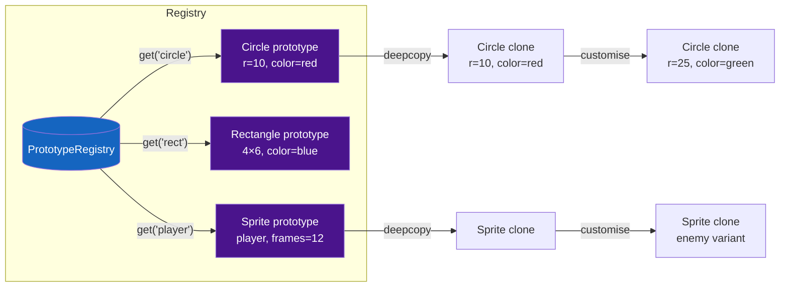

# :material-content-copy: Prototype Pattern

!!! abstract "At a Glance"
    **Intent:** Specify the kinds of objects to create using a prototypical instance, and create new objects by copying this prototype.
    **C++ Equivalent:** Abstract `clone()` method returning a raw or smart pointer; copy constructors drive the actual duplication.
    **Category:** Creational

<div class="grid cards" markdown>
- :material-lightbulb-on: **Core Concept** — Clone a fully-configured object instead of constructing a new one from scratch; customise the clone without knowing the concrete class.
- :material-snake: **Python Way** — `Prototype` ABC with `clone() -> Self`; `copy.deepcopy()` for full independence; `__copy__`/`__deepcopy__` for custom control; a registry maps names to master prototypes.
- :material-alert: **Watch Out** — Shallow copies share nested mutable state between clone and original; always `deepcopy` unless you deliberately want shared references.
- :material-check-circle: **When to Use** — Object creation is expensive (DB load, network fetch, heavy computation) and cloning is cheaper; or when you need many slightly-varied instances of a complex object.
</div>

---

## :material-lightbulb-on: Intuition

!!! info "Core Idea"
    A cookie cutter is a prototype: press it into dough once to get a cookie, then press again and again — each impression is independent.
    The Prototype pattern replaces the "build from scratch" factory call with a "duplicate and tweak" workflow.
    It is especially powerful when object construction involves loading configuration, parsing files, or connecting to external services — you do it once for the prototype, then clone freely.

!!! success "Python vs C++"
    C++ requires explicit copy constructors, deep-copy logic for every pointer member, and a virtual `clone()` returning a heap-allocated copy — significant boilerplate.
    Python's `copy.deepcopy()` recursively clones any object graph with one call.
    `__copy__` and `__deepcopy__` allow surgical control: exclude file handles, reset connection pools, or share read-only sub-objects.
    Frozen dataclasses make read-only prototypes trivially safe to share without copying at all.

---

## :material-graph: Prototype Registry Flow



---

## :material-book-open-variant: Implementation

### Structure

| Role | Responsibility |
|---|---|
| `Prototype` (ABC) | Declares `clone() -> Self` |
| `ConcretePrototype` | Implements `clone()` — usually delegates to `copy.deepcopy(self)` |
| `PrototypeRegistry` | Maps string keys to master prototype instances |
| `Client` | Clones from registry; customises the clone |

### Python Code

```python
from __future__ import annotations
from abc import ABC, abstractmethod
from copy import copy, deepcopy
from dataclasses import dataclass, field
from typing import Any, Self
import time


# ════════════════════════════════════════════════════════════════════════════
# Abstract Prototype
# ════════════════════════════════════════════════════════════════════════════

class Prototype(ABC):
    @abstractmethod
    def clone(self) -> Self:
        """Return a deep copy of this instance."""
        ...


# ════════════════════════════════════════════════════════════════════════════
# Example 1 — Shape Prototype Registry
# ════════════════════════════════════════════════════════════════════════════

class Shape(Prototype):
    def __init__(self, color: str = "black", x: float = 0, y: float = 0) -> None:
        self.color = color
        self.x = x
        self.y = y
        self.tags: list[str] = []          # mutable nested state

    def clone(self) -> Self:
        return deepcopy(self)

    def move(self, dx: float, dy: float) -> "Shape":
        self.x += dx
        self.y += dy
        return self

    def __repr__(self) -> str:
        return f"{type(self).__name__}(color={self.color!r}, pos=({self.x},{self.y}), tags={self.tags})"


class Circle(Shape):
    def __init__(self, radius: float, **kwargs) -> None:
        super().__init__(**kwargs)
        self.radius = radius

    def __repr__(self) -> str:
        return f"Circle(r={self.radius}, color={self.color!r}, pos=({self.x},{self.y}))"


class Rectangle(Shape):
    def __init__(self, width: float, height: float, **kwargs) -> None:
        super().__init__(**kwargs)
        self.width = width
        self.height = height

    def __repr__(self) -> str:
        return f"Rectangle({self.width}×{self.height}, color={self.color!r}, pos=({self.x},{self.y}))"


# ── Prototype Registry ───────────────────────────────────────────────────────

class PrototypeRegistry:
    """Maps names to master prototypes; vends clones on demand."""

    def __init__(self) -> None:
        self._prototypes: dict[str, Prototype] = {}

    def register(self, name: str, prototype: Prototype) -> None:
        self._prototypes[name] = prototype

    def clone(self, name: str, **overrides: Any) -> Any:
        if name not in self._prototypes:
            raise KeyError(f"No prototype registered as {name!r}")
        instance = self._prototypes[name].clone()
        for attr, value in overrides.items():
            setattr(instance, attr, value)
        return instance

    def __contains__(self, name: str) -> bool:
        return name in self._prototypes


# ════════════════════════════════════════════════════════════════════════════
# Example 2 — Document Template Cloning
# ════════════════════════════════════════════════════════════════════════════

@dataclass
class DocumentStyle:
    font: str = "Arial"
    font_size: int = 12
    line_spacing: float = 1.5
    margins: dict[str, int] = field(default_factory=lambda: {"top": 20, "bottom": 20, "left": 25, "right": 25})


class Document(Prototype):
    def __init__(self, title: str, style: DocumentStyle | None = None) -> None:
        self.title = title
        self.content: list[str] = []
        self.style = style or DocumentStyle()
        self._created_at = time.time()

    def append(self, paragraph: str) -> "Document":
        self.content.append(paragraph)
        return self

    def clone(self) -> "Document":
        """Custom clone: deep-copy everything except _created_at (reset to now)."""
        new_doc = deepcopy(self)
        new_doc._created_at = time.time()   # reset timestamp for the clone
        return new_doc

    def __repr__(self) -> str:
        return (
            f"Document(title={self.title!r}, "
            f"paragraphs={len(self.content)}, "
            f"font={self.style.font!r})"
        )


# ════════════════════════════════════════════════════════════════════════════
# Example 3 — Game Sprite Factory (expensive init, cheap clone)
# ════════════════════════════════════════════════════════════════════════════

class Sprite(Prototype):
    """Simulates an expensive-to-load sprite (image data, animation frames)."""

    def __init__(self, name: str, frame_count: int) -> None:
        self.name = name
        self.frame_count = frame_count
        self.position: tuple[float, float] = (0.0, 0.0)
        self.health = 100
        # Simulate expensive asset loading
        print(f"  [Sprite] Loading '{name}' ({frame_count} frames)... (expensive)")
        self._frames: list[bytes] = [b"\x00" * 64] * frame_count  # mock frame data

    def clone(self) -> "Sprite":
        """Shallow-copy frames (read-only data) but deep-copy mutable state."""
        new_sprite = copy(self)             # shallow: shares _frames (OK — read-only)
        new_sprite.position = self.position # tuples are immutable, direct copy fine
        new_sprite.health = self.health
        print(f"  [Sprite] Cloned '{self.name}' (cheap)")
        return new_sprite

    def __repr__(self) -> str:
        return f"Sprite({self.name!r}, pos={self.position}, hp={self.health})"


# ── Custom __copy__ / __deepcopy__ ──────────────────────────────────────────

class ConfigSnapshot(Prototype):
    """Demonstrates custom __deepcopy__ to exclude a non-serialisable handle."""

    def __init__(self, settings: dict[str, Any]) -> None:
        self.settings = settings
        self._file_handle = None            # non-copyable resource

    def clone(self) -> "ConfigSnapshot":
        return deepcopy(self)

    def __deepcopy__(self, memo: dict) -> "ConfigSnapshot":
        new_obj = ConfigSnapshot(settings=deepcopy(self.settings, memo))
        new_obj._file_handle = None         # deliberately excluded — reset to None
        memo[id(self)] = new_obj
        return new_obj

    def __repr__(self) -> str:
        return f"ConfigSnapshot(settings={self.settings}, handle={self._file_handle})"
```

### Example Usage

```python
# ── Shape Registry Demo ───────────────────────────────────────────────────────

print("=== Shape Prototype Registry ===")
registry = PrototypeRegistry()
registry.register("red-circle",    Circle(radius=10, color="red"))
registry.register("blue-rect",     Rectangle(width=4, height=6, color="blue"))

# Clone and customise without knowing the concrete class
c1 = registry.clone("red-circle")
c2 = registry.clone("red-circle", color="green", radius=25)
c2.move(10, 20)

print(c1)   # Circle(r=10, color='red',   pos=(0,0))
print(c2)   # Circle(r=25, color='green', pos=(10,20))

# Prove independence: mutating c2.tags does not affect c1
c2.tags.append("selected")
print(f"c1.tags={c1.tags}, c2.tags={c2.tags}")
# c1.tags=[], c2.tags=['selected']


# ── Document Template Demo ────────────────────────────────────────────────────

print("\n=== Document Templates ===")
invoice_template = Document("Invoice Template")
invoice_template.append("Bill To: {client_name}")
invoice_template.append("Amount Due: {amount}")
invoice_template.style.font = "Helvetica"

inv1 = invoice_template.clone()
inv1.title = "Invoice #1001"

inv2 = invoice_template.clone()
inv2.title = "Invoice #1002"
inv2.style.margins["left"] = 30   # customise clone's style

print(inv1)
print(inv2)
# Different titles, isolated style changes
print(f"Template margins: {invoice_template.style.margins['left']}")  # still 25


# ── Sprite Factory Demo ───────────────────────────────────────────────────────

print("\n=== Sprite Factory (expensive load, cheap clone) ===")
# Load once
player_proto = Sprite("player", frame_count=24)
enemy_proto  = Sprite("enemy",  frame_count=16)

# Clone many times (cheap)
players = [player_proto.clone() for _ in range(3)]
enemies = [enemy_proto.clone()  for _ in range(5)]

players[0].position = (10, 20)
players[0].health   = 80
print(players[0])  # Sprite('player', pos=(10, 20), hp=80)
print(players[1])  # Sprite('player', pos=(0.0, 0.0), hp=100)  — independent


# ── ConfigSnapshot custom deepcopy ───────────────────────────────────────────

print("\n=== ConfigSnapshot ===")
original = ConfigSnapshot({"debug": True, "timeout": 30})
original._file_handle = object()   # simulate open file handle

clone = original.clone()
print(f"Original handle: {original._file_handle}")   # <object object at 0x...>
print(f"Clone handle:    {clone._file_handle}")       # None  ← safely excluded
print(f"Clone settings:  {clone.settings}")           # {'debug': True, 'timeout': 30}
```

---

## :material-alert: Common Pitfalls

!!! warning "Shallow Copy Shared State"
    `copy.copy(obj)` copies only the top-level object; nested lists, dicts, and objects are shared between original and clone. Mutating a nested list in the clone corrupts the original. Use `copy.deepcopy()` unless you have a deliberate reason to share sub-objects (e.g., read-only frame data in sprites).

!!! warning "Prototype Registry as a Global Singleton"
    A module-level registry dictionary is convenient but becomes a hidden dependency. Prefer injecting the registry as a parameter so code is testable without monkey-patching globals.

!!! danger "Non-Copyable Resources"
    `deepcopy` cannot copy open file handles, sockets, database connections, or threading locks. Attempting it raises a `TypeError`. Always implement `__deepcopy__` to exclude these resources and reset them to `None` or a safe default in the clone.

!!! danger "Circular References"
    `deepcopy` handles cycles via the `memo` dict, but objects with `__deepcopy__` that forget to use `memo` can loop infinitely. Always pass `memo` through: `deepcopy(self.attr, memo)`.

---

## :material-help-circle: Flashcards

???+ question "What is the primary motivation for cloning instead of constructing?"
    When constructing an object is **expensive** (database query, file parse, network fetch, complex computation) and you need many similar instances, cloning the pre-built prototype is faster — you pay the construction cost once and copy repeatedly.

???+ question "What is the difference between `copy.copy()` and `copy.deepcopy()`?"
    `copy.copy()` creates a new object but references the same nested objects (shallow).
    `copy.deepcopy()` recursively creates new copies of all nested objects (deep).
    Shallow copies are faster and correct when nested state is read-only or intentionally shared; deep copies are required when nested state must be independent.

???+ question "How do `__copy__` and `__deepcopy__` give you custom control?"
    `__copy__(self)` is called by `copy.copy()`; `__deepcopy__(self, memo)` is called by `copy.deepcopy()`.
    Override them to exclude non-copyable resources (file handles, sockets), reset mutable counters, share expensive read-only data, or apply any other custom clone semantics.

???+ question "How does the Prototype pattern differ from a Factory Method?"
    **Factory Method** creates objects from scratch using a constructor.
    **Prototype** clones an existing instance and optionally customises the clone.
    Use Prototype when the class to instantiate is specified at runtime or when construction is prohibitively expensive.

---

## :material-clipboard-check: Self Test

=== "Question 1"
    A `Sprite` clone shares `_frames` (a list of `bytes`) via `copy.copy()`. A developer calls `clone._frames.append(extra_frame)`. Does this affect the original? What about `clone._frames[0] = new_data`?

=== "Answer 1"
    **Appending** (`clone._frames.append(...)`) modifies the *list object* which is shared — **yes**, the original's `_frames` list is mutated too.
    **Item assignment** (`clone._frames[0] = new_data`) replaces an element in the shared list — again, **yes**, the original sees the change.
    If frames are read-only by convention the shallow copy is safe, but this relies on discipline, not enforcement. Use `deepcopy` for safety or document the sharing contract clearly.

=== "Question 2"
    You need a `PrototypeRegistry` that supports versioned prototypes (register `"circle-v1"` and `"circle-v2"`, and clone a specific version). Sketch the API changes needed.

=== "Answer 2"
    Add a version parameter to `register` and `clone`:
    ```python
    def register(self, name: str, prototype: Prototype, version: str = "latest") -> None:
        self._prototypes[(name, version)] = prototype
        self._prototypes[(name, "latest")] = prototype  # always update latest

    def clone(self, name: str, version: str = "latest", **overrides) -> Any:
        key = (name, version)
        if key not in self._prototypes:
            raise KeyError(f"No prototype {name!r} version {version!r}")
        instance = self._prototypes[key].clone()
        for attr, val in overrides.items():
            setattr(instance, attr, val)
        return instance
    ```
    Callers use `registry.clone("circle")` for the latest or `registry.clone("circle", version="v1")` for a specific version.

---

## :material-check-circle: Summary

!!! success "Key Takeaways"
    - **Clone over construct**: pay the expensive creation cost once; clone repeatedly for variants.
    - **Always deep-copy mutable nested state** unless you explicitly design for shared sub-objects.
    - **`__deepcopy__`**: the surgical tool for excluding non-copyable resources and customising clone semantics.
    - **Registry pattern**: map names to master prototypes; vend clones with optional attribute overrides — a clean, extensible API.
    - **Real-world uses**: game object factories (enemies, projectiles), document template engines, configuration snapshot/rollback, UI widget themes, ORM model caching, machine-learning model weight sharing.
