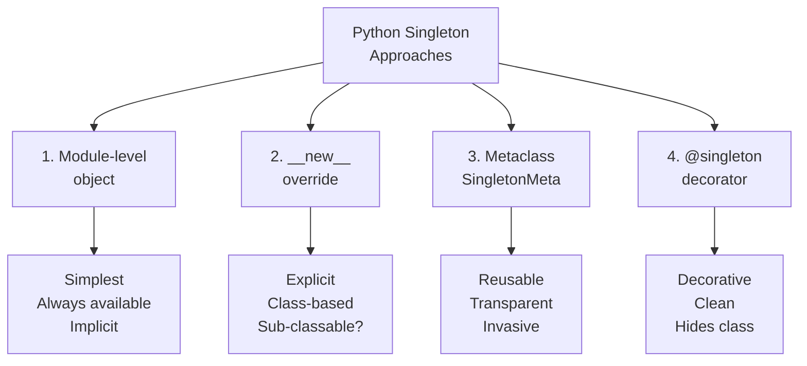

# :material-numeric-1-circle: Singleton Pattern

!!! abstract "At a Glance"
    **Goal:** Ensure a class has only one instance and provide a global access point.
    **C++ Equivalent:** Static instance + private constructor + `getInstance()` method.

<div class="grid cards" markdown>

- :material-lightbulb-on: **Core Concept** — One and only one instance of a class exists
- :material-snake: **Python Way** — Module-level objects ARE singletons; 4 class-level approaches
- :material-alert: **Watch Out** — Singletons are global state — they hurt testability
- :material-check-circle: **When to Use** — Loggers, config, registry; avoid for everything else

</div>

## :material-lightbulb-on: Intuition

!!! info "Core Idea"
    In Python, **a module is already a singleton** — it is imported once and cached in `sys.modules`.
    Module-level objects (config, logger, db_pool) are the idiomatic Python singleton.
    When you need a class-based singleton, there are four approaches, each with trade-offs.

!!! success "Python vs C++ Singleton"
    | C++ | Python |
    |---|---|
    | `static Foo& getInstance()` | Module-level object |
    | Private constructor | `__new__` override or metaclass |
    | Thread-safe with `std::call_once` | `threading.Lock` in `__new__` |
    | No clear "destroy" mechanism | `del module.instance` |

## :material-chart-timeline: Four Singleton Approaches



## :material-book-open-variant: Approach 1 — Module-Level Object (Recommended)

```python
# config.py — this IS a singleton by virtue of being a module object
from dataclasses import dataclass
from functools import cached_property

@dataclass
class AppConfig:
    host: str = "localhost"
    port: int = 8080
    debug: bool = False

    @cached_property
    def db_url(self) -> str:
        return f"postgresql://{self.host}:{self.port}/mydb"

# The single instance — created once when module is imported
_config: AppConfig | None = None

def get_config() -> AppConfig:
    global _config
    if _config is None:
        _config = AppConfig()
    return _config

# In other modules:
# from config import get_config
# cfg = get_config()   # always returns the same instance
```

## :material-code-tags: Approach 2 — `__new__` Override

```python
import threading
from typing import ClassVar

class SingletonNew:
    _instance: ClassVar["SingletonNew | None"] = None
    _lock: ClassVar[threading.Lock] = threading.Lock()

    def __new__(cls) -> "SingletonNew":
        if cls._instance is None:
            with cls._lock:
                # Double-checked locking pattern
                if cls._instance is None:
                    cls._instance = super().__new__(cls)
        return cls._instance

    def __init__(self) -> None:
        # __init__ is called every time SingletonNew() is called!
        # Guard against re-initialisation:
        if hasattr(self, "_initialized"):
            return
        self._initialized = True
        self.value = 0

s1 = SingletonNew()
s2 = SingletonNew()
print(s1 is s2)   # True
```

!!! warning "`__init__` is called on every `ClassName()` call"
    Even though `__new__` returns the existing instance, Python still calls `__init__` on it.
    Guard with `if hasattr(self, "_initialized"): return` to prevent re-initialisation.

## :material-cog: Approach 3 — Metaclass

```python
import threading

class SingletonMeta(type):
    _instances: dict[type, object] = {}
    _lock: threading.Lock = threading.Lock()

    def __call__(cls, *args, **kwargs):
        with cls._lock:
            if cls not in cls._instances:
                instance = super().__call__(*args, **kwargs)
                cls._instances[cls] = instance
        return cls._instances[cls]

class Database(metaclass=SingletonMeta):
    def __init__(self, url: str) -> None:
        self.url = url
        self.connected = False

    def connect(self) -> None:
        self.connected = True

db1 = Database("postgresql://localhost/db")
db2 = Database("other_url")   # __init__ called but instance is same!
print(db1 is db2)   # True
print(db1.url)      # "postgresql://localhost/db"
```

## :material-function-variant: Approach 4 — `@singleton` Decorator

```python
import functools
import threading

def singleton(cls):
    """Decorator that makes a class a singleton."""
    instances: dict = {}
    lock = threading.Lock()

    @functools.wraps(cls)
    def get_instance(*args, **kwargs):
        if cls not in instances:
            with lock:
                if cls not in instances:
                    instances[cls] = cls(*args, **kwargs)
        return instances[cls]

    return get_instance

@singleton
class Logger:
    def __init__(self, level: str = "INFO") -> None:
        self.level = level
        self.entries: list[str] = []

    def log(self, message: str) -> None:
        entry = f"[{self.level}] {message}"
        self.entries.append(entry)
        print(entry)

log1 = Logger("DEBUG")
log2 = Logger()   # returns same instance as log1
print(log1 is log2)   # True
# Note: Logger is now a function, not a class
# isinstance(log1, Logger) will NOT work as expected
```

## :material-table: Singleton Approach Comparison

| Approach | Thread-safe | `isinstance` works | Subclassable | Complexity |
|---|---|---|---|---|
| Module-level | Yes (GIL) | N/A | No | Simplest |
| `__new__` | With lock | Yes | Tricky | Low |
| Metaclass | With lock | Yes | Yes | Medium |
| Decorator | With lock | No | No | Low |

## :material-alert: Common Pitfalls

!!! warning "Singletons are global state — test isolation breaks"
    ```python
    # In tests, singletons persist between test cases!
    def test_a():
        db = Database.get_instance()
        db.set("key", "value_a")

    def test_b():
        db = Database.get_instance()
        # db still has "value_a" from test_a!
        # Fix: provide a reset mechanism or use dependency injection
    ```

!!! danger "Never use Singleton for things that should be testable"
    The Singleton pattern creates tight coupling and makes unit testing hard.
    Instead, use **dependency injection**: pass the object as a constructor argument.
    Reserve singletons for truly global, stateless resources (loggers, config) that are
    safe to share across tests.

## :material-help-circle: Flashcards

???+ question "Why is the module-level approach preferred in Python?"
    Python modules are cached in `sys.modules` after first import — they are singletons
    by definition. A module-level object is simpler, requires no metaclass magic, is
    thread-safe (module loading is protected by the import lock), and is explicit.
    Use `module_name.singleton_object` for access.

???+ question "What is the double-checked locking pattern and why is it needed?"
    Without locking, two threads could both check `instance is None` simultaneously, both find
    it True, and both create an instance. The double-checked locking pattern acquires the lock
    only once (when `instance is None`), then checks again inside the lock:
    `if instance is None: with lock: if instance is None: instance = create()`.

???+ question "How do you make a Singleton mockable in tests?"
    Provide a reset mechanism: `Database._instance = None`. Or better, use dependency injection
    so the singleton is passed as a parameter rather than accessed globally. For the module-level
    approach, use `unittest.mock.patch` to replace the module attribute with a mock.

???+ question "Can a Singleton be subclassed?"
    With the `__new__` approach, subclassing is tricky — `SubClass._instance` is the same
    attribute as `Base._instance`, so the subclass and base share one instance.
    The metaclass approach handles subclasses correctly since each class has its own entry
    in `_instances`. With the decorator approach, `Logger` is replaced by a function — not subclassable.

## :material-clipboard-check: Self Test

=== "Question 1"
    Implement a thread-safe `Counter` singleton using `__new__` with a reset method for testing.

=== "Answer 1"
    ```python
    import threading

    class Counter:
        _instance = None
        _lock = threading.Lock()

        def __new__(cls):
            if cls._instance is None:
                with cls._lock:
                    if cls._instance is None:
                        cls._instance = super().__new__(cls)
            return cls._instance

        def __init__(self):
            if hasattr(self, "_initialized"):
                return
            self._initialized = True
            self._value = 0
            self._value_lock = threading.Lock()

        def increment(self) -> int:
            with self._value_lock:
                self._value += 1
                return self._value

        @classmethod
        def reset(cls) -> None:
            """For testing only — destroy the singleton."""
            with cls._lock:
                cls._instance = None
    ```

=== "Question 2"
    What is the difference between a Singleton and the Borg pattern?

=== "Answer 2"
    **Singleton**: one instance, all references point to the same object (`is` returns True).
    **Borg (Monostate)**: multiple instances that share the same `__dict__` (state), so they
    behave identically even though they are different objects.

    ```python
    class Borg:
        _shared_state: dict = {}
        def __init__(self):
            self.__dict__ = Borg._shared_state  # share the dict!

    b1 = Borg()
    b2 = Borg()
    b1.x = 42
    print(b2.x)    # 42 — shared state
    print(b1 is b2)  # False — different objects
    ```
    Borg is useful when `isinstance` must work normally and each "instance" needs its own identity.

## :material-check-circle: Summary

!!! success "Key Takeaways"
    - Module-level objects are Python's idiomatic singleton — import once, use everywhere.
    - The `__new__` approach is class-based; guard `__init__` with `_initialized` flag.
    - The metaclass approach is reusable and supports subclassing correctly.
    - The decorator approach is clean but makes `isinstance` unreliable.
    - Always add thread safety with `threading.Lock` and double-checked locking.
    - Provide a `reset()` classmethod for test isolation.
    - Prefer dependency injection over singletons for anything that needs to be testable.
