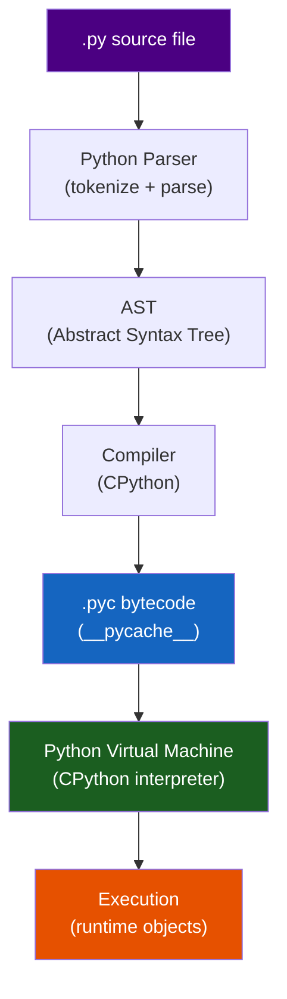

# :material-python: Day 00 — Setup & Basics

!!! abstract "At a Glance"
    **Goal:** Set up a professional Python environment and understand Python's execution model.
    **C++ Equivalent:** Setting up CMake + compiler + vcpkg; understanding compilation vs interpretation.

<div class="grid cards" markdown>

- :material-lightbulb-on: **Core Concept** — pyenv manages Python versions; venv isolates project dependencies
- :material-snake: **Python Way** — `pyproject.toml` replaces CMakeLists.txt as the project manifest
- :material-alert: **Watch Out** — Never install packages into the system Python; always use a venv
- :material-check-circle: **When to Use** — This setup is the standard for every Python project

</div>

## :material-lightbulb-on: Intuition

!!! info "Core Idea"
    Python projects need **version isolation** (different projects may need different Python versions)
    and **dependency isolation** (different projects need different package versions). `pyenv` handles
    the former; `venv` handles the latter. Together they give you a clean, reproducible environment.

!!! success "Python vs C++"
    | C++ | Python |
    |---|---|
    | CMakeLists.txt | pyproject.toml |
    | CMake / make | `pip install -e .` |
    | vcpkg / conan | pip + PyPI |
    | GCC/Clang version | Python version (pyenv) |
    | Build directory | venv directory |

## :material-code-tags: Setup Steps

```bash
# 1. Install pyenv (manages Python versions)
curl https://pyenv.run | bash

# 2. Install a Python version
pyenv install 3.12.3
pyenv local 3.12.3   # sets .python-version in current dir

# 3. Create a virtual environment
python -m venv .venv
source .venv/bin/activate   # Windows: .venv\Scripts\activate

# 4. Verify
python --version    # should match pyenv version
which python        # should point inside .venv

# 5. Install project in editable mode
pip install -e ".[dev]"
```

## :material-file: pyproject.toml Structure

```toml
[build-system]
requires = ["setuptools>=68", "wheel"]
build-backend = "setuptools.backends.legacy:build"

[project]
name = "my-python-project"
version = "0.1.0"
requires-python = ">=3.11"
dependencies = [
    "requests>=2.31",
]

[project.optional-dependencies]
dev = [
    "pytest>=7.4",
    "mypy>=1.5",
    "ruff>=0.1",
]

[tool.mypy]
strict = true
python_version = "3.12"

[tool.ruff]
line-length = 88
```

!!! warning "pyproject.toml vs setup.py"
    `setup.py` is the legacy approach. Always use `pyproject.toml` for new projects (PEP 517/518/621).
    `setup.cfg` is also legacy. `pyproject.toml` is the single source of truth.

## :material-book-open-variant: Python Data Model Overview

Python objects have three fundamental properties:

- **Identity** — the memory address; checked with `is` operator, returned by `id()`
- **Type** — the class of the object; checked with `type()` or `isinstance()`
- **Value** — the actual data; equality checked with `==` (calls `__eq__`)

```python
x = [1, 2, 3]
y = x           # same object (same identity)
z = [1, 2, 3]   # equal value, different identity

print(x is y)   # True  — same object
print(x is z)   # False — different objects
print(x == z)   # True  — equal values
print(id(x), id(z))  # different addresses
```

!!! info "Everything is an object"
    In Python, integers, strings, functions, classes — everything is a first-class object.
    Even `int` and `type` are objects. `type(int)` returns `<class 'type'>` and `type(type)`
    returns `<class 'type'>` (type is its own metaclass).

## :material-play: if `__name__ == "__main__"` Explained

```python
# mymodule.py
def greet(name: str) -> str:
    return f"Hello, {name}!"

if __name__ == "__main__":
    # This block ONLY runs when the file is executed directly:
    #   python mymodule.py
    # It does NOT run when imported:
    #   import mymodule
    print(greet("World"))
```

!!! success "Why this matters"
    This is Python's equivalent of `int main()` in C++. When Python imports a module, it sets
    `__name__` to the module's name (e.g., `"mymodule"`). When you run it directly, `__name__`
    is set to `"__main__"`. This lets a file serve as both a library and a runnable script.

## :material-chart-timeline: Python Execution Model



!!! info "CPython is the reference implementation"
    When people say "Python", they usually mean CPython. Other implementations exist:
    PyPy (JIT compiled, faster), Jython (JVM), MicroPython (microcontrollers).
    The `.pyc` bytecode cache is invalidated automatically when the source changes.

## :material-alert: Common Pitfalls

!!! warning "Mutable default arguments"
    ```python
    # WRONG — the list is created once and shared across all calls!
    def append_to(element, to=[]):
        to.append(element)
        return to

    # CORRECT — use None sentinel
    def append_to(element, to=None):
        if to is None:
            to = []
        to.append(element)
        return to
    ```

!!! danger "Circular imports"
    Unlike C++ `#pragma once`, Python modules execute on import. Circular imports
    (`a.py` imports `b.py` which imports `a.py`) cause `ImportError` or partially
    initialized modules. Fix by restructuring or using lazy imports inside functions.

## :material-help-circle: Flashcards

???+ question "What does `python -m pytest` do differently than `pytest`?"
    `python -m pytest` runs pytest as a module, which adds the current directory to `sys.path`.
    This ensures your project's source code is importable without needing to install the package first.
    It is the recommended way to run pytest in a project with a `src/` layout.

???+ question "What is the difference between `venv` and `virtualenv`?"
    `venv` is Python's built-in virtual environment module (Python 3.3+). `virtualenv` is a
    third-party package that is faster to create, supports more Python versions, and has more features.
    For most projects, the built-in `venv` is sufficient. Use `virtualenv` when you need Python 2
    support or faster environment creation in CI pipelines.

???+ question "What does `pip install -e .` do?"
    Installs the package in **editable mode** (development mode). Instead of copying files to
    `site-packages`, it creates a link so changes to the source are immediately reflected without
    reinstalling. The `-e` stands for "editable" and is equivalent to `setup.py develop`.

???+ question "Why should you commit `pyproject.toml` but not `.venv`?"
    `pyproject.toml` defines the project's metadata and dependencies — it is the specification.
    `.venv` is the local materialisation of those dependencies for your machine. Other developers
    recreate their own `.venv` from `pyproject.toml`. Add `.venv` to `.gitignore`.

## :material-clipboard-check: Self Test

=== "Question 1"
    You clone a Python project. The README says "Python 3.12 required".
    Walk through the commands to set up a reproducible development environment.

=== "Answer 1"
    ```bash
    # 1. Install the right Python version
    pyenv install 3.12.3
    pyenv local 3.12.3

    # 2. Create and activate venv
    python -m venv .venv
    source .venv/bin/activate

    # 3. Install project with dev dependencies
    pip install -e ".[dev]"

    # 4. Verify
    python -c "import sys; print(sys.version)"
    ```

=== "Question 2"
    What is `__pycache__` and should you commit it?

=== "Answer 2"
    `__pycache__` contains `.pyc` bytecode files that CPython generates the first time a module
    is imported. They speed up subsequent imports by skipping the parse/compile step.
    You should **not** commit them — add `__pycache__/` and `*.pyc` to `.gitignore`.
    They are machine-specific and automatically regenerated.

## :material-check-circle: Summary

!!! success "Key Takeaways"
    - Use `pyenv` for Python version management and `venv` for dependency isolation.
    - `pyproject.toml` is the modern project manifest (replaces `setup.py`).
    - `if __name__ == "__main__"` guards executable code from running on import.
    - Python parses source to AST, compiles to bytecode, then the VM executes it.
    - Never install into the system Python; always activate your venv first.
