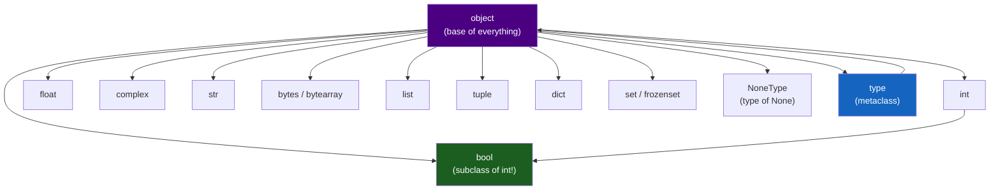

# :material-variable: Day 01 — Variables & Types

!!! abstract "At a Glance"
    **Goal:** Understand Python's dynamic type system and how to add optional static annotations.
    **C++ Equivalent:** `auto`, `decltype`, and template type deduction — but at runtime.

<div class="grid cards" markdown>

- :material-lightbulb-on: **Core Concept** — Variables are names bound to objects; types live on objects, not variables
- :material-snake: **Python Way** — Type annotations are hints for tools, not enforced by the runtime
- :material-alert: **Watch Out** — `==` tests value equality; `is` tests identity (same object)
- :material-check-circle: **When to Use** — Annotate everything in library code; annotate gradually in scripts

</div>

## :material-lightbulb-on: Intuition

!!! info "Core Idea"
    In C++, types belong to variables: `int x = 5`. In Python, types belong to **objects**.
    A variable is just a **name** (a binding in a namespace). You can rebind `x` to a string
    after it was an int — there is no declaration that prevents this.

!!! success "Python vs C++ Static Typing"
    ```python
    # C++ mindset: variable has a type
    # int x = 42;  // x is always int
    # x = "hello"; // compile error!

    # Python reality: name is bound to an object
    x = 42        # x is bound to int object 42
    x = "hello"   # x is now bound to str object "hello" — perfectly valid!

    # But with type annotations (checked by mypy, not Python):
    y: int = 42
    y = "hello"   # mypy error: Incompatible types (str vs int)
    ```

## :material-chart-timeline: Python Type Hierarchy



## :material-book-open-variant: Built-in Types

### Numeric Types

```python
# int — arbitrary precision (no overflow!)
big = 2 ** 100          # works fine, no overflow
negative = -42
hex_val = 0xFF          # 255
oct_val = 0o17          # 15
bin_val = 0b1010        # 10

# float — IEEE 754 double (like C++ double)
pi = 3.14159
sci = 1.5e-10
inf = float("inf")
nan = float("nan")

# complex
z = 3 + 4j              # real=3, imag=4
print(z.real, z.imag)   # 3.0 4.0
print(abs(z))           # 5.0 (magnitude)

# bool — subclass of int! True==1, False==0
print(True + True)      # 2 (!)
print(isinstance(True, int))  # True
```

### Sequence Types

```python
# str — immutable Unicode sequence
s = "Hello, World!"
s2 = s.upper()          # "HELLO, WORLD!" — new object
s[0] = "h"              # TypeError: str is immutable

# bytes / bytearray
b = b"hello"            # bytes: immutable
ba = bytearray(b"hello")
ba[0] = ord("H")        # bytearray: mutable

# list — mutable, ordered, heterogeneous
lst = [1, "two", 3.0, None]
lst.append(4)
lst[1] = 2

# tuple — immutable, ordered
t = (1, 2, 3)
t2 = (42,)              # single-element tuple needs trailing comma!
t3 = 1, 2, 3            # parentheses optional

# range — lazy sequence of integers
r = range(0, 10, 2)     # 0, 2, 4, 6, 8
```

### Mapping and Set Types

```python
# dict — mutable, ordered (Python 3.7+), key-value
d = {"name": "Alice", "age": 30}
d["city"] = "NY"
d.get("missing", "default")    # safe access with default

# set — mutable, unordered, unique
s = {1, 2, 3, 2, 1}            # {1, 2, 3}
s.add(4)
s & {2, 3, 5}                   # intersection: {2, 3}

# frozenset — immutable set (hashable, usable as dict key)
fs = frozenset({1, 2, 3})
```

### None and Booleans

```python
# None — the null object, singleton
x = None
x is None               # always use 'is', never ==

# Falsy values (evaluate to False in boolean context)
# False, None, 0, 0.0, "", [], {}, set(), ()
if not []:              # empty list is falsy
    print("empty!")
```

## :material-code-tags: Type Annotations

```python
from typing import Optional, Union, List, Dict, Tuple, Any

# Basic annotations
name: str = "Alice"
age: int = 30
height: float = 1.75
active: bool = True

# Optional (can be None)
nickname: Optional[str] = None   # same as Union[str, None]

# Collections
scores: list[int] = [95, 87, 92]       # Python 3.9+
mapping: dict[str, int] = {"a": 1}     # Python 3.9+

# Function annotations
def greet(name: str, times: int = 1) -> str:
    return (f"Hello, {name}! " * times).strip()

# Python 3.10+ union syntax
def process(value: int | str | None) -> str:
    return str(value)
```

!!! info "Annotations are not enforced at runtime"
    ```python
    def add(x: int, y: int) -> int:
        return x + y

    add("hello", " world")  # Works at runtime! Returns "hello world"
    # mypy would flag this as an error though.
    ```

!!! warning "Common int/float confusion"
    ```python
    # Integer division in Python 3:
    print(7 / 2)    # 3.5  (true division — always float)
    print(7 // 2)   # 3    (floor division — integer result)
    print(7 % 2)    # 1    (modulo)

    # In C++: 7 / 2 == 3 (integer division when both are int)
    # Python's / always returns float — a deliberate design decision.
    ```

## :material-alert: Common Pitfalls

!!! warning "Integer interning"
    ```python
    # CPython interns small integers (-5 to 256)
    a = 256
    b = 256
    print(a is b)   # True (interned, same object)

    a = 257
    b = 257
    print(a is b)   # False (not interned, different objects)
    # Always use == for value comparison, never 'is' for numbers/strings
    ```

!!! danger "Mutable objects as dict keys"
    ```python
    # Lists cannot be dict keys (not hashable)
    d = {[1, 2]: "value"}   # TypeError: unhashable type: 'list'

    # Tuples can be dict keys (immutable, hashable)
    d = {(1, 2): "value"}   # OK

    # Only objects with __hash__ and __eq__ can be dict keys / set members
    ```

## :material-help-circle: Flashcards

???+ question "What is the difference between `==` and `is` in Python?"
    `==` calls `__eq__` and tests **value equality** — do the two objects represent the same value?
    `is` tests **identity** — are the two names bound to the exact same object in memory?
    Use `==` for comparisons. Use `is` only when checking against singletons: `x is None`,
    `x is True`, `x is False`. Never use `x is "string"` — string interning is an implementation detail.

???+ question "Why is `bool` a subclass of `int` in Python?"
    For historical reasons and to allow boolean values in arithmetic contexts.
    `True == 1` and `False == 0`. This means `sum([True, False, True])` returns `2`.
    While useful in some contexts, be explicit: use `int(b)` rather than relying on this
    in code that needs to be clear about intent.

???+ question "What is the difference between `list[int]` and `List[int]`?"
    From Python 3.9+, you can use the built-in `list[int]` directly in type annotations.
    Before 3.9, you needed `from typing import List` and used `List[int]`.
    In Python 3.12+, `list[int]` is also valid at runtime (not just in annotations).
    The `typing.List` form is now deprecated in favour of the lowercase built-in form.

???+ question "Can a Python variable change type?"
    Yes — Python variables are just names. You can write `x = 42; x = \"hello\"` and it is valid.
    However, good Python code uses type annotations and a type checker (mypy) to prevent this in
    production code. The dynamic nature is intentional for flexibility, but annotations bring
    the safety of static typing without the rigidity.

## :material-clipboard-check: Self Test

=== "Question 1"
    Predict the output:
    ```python
    x = [1, 2, 3]
    y = x
    y.append(4)
    print(x)
    ```

=== "Answer 1"
    Output: `[1, 2, 3, 4]`

    `y = x` does NOT copy the list. Both `x` and `y` are names bound to the **same** list object.
    Mutating it through `y` is visible through `x`. This is Python's reference semantics.
    To copy: `y = x.copy()` or `y = list(x)` or `y = x[:]`.

=== "Question 2"
    What is the type of `None` and how should you check for it?

=== "Answer 2"
    `type(None)` is `NoneType`. There is exactly one `None` object in Python (it is a singleton).
    Always check with `x is None` or `x is not None`, **never** with `x == None`.
    The `==` check works but is slower and conceptually wrong — you are checking identity, not equality.

## :material-check-circle: Summary

!!! success "Key Takeaways"
    - Python variables are names bound to objects; the type lives on the object, not the name.
    - All Python integers have arbitrary precision — no integer overflow.
    - `bool` is a subclass of `int`; `True == 1` and `False == 0`.
    - Type annotations are optional hints for tools like mypy; they are not enforced at runtime.
    - Use `==` for value comparison; use `is` only for singleton checks (`None`, `True`, `False`).
    - `list[int]` is the modern annotation syntax (Python 3.9+); `List[int]` from `typing` is legacy.
