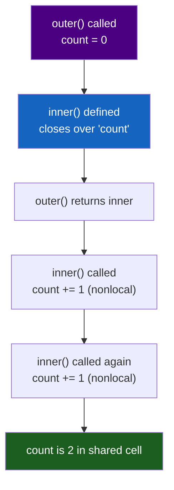

# :material-function: Day 02 — Functions & Lambdas

!!! abstract "At a Glance"
    **Goal:** Master Python's first-class functions, closures, and functional tools.
    **C++ Equivalent:** `std::function`, lambdas, `std::bind`, `std::partial` — but more powerful.

<div class="grid cards" markdown>

- :material-lightbulb-on: **Core Concept** — Functions are objects; they can be stored, passed, and returned
- :material-snake: **Python Way** — Closures with `nonlocal`, `*args`/`**kwargs` for variadic functions
- :material-alert: **Watch Out** — Late binding in closures captures the variable, not its value
- :material-check-circle: **When to Use** — Use `lambda` for short throwaway functions; named functions for anything complex

</div>

## :material-lightbulb-on: Intuition

!!! info "Core Idea"
    Python functions are **first-class objects**. This means you can assign them to variables,
    store them in data structures, pass them as arguments, and return them from other functions.
    This enables powerful patterns like callbacks, decorators, and functional programming.

!!! success "Python vs C++"
    | C++ | Python |
    |---|---|
    | `std::function<int(int)>` | any callable (function, lambda, class with `__call__`) |
    | `[](int x){ return x*2; }` | `lambda x: x * 2` |
    | `std::bind(f, _1, 42)` | `functools.partial(f, y=42)` |
    | `std::for_each` + lambda | `map()` / list comprehension |
    | closure capture `[x]` | Python closes over the variable automatically |

## :material-chart-timeline: Closure Variable Capture



## :material-book-open-variant: First-Class Functions

```python
# Functions assigned to variables
def square(x: int) -> int:
    return x * x

f = square          # f is now another name for the same function object
print(f(5))         # 25
print(type(f))      # <class 'function'>

# Functions in data structures
ops = {
    "add": lambda x, y: x + y,
    "sub": lambda x, y: x - y,
    "mul": lambda x, y: x * y,
}
print(ops["add"](3, 4))   # 7

# Functions as arguments (higher-order functions)
def apply(func, value):
    return func(value)

print(apply(square, 6))   # 36
print(apply(str.upper, "hello"))  # "HELLO"

# Functions as return values (factory)
def multiplier(factor: int):
    def multiply(x: int) -> int:
        return x * factor    # closes over 'factor'
    return multiply

double = multiplier(2)
triple = multiplier(3)
print(double(5))   # 10
print(triple(5))   # 15
```

## :material-code-tags: Closures and `nonlocal`

```python
def make_counter(start: int = 0):
    count = start

    def increment(step: int = 1) -> int:
        nonlocal count          # 'nonlocal' allows rebinding in enclosing scope
        count += step           # without 'nonlocal': UnboundLocalError!
        return count

    def reset() -> None:
        nonlocal count
        count = start

    return increment, reset

inc, rst = make_counter(10)
print(inc())    # 11
print(inc(5))   # 16
rst()
print(inc())    # 11
```

!!! warning "Late binding pitfall"
    ```python
    # WRONG — all lambdas capture the variable 'i', not its value
    funcs = [lambda: i for i in range(3)]
    print([f() for f in funcs])   # [2, 2, 2] — not [0, 1, 2]!

    # CORRECT — capture the value using a default argument
    funcs = [lambda i=i: i for i in range(3)]
    print([f() for f in funcs])   # [0, 1, 2]
    ```

## :material-cog: `*args` and `**kwargs`

```python
# *args collects positional arguments into a tuple
def sum_all(*args: int) -> int:
    return sum(args)

print(sum_all(1, 2, 3, 4))    # 10

# **kwargs collects keyword arguments into a dict
def display(**kwargs: str) -> None:
    for key, value in kwargs.items():
        print(f"{key}: {value}")

display(name="Alice", city="NY")

# Keyword-only arguments (after the * marker)
def create_user(name: str, *, role: str = "user", active: bool = True):
    # 'role' and 'active' can ONLY be passed as keyword arguments
    return {"name": name, "role": role, "active": active}

create_user("Alice")                    # OK
create_user("Bob", role="admin")        # OK
create_user("Carol", "admin")           # TypeError! role is keyword-only

# Positional-only arguments (before the / marker, Python 3.8+)
def point(x: float, y: float, /, z: float = 0.0):
    # x and y can ONLY be passed positionally
    return (x, y, z)

point(1.0, 2.0)             # OK
point(x=1.0, y=2.0)        # TypeError! x is positional-only
```

## :material-function-variant: Lambda, map, filter, functools.partial

```python
from functools import partial, reduce
from typing import Callable

# lambda: anonymous function
square = lambda x: x ** 2
add = lambda x, y: x + y

# map: apply function to each element (returns iterator)
nums = [1, 2, 3, 4, 5]
squared = list(map(lambda x: x ** 2, nums))  # [1, 4, 9, 16, 25]
# Pythonic: use list comprehension instead:
squared = [x ** 2 for x in nums]

# filter: keep elements where function returns True
evens = list(filter(lambda x: x % 2 == 0, nums))  # [2, 4]
# Pythonic:
evens = [x for x in nums if x % 2 == 0]

# reduce: fold/accumulate (like std::accumulate in C++)
product = reduce(lambda acc, x: acc * x, nums, 1)  # 120

# functools.partial — fix some arguments (like std::bind)
def power(base: int, exp: int) -> int:
    return base ** exp

square = partial(power, exp=2)
cube = partial(power, exp=3)
print(square(4))   # 16
print(cube(3))     # 27

# Useful with map
squares = list(map(partial(power, exp=2), [1, 2, 3, 4]))  # [1, 4, 9, 16]
```

## :material-alert: Common Pitfalls

!!! warning "Mutable default arguments (repeated from Day 0 — it is that common)"
    ```python
    # WRONG
    def add_item(item, container=[]):
        container.append(item)
        return container

    print(add_item(1))   # [1]
    print(add_item(2))   # [1, 2]  !! not [2]

    # CORRECT
    def add_item(item, container=None):
        if container is None:
            container = []
        container.append(item)
        return container
    ```

!!! danger "Lambda cannot contain statements"
    ```python
    # lambdas can only contain expressions, not statements
    f = lambda x: if x > 0: x else -x   # SyntaxError!

    # Use a named function instead:
    def abs_val(x):
        return x if x > 0 else -x
    # Or: abs_val = lambda x: x if x > 0 else -x  (ternary expression OK)
    ```

## :material-help-circle: Flashcards

???+ question "What is the difference between a closure and a regular function?"
    A closure is a function that **remembers the variables from the enclosing scope** even after
    that scope has finished executing. The closed-over variables are stored in the function's
    `__closure__` attribute. A regular function accesses only its local scope and the global scope.
    Use `nonlocal` to rebind (not just read) a variable in the enclosing scope.

???+ question "When should you use `lambda` vs `def`?"
    Use `lambda` for short, single-expression functions that are used inline once (e.g., as a
    `key=` argument to `sorted()`). Use `def` for anything with a body, docstring, or reuse.
    PEP 8 says: "Never use a lambda expression assigned to an identifier. Use def instead."
    So `f = lambda x: x * 2` should be `def f(x): return x * 2`.

???+ question "What does `*` alone in a function signature mean?"
    A bare `*` separator means all parameters after it are **keyword-only**. They cannot be
    passed positionally. Example: `def f(a, b, *, c, d)` — `a` and `b` accept positional or keyword,
    while `c` and `d` must be passed as keyword arguments. This prevents API-breaking changes
    when you add optional parameters.

???+ question "What is `functools.partial` and when do you use it?"
    `partial` creates a new callable with some arguments pre-filled. It is Python's equivalent of
    `std::bind` in C++. Use it when you have a function that takes N arguments but a consumer
    expects a function with fewer arguments (e.g., callbacks, `map`). It is more readable than
    a lambda for simple argument fixing.

## :material-clipboard-check: Self Test

=== "Question 1"
    Write a function `memoize(func)` that caches the results of a function call.

=== "Answer 1"
    ```python
    def memoize(func):
        cache = {}
        def wrapper(*args):
            if args not in cache:
                cache[args] = func(*args)
            return cache[args]
        return wrapper

    @memoize
    def fib(n):
        if n < 2:
            return n
        return fib(n - 1) + fib(n - 2)

    # Or use the built-in:
    from functools import lru_cache

    @lru_cache(maxsize=None)
    def fib(n):
        if n < 2:
            return n
        return fib(n - 1) + fib(n - 2)
    ```

=== "Question 2"
    Explain why `sorted(words, key=str.lower)` is better than `sorted(words, key=lambda w: w.lower())`.

=== "Answer 2"
    Both produce identical results, but `str.lower` is:

    - **Faster** — it is a built-in method reference, no lambda overhead
    - **More readable** — the intent is clear: sort by lowercase version
    - **No closure** — avoids potential late-binding issues

    Generally, passing a method reference (`str.lower`, `int`, `len`) is preferred over a lambda
    when the lambda just calls a single method or function.

## :material-check-circle: Summary

!!! success "Key Takeaways"
    - Python functions are first-class objects: assign, store, pass, and return them freely.
    - Closures capture the **variable** (not its value) — use default argument trick to capture values.
    - `nonlocal` is needed to **rebind** (not just read) a variable in the enclosing scope.
    - `*args` captures extra positional args as a tuple; `**kwargs` captures keyword args as a dict.
    - `*` in a signature makes all following parameters keyword-only; `/` makes preceding ones positional-only.
    - `lambda` for inline throwaway functions; `def` for anything reusable or complex.
    - `functools.partial` is Python's `std::bind` for fixing arguments.
