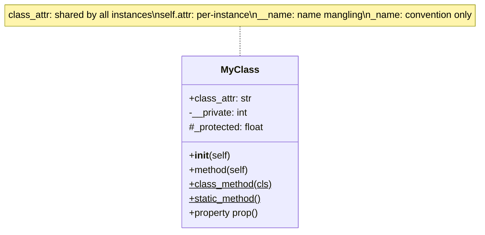

# :material-code-braces: Day 03 — Classes & Encapsulation

!!! abstract "At a Glance"
    **Goal:** Master Python's class system, instance vs class attributes, and dunder methods.
    **C++ Equivalent:** Class definition, constructor, member variables, operator overloading.

<div class="grid cards" markdown>

- :material-lightbulb-on: **Core Concept** — `__init__` initialises; `self` is the explicit `this`
- :material-snake: **Python Way** — Dunder methods give any class operator-like behaviour
- :material-alert: **Watch Out** — Class attributes shared by all instances; instance attrs per object
- :material-check-circle: **When to Use** — Use classes to bundle data and behaviour; `@property` for controlled access

</div>

## :material-lightbulb-on: Intuition

!!! info "Core Idea"
    A Python class is a blueprint for creating objects. Unlike C++, there is no header/source split.
    `__init__` is the initializer (not the constructor — `__new__` is the constructor, but rarely
    overridden). `self` is always the first parameter and is the explicit receiver (like C++ `this`).

!!! success "Python vs C++"
    ```cpp
    // C++
    class Point {
    public:
        int x, y;
        Point(int x, int y) : x(x), y(y) {}
        bool operator==(const Point& o) const { return x==o.x && y==o.y; }
    };
    ```
    ```python
    # Python
    class Point:
        def __init__(self, x: int, y: int) -> None:
            self.x = x   # instance attribute — created in __init__
            self.y = y

        def __eq__(self, other: object) -> bool:
            if not isinstance(other, Point):
                return NotImplemented
            return self.x == other.x and self.y == other.y
    ```

## :material-chart-timeline: Class Anatomy



## :material-book-open-variant: Class Basics

```python
from __future__ import annotations

class BankAccount:
    # Class attribute — shared by ALL instances
    interest_rate: float = 0.05
    _account_count: int = 0   # "protected" by convention

    def __init__(self, owner: str, balance: float = 0.0) -> None:
        # Instance attributes — unique to each object
        self.owner = owner
        self._balance = balance   # single underscore: "internal"
        self.__id = BankAccount._account_count   # double underscore: name mangled
        BankAccount._account_count += 1

    @property
    def balance(self) -> float:
        """Read-only balance via property."""
        return self._balance

    @property
    def id(self) -> int:
        return self.__id   # access via property; actual name is _BankAccount__id

    def deposit(self, amount: float) -> None:
        if amount <= 0:
            raise ValueError(f"Amount must be positive, got {amount}")
        self._balance += amount

    def withdraw(self, amount: float) -> None:
        if amount > self._balance:
            raise ValueError("Insufficient funds")
        self._balance -= amount

    @classmethod
    def create_savings(cls, owner: str) -> BankAccount:
        """Named constructor — class method factory."""
        return cls(owner, balance=100.0)  # bonus starting balance

    @staticmethod
    def validate_amount(amount: float) -> bool:
        return amount > 0

    def __repr__(self) -> str:
        return f"BankAccount(owner={self.owner!r}, balance={self._balance:.2f})"

    def __str__(self) -> str:
        return f"{self.owner}'s account: ${self._balance:.2f}"

    def __eq__(self, other: object) -> bool:
        if not isinstance(other, BankAccount):
            return NotImplemented
        return self.__id == other.__id   # same account = same id

    def __hash__(self) -> int:
        return hash(self.__id)   # hashable if __eq__ is defined
```

## :material-lock: Property and Name Mangling

```python
class Temperature:
    def __init__(self, celsius: float) -> None:
        self._celsius = celsius   # backing store

    @property
    def celsius(self) -> float:
        return self._celsius

    @celsius.setter
    def celsius(self, value: float) -> None:
        if value < -273.15:
            raise ValueError(f"Temperature below absolute zero: {value}")
        self._celsius = value

    @celsius.deleter
    def celsius(self) -> None:
        del self._celsius

    @property
    def fahrenheit(self) -> float:
        """Computed property — no setter."""
        return self._celsius * 9/5 + 32

t = Temperature(100.0)
print(t.celsius)      # 100.0 — getter called
print(t.fahrenheit)   # 212.0 — computed
t.celsius = 0.0       # setter called
t.celsius = -300      # ValueError!
```

!!! info "Name Mangling"
    `self.__attr` is rewritten to `self._ClassName__attr` by the Python compiler.
    This prevents accidental override in subclasses — not security.
    ```python
    class A:
        def __init__(self):
            self.__secret = 42

    a = A()
    # a.__secret          # AttributeError!
    a._A__secret          # 42 — accessible but signals "don't touch"
    ```

## :material-format-list-bulleted: Key Dunder Methods

| Dunder | C++ Equivalent | Purpose |
|---|---|---|
| `__init__` | constructor body | Initialise object |
| `__new__` | `operator new` | Allocate + create object |
| `__del__` | destructor | Cleanup (non-deterministic) |
| `__repr__` | `operator<<` (debug) | Unambiguous string representation |
| `__str__` | `operator<<` (display) | Human-readable string |
| `__eq__` | `operator==` | Value equality |
| `__hash__` | `std::hash<T>` | Hash value (for dict/set) |
| `__lt__`, `__le__` etc. | `operator<` etc. | Comparison operators |
| `__add__` | `operator+` | Addition |
| `__len__` | `size()` | Length |
| `__getitem__` | `operator[]` | Index access |
| `__contains__` | `find() != end()` | `in` operator |
| `__call__` | `operator()` | Make instance callable |
| `__enter__`/`__exit__` | RAII class | Context manager |

## :material-alert: Common Pitfalls

!!! warning "Class vs instance attributes"
    ```python
    class Foo:
        items = []    # CLASS attribute — shared!

    a = Foo()
    b = Foo()
    a.items.append(1)
    print(b.items)    # [1] !! b.items is the SAME list as a.items

    # Fix: create instance attribute in __init__
    class Foo:
        def __init__(self):
            self.items = []    # INSTANCE attribute — separate per object
    ```

!!! danger "Forgetting to define `__hash__` when defining `__eq__`"
    If you define `__eq__` without `__hash__`, Python sets `__hash__ = None`, making your
    objects **unhashable** (cannot be used in sets or as dict keys). If your objects should
    be hashable, always define both. If they should not be hashable (mutable value objects),
    explicitly set `__hash__ = None`.

## :material-help-circle: Flashcards

???+ question "What is the difference between `__repr__` and `__str__`?"
    `__repr__` should return an **unambiguous** string that ideally can be used to recreate the object:
    `repr(Point(1, 2))` → `"Point(x=1, y=2)"`. `__str__` is for **human display**.
    When only `__repr__` is defined, `str()` falls back to it. When printing an object,
    Python calls `__str__`. In containers (lists, dicts), `__repr__` is called for elements.

???+ question "Why does Python have both `@classmethod` and `@staticmethod`?"
    `@classmethod` receives `cls` as first argument (the class itself, not an instance).
    Use it for factory methods, alternate constructors, or methods that need to access/modify
    class state. `@staticmethod` receives no implicit first argument — it is a plain function
    namespaced in the class. Use it for utility functions logically related to the class.

???+ question "What is name mangling and why does Python have it?"
    Double-underscore prefix (`__attr`) triggers name mangling: `__attr` becomes `_ClassName__attr`.
    The goal is to avoid **accidental name clashes in subclasses**, not to enforce privacy.
    If a subclass also has `__attr`, the two will not collide. It is NOT a security mechanism.

???+ question "When should you use a property vs a plain attribute?"
    Use a plain attribute when there is no validation, transformation, or derived value needed.
    Use `@property` when you need to validate on set, compute on get, or change the implementation
    without changing the public API. Properties allow you to start with a plain attribute and add
    logic later without breaking callers — this is the **Uniform Access Principle**.

## :material-clipboard-check: Self Test

=== "Question 1"
    Design a `Vector2D` class with `__add__`, `__mul__` (scalar), `__abs__` (magnitude), and `__repr__`.

=== "Answer 1"
    ```python
    import math

    class Vector2D:
        def __init__(self, x: float, y: float) -> None:
            self.x = x
            self.y = y

        def __add__(self, other: "Vector2D") -> "Vector2D":
            return Vector2D(self.x + other.x, self.y + other.y)

        def __mul__(self, scalar: float) -> "Vector2D":
            return Vector2D(self.x * scalar, self.y * scalar)

        def __rmul__(self, scalar: float) -> "Vector2D":
            return self.__mul__(scalar)  # support 3 * v as well as v * 3

        def __abs__(self) -> float:
            return math.hypot(self.x, self.y)

        def __repr__(self) -> str:
            return f"Vector2D(x={self.x}, y={self.y})"
    ```

=== "Question 2"
    Explain the difference: `BankAccount.deposit` vs `account.deposit`.

=== "Answer 2"
    `BankAccount.deposit` is an **unbound method** — it is just a function stored in the class.
    You can call it but must pass `self` explicitly: `BankAccount.deposit(account, 100)`.
    `account.deposit` is a **bound method** — Python automatically binds `self` to `account`.
    Calling `account.deposit(100)` is equivalent to `BankAccount.deposit(account, 100)`.

## :material-check-circle: Summary

!!! success "Key Takeaways"
    - `__init__` initialises the object; `self` is the explicit receiver (like C++ `this`).
    - Class attributes are shared; instance attributes (set via `self.x`) are per-object.
    - `@property` provides getter/setter/deleter with the clean attribute access syntax.
    - `__name` (double underscore) triggers name mangling to `_ClassName__name`.
    - Always define `__repr__` for debugging; add `__str__` for user-facing display.
    - Define `__hash__` whenever you define `__eq__`, or explicitly set `__hash__ = None`.
