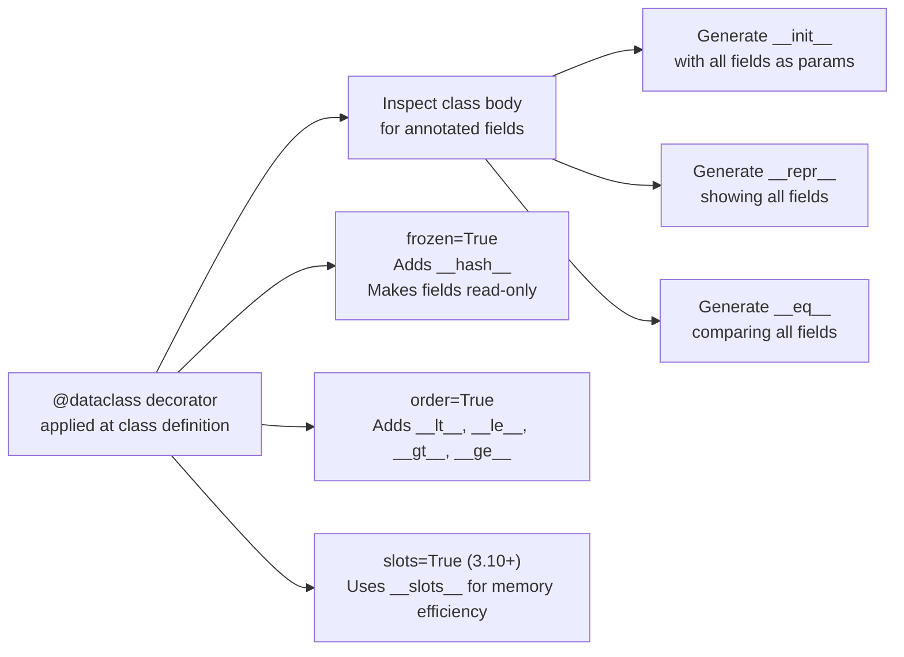

# :material-table-row: Day 04 — Dataclasses & Slots

!!! abstract "At a Glance"
    **Goal:** Use `@dataclass` and `__slots__` to write concise, efficient data-holding classes.
    **C++ Equivalent:** `struct` with synthesised constructors (Rule of Zero) + `std::tuple`.

<div class="grid cards" markdown>

- :material-lightbulb-on: **Core Concept** — `@dataclass` auto-generates `__init__`, `__repr__`, `__eq__`
- :material-snake: **Python Way** — `frozen=True` gives immutability; `slots=True` reduces memory
- :material-alert: **Watch Out** — Mutable default fields must use `field(default_factory=...)`
- :material-check-circle: **When to Use** — For data transfer objects, configuration, value types

</div>

## :material-lightbulb-on: Intuition

!!! info "Core Idea"
    `@dataclass` is Python's answer to C++ Rule of Zero — the compiler (in Python's case, the
    decorator) generates all the boilerplate. You declare what data you have, and `@dataclass`
    generates `__init__`, `__repr__`, `__eq__`, optionally `__lt__`/`__hash__`, and more.

!!! success "Python vs C++ Rule of Zero"
    ```cpp
    // C++ Rule of Zero — compiler generates everything
    struct Point {
        int x, y;
    };
    // Has default constructor, copy, move, destructor for free
    ```
    ```python
    # Python @dataclass — decorator generates everything
    from dataclasses import dataclass

    @dataclass
    class Point:
        x: int
        y: int
    # Has __init__, __repr__, __eq__ for free
    p = Point(1, 2)
    print(p)          # Point(x=1, y=2)
    print(p == Point(1, 2))  # True
    ```

## :material-chart-timeline: Dataclass Generation



## :material-book-open-variant: `@dataclass` Features

```python
from dataclasses import dataclass, field, fields, asdict, astuple
from typing import ClassVar

@dataclass(order=True, frozen=False)
class Employee:
    # Sort key — only this field used for ordering (order=True)
    sort_index: float = field(init=False, repr=False)

    name: str
    department: str
    salary: float
    tags: list[str] = field(default_factory=list)  # MUST use field() for mutable defaults

    # ClassVar: class-level variable, not an instance field
    company: ClassVar[str] = "Acme Corp"

    def __post_init__(self) -> None:
        # Called after __init__ — use for validation and derived fields
        if self.salary < 0:
            raise ValueError(f"Salary cannot be negative: {self.salary}")
        # Set the sort key after init
        object.__setattr__(self, "sort_index", self.salary)

    def give_raise(self, amount: float) -> None:
        self.salary += amount
        self.sort_index = self.salary  # update sort key

# Usage
alice = Employee("Alice", "Engineering", 95000.0, ["python", "rust"])
bob = Employee("Bob", "Marketing", 75000.0)

print(alice)         # Employee(name='Alice', ...)
print(alice == Employee("Alice", "Engineering", 95000.0, ["python", "rust"]))  # True
print(sorted([alice, bob]))  # sorted by salary

# Serialise
print(asdict(alice))   # {"name": "Alice", "department": "Engineering", ...}
print(astuple(alice))  # ("Alice", "Engineering", 95000.0, [...], 95000.0)
```

## :material-snowflake: Frozen and Slots

```python
@dataclass(frozen=True)
class ImmutablePoint:
    x: float
    y: float

p = ImmutablePoint(1.0, 2.0)
p.x = 3.0   # FrozenInstanceError! Cannot assign to field 'x'

# frozen=True also generates __hash__ (since the object is immutable)
s = {ImmutablePoint(0, 0), ImmutablePoint(1, 1)}  # hashable!

# slots=True (Python 3.10+) — uses __slots__ for memory efficiency
@dataclass(slots=True)
class SlottedPoint:
    x: float
    y: float
    # No __dict__ created — lower memory, faster attribute access

# Compare memory
import sys
regular = ImmutablePoint(1.0, 2.0)
slotted = SlottedPoint(1.0, 2.0)
print(sys.getsizeof(regular.__dict__))  # dict overhead
# SlottedPoint has no __dict__, saves ~50-100 bytes per instance
```

## :material-compare: `@dataclass` vs `NamedTuple`

```python
from typing import NamedTuple

# NamedTuple: immutable, tuple-like (indexable!), slightly less features
class PointNT(NamedTuple):
    x: float
    y: float
    label: str = "point"   # default value OK

p = PointNT(1.0, 2.0)
print(p[0])              # 1.0 — indexed like a tuple
print(p._asdict())       # {"x": 1.0, "y": 2.0, "label": "point"}
x, y, label = p          # tuple unpacking

# When to use what:
# @dataclass:   mutable or complex objects, methods, inheritance needed
# NamedTuple:   simple immutable record, tuple interoperability needed
```

| Feature | `@dataclass` | `NamedTuple` | `TypedDict` | Manual class |
|---|---|---|---|---|
| Mutable | Yes (default) | No | Yes (dict) | Yes |
| Ordered/indexed | No | Yes (tuple) | No | No |
| Type annotations | Yes | Yes | Yes | Yes |
| `__init__` generated | Yes | Yes | N/A | No |
| `__repr__` generated | Yes | Yes | N/A | No |
| `__eq__` by value | Yes | Yes | N/A | No |
| `__hash__` | Only if frozen | Yes | No | No (if `__eq__` defined) |
| Memory efficient | With `slots=True` | Yes (tuple) | Dict overhead | Medium |
| Inheritance | Yes | Limited | No | Yes |

## :material-factory: `@classmethod` Factories

```python
from dataclasses import dataclass
from datetime import date

@dataclass
class DateRange:
    start: date
    end: date

    @classmethod
    def this_week(cls) -> "DateRange":
        """Named constructor — Python's equivalent of C++ named constructors."""
        today = date.today()
        monday = today.replace(day=today.day - today.weekday())
        sunday = monday.replace(day=monday.day + 6)
        return cls(monday, sunday)

    @classmethod
    def from_strings(cls, start: str, end: str) -> "DateRange":
        return cls(date.fromisoformat(start), date.fromisoformat(end))

    @classmethod
    def from_dict(cls, d: dict) -> "DateRange":
        return cls(d["start"], d["end"])

# Usage
this_week = DateRange.this_week()
q1 = DateRange.from_strings("2024-01-01", "2024-03-31")
```

!!! info "Why `@classmethod` instead of `__init__` overloads?"
    Python does not support overloaded constructors (C++ has multiple `Foo(int)`, `Foo(string)` etc).
    The Pythonic pattern is to have one `__init__` and multiple `@classmethod` factories with
    descriptive names like `from_string`, `from_dict`, `create_empty`. This is more readable.

## :material-alert: Common Pitfalls

!!! warning "Mutable default in `@dataclass`"
    ```python
    # WRONG — raises TypeError at class definition time!
    @dataclass
    class Bad:
        items: list = []   # TypeError: mutable default not allowed

    # CORRECT — use field(default_factory=...)
    @dataclass
    class Good:
        items: list = field(default_factory=list)
        config: dict = field(default_factory=dict)
    ```

!!! danger "Inheriting frozen dataclass from non-frozen"
    ```python
    @dataclass
    class Base:
        x: int

    @dataclass(frozen=True)
    class Child(Base):
        y: int
    # TypeError: cannot inherit frozen dataclass from a non-frozen one
    # All classes in the hierarchy must agree on frozen status
    ```

## :material-help-circle: Flashcards

???+ question "What is `__post_init__` used for in a dataclass?"
    `__post_init__` is called automatically after the generated `__init__` completes. Use it for:
    **validation** (raise `ValueError` if data is invalid), **computing derived fields** (set a field
    that depends on other fields), **type coercion** (convert strings to ints). For `frozen=True`
    dataclasses, use `object.__setattr__(self, 'field', value)` to set derived fields.

???+ question "What is the difference between `field(default=...)` and `field(default_factory=...)`?"
    `default=value` sets the same literal value for all instances (fine for immutable types like
    `int`, `str`, `float`). `default_factory=callable` calls the callable with no arguments for
    each new instance, creating a fresh object each time. Always use `default_factory` for
    mutable types: `field(default_factory=list)` not `field(default=[])`.

???+ question "When would you choose `NamedTuple` over `@dataclass`?"
    Choose `NamedTuple` when: (1) you need tuple unpacking and indexing, (2) you need hashability
    without `frozen=True`, (3) you need tuple compatibility (e.g., CSV row, function return),
    (4) you want the smallest possible memory footprint. Choose `@dataclass` when you need
    mutability, computed fields in `__post_init__`, or complex inheritance.

???+ question "What does `slots=True` do and why does it matter?"
    `slots=True` (Python 3.10+) generates a `__slots__` declaration instead of using `__dict__`
    for instance attribute storage. This reduces memory per instance by 50-100 bytes and speeds up
    attribute access. The tradeoff: you cannot add new attributes at runtime, and it interacts
    with multiple inheritance. Use it for classes that will have millions of instances.

## :material-clipboard-check: Self Test

=== "Question 1"
    Write a `Config` frozen dataclass with a `from_env()` classmethod that reads from environment variables.

=== "Answer 1"
    ```python
    import os
    from dataclasses import dataclass

    @dataclass(frozen=True)
    class Config:
        host: str
        port: int
        debug: bool

        @classmethod
        def from_env(cls) -> "Config":
            return cls(
                host=os.environ.get("HOST", "localhost"),
                port=int(os.environ.get("PORT", "8080")),
                debug=os.environ.get("DEBUG", "false").lower() == "true",
            )

    config = Config.from_env()
    # config.host = "other"  # FrozenInstanceError
    ```

=== "Question 2"
    Explain when `dataclasses.replace()` is useful and how it relates to C++.

=== "Answer 2"
    `dataclasses.replace(obj, field=new_value)` creates a **shallow copy** of the dataclass
    with specified fields changed. This is essential for frozen dataclasses (which you cannot
    mutate), enabling an immutable update pattern:
    ```python
    p1 = ImmutablePoint(1.0, 2.0)
    p2 = replace(p1, x=5.0)   # p1 unchanged, p2 is new
    ```
    In C++ this is like the builder pattern or `std::optional`-style transformations.
    It encourages immutable data with explicit "transformed copy" semantics.

## :material-check-circle: Summary

!!! success "Key Takeaways"
    - `@dataclass` auto-generates `__init__`, `__repr__`, `__eq__` from annotated fields.
    - `frozen=True` makes instances immutable and adds `__hash__`.
    - `slots=True` (Python 3.10+) replaces `__dict__` with `__slots__` for memory efficiency.
    - Mutable default values **must** use `field(default_factory=callable)`.
    - `__post_init__` runs after `__init__` — use for validation and derived fields.
    - `@classmethod` factories replace C++ constructor overloads with named, readable constructors.
    - `NamedTuple` is better when you need tuple indexing/unpacking; `@dataclass` for everything else.
