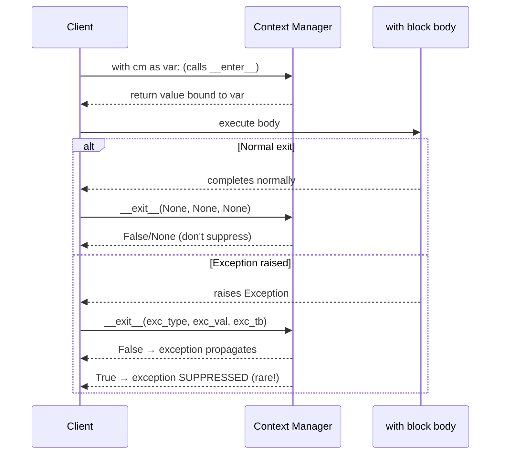

# :material-shield-lock: Day 05 — Context Managers (Python's RAII)

!!! abstract "At a Glance"
    **Goal:** Master the `with` statement and the context manager protocol for deterministic cleanup.
    **C++ Equivalent:** RAII — Resource Acquisition Is Initialization. `std::lock_guard`, `std::unique_ptr`.

<div class="grid cards" markdown>

- :material-lightbulb-on: **Core Concept** — `with` guarantees cleanup even if an exception occurs
- :material-snake: **Python Way** — Class form (`__enter__`/`__exit__`) or `@contextmanager` generator
- :material-alert: **Watch Out** — `__exit__` returning `True` suppresses the exception — almost always wrong
- :material-check-circle: **When to Use** — Files, locks, DB connections, timers, mocks, temporary state

</div>

## :material-lightbulb-on: Intuition

!!! info "Core Idea"
    Python is garbage collected — there is no destructor called at a predictable time.
    The context manager protocol (`with` statement) provides **deterministic cleanup** by
    guaranteeing that `__exit__` is always called when the `with` block exits, whether normally
    or via an exception. This is Python's RAII.

!!! success "Python vs C++ RAII"
    ```cpp
    // C++ RAII — destructor called deterministically
    {
        std::lock_guard<std::mutex> lock(mutex);
        // critical section
    }  // lock released here, even if exception thrown
    ```
    ```python
    # Python context manager — __exit__ called deterministically
    with threading.Lock() as lock:
        # critical section
        pass
    # lock released here, even if exception raised
    ```

## :material-chart-timeline: Context Manager Lifecycle



## :material-book-open-variant: Class-Form Context Manager

```python
import time
from types import TracebackType

class Timer:
    """Measures elapsed time of a with block."""

    def __init__(self, label: str = "") -> None:
        self.label = label
        self.elapsed: float = 0.0

    def __enter__(self) -> "Timer":
        self._start = time.perf_counter()
        return self   # value bound to 'as' variable

    def __exit__(
        self,
        exc_type: type[BaseException] | None,
        exc_val: BaseException | None,
        exc_tb: TracebackType | None,
    ) -> bool:
        self.elapsed = time.perf_counter() - self._start
        if self.label:
            print(f"[{self.label}] elapsed: {self.elapsed:.4f}s")
        return False   # DO NOT suppress exceptions

with Timer("computation") as t:
    result = sum(range(10_000_000))

print(f"Sum: {result}, Time: {t.elapsed:.4f}s")
```

### Exception Handling in `__exit__`

```python
class SuppressFileNotFound:
    """Context manager that suppresses FileNotFoundError."""

    def __enter__(self) -> "SuppressFileNotFound":
        return self

    def __exit__(self, exc_type, exc_val, exc_tb) -> bool:
        if exc_type is FileNotFoundError:
            print(f"File not found, continuing: {exc_val}")
            return True   # suppress the exception
        return False      # re-raise any other exception

with SuppressFileNotFound():
    content = open("missing.txt").read()   # suppressed!

print("Continuing after missing file...")
# Standard library equivalent:
from contextlib import suppress
with suppress(FileNotFoundError):
    content = open("missing.txt").read()
```

## :material-function-variant: `@contextmanager` Generator Form

```python
from contextlib import contextmanager
from typing import Generator

@contextmanager
def managed_file(path: str, mode: str = "r") -> Generator[object, None, None]:
    """Equivalent to open() but with custom error handling."""
    print(f"Opening {path}")
    f = open(path, mode)
    try:
        yield f          # value bound to 'as' variable; suspends here
    except PermissionError:
        print("Access denied!")
        raise            # re-raise after logging
    finally:
        f.close()        # always runs — cleanup code
        print(f"Closed {path}")

with managed_file("data.txt") as f:
    data = f.read()
```

!!! info "How `@contextmanager` works"
    The generator pauses at `yield`. The yielded value is the `as` variable. After the `with`
    block, execution resumes after `yield`. If an exception occurs in the `with` block, it is
    thrown into the generator at the `yield` point — that's why you need `try/finally` or
    `try/except/raise` to handle cleanup correctly.

## :material-layers: Advanced: `contextlib.ExitStack`

```python
from contextlib import ExitStack

# Dynamic number of context managers
def process_files(filenames: list[str]) -> None:
    with ExitStack() as stack:
        files = [stack.enter_context(open(f)) for f in filenames]
        # All files are open here
        for f in files:
            print(f.readline())
    # All files closed here

# Conditional context managers
def maybe_lock(mutex, should_lock: bool):
    with ExitStack() as stack:
        if should_lock:
            stack.enter_context(mutex)
        # critical work here
```

## :material-table: Real-World Context Manager Examples

| Use Case | Built-in / Library | Pattern |
|---|---|---|
| File I/O | `open()` | `with open("f.txt") as f:` |
| Threading | `threading.Lock()` | `with lock:` |
| Database | `sqlite3.connect()` | `with conn:` — auto-commit/rollback |
| Temporary directory | `tempfile.TemporaryDirectory()` | Auto-deleted |
| Patching in tests | `unittest.mock.patch()` | `with patch("mod.Cls"):` |
| Suppress exceptions | `contextlib.suppress(Exc)` | `with suppress(ValueError):` |
| Redirect stdout | `contextlib.redirect_stdout()` | Capture print output |
| Timer | Custom or `contextlib.AbstractContextManager` | Elapsed time |

## :material-alert: Common Pitfalls

!!! warning "Returning True from `__exit__` accidentally suppresses exceptions"
    ```python
    def __exit__(self, exc_type, exc_val, exc_tb):
        self.cleanup()
        # If you forget 'return False' or 'return None', Python returns None
        # which is falsy — exceptions propagate. That's correct!
        # But if you do: return True  # DANGER: ALL exceptions suppressed
    ```

!!! danger "Not using `with` for files"
    ```python
    # WRONG — file may not be closed if exception occurs
    f = open("data.txt")
    data = f.read()
    f.close()

    # CORRECT — always use with
    with open("data.txt") as f:
        data = f.read()
    ```

## :material-help-circle: Flashcards

???+ question "What are the three arguments passed to `__exit__`?"
    `__exit__(self, exc_type, exc_val, exc_tb)`:
    - `exc_type`: the exception class (e.g., `ValueError`) or `None` if no exception
    - `exc_val`: the exception instance or `None`
    - `exc_tb`: the traceback object or `None`
    Return `True` to suppress the exception; return `False` or `None` to propagate it.

???+ question "What is the difference between the class form and `@contextmanager` form?"
    **Class form**: more explicit, supports `__aenter__`/`__aexit__` for async, better for
    complex state. **`@contextmanager` form**: more concise, uses generator suspend/resume,
    natural for setup/cleanup patterns with `try/finally`. Both are correct — use whichever
    reads more clearly. The class form is required for async context managers.

???+ question "What does `ExitStack` solve that a regular `with` statement cannot?"
    `ExitStack` allows a **dynamic number** of context managers determined at runtime.
    You cannot write `with cm1, cm2, ..., cmN:` when N is unknown at write time.
    `ExitStack.enter_context()` registers each manager, and all are cleaned up when the
    `ExitStack` itself exits. It is also useful for conditionally entering context managers.

???+ question "Why is Python's `with` statement safer than C++ destructors for some use cases?"
    Python context managers run synchronously in the same thread/call stack, making them
    predictable. They handle exceptions explicitly via `__exit__` arguments. C++ destructors
    cannot safely throw exceptions (undefined behavior to throw during stack unwinding).
    Python's `__exit__` can inspect, handle, suppress, or re-raise exceptions explicitly.

## :material-clipboard-check: Self Test

=== "Question 1"
    Write a `@contextmanager` that temporarily changes the current working directory.

=== "Answer 1"
    ```python
    import os
    from contextlib import contextmanager

    @contextmanager
    def working_directory(path: str):
        original = os.getcwd()
        os.chdir(path)
        try:
            yield
        finally:
            os.chdir(original)

    with working_directory("/tmp"):
        print(os.getcwd())  # /tmp
    print(os.getcwd())  # original directory restored
    ```

=== "Question 2"
    How would you use a context manager to ensure a database transaction is committed or rolled back?

=== "Answer 2"
    ```python
    from contextlib import contextmanager

    @contextmanager
    def transaction(conn):
        try:
            yield conn
            conn.commit()    # only reached if no exception
        except Exception:
            conn.rollback()  # undo partial work
            raise            # re-raise so caller knows it failed

    with transaction(db_connection) as conn:
        conn.execute("INSERT INTO ...")
        conn.execute("UPDATE ...")
    # commit called if both succeed; rollback if either raises
    ```

## :material-check-circle: Summary

!!! success "Key Takeaways"
    - Context managers provide deterministic cleanup via `__enter__` and `__exit__`.
    - `__exit__` is always called — on normal exit and on exceptions.
    - Return `False` from `__exit__` to propagate exceptions (almost always correct).
    - `@contextmanager` lets you write context managers as generators with `yield`.
    - `contextlib.ExitStack` handles a dynamic number of context managers.
    - Use `with` for all resources: files, locks, connections, temporary state.
