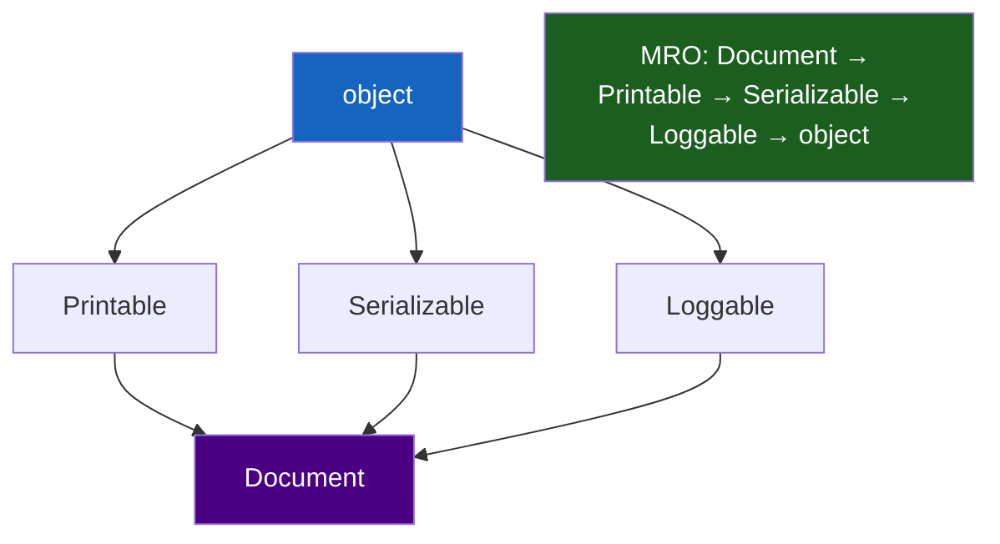

# :material-family-tree: Day 06 — Inheritance & Polymorphism

!!! abstract "At a Glance"
    **Goal:** Understand Python's inheritance model, MRO, `super()`, and the mixin pattern.
    **C++ Equivalent:** Single/multiple inheritance, virtual functions, diamond problem resolution.

<div class="grid cards" markdown>

- :material-lightbulb-on: **Core Concept** — Every Python method is virtual; no `virtual` keyword needed
- :material-snake: **Python Way** — `super()` + C3 MRO eliminates the diamond problem
- :material-alert: **Watch Out** — `super()` does not call the parent class — it calls the *next in MRO*
- :material-check-circle: **When to Use** — Prefer composition; use inheritance for IS-A and mixin relationships

</div>

## :material-lightbulb-on: Intuition

!!! info "Core Idea"
    In C++, methods are non-virtual by default — you must opt in with `virtual`. In Python,
    **every method is virtual by default**. Any subclass can override any method. The key
    to multiple inheritance is understanding the **MRO (Method Resolution Order)**: Python
    uses the C3 linearization algorithm to determine which method to call.

!!! success "Python vs C++ Inheritance"
    | C++ | Python |
    |---|---|
    | `virtual void draw()` | Just `def draw(self):` — always overridable |
    | `Base::method()` | `super().method()` — next in MRO |
    | Diamond problem | Solved by C3 MRO + cooperative super() |
    | Pure virtual | `@abstractmethod` |
    | `override` keyword | No equivalent — just define the method |

## :material-chart-timeline: MRO C3 Linearization



## :material-book-open-variant: Single Inheritance

```python
class Animal:
    def __init__(self, name: str, sound: str) -> None:
        self.name = name
        self.sound = sound

    def speak(self) -> str:
        return f"{self.name} says {self.sound}"

    def __repr__(self) -> str:
        return f"{type(self).__name__}(name={self.name!r})"

class Dog(Animal):
    def __init__(self, name: str, breed: str) -> None:
        super().__init__(name, "woof")   # cooperative super()
        self.breed = breed

    def fetch(self, item: str) -> str:
        return f"{self.name} fetches {item}"

    # Override parent method
    def speak(self) -> str:
        return f"{super().speak()}! (happily)"

class GuideDog(Dog):
    def __init__(self, name: str, breed: str, owner: str) -> None:
        super().__init__(name, breed)
        self.owner = owner

    def guide(self) -> str:
        return f"{self.name} guides {self.owner}"

rex = GuideDog("Rex", "Labrador", "Alice")
print(rex.speak())    # Rex says woof! (happily)
print(rex.guide())
print(isinstance(rex, Dog))     # True
print(isinstance(rex, Animal))  # True
print(type(rex).__mro__)        # (GuideDog, Dog, Animal, object)
```

## :material-merge: Multiple Inheritance & MRO

```python
class Flyable:
    def move(self) -> str:
        return "flying"

    def describe(self) -> str:
        return f"I can fly. {super().describe()}"  # cooperative!

class Swimmable:
    def move(self) -> str:
        return "swimming"

    def describe(self) -> str:
        return f"I can swim. {super().describe()}"  # cooperative!

class Animal:
    def describe(self) -> str:
        return "I am an animal."

class Duck(Flyable, Swimmable, Animal):
    def move(self) -> str:
        return "waddling (but can fly and swim)"

donald = Duck()
print(donald.describe())
# Follows MRO: Duck → Flyable → Swimmable → Animal → object
# Output: "I can fly. I can swim. I am an animal."

print(Duck.__mro__)
# (<class 'Duck'>, <class 'Flyable'>, <class 'Swimmable'>, <class 'Animal'>, <class 'object'>)
```

!!! info "Cooperative `super()` is the key"
    For multiple inheritance to work correctly, every class in the hierarchy must call
    `super().method()` — including intermediate classes. This ensures the full MRO chain
    is traversed. If any class breaks the chain, classes further down the MRO are skipped.

## :material-puzzle: Mixin Pattern

```python
from typing import Any

class JsonMixin:
    """Mixin: adds JSON serialisation to any class."""
    import json

    def to_json(self) -> str:
        return __import__("json").dumps(self.__dict__, default=str)

    @classmethod
    def from_json(cls, data: str) -> "JsonMixin":
        return cls(**__import__("json").loads(data))

class LogMixin:
    """Mixin: adds logging to any class."""

    def log(self, message: str, level: str = "INFO") -> None:
        print(f"[{level}] {type(self).__name__}: {message}")

class ValidateMixin:
    """Mixin: calls validate() in __init__ after setup."""

    def __init_subclass__(cls, **kwargs: Any) -> None:
        super().__init_subclass__(**kwargs)
        original_init = cls.__init__

        def patched_init(self, *args, **kwargs):
            original_init(self, *args, **kwargs)
            if hasattr(self, "validate"):
                self.validate()

        cls.__init__ = patched_init

# Compose mixins with the actual class
class User(JsonMixin, LogMixin):
    def __init__(self, name: str, email: str) -> None:
        self.name = name
        self.email = email

u = User("Alice", "alice@example.com")
print(u.to_json())             # {"name": "Alice", "email": "alice@example.com"}
u.log("User created")          # [INFO] User: User created
```

!!! warning "Mixin naming convention"
    By convention, mixins end with `Mixin` (e.g., `JsonMixin`, `LogMixin`). They should:
    - Not have an `__init__` (or call `super().__init__()` if they do)
    - Not be instantiated directly
    - Add behaviour, not state (or at least minimal state)

## :material-alert: Common Pitfalls

!!! warning "`super()` is not the parent class"
    ```python
    class A:
        def method(self):
            print("A")

    class B(A):
        def method(self):
            super().method()   # calls A.method — correct for simple case
            print("B")

    class C(A):
        def method(self):
            super().method()   # calls A.method — but wait...
            print("C")

    class D(B, C):
        def method(self):
            super().method()   # calls B.method, not A! MRO: D→B→C→A
            print("D")

    D().method()  # A, C, B, D  — NOT A, B, A, C, D
    ```

!!! danger "Diamond inheritance without cooperative super()"
    ```python
    class A:
        def hello(self):
            print("A")

    class B(A):
        def hello(self):
            A.hello(self)   # hardcoded! breaks cooperative inheritance
            print("B")

    class C(A):
        def hello(self):
            super().hello()   # cooperative
            print("C")

    class D(B, C):
        def hello(self):
            super().hello()
            print("D")

    D().hello()  # A, B, D — C is SKIPPED because B broke the chain!
    ```

## :material-help-circle: Flashcards

???+ question "What is the MRO and how does Python compute it?"
    MRO (Method Resolution Order) defines the order in which base classes are searched for
    a method. Python uses the **C3 linearization algorithm**: left-to-right, depth-first, with
    each class appearing only once, and the constraint that a class always appears before its
    parents. Use `ClassName.__mro__` or `ClassName.mro()` to inspect it.

???+ question "What does `super()` actually call?"
    `super()` does not call the direct parent class. It calls the **next class in the MRO**
    relative to the current class. In a single-inheritance chain this is always the parent,
    but in multiple inheritance it may be a sibling class. This is why cooperative `super()`
    calls work for diamond inheritance.

???+ question "When should you prefer composition over inheritance?"
    Prefer composition when: (1) the relationship is HAS-A, not IS-A, (2) you want to use
    multiple unrelated behaviours, (3) you want to change behaviour at runtime, (4) the base
    class has many methods you do not need. Use inheritance for IS-A relationships and when
    you want polymorphic behaviour (treating subclass instances as base class instances).

???+ question "What is `__init_subclass__` and why is it useful?"
    `__init_subclass__` is a class method called on the parent class whenever a subclass is
    defined. It is a hook for registering subclasses, validating subclass definitions, or
    modifying subclass behaviour — all without a metaclass. It is the modern alternative to
    metaclasses for simple class customisation.

## :material-clipboard-check: Self Test

=== "Question 1"
    Predict the MRO for `class D(B, C)` where `class B(A)` and `class C(A)` (diamond).
    Verify with Python.

=== "Answer 1"
    MRO: `D → B → C → A → object`

    C3 linearization for diamond inheritance always puts the left parent (B) before the right
    parent (C), and the common base (A) last (before `object`). This ensures A's methods are
    only called once. Verify: `print(D.__mro__)`.

=== "Question 2"
    How do you prevent a method from being overridden in Python?

=== "Answer 2"
    Python has no `final` keyword. Conventions to signal "don't override":

    1. **Naming convention**: prefix with `_` or document it clearly.
    2. **`__init_subclass__` hook**: check if the subclass overrides the method and raise `TypeError`.
    3. **Use a metaclass**: override `__setattr__` to detect overrides.

    In practice, most Python code relies on documentation and convention. For critical cases,
    you can use `__init_subclass__` to enforce it at class-definition time.

## :material-check-circle: Summary

!!! success "Key Takeaways"
    - Every Python method is virtual — any subclass can override any method.
    - `super()` calls the next method in the MRO, not necessarily the direct parent.
    - C3 linearization ensures a consistent, deterministic MRO even with diamond inheritance.
    - All classes in a multiple-inheritance hierarchy must cooperatively call `super()`.
    - Mixins add reusable behaviour; they should be named `*Mixin` and not be instantiated directly.
    - Prefer composition over inheritance for HAS-A relationships and runtime flexibility.
