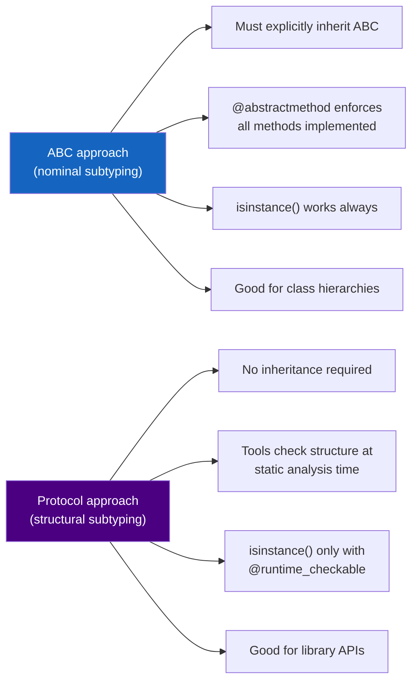

# :material-duck: Day 07 — ABCs & Protocols (Duck Typing)

!!! abstract "At a Glance"
    **Goal:** Understand Python's two approaches to interface definition: nominal (ABC) and structural (Protocol).
    **C++ Equivalent:** Pure virtual classes (nominal) vs C++20 Concepts (structural).

<div class="grid cards" markdown>

- :material-lightbulb-on: **Core Concept** — Duck typing: if it has the right methods, it works
- :material-snake: **Python Way** — `ABC` for explicit contracts; `Protocol` for implicit structural matching
- :material-alert: **Watch Out** — `Protocol` does NOT require inheritance — any class with the right methods qualifies
- :material-check-circle: **When to Use** — `ABC` for hierarchies; `Protocol` for functions/APIs accepting many types

</div>

## :material-lightbulb-on: Intuition

!!! info "Core Idea"
    "If it walks like a duck and quacks like a duck, it's a duck." Python does not require
    explicit declarations of interface conformance. A function that calls `obj.draw()` will
    work with any object that has a `draw` method — regardless of its class hierarchy.

!!! success "Two Python Interface Strategies"
    | Strategy | Mechanism | C++ Analogy | `isinstance` works? |
    |---|---|---|---|
    | Duck typing | Just write the method | Templates (implicit) | No (unless ABC registered) |
    | Nominal (ABC) | `class Foo(MyABC):` | Pure virtual inheritance | Yes |
    | Structural (Protocol) | Methods match structure | C++20 Concepts | Yes (if `runtime_checkable`) |

## :material-chart-timeline: ABC vs Protocol Comparison



## :material-book-open-variant: Abstract Base Classes

```python
from abc import ABC, abstractmethod
from typing import Iterator

class Shape(ABC):
    """Abstract base class — cannot be instantiated directly."""

    @abstractmethod
    def area(self) -> float:
        """Subclasses MUST implement this."""
        ...

    @abstractmethod
    def perimeter(self) -> float:
        ...

    # Concrete method — provided to all subclasses
    def describe(self) -> str:
        return f"{type(self).__name__}: area={self.area():.2f}, perimeter={self.perimeter():.2f}"

    @classmethod
    @abstractmethod
    def from_dict(cls, d: dict) -> "Shape":
        """Abstract classmethod — subclasses must implement."""
        ...

class Circle(Shape):
    import math as _math

    def __init__(self, radius: float) -> None:
        self.radius = radius

    def area(self) -> float:
        return self._math.pi * self.radius ** 2

    def perimeter(self) -> float:
        return 2 * self._math.pi * self.radius

    @classmethod
    def from_dict(cls, d: dict) -> "Circle":
        return cls(d["radius"])

class Rectangle(Shape):
    def __init__(self, width: float, height: float) -> None:
        self.width = width
        self.height = height

    def area(self) -> float:
        return self.width * self.height

    def perimeter(self) -> float:
        return 2 * (self.width + self.height)

    @classmethod
    def from_dict(cls, d: dict) -> "Rectangle":
        return cls(d["width"], d["height"])

# Shape()           # TypeError: Can't instantiate abstract class Shape
c = Circle(5.0)
r = Rectangle(3.0, 4.0)
shapes: list[Shape] = [c, r]
for s in shapes:
    print(s.describe())

print(isinstance(c, Shape))   # True
```

## :material-protocol: Protocols (Structural Subtyping)

```python
from typing import Protocol, runtime_checkable

@runtime_checkable
class Drawable(Protocol):
    """Structural protocol — any class with draw() qualifies."""

    def draw(self) -> None: ...

class DrawableSized(Protocol):
    """Protocol with multiple methods."""

    def draw(self) -> None: ...
    def bounding_box(self) -> tuple[float, float, float, float]: ...

# These classes do NOT inherit from Drawable!
class Circle:
    def __init__(self, x: float, y: float, r: float) -> None:
        self.x, self.y, self.r = x, y, r

    def draw(self) -> None:
        print(f"Drawing circle at ({self.x}, {self.y}) r={self.r}")

class Button:
    def __init__(self, label: str) -> None:
        self.label = label

    def draw(self) -> None:
        print(f"Drawing button: {self.label}")

class NonDrawable:
    def render(self) -> None:   # different method name
        print("rendering")

# Works with any Drawable (structural check by type checker)
def render_all(items: list[Drawable]) -> None:
    for item in items:
        item.draw()

render_all([Circle(0, 0, 5), Button("OK")])   # works!

# runtime_checkable enables isinstance checks
print(isinstance(Circle(0, 0, 5), Drawable))  # True
print(isinstance(NonDrawable(), Drawable))     # False
```

!!! warning "Protocol isinstance is shallow"
    `@runtime_checkable` Protocol `isinstance` checks only verify the **presence** of methods,
    not their signatures. A class with a `draw` attribute that is a string (not callable) would
    still pass `isinstance(obj, Drawable)`. Static type checkers (mypy, pyright) do full
    signature checking.

## :material-library: `collections.abc` Protocols

```python
from collections.abc import (
    Iterable,      # __iter__
    Iterator,      # __iter__ + __next__
    Sequence,      # __getitem__ + __len__
    Mapping,       # __getitem__ + __iter__ + __len__
    MutableMapping,
    Callable,      # __call__
    Hashable,      # __hash__
    Sized,         # __len__
    Container,     # __contains__
)

# Type hints using ABCs (accept any conforming type)
def process(items: Iterable[int]) -> list[int]:
    return [x * 2 for x in items]

process([1, 2, 3])           # list — OK
process((1, 2, 3))           # tuple — OK
process(range(5))             # range — OK
process({1, 2, 3})           # set — OK

def lookup(mapping: Mapping[str, int], key: str) -> int:
    return mapping.get(key, 0)

lookup({"a": 1}, "a")        # dict — OK
```

## :material-compare: When to Use ABC vs Protocol

| Situation | Use |
|---|---|
| Defining a class hierarchy (IS-A) | `ABC` |
| Third-party classes need to conform | `Protocol` (no inheritance required) |
| `isinstance` checks at runtime | `ABC` or `@runtime_checkable Protocol` |
| Function accepting many unrelated types | `Protocol` |
| Enforcing abstract methods in subclasses | `ABC` + `@abstractmethod` |
| Type-checking without runtime overhead | `Protocol` |
| Plugin system with explicit registration | `ABC.register()` |

## :material-alert: Common Pitfalls

!!! warning "Forgetting `@abstractmethod` makes a non-abstract method"
    ```python
    class MyABC(ABC):
        def process(self):    # NOT abstract — has a default implementation
            pass              # Subclasses can be instantiated without overriding this!

        @abstractmethod
        def required(self):   # THIS is abstract
            ...
    ```

!!! danger "Protocol does not enforce at runtime"
    ```python
    from typing import Protocol

    class Printable(Protocol):
        def to_str(self) -> str: ...

    def print_it(p: Printable) -> None:
        print(p.to_str())

    class Broken:
        pass   # no to_str method

    print_it(Broken())   # mypy error, but runs at runtime and raises AttributeError!
    # Protocol is only checked by the type checker, not Python itself.
    ```

## :material-help-circle: Flashcards

???+ question "What is the difference between `ABC` and `Protocol`?"
    `ABC` (Abstract Base Class) uses **nominal subtyping** — a class must explicitly inherit from
    the ABC to conform. `Protocol` uses **structural subtyping** — any class with the required
    methods conforms, regardless of inheritance. `ABC` enforces contracts at class-definition time
    via `@abstractmethod`. `Protocol` contracts are checked by static type tools only.

???+ question "What does `@runtime_checkable` do to a Protocol?"
    It enables `isinstance(obj, MyProtocol)` at runtime. Without it, `isinstance` raises
    `TypeError`. The check only verifies that the required method *names* exist (not their
    signatures or return types). It is a shallow structural check — use it for simple guards,
    but rely on the type checker for full structural validation.

???+ question "Can you use `ABC.register()` for virtual subclasses?"
    Yes. `ABC.register(ThirdPartyClass)` makes `isinstance(obj, MyABC)` return `True` for
    `ThirdPartyClass` instances without modifying `ThirdPartyClass`. This is how
    `collections.abc.Sequence.register(tuple)` works — `isinstance((), Sequence)` is `True`
    even though `tuple` does not inherit from `Sequence`.

???+ question "What is the Liskov Substitution Principle and how does it apply to Python?"
    LSP states that objects of a subclass must be usable wherever the base class is expected,
    without breaking correctness. In Python: if `Dog` is a subclass of `Animal`, any code
    that works with `Animal` must work with `Dog`. Violating LSP (e.g., raising exceptions
    in overridden methods) is a design smell. `Protocol` enforces structural LSP at the type level.

## :material-clipboard-check: Self Test

=== "Question 1"
    Design a `Sortable` Protocol and a function that sorts any collection of `Sortable` items.

=== "Answer 1"
    ```python
    from typing import Protocol, TypeVar

    T = TypeVar("T", bound="Sortable")

    class Sortable(Protocol):
        def __lt__(self, other: "Sortable") -> bool: ...

    def sort_items(items: list[T]) -> list[T]:
        return sorted(items)

    # Works with any class that has __lt__
    sort_items([3, 1, 2])          # [1, 2, 3]
    sort_items(["banana", "apple"])  # ["apple", "banana"]
    ```

=== "Question 2"
    What is the difference between `Iterable[T]` and `Iterator[T]` from `collections.abc`?

=== "Answer 2"
    `Iterable[T]` requires only `__iter__(self) -> Iterator[T]` — you can call `iter()` on it.
    Lists, tuples, sets, dicts, strings are all `Iterable`.

    `Iterator[T]` requires both `__iter__` and `__next__` — it tracks position and yields one
    value at a time. An `Iterator` is also an `Iterable` (its `__iter__` returns `self`).

    Key distinction: you can iterate an `Iterable` multiple times (get a fresh iterator each time).
    An `Iterator` is stateful — once exhausted, it raises `StopIteration` and cannot be reset.

## :material-check-circle: Summary

!!! success "Key Takeaways"
    - Duck typing: Python checks for method presence at runtime, not class hierarchy.
    - `ABC` + `@abstractmethod` enforces nominal contracts; subclasses must explicitly inherit.
    - `Protocol` (PEP 544) enables structural subtyping — any matching class qualifies without inheritance.
    - `@runtime_checkable` enables `isinstance` checks for Protocols (shallow, method-name only).
    - `collections.abc` provides standard Protocols: `Iterable`, `Sequence`, `Mapping`, `Callable`, etc.
    - Use `ABC` for class hierarchies; use `Protocol` for library APIs that accept many unrelated types.
