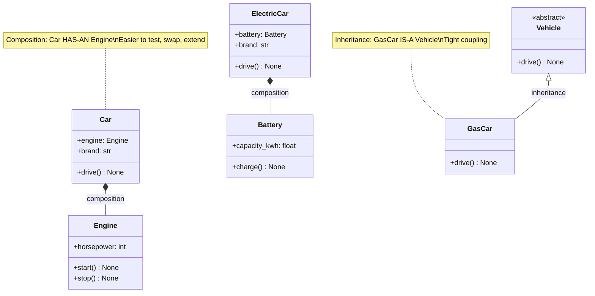

# :material-shape-plus: Day 08 — Advanced OOP Patterns

!!! abstract "Day at a Glance"
    **Goal:** Master advanced OOP mechanics — dunder hooks, operator overloading, callable objects, and memory-efficient `__slots__`.
    **C++ Equivalent:** Day 08 of Learn-Modern-CPP-OOP-30-Days (operator overloading, friend functions, templates)
    **Estimated Time:** 60–90 minutes

<div class="grid cards" markdown>
- :material-lightbulb-on: **Core Concept** — Python exposes almost every runtime behaviour through dunder methods
- :material-snake: **Python Way** — prefer composition and protocol hooks over rigid inheritance hierarchies
- :material-alert: **Watch Out** — `__getattribute__` is called on *every* attribute access; infinite recursion is easy
- :material-check-circle: **By End of Day** — build fully operator-overloaded types, callable objects, and slot-optimised classes
</div>

## :material-lightbulb-on: Intuition

!!! info "Core Idea"
    Python's data model is a collection of *protocols*: sets of dunder methods that the interpreter calls in well-defined situations.
    When you write `a + b`, Python calls `a.__add__(b)` (and falls back to `b.__radd__(a)` if that returns `NotImplemented`).
    This single mechanism powers numbers, strings, containers, and every third-party numeric tower.

!!! success "Python vs C++"
    | Python | C++ |
    |--------|-----|
    | `__add__` / `__radd__` | `operator+` / `friend operator+` |
    | `__lt__`, `@functools.total_ordering` | `operator<`, `<=>` spaceship |
    | `__call__` | `operator()` (functor) |
    | `__slots__` | struct with fixed members |
    | Composition via attribute | private member + delegation |
    | `__init_subclass__` | CRTP base |
    | `__class_getitem__` | `template<>` specialisation hint |

## :material-family-tree: Class Diagram — Composition vs Inheritance



## :material-book-open-variant: Lesson

### Composition Over Inheritance

Inheritance models *is-a* relationships; composition models *has-a*.
Prefer composition when you want to swap behaviour at runtime or avoid deep hierarchies.

```python
# ---- BAD: inheritance just to reuse code ----
class LoggingList(list):
    def append(self, item):
        print(f"appending {item!r}")
        super().append(item)

# ---- GOOD: composition via delegation ----
class LoggingList:
    def __init__(self):
        self._data: list = []

    def append(self, item):
        print(f"appending {item!r}")
        self._data.append(item)

    def __len__(self):
        return len(self._data)

    def __iter__(self):
        return iter(self._data)
```

### Attribute Access Hooks

| Dunder | Called when |
|--------|-------------|
| `__getattr__` | attribute NOT found by normal means |
| `__getattribute__` | every attribute access (use with care) |
| `__setattr__` | any assignment `obj.x = v` |
| `__delattr__` | `del obj.x` |

```python
class Proxy:
    """Transparent proxy that logs every get/set."""

    def __init__(self, target):
        # Bypass __setattr__ by writing directly to __dict__
        object.__setattr__(self, "_target", target)

    def __getattr__(self, name: str):
        # Only called when normal lookup fails
        return getattr(object.__getattribute__(self, "_target"), name)

    def __setattr__(self, name: str, value):
        print(f"SET {name} = {value!r}")
        setattr(object.__getattribute__(self, "_target"), name, value)


class Point:
    def __init__(self, x, y):
        self.x = x
        self.y = y


p = Proxy(Point(1, 2))
p.x = 99  # prints: SET x = 99
print(p.x)  # 99
```

### `__init_subclass__` — Hook Every Subclass

```python
class Plugin:
    _registry: dict[str, type] = {}

    def __init_subclass__(cls, name: str = "", **kwargs):
        super().__init_subclass__(**kwargs)
        key = name or cls.__name__.lower()
        Plugin._registry[key] = cls
        print(f"Registered plugin: {key!r}")


class CSVPlugin(Plugin, name="csv"):
    def run(self): ...

class JSONPlugin(Plugin, name="json"):
    def run(self): ...

print(Plugin._registry)
# {'csv': <class 'CSVPlugin'>, 'json': <class 'JSONPlugin'>}
```

### `__class_getitem__` — Generic Syntax Support

```python
class MyContainer:
    def __class_getitem__(cls, item):
        # item is whatever is inside []
        return f"{cls.__name__}[{item.__name__}]"

hint = MyContainer[int]   # "MyContainer[int]"
```

### Operator Overloading — `Vector2D`

```python
from __future__ import annotations
import math
from functools import total_ordering


@total_ordering          # only need __eq__ + one comparison
class Vector2D:
    __slots__ = ("x", "y")   # no __dict__, ~40 % less memory per instance

    def __init__(self, x: float, y: float) -> None:
        self.x = x
        self.y = y

    # ---- representation ----
    def __repr__(self) -> str:
        return f"Vector2D({self.x}, {self.y})"

    # ---- arithmetic ----
    def __add__(self, other: Vector2D) -> Vector2D:
        return Vector2D(self.x + other.x, self.y + other.y)

    def __sub__(self, other: Vector2D) -> Vector2D:
        return Vector2D(self.x - other.x, self.y - other.y)

    def __mul__(self, scalar: float) -> Vector2D:
        return Vector2D(self.x * scalar, self.y * scalar)

    def __rmul__(self, scalar: float) -> Vector2D:
        # Allows: 3 * v  (int.__mul__ returns NotImplemented for Vector2D)
        return self.__mul__(scalar)

    def __neg__(self) -> Vector2D:
        return Vector2D(-self.x, -self.y)

    def __abs__(self) -> float:
        return math.hypot(self.x, self.y)

    # ---- container-like ----
    def __len__(self) -> int:
        return 2

    def __contains__(self, value: float) -> bool:
        return value in (self.x, self.y)

    def __iter__(self):
        yield self.x
        yield self.y

    # ---- comparison ----
    def __eq__(self, other: object) -> bool:
        if not isinstance(other, Vector2D):
            return NotImplemented
        return (self.x, self.y) == (other.x, other.y)

    def __lt__(self, other: Vector2D) -> bool:
        return abs(self) < abs(other)

    # ---- bool / hash ----
    def __bool__(self) -> bool:
        return bool(self.x or self.y)

    def __hash__(self):
        return hash((self.x, self.y))


# --- demo ---
v1 = Vector2D(3, 4)
v2 = Vector2D(1, 2)

print(v1 + v2)        # Vector2D(4, 6)
print(3 * v1)         # Vector2D(9, 12)
print(abs(v1))        # 5.0
print(0 in v1)        # False
print(3 in v1)        # True
print(v1 > v2)        # True  (total_ordering)
print(list(v1))       # [3, 4]
```

### `__call__` — Callable Objects

```python
from typing import Callable, Any


class CallableRegistry:
    """A registry where each entry is a callable object."""

    def __init__(self, name: str) -> None:
        self.name = name
        self._call_count = 0

    def __call__(self, *args: Any, **kwargs: Any) -> str:
        self._call_count += 1
        return f"[{self.name}] called {self._call_count}x with args={args}"

    def __repr__(self) -> str:
        return f"<Handler name={self.name!r} calls={self._call_count}>"


handler = CallableRegistry("auth")
print(handler("user", role="admin"))   # [auth] called 1x with args=('user',)
print(handler("guest"))                # [auth] called 2x with args=('guest',)
print(callable(handler))              # True
```

### `__slots__` — Memory Efficiency

```python
import sys

class PointDict:          # default: uses __dict__
    def __init__(self, x, y):
        self.x = x
        self.y = y

class PointSlots:         # slots: no __dict__
    __slots__ = ("x", "y")
    def __init__(self, x, y):
        self.x = x
        self.y = y

pd = PointDict(1.0, 2.0)
ps = PointSlots(1.0, 2.0)

print(sys.getsizeof(pd.__dict__))   # ~232 bytes
# ps has no __dict__ — savings are significant at scale
print(hasattr(ps, "__dict__"))      # False
print(hasattr(pd, "__dict__"))      # True
```

## :material-alert: Common Pitfalls

!!! warning "Infinite recursion in `__getattribute__`"
    Never access `self.anything` inside `__getattribute__` — it calls itself.
    Always delegate to `object.__getattribute__(self, name)`.

    ```python
    # WRONG
    def __getattribute__(self, name):
        print(self._log)   # RecursionError!
        return super().__getattribute__(name)

    # RIGHT
    def __getattribute__(self, name):
        print(object.__getattribute__(self, "_log"))
        return object.__getattribute__(self, name)
    ```

!!! danger "`__slots__` and inheritance"
    If a parent class does NOT define `__slots__`, the subclass still gets `__dict__`.
    All classes in the MRO must define `__slots__` for full savings.

    ```python
    class Base:           # no __slots__ → has __dict__
        pass

    class Child(Base):
        __slots__ = ("x",)

    c = Child()
    c.anything = 99       # works — __dict__ inherited from Base!
    ```

!!! warning "Forgetting `__radd__` / `__rmul__`"
    `3 * v` calls `int.__mul__(3, v)` first; when that returns `NotImplemented`,
    Python tries `v.__rmul__(3)`. Without `__rmul__`, you get `TypeError`.

## :material-help-circle: Flashcards

???+ question "Q1 — When is `__getattr__` called vs `__getattribute__`?"
    `__getattribute__` is called on *every* attribute access.
    `__getattr__` is only called when the normal lookup mechanism (via `__getattribute__`) raises `AttributeError`.
    Use `__getattr__` for fallback behaviour; avoid overriding `__getattribute__` unless absolutely necessary.

???+ question "Q2 — What does `@total_ordering` do?"
    It auto-generates the missing comparison methods (`__le__`, `__gt__`, `__ge__`) from the two you provide (`__eq__` and one of `__lt__`, `__le__`, `__gt__`, `__ge__`). Saves you writing six near-identical methods.

???+ question "Q3 — Why use `__slots__`?"
    It replaces the per-instance `__dict__` with a compact fixed-size array of slot descriptors. For classes with many small instances (e.g. particles, vertices) this can cut memory by 40–50 % and speed up attribute access slightly.

???+ question "Q4 — What is `__init_subclass__` used for?"
    It is called on the *base class* whenever a new subclass is created. Common uses: plugin registration, enforcing naming conventions, auto-populating class-level metadata, and framework hooks — all without a metaclass.

## :material-clipboard-check: Self Test

=== "Question 1"
    Write a `Money` class that supports `+`, `-`, `*` (scalar), `==`, and `<`.
    It should store `amount: float` and `currency: str`.
    Guard against adding different currencies.

=== "Answer 1"
    ```python
    from __future__ import annotations
    from functools import total_ordering

    @total_ordering
    class Money:
        __slots__ = ("amount", "currency")

        def __init__(self, amount: float, currency: str = "USD"):
            self.amount = amount
            self.currency = currency

        def _check(self, other: Money):
            if self.currency != other.currency:
                raise ValueError(f"Cannot mix {self.currency} and {other.currency}")

        def __add__(self, other: Money) -> Money:
            self._check(other)
            return Money(self.amount + other.amount, self.currency)

        def __sub__(self, other: Money) -> Money:
            self._check(other)
            return Money(self.amount - other.amount, self.currency)

        def __mul__(self, scalar: float) -> Money:
            return Money(self.amount * scalar, self.currency)

        __rmul__ = __mul__

        def __eq__(self, other: object) -> bool:
            if not isinstance(other, Money):
                return NotImplemented
            return self.currency == other.currency and self.amount == other.amount

        def __lt__(self, other: Money) -> bool:
            self._check(other)
            return self.amount < other.amount

        def __repr__(self) -> str:
            return f"Money({self.amount:.2f}, {self.currency!r})"

    a = Money(10)
    b = Money(5)
    print(a + b)     # Money(15.00, 'USD')
    print(2 * a)     # Money(20.00, 'USD')
    print(a > b)     # True
    ```

=== "Question 2"
    What is printed?
    ```python
    class A:
        def __init_subclass__(cls, tag="", **kw):
            super().__init_subclass__(**kw)
            print(f"subclass: {cls.__name__}, tag={tag!r}")

    class B(A, tag="beta"): pass
    class C(A): pass
    ```

=== "Answer 2"
    ```
    subclass: B, tag='beta'
    subclass: C, tag=''
    ```
    `__init_subclass__` fires at *class definition time*, not at instantiation.

## :material-check-circle: Summary

!!! success "Key Takeaways"
    - Composition (has-a) is usually more flexible than deep inheritance (is-a)
    - `__getattr__` is a safe fallback; `__getattribute__` intercepts everything — use carefully
    - `__init_subclass__` enables plugin/registry patterns without metaclasses
    - `__class_getitem__` powers `MyClass[int]` generic hint syntax
    - Implement `__add__` + `__radd__` pairs so both `a + 3` and `3 + a` work
    - `__call__` turns any instance into a first-class callable
    - `__slots__` eliminates `__dict__` for significant memory savings in value-type classes
    - `@total_ordering` generates all six comparison methods from just two
