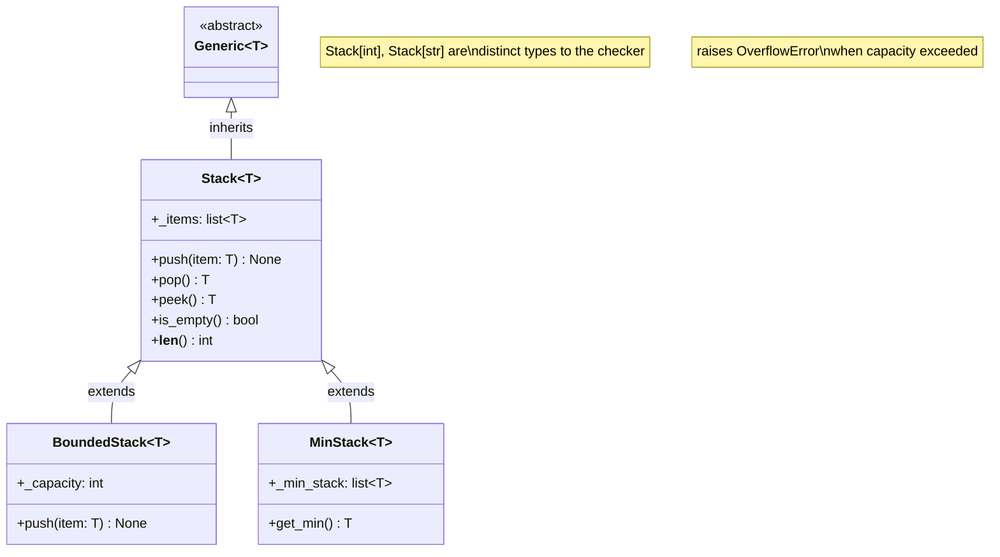

# :material-variable-box: Day 09 — Generics & TypeVar

!!! abstract "Day at a Glance"
    **Goal:** Write reusable, fully type-safe generic classes and functions using `TypeVar`, `Generic[T]`, bounded TypeVar, `ParamSpec`, and `typing.overload`.
    **C++ Equivalent:** Day 09 of Learn-Modern-CPP-OOP-30-Days (`template<typename T>`, `std::stack<T>`, SFINAE bounds)
    **Estimated Time:** 60–90 minutes

<div class="grid cards" markdown>
- :material-lightbulb-on: **Core Concept** — `TypeVar` is a placeholder that type-checkers substitute at every call-site
- :material-snake: **Python Way** — `class Stack(Generic[T])` gives you the same ergonomics as `std::stack<T>` with zero runtime cost
- :material-alert: **Watch Out** — generics are *erased* at runtime; `isinstance(x, Stack[int])` is a `TypeError`
- :material-check-circle: **By End of Day** — write typed generic containers, bounded sort utilities, and multi-signature overloads
</div>

## :material-lightbulb-on: Intuition

!!! info "Core Idea"
    A `TypeVar` is a *variable over types* — a symbol that a static type-checker (mypy, pyright) replaces with a concrete type whenever it analyses a call.
    At runtime, `T = TypeVar('T')` is just a regular object; the generic machinery exists entirely in the type-checking layer.
    `Generic[T]` tells the type-checker that a class is parameterised by `T`, enabling it to track `Stack[int]` and `Stack[str]` as distinct types.

!!! success "Python vs C++"
    | Python | C++ |
    |--------|-----|
    | `T = TypeVar('T')` | `typename T` |
    | `class Stack(Generic[T])` | `template<typename T> class Stack` |
    | `T = TypeVar('T', bound=Comparable)` | `template<typename T> requires Comparable<T>` (C++20) |
    | `Pair[A, B]` | `std::pair<A, B>` |
    | `typing.overload` | function overloading |
    | `ParamSpec` | `template<typename... Args>` (signature-level) |
    | Type erasure at runtime | No erasure — types present at compile time |

## :material-family-tree: Generic Stack Hierarchy



## :material-book-open-variant: Lesson

### TypeVar Basics

```python
from typing import TypeVar

# Unconstrained: T can be ANY type
T = TypeVar("T")

# Constrained: T must be exactly int OR str (no subtypes)
IntOrStr = TypeVar("IntOrStr", int, str)

# Bounded: T must be a subtype of Comparable (duck-typed)
from typing import Protocol

class Comparable(Protocol):
    def __lt__(self, other) -> bool: ...

C = TypeVar("C", bound=Comparable)
```

### `Generic[T]` — Fully Typed Stack

```python
from __future__ import annotations
from typing import Generic, TypeVar, Iterator

T = TypeVar("T")


class Stack(Generic[T]):
    """LIFO stack, fully type-safe."""

    def __init__(self) -> None:
        self._items: list[T] = []

    def push(self, item: T) -> None:
        self._items.append(item)

    def pop(self) -> T:
        if self.is_empty():
            raise IndexError("pop from empty stack")
        return self._items.pop()

    def peek(self) -> T:
        if self.is_empty():
            raise IndexError("peek at empty stack")
        return self._items[-1]

    def is_empty(self) -> bool:
        return len(self._items) == 0

    def __len__(self) -> int:
        return len(self._items)

    def __iter__(self) -> Iterator[T]:
        return reversed(self._items)  # top → bottom

    def __repr__(self) -> str:
        return f"Stack({self._items!r})"


# Type-checker knows each Stack is monomorphic
int_stack: Stack[int] = Stack()
int_stack.push(1)
int_stack.push(2)
print(int_stack.peek())   # 2
print(len(int_stack))     # 2

str_stack: Stack[str] = Stack()
str_stack.push("hello")
# str_stack.push(42)      # mypy error: Argument 1 has incompatible type "int"
```

### Bounded TypeVar — Generic Sort

```python
from typing import TypeVar, Protocol
from functools import total_ordering


class SupportsLT(Protocol):
    def __lt__(self, other) -> bool: ...


C = TypeVar("C", bound=SupportsLT)


def top_n(items: list[C], n: int) -> list[C]:
    """Return the n largest items. Works for any type with __lt__."""
    return sorted(items, reverse=True)[:n]


print(top_n([3, 1, 4, 1, 5, 9, 2, 6], 3))    # [9, 6, 5]
print(top_n(["banana", "apple", "cherry"], 2)) # ['cherry', 'banana']
```

### Generic `Queue[T]`

```python
from collections import deque
from typing import Generic, TypeVar, Iterator

T = TypeVar("T")


class Queue(Generic[T]):
    """FIFO queue."""

    def __init__(self) -> None:
        self._data: deque[T] = deque()

    def enqueue(self, item: T) -> None:
        self._data.append(item)

    def dequeue(self) -> T:
        if not self._data:
            raise IndexError("dequeue from empty queue")
        return self._data.popleft()

    def __len__(self) -> int:
        return len(self._data)

    def __repr__(self) -> str:
        return f"Queue({list(self._data)!r})"


q: Queue[str] = Queue()
q.enqueue("first")
q.enqueue("second")
print(q.dequeue())   # 'first'
```

### `Pair[A, B]` — Two Type Parameters

```python
from typing import Generic, TypeVar

A = TypeVar("A")
B = TypeVar("B")


class Pair(Generic[A, B]):
    """An immutable ordered pair."""

    def __init__(self, first: A, second: B) -> None:
        self.first = first
        self.second = second

    def swap(self) -> "Pair[B, A]":
        return Pair(self.second, self.first)

    def __repr__(self) -> str:
        return f"Pair({self.first!r}, {self.second!r})"


p: Pair[str, int] = Pair("age", 30)
print(p)          # Pair('age', 30)
print(p.swap())   # Pair(30, 'age')
```

### `BoundedStack[T]` — Subclassing Generic

```python
class BoundedStack(Stack[T]):
    """Stack with a maximum capacity."""

    def __init__(self, capacity: int) -> None:
        super().__init__()
        self._capacity = capacity

    def push(self, item: T) -> None:
        if len(self) >= self._capacity:
            raise OverflowError(f"Stack is full (capacity={self._capacity})")
        super().push(item)


bs: BoundedStack[int] = BoundedStack(3)
bs.push(1)
bs.push(2)
bs.push(3)
try:
    bs.push(4)
except OverflowError as e:
    print(e)   # Stack is full (capacity=3)
```

### `typing.overload` — Multiple Signatures

```python
from typing import overload


@overload
def process(value: int) -> str: ...          # signature 1
@overload
def process(value: str) -> int: ...          # signature 2

def process(value):                           # actual implementation
    if isinstance(value, int):
        return str(value)
    return len(value)


result_a: str = process(42)      # checker knows this returns str
result_b: int = process("hi")    # checker knows this returns int
print(result_a, result_b)        # '42'  2
```

### `ParamSpec` — Preserve Callable Signatures

```python
from typing import Callable, TypeVar, ParamSpec
import functools

P = ParamSpec("P")
R = TypeVar("R")


def log_call(fn: Callable[P, R]) -> Callable[P, R]:
    """Decorator that preserves the wrapped function's full signature."""
    @functools.wraps(fn)
    def wrapper(*args: P.args, **kwargs: P.kwargs) -> R:
        print(f"calling {fn.__name__}")
        return fn(*args, **kwargs)
    return wrapper


@log_call
def add(x: int, y: int) -> int:
    return x + y

# Type-checker knows add(x=1, y=2) is valid and returns int
print(add(1, 2))   # calling add → 3
```

### Runtime Behaviour of Generics

```python
from typing import get_args, get_origin

print(Stack[int])                        # __main__.Stack[int]
print(get_origin(Stack[int]))            # <class '__main__.Stack'>
print(get_args(Stack[int]))              # (<class 'int'>,)

# Generic classes are NOT usable with isinstance at runtime
s = Stack()
print(isinstance(s, Stack))             # True
# isinstance(s, Stack[int])             # TypeError!
```

## :material-alert: Common Pitfalls

!!! warning "TypeVar name must match variable name"
    ```python
    # WRONG — the string arg doesn't match the variable
    T = TypeVar("S")    # mypy will warn about this

    # RIGHT
    T = TypeVar("T")
    ```

!!! danger "Generic type erasure at runtime"
    ```python
    from typing import Generic, TypeVar
    T = TypeVar("T")

    class Box(Generic[T]):
        def __init__(self, value: T): self.value = value

    b = Box(42)
    # This is always True regardless of T — types are erased
    print(isinstance(b, Box))         # True
    # isinstance(b, Box[int])         # TypeError at runtime!
    ```

!!! warning "Constrained TypeVar vs bounded TypeVar"
    - `T = TypeVar('T', int, str)` — T is *exactly* int or str (union constraint, no subtypes)
    - `T = TypeVar('T', bound=Number)` — T is any *subtype* of Number
    Use bounds for "any comparable" patterns; use constraints for true unions.

## :material-help-circle: Flashcards

???+ question "Q1 — What is the difference between a constrained and a bounded TypeVar?"
    A **constrained** TypeVar (`TypeVar('T', int, str)`) restricts T to *exactly* one of the listed types.
    A **bounded** TypeVar (`TypeVar('T', bound=Base)`) allows T to be `Base` *or any subclass* of it.
    Use bounds when you need polymorphism; use constraints when you need an exact union.

???+ question "Q2 — Are generics enforced at runtime in Python?"
    No. Python's generics are *type-erased*: `Stack[int]` and `Stack[str]` are the same class object at runtime. The parameterisation exists only for static type-checkers (mypy, pyright). You cannot use `isinstance(x, Stack[int])`.

???+ question "Q3 — Why is `ParamSpec` needed?"
    `TypeVar` captures a single type, but it cannot capture a *callable's parameter list*. `ParamSpec` captures both `*args` types and `**kwargs` types as a unit, so decorators can preserve the full signature of the wrapped function for the type-checker.

???+ question "Q4 — What does `typing.overload` actually generate at runtime?"
    Nothing useful — the last non-`@overload` definition wins and replaces all overloaded stubs. `@overload` annotations exist purely so type-checkers can resolve different return types for different argument patterns. Always provide an implementation without `@overload` as the final definition.

## :material-clipboard-check: Self Test

=== "Question 1"
    Implement a generic `MinStack[T]` that supports `push`, `pop`, `peek`, and `get_min` in O(1) time. `T` must be bounded to `SupportsLT`.

=== "Answer 1"
    ```python
    from typing import TypeVar, Protocol

    class SupportsLT(Protocol):
        def __lt__(self, other) -> bool: ...

    T = TypeVar("T", bound=SupportsLT)


    class MinStack(Stack[T]):
        def __init__(self) -> None:
            super().__init__()
            self._min: list[T] = []

        def push(self, item: T) -> None:
            super().push(item)
            if not self._min or item <= self._min[-1]:
                self._min.append(item)

        def pop(self) -> T:
            item = super().pop()
            if self._min and item == self._min[-1]:
                self._min.pop()
            return item

        def get_min(self) -> T:
            if not self._min:
                raise IndexError("empty stack")
            return self._min[-1]


    ms: MinStack[int] = MinStack()
    for n in [5, 3, 7, 2, 8]:
        ms.push(n)
    print(ms.get_min())   # 2
    ms.pop(); ms.pop()
    print(ms.get_min())   # 3
    ```

=== "Question 2"
    What is the output?
    ```python
    from typing import TypeVar, Generic
    T = TypeVar("T")

    class Box(Generic[T]):
        pass

    print(Box[int] is Box[str])
    print(Box[int] is Box[int])
    ```

=== "Answer 2"
    ```
    False
    True
    ```
    Python caches parameterised generics, so `Box[int]` always returns the same object, but `Box[int]` and `Box[str]` are distinct `_GenericAlias` objects.

## :material-check-circle: Summary

!!! success "Key Takeaways"
    - `TypeVar` is a type-level variable; it exists only for static analysis — no runtime cost
    - `Generic[T]` declares a class is parameterised; subclasses pin `T` with concrete types
    - Bounded TypeVars (`bound=`) enable structural polymorphism without runtime overhead
    - Two-parameter generics use `Generic[A, B]`; subclasses can fix one or both
    - `typing.overload` gives different return types per argument pattern — implementation is the undecorated final definition
    - `ParamSpec` preserves a callable's full parameter signature through decorators
    - All generic parameterisation is erased at runtime — never use `isinstance` with parameterised types
