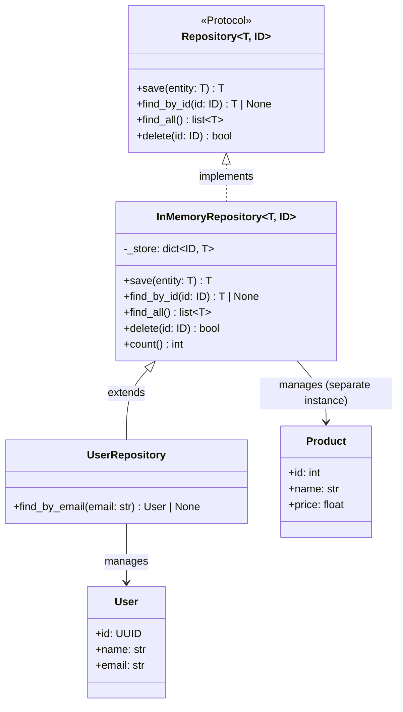

# :material-layers-triple: Day 11 — Generic OOP Design

!!! abstract "Day at a Glance"
    **Goal:** Apply generics to real design patterns — Repository, Result monad, generic event system, and Protocol-based generic observers.
    **C++ Equivalent:** Day 11 of Learn-Modern-CPP-OOP-30-Days (`std::expected<T,E>`, template classes, policy-based design)
    **Estimated Time:** 60–90 minutes

<div class="grid cards" markdown>
- :material-lightbulb-on: **Core Concept** — generic patterns encode structural contracts once and reuse them across all domain types
- :material-snake: **Python Way** — `Protocol` + `Generic[T]` gives you structural typing without explicit registration
- :material-alert: **Watch Out** — generic `Protocol` subclassing requires `Protocol` to appear *explicitly* in every Protocol's MRO
- :material-check-circle: **By End of Day** — implement `Repository[T, ID]`, `Result[T, E]` monad, and a typed event bus
</div>

## :material-lightbulb-on: Intuition

!!! info "Core Idea"
    Design patterns solve recurring structural problems. When combined with generics, they solve those problems *for any type*.
    A `Repository[User, UUID]` and a `Repository[Product, int]` share identical infrastructure code but are statically distinct types.
    The `Result[T, E]` monad replaces exception-based control flow with a value that is either a success (`Ok[T]`) or a failure (`Err[E]`), enabling safe chaining with `map` and `flat_map`.

!!! success "Python vs C++"
    | Python | C++ |
    |--------|-----|
    | `Repository[T, ID]` | `template<typename T, typename ID>` |
    | `Result[T, E]` | `std::expected<T, E>` (C++23) |
    | `Protocol` | `concept` (C++20) |
    | `Generic[T]` + `Protocol` | `template<typename T> requires ...` |
    | `EventBus[T]` | `std::function<void(T)>` with `std::vector` |
    | `map` / `flat_map` | `std::expected::transform` / `and_then` |

## :material-family-tree: Generic Repository Pattern



## :material-book-open-variant: Lesson

### Generic Repository Pattern

```python
from __future__ import annotations
from typing import Generic, TypeVar, Protocol, runtime_checkable
from uuid import UUID, uuid4
from dataclasses import dataclass, field

T = TypeVar("T")
ID = TypeVar("ID")


@runtime_checkable
class Repository(Protocol[T, ID]):
    """Abstract storage contract for any entity type."""

    def save(self, entity: T) -> T: ...
    def find_by_id(self, id: ID) -> T | None: ...
    def find_all(self) -> list[T]: ...
    def delete(self, id: ID) -> bool: ...


class InMemoryRepository(Generic[T, ID]):
    """Concrete in-memory implementation."""

    def __init__(self, id_getter) -> None:
        self._store: dict[ID, T] = {}
        self._id_getter = id_getter  # lambda entity: entity.id

    def save(self, entity: T) -> T:
        key: ID = self._id_getter(entity)
        self._store[key] = entity
        return entity

    def find_by_id(self, id: ID) -> T | None:
        return self._store.get(id)

    def find_all(self) -> list[T]:
        return list(self._store.values())

    def delete(self, id: ID) -> bool:
        return self._store.pop(id, None) is not None

    def count(self) -> int:
        return len(self._store)


# ---- domain models ----

@dataclass
class User:
    name: str
    email: str
    id: UUID = field(default_factory=uuid4)


@dataclass
class Product:
    name: str
    price: float
    id: int = 0


# ---- specialised repository ----

class UserRepository(InMemoryRepository[User, UUID]):
    def find_by_email(self, email: str) -> User | None:
        return next((u for u in self.find_all() if u.email == email), None)


# ---- usage ----

user_repo = UserRepository(id_getter=lambda u: u.id)
alice = user_repo.save(User("Alice", "alice@example.com"))
bob   = user_repo.save(User("Bob",   "bob@example.com"))

print(user_repo.count())                      # 2
print(user_repo.find_by_email("alice@example.com"))  # User(name='Alice', ...)
print(user_repo.delete(bob.id))               # True
print(user_repo.count())                      # 1

product_repo: InMemoryRepository[Product, int] = InMemoryRepository(lambda p: p.id)
product_repo.save(Product("Widget", 9.99, id=1))
print(product_repo.find_by_id(1))             # Product(name='Widget', ...)
```

### `Result[T, E]` — Railway-Oriented Programming

```python
from __future__ import annotations
from typing import Generic, TypeVar, Callable
from dataclasses import dataclass

T = TypeVar("T")
E = TypeVar("E")
U = TypeVar("U")


@dataclass(frozen=True)
class Ok(Generic[T]):
    value: T

    def is_ok(self) -> bool:  return True
    def is_err(self) -> bool: return False

    def map(self, fn: Callable[[T], U]) -> "Ok[U] | Err":
        return Ok(fn(self.value))

    def flat_map(self, fn: Callable[[T], "Result[U, E]"]) -> "Result[U, E]":
        return fn(self.value)

    def unwrap(self) -> T:
        return self.value

    def unwrap_or(self, default: T) -> T:
        return self.value

    def __repr__(self) -> str:
        return f"Ok({self.value!r})"


@dataclass(frozen=True)
class Err(Generic[E]):
    error: E

    def is_ok(self) -> bool:  return False
    def is_err(self) -> bool: return True

    def map(self, fn) -> "Err[E]":
        return self  # pass the error through unchanged

    def flat_map(self, fn) -> "Err[E]":
        return self

    def unwrap(self):
        raise ValueError(f"Called unwrap on Err: {self.error!r}")

    def unwrap_or(self, default):
        return default

    def __repr__(self) -> str:
        return f"Err({self.error!r})"


Result = Ok[T] | Err[E]


# ---- example pipeline ----

def parse_int(s: str) -> Ok[int] | Err[str]:
    try:
        return Ok(int(s))
    except ValueError:
        return Err(f"Cannot parse {s!r} as int")


def validate_positive(n: int) -> Ok[int] | Err[str]:
    if n > 0:
        return Ok(n)
    return Err(f"{n} is not positive")


def safe_sqrt(n: int) -> Ok[float] | Err[str]:
    import math
    return Ok(math.sqrt(n))


# Chained pipeline — no try/except needed
result = (
    parse_int("16")
    .flat_map(validate_positive)
    .flat_map(safe_sqrt)
    .map(lambda x: round(x, 2))
)
print(result)              # Ok(4.0)
print(result.unwrap())     # 4.0

bad = (
    parse_int("-5")
    .flat_map(validate_positive)
    .flat_map(safe_sqrt)
)
print(bad)                 # Err('-5 is not positive')
print(bad.unwrap_or(0.0))  # 0.0
```

### Generic Event System

```python
from __future__ import annotations
from typing import Generic, TypeVar, Callable
from dataclasses import dataclass
from datetime import datetime

E = TypeVar("E")
Handler = Callable[[E], None]


class EventBus(Generic[E]):
    """Type-safe single-event-type pub/sub."""

    def __init__(self) -> None:
        self._handlers: list[Handler[E]] = []

    def subscribe(self, handler: Handler[E]) -> None:
        self._handlers.append(handler)

    def unsubscribe(self, handler: Handler[E]) -> None:
        self._handlers.remove(handler)

    def publish(self, event: E) -> None:
        for h in self._handlers:
            h(event)


# ---- domain events ----

@dataclass
class UserCreated:
    user_id: str
    email: str
    timestamp: datetime = None

    def __post_init__(self):
        if self.timestamp is None:
            self.timestamp = datetime.now()


@dataclass
class OrderPlaced:
    order_id: str
    amount: float


# Separate buses per event type — fully type-safe
user_bus: EventBus[UserCreated] = EventBus()
order_bus: EventBus[OrderPlaced] = EventBus()

# Handlers
def send_welcome_email(event: UserCreated) -> None:
    print(f"Sending welcome email to {event.email}")

def log_order(event: OrderPlaced) -> None:
    print(f"Order {event.order_id} placed: ${event.amount:.2f}")

user_bus.subscribe(send_welcome_email)
order_bus.subscribe(log_order)

user_bus.publish(UserCreated("u1", "alice@example.com"))
order_bus.publish(OrderPlaced("o42", 129.99))
```

### Generic Observer with `Protocol`

```python
from typing import Protocol, Generic, TypeVar

E = TypeVar("E", covariant=True)


class Observer(Protocol[E]):
    def on_event(self, event: E) -> None: ...


class Subject(Generic[E]):
    def __init__(self) -> None:
        self._observers: list[Observer[E]] = []

    def attach(self, obs: Observer[E]) -> None:
        self._observers.append(obs)

    def notify(self, event: E) -> None:
        for obs in self._observers:
            obs.on_event(event)


# Any class with on_event satisfies Observer — no explicit inheritance
class Logger:
    def on_event(self, event: object) -> None:
        print(f"[LOG] {event}")


class AlertSystem:
    def on_event(self, event: str) -> None:
        if "ERROR" in event:
            print(f"[ALERT] {event}")


bus: Subject[str] = Subject()
bus.attach(Logger())
bus.attach(AlertSystem())
bus.notify("User login")        # [LOG] User login
bus.notify("ERROR: DB timeout") # [LOG] ..., [ALERT] ...
```

## :material-alert: Common Pitfalls

!!! warning "Protocol subclass must include `Protocol` in its own bases"
    ```python
    from typing import Protocol

    class Drawable(Protocol):
        def draw(self) -> None: ...

    # WRONG: does NOT create a new Protocol
    class Resizable(Drawable):
        def resize(self, factor: float) -> None: ...

    # RIGHT: combine Protocols explicitly
    class DrawableResizable(Drawable, Protocol):
        def resize(self, factor: float) -> None: ...
    ```

!!! danger "Using `Result.unwrap()` without checking `is_ok()`"
    ```python
    result = parse_int("abc")
    value = result.unwrap()   # raises ValueError!

    # Always guard:
    if result.is_ok():
        value = result.unwrap()
    else:
        value = result.unwrap_or(0)
    ```

!!! warning "Covariance confusion in generic containers"
    A `list[Dog]` is NOT a `list[Animal]` in Python's type system (invariant).
    Use `Sequence[Animal]` (covariant) when you only need read access.
    ```python
    def feed(animals: list[Animal]) -> None: ...
    feed(dogs)   # mypy error — list is invariant

    def feed(animals: Sequence[Animal]) -> None: ...
    feed(dogs)   # OK — Sequence is covariant
    ```

## :material-help-circle: Flashcards

???+ question "Q1 — What is the Repository pattern and why make it generic?"
    The Repository pattern abstracts the storage layer behind a uniform CRUD interface, decoupling domain logic from persistence details (in-memory, SQL, REST).
    Making it `Generic[T, ID]` means a single implementation can handle `User`, `Product`, `Order`, etc., with full type-checker support — the checker knows `find_by_id` returns `User | None` for a `Repository[User, UUID]`.

???+ question "Q2 — What is a `Result` type and how does it differ from exceptions?"
    A `Result[T, E]` is a value that is either `Ok(value)` or `Err(error)`.
    Unlike exceptions, errors are part of the function's return type, making failure paths explicit and composable.
    `map` and `flat_map` let you build pipelines that short-circuit on the first error without try/except blocks.

???+ question "Q3 — How does `Protocol` enable structural typing?"
    A class satisfies a `Protocol` if it has all the required methods/attributes — no inheritance needed.
    This is called *duck typing with type-checker support*: any class with `def draw(self) -> None` satisfies `Drawable`, even if it never imports or inherits from `Drawable`.

???+ question "Q4 — What is the difference between an `EventBus[T]` and a generic observer pattern?"
    `EventBus[T]` is a single-event-type pub/sub: all handlers receive events of exactly type `T`.
    The generic observer pattern uses a `Protocol` to define the handler interface and a `Subject[E]` to manage observers, separating the notification mechanism from the event routing. Both are type-safe but differ in coupling and flexibility.

## :material-clipboard-check: Self Test

=== "Question 1"
    Extend `Result` with an `or_else` method: if the result is `Ok`, return it unchanged; if `Err`, apply a recovery function `fn: Callable[[E], Result[T, F]]` and return its result.

=== "Answer 1"
    ```python
    # In Ok:
    def or_else(self, fn):
        return self   # already successful — ignore fn

    # In Err:
    def or_else(self, fn):
        return fn(self.error)   # attempt recovery

    # Demo
    def fallback(err: str) -> Ok[int] | Err[str]:
        print(f"Recovering from: {err}")
        return Ok(0)

    result = parse_int("bad").or_else(fallback)
    print(result)   # Recovering from: "Cannot parse 'bad' as int" → Ok(0)
    ```

=== "Question 2"
    What does `runtime_checkable` do to a `Protocol`, and what does it NOT do?

=== "Answer 2"
    `@runtime_checkable` allows `isinstance(obj, MyProtocol)` to work at runtime.
    It checks only for the *presence* of the required methods/attributes (structural check on names).
    It does NOT check method signatures or return types — those are only verified by the static type-checker.
    ```python
    @runtime_checkable
    class Drawable(Protocol):
        def draw(self) -> None: ...

    class Circle:
        def draw(self) -> None: print("O")

    print(isinstance(Circle(), Drawable))   # True
    ```

## :material-check-circle: Summary

!!! success "Key Takeaways"
    - `Repository[T, ID]` decouples domain logic from persistence; generics give each instance a distinct static type
    - `InMemoryRepository[T, ID]` provides a reusable test double for any entity type
    - `Result[T, E]` replaces exception-driven control flow with composable `Ok`/`Err` values
    - `map` transforms the success value; `flat_map` chains operations that may themselves fail
    - `EventBus[E]` gives type-safe pub/sub: handler signatures are checked by the type-checker
    - `Protocol[T]` enables structural generic interfaces without inheritance coupling
    - Use `Sequence[T]` (covariant) instead of `list[T]` (invariant) when read-only access is sufficient
