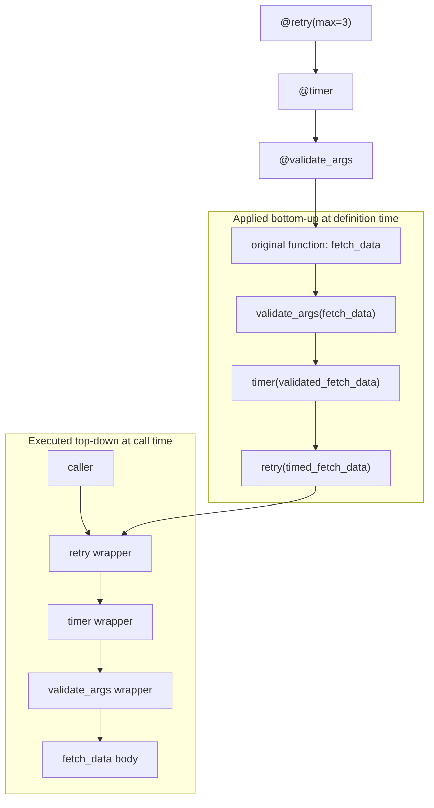

# :material-gift: Day 13 — Decorators In-Depth

!!! abstract "Day at a Glance"
    **Goal:** Understand decorator anatomy, implement parameterised and class-based decorators, stack multiple decorators, and master `functools` caching tools.
    **C++ Equivalent:** Day 13 of Learn-Modern-CPP-OOP-30-Days (CRTP, policy classes, `std::function` wrappers)
    **Estimated Time:** 60–90 minutes

<div class="grid cards" markdown>
- :material-lightbulb-on: **Core Concept** — a decorator is any callable that takes a function and returns a (usually wrapped) function
- :material-snake: **Python Way** — `@functools.wraps` preserves the original function's metadata so introspection stays honest
- :material-alert: **Watch Out** — stacking decorators applies them bottom-up; execution order is top-down
- :material-check-circle: **By End of Day** — write `@retry`, `@timer`, `@validate_args`, `@memoize`, and class-based decorators from scratch
</div>

## :material-lightbulb-on: Intuition

!!! info "Core Idea"
    A decorator is pure higher-order-function sugar.
    `@my_dec\ndef f(): ...` is exactly `f = my_dec(f)`.
    The decorator receives the original function, creates a wrapper that adds behaviour before/after the call, and returns the wrapper.
    `functools.wraps` copies `__name__`, `__doc__`, `__annotations__`, and `__wrapped__` from the original to the wrapper so `help()` and `inspect` still work correctly.

!!! success "Python vs C++"
    | Python | C++ |
    |--------|-----|
    | `@decorator` | CRTP: `template<typename Derived>` base |
    | Parameterised decorator | Policy class template parameter |
    | `functools.lru_cache` | Custom memoisation map |
    | `functools.cached_property` | Lazy member computation pattern |
    | Class-based decorator | Functor with `operator()` |
    | Stacking decorators | Chained policy templates |
    | `@property` | Getter/setter with `operator=` |

## :material-chart-flow: Decorator Wrapping Chain



## :material-book-open-variant: Lesson

### Decorator Anatomy

```python
import functools
from typing import Callable, TypeVar, Any

F = TypeVar("F", bound=Callable[..., Any])


def my_decorator(fn: F) -> F:
    @functools.wraps(fn)          # copy __name__, __doc__, __wrapped__
    def wrapper(*args, **kwargs):
        print(f"Before {fn.__name__}")
        result = fn(*args, **kwargs)
        print(f"After  {fn.__name__}")
        return result
    return wrapper                 # type: ignore[return-value]


@my_decorator
def greet(name: str) -> str:
    """Return a greeting."""
    return f"Hello, {name}!"


print(greet("Alice"))       # Before greet → Hello, Alice! → After greet
print(greet.__name__)       # greet        (not 'wrapper' — thanks to wraps)
print(greet.__doc__)        # Return a greeting.
print(greet.__wrapped__)    # <function greet at 0x...>
```

### `@timer` — Measuring Execution Time

```python
import time
import functools


def timer(fn):
    @functools.wraps(fn)
    def wrapper(*args, **kwargs):
        start = time.perf_counter()
        result = fn(*args, **kwargs)
        elapsed = time.perf_counter() - start
        print(f"{fn.__name__} took {elapsed:.4f}s")
        return result
    return wrapper


@timer
def slow_sum(n: int) -> int:
    return sum(range(n))


print(slow_sum(10_000_000))   # slow_sum took 0.2341s  →  49999995000000
```

### Parameterised Decorators (Factories)

A parameterised decorator is a *function that returns a decorator*.

```python
import time
import functools


def retry(max_attempts: int = 3, delay: float = 0.5, exceptions=(Exception,)):
    """Retry the decorated function up to `max_attempts` times on exception."""
    def decorator(fn):
        @functools.wraps(fn)
        def wrapper(*args, **kwargs):
            last_exc = None
            for attempt in range(1, max_attempts + 1):
                try:
                    return fn(*args, **kwargs)
                except exceptions as e:
                    last_exc = e
                    print(f"Attempt {attempt}/{max_attempts} failed: {e}")
                    if attempt < max_attempts:
                        time.sleep(delay)
            raise last_exc
        return wrapper
    return decorator


@retry(max_attempts=3, delay=0.1, exceptions=(ValueError,))
def parse_number(text: str) -> int:
    n = int(text)
    if n < 0:
        raise ValueError(f"Negative: {n}")
    return n


try:
    parse_number("-5")
except ValueError as e:
    print(f"Gave up: {e}")
```

### `@validate_args` — Runtime Type Checking

```python
import inspect
import functools


def validate_args(fn):
    """Check annotated argument types at runtime."""
    hints = {
        k: v for k, v in fn.__annotations__.items() if k != "return"
    }

    @functools.wraps(fn)
    def wrapper(*args, **kwargs):
        bound = inspect.signature(fn).bind(*args, **kwargs)
        bound.apply_defaults()
        for param_name, value in bound.arguments.items():
            if param_name in hints:
                expected = hints[param_name]
                if not isinstance(value, expected):
                    raise TypeError(
                        f"{fn.__name__}(): {param_name} must be {expected.__name__}, "
                        f"got {type(value).__name__}"
                    )
        return fn(*args, **kwargs)
    return wrapper


@validate_args
def power(base: int, exp: int) -> int:
    return base ** exp


print(power(2, 10))    # 1024
try:
    power(2, "10")     # TypeError: power(): exp must be int, got str
except TypeError as e:
    print(e)
```

### Class-Based Decorators

```python
import functools


class memoize:
    """LRU-style memoisation as a class-based decorator."""

    def __init__(self, fn):
        functools.update_wrapper(self, fn)
        self._fn = fn
        self._cache: dict = {}
        self._hits = 0
        self._misses = 0

    def __call__(self, *args):
        if args in self._cache:
            self._hits += 1
            return self._cache[args]
        self._misses += 1
        result = self._fn(*args)
        self._cache[args] = result
        return result

    def cache_info(self) -> str:
        return f"hits={self._hits}, misses={self._misses}, size={len(self._cache)}"

    def cache_clear(self) -> None:
        self._cache.clear()
        self._hits = self._misses = 0


@memoize
def fib(n: int) -> int:
    if n < 2:
        return n
    return fib(n - 1) + fib(n - 2)


print(fib(35))             # 9227465 (fast thanks to caching)
print(fib.cache_info())    # hits=33, misses=36, size=36
```

### Stacking Multiple Decorators

```python
@retry(max_attempts=2, delay=0)
@timer
@validate_args
def fetch(url: str, timeout: int = 5) -> str:
    """Simulated HTTP fetch."""
    import random
    if random.random() < 0.5:
        raise ConnectionError("Flaky network")
    return f"<html from {url}>"


# Equivalent to:
# fetch = retry(...)(timer(validate_args(fetch_original)))
```

### `functools.lru_cache` and `functools.cache`

```python
from functools import lru_cache, cache


@lru_cache(maxsize=128)
def expensive(n: int) -> int:
    print(f"computing {n}")
    return n * n


expensive(4)   # computing 4
expensive(4)   # cached — no print
expensive(5)   # computing 5
print(expensive.cache_info())
# CacheInfo(hits=1, misses=2, maxsize=128, currsize=2)


# cache = lru_cache(maxsize=None) — unbounded
@cache
def factorial(n: int) -> int:
    return 1 if n == 0 else n * factorial(n - 1)
```

### `functools.cached_property`

```python
from functools import cached_property
import statistics


class DataSet:
    def __init__(self, data: list[float]) -> None:
        self._data = data

    @cached_property
    def mean(self) -> float:
        print("computing mean…")
        return statistics.mean(self._data)

    @cached_property
    def stdev(self) -> float:
        print("computing stdev…")
        return statistics.stdev(self._data)


ds = DataSet([1, 2, 3, 4, 5, 6, 7, 8, 9, 10])
print(ds.mean)    # computing mean… → 5.5
print(ds.mean)    # (cached — no print) → 5.5
print(ds.stdev)   # computing stdev… → 3.0276…
```

### `@property` as a Descriptor

```python
class Temperature:
    def __init__(self, celsius: float = 0.0) -> None:
        self._celsius = celsius

    @property
    def celsius(self) -> float:
        return self._celsius

    @celsius.setter
    def celsius(self, value: float) -> None:
        if value < -273.15:
            raise ValueError("Temperature below absolute zero!")
        self._celsius = value

    @property
    def fahrenheit(self) -> float:
        return self._celsius * 9 / 5 + 32

    @fahrenheit.setter
    def fahrenheit(self, value: float) -> None:
        self.celsius = (value - 32) * 5 / 9


t = Temperature(100)
print(t.fahrenheit)    # 212.0
t.fahrenheit = 32
print(t.celsius)       # 0.0
```

## :material-alert: Common Pitfalls

!!! warning "Decorator stack order — bottom is applied first"
    ```python
    @A
    @B
    @C
    def f(): ...
    # Same as: f = A(B(C(f)))
    # At call time:  A-wrapper → B-wrapper → C-wrapper → original f
    ```
    Placing `@retry` inside `@timer` means the timer measures ALL retry attempts.
    Placing `@timer` inside `@retry` measures only one attempt per timing.

!!! danger "Forgetting `functools.wraps` — breaks introspection and `help()`"
    ```python
    def bad_dec(fn):
        def wrapper(*args, **kwargs):   # __name__ is 'wrapper'
            return fn(*args, **kwargs)
        return wrapper

    @bad_dec
    def important(): """Does something important."""

    print(important.__name__)   # 'wrapper' — wrong!
    print(important.__doc__)    # None — lost!
    ```

!!! warning "`lru_cache` requires hashable arguments"
    ```python
    @lru_cache
    def process(data: list) -> int:   # list is not hashable
        return sum(data)

    process([1, 2, 3])   # TypeError: unhashable type: 'list'
    # Fix: use tuple instead of list, or convert inside
    ```

## :material-help-circle: Flashcards

???+ question "Q1 — What is the difference between a simple decorator and a parameterised decorator?"
    A simple decorator is a function that takes a function and returns a wrapper: `def dec(fn): ...`.
    A parameterised decorator is a *decorator factory* — a function that takes parameters and returns a decorator: `def dec(param): def decorator(fn): ...`.
    Usage: `@dec` vs `@dec(param)`. The extra call layer accepts the parameters before wrapping.

???+ question "Q2 — What does `functools.wraps` do exactly?"
    It copies `__module__`, `__name__`, `__qualname__`, `__doc__`, `__dict__`, and `__annotations__` from the wrapped function to the wrapper, and sets `__wrapped__` to the original. This preserves `help()`, `inspect.signature()`, and debugging information.

???+ question "Q3 — When should you use a class-based decorator instead of a function-based one?"
    When the decorator needs to maintain **mutable state** across calls (hit counts, cache, connection pool) or expose **public methods** on the decorated object (e.g., `fn.cache_info()`, `fn.cache_clear()`). Class-based decorators make this state explicit and introspectable.

???+ question "Q4 — What is the difference between `lru_cache` and `cached_property`?"
    `lru_cache` wraps a *function* (or method called with arguments) and caches results by argument tuple with an optional size limit.
    `cached_property` wraps a zero-argument *method* on an instance and stores the result in the instance's `__dict__` on the first access — subsequent accesses bypass the descriptor entirely (no locking). It is not thread-safe by default.

## :material-clipboard-check: Self Test

=== "Question 1"
    Write a `@rate_limit(calls_per_second)` decorator that raises `RuntimeError` if the decorated function is called more often than the specified rate.

=== "Answer 1"
    ```python
    import time
    import functools


    def rate_limit(calls_per_second: float):
        min_interval = 1.0 / calls_per_second

        def decorator(fn):
            last_called = [0.0]   # mutable container to avoid nonlocal

            @functools.wraps(fn)
            def wrapper(*args, **kwargs):
                elapsed = time.time() - last_called[0]
                if elapsed < min_interval:
                    raise RuntimeError(
                        f"{fn.__name__} called too fast "
                        f"({1/elapsed:.1f} calls/s > {calls_per_second} limit)"
                    )
                last_called[0] = time.time()
                return fn(*args, **kwargs)
            return wrapper
        return decorator


    @rate_limit(calls_per_second=2)
    def ping():
        return "pong"


    print(ping())       # pong
    try:
        print(ping())   # RuntimeError — called immediately after
    except RuntimeError as e:
        print(e)
    ```

=== "Question 2"
    What is printed and in what order?
    ```python
    def dec_a(fn):
        print(f"decorating with A: {fn.__name__}")
        def wrapper(*a, **kw):
            print("A before")
            r = fn(*a, **kw)
            print("A after")
            return r
        return wrapper

    def dec_b(fn):
        print(f"decorating with B: {fn.__name__}")
        def wrapper(*a, **kw):
            print("B before")
            r = fn(*a, **kw)
            print("B after")
            return r
        return wrapper

    @dec_a
    @dec_b
    def hello():
        print("hello!")

    hello()
    ```

=== "Answer 2"
    ```
    decorating with B: hello
    decorating with A: wrapper
    B before
    A before
    hello!
    A after
    B after
    ```
    Wait — the execution order is: A-wrapper calls B-wrapper calls hello.
    So it prints: A before → B before → hello! → B after → A after.

    Actually the correct output is:
    ```
    decorating with B: hello
    decorating with A: wrapper
    A before
    B before
    hello!
    B after
    A after
    ```
    Decoration is bottom-up (B first, then A wraps B's wrapper). Execution is top-down (A runs first, then calls B's wrapper, then the original).

## :material-check-circle: Summary

!!! success "Key Takeaways"
    - `@dec` is syntactic sugar for `f = dec(f)` — decorators are just higher-order functions
    - Always use `@functools.wraps(fn)` to preserve the original function's metadata
    - Parameterised decorators add an extra factory layer: `@dec(params)` → `f = dec(params)(f)`
    - Class-based decorators are ideal when you need mutable state or public methods on the result
    - Stacking decorators applies them bottom-up at definition time but executes wrappers top-down at call time
    - `lru_cache(maxsize=N)` and `cache` (unbounded) give O(1) memoisation with minimal code
    - `cached_property` stores computed values in the instance `__dict__` — subsequent access bypasses the descriptor
    - `@property` is itself a descriptor that wraps getter, setter, and deleter into one clean interface
