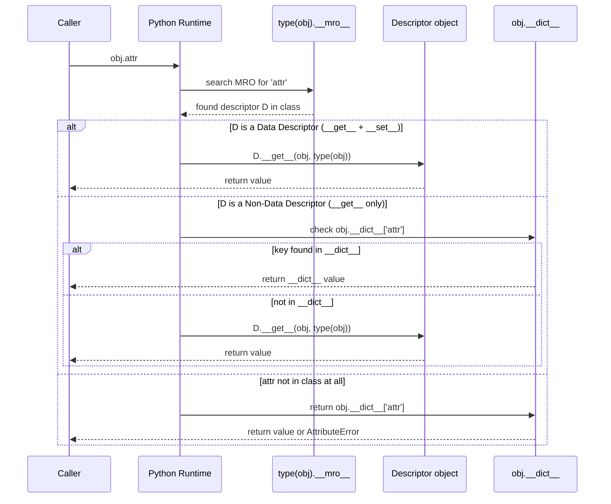

# :material-view-dashboard: Day 14 — Descriptors & Properties

!!! abstract "Day at a Glance"
    **Goal:** Understand the descriptor protocol (`__get__`, `__set__`, `__delete__`, `__set_name__`), distinguish data from non-data descriptors, and build reusable validated, clamped, and lazy attributes.
    **C++ Equivalent:** Day 14 of Learn-Modern-CPP-OOP-30-Days (`operator[]`, getter/setter methods, proxy objects)
    **Estimated Time:** 60–90 minutes

<div class="grid cards" markdown>
- :material-lightbulb-on: **Core Concept** — a descriptor is any object whose class defines `__get__`, `__set__`, or `__delete__`; Python calls these automatically during attribute access
- :material-snake: **Python Way** — `property` is just a built-in descriptor; you can write your own reusable ones for validation, type-checking, and lazy computation
- :material-alert: **Watch Out** — non-data descriptors are shadowed by instance `__dict__` entries; data descriptors take priority over `__dict__`
- :material-check-circle: **By End of Day** — implement `TypedAttribute`, `Clamped`, `LazyProperty`, and understand why `classmethod`/`staticmethod` are descriptors
</div>

## :material-lightbulb-on: Intuition

!!! info "Core Idea"
    Every time you write `obj.attr`, Python does not blindly look in `obj.__dict__`.
    It follows a precise *MRO lookup* that checks for descriptors in the class hierarchy first.
    If the class (or any base) has an attribute whose *type* defines `__get__`, Python calls `descriptor.__get__(obj, type(obj))` instead of returning the raw object.
    This one mechanism powers `property`, `classmethod`, `staticmethod`, `__slots__`, and every ORM field you have ever used.

!!! success "Python vs C++"
    | Python | C++ |
    |--------|-----|
    | Data descriptor (`__get__` + `__set__`) | Getter + setter pair |
    | Non-data descriptor (`__get__` only) | Read-only `const` getter |
    | `property` | `operator=` + getter method |
    | `classmethod` descriptor | `static` method with class context |
    | `staticmethod` descriptor | Free function stored in class |
    | `Clamped(min, max)` | Range-checked `operator=` |
    | `LazyProperty` | Mutable cached `const` member |
    | `__set_name__` | Knows which attribute name it's assigned to |

## :material-sequence-diagram: Descriptor `__get__` Lookup Chain



## :material-book-open-variant: Lesson

### The Descriptor Protocol

```python
class Descriptor:
    """Minimal data descriptor."""

    def __set_name__(self, owner, name: str) -> None:
        # Called at class-creation time; owner = the class, name = attribute name
        self.public_name = name
        self.private_name = f"_{name}"

    def __get__(self, obj, objtype=None):
        if obj is None:
            return self   # accessed on the class, not an instance
        return getattr(obj, self.private_name, None)

    def __set__(self, obj, value) -> None:
        setattr(obj, self.private_name, value)

    def __delete__(self, obj) -> None:
        delattr(obj, self.private_name)
```

### `TypedAttribute` — Runtime Type Enforcement

```python
class TypedAttribute:
    """Data descriptor that enforces a single type."""

    def __set_name__(self, owner, name: str) -> None:
        self.public_name = name
        self.private_name = f"_{name}"

    def __init__(self, expected_type: type) -> None:
        self.expected_type = expected_type

    def __get__(self, obj, objtype=None):
        if obj is None:
            return self
        return getattr(obj, self.private_name)

    def __set__(self, obj, value) -> None:
        if not isinstance(value, self.expected_type):
            raise TypeError(
                f"{self.public_name} expects {self.expected_type.__name__}, "
                f"got {type(value).__name__}"
            )
        setattr(obj, self.private_name, value)


class Person:
    name: str = TypedAttribute(str)    # __set_name__ fires here
    age:  int = TypedAttribute(int)

    def __init__(self, name: str, age: int) -> None:
        self.name = name   # calls TypedAttribute.__set__
        self.age  = age


alice = Person("Alice", 30)
print(alice.name)   # Alice

try:
    alice.age = "thirty"   # TypeError: age expects int, got str
except TypeError as e:
    print(e)
```

### `Clamped(min, max)` — Range-Validated Descriptor

```python
class Clamped:
    """Clamp numeric values to [lo, hi]."""

    def __init__(self, lo, hi) -> None:
        self.lo = lo
        self.hi = hi

    def __set_name__(self, owner, name: str) -> None:
        self.public_name = name
        self.private_name = f"_{name}"

    def __get__(self, obj, objtype=None):
        if obj is None:
            return self
        return getattr(obj, self.private_name, self.lo)

    def __set__(self, obj, value) -> None:
        clamped = max(self.lo, min(self.hi, value))
        setattr(obj, self.private_name, clamped)


class Sensor:
    temperature: float = Clamped(-40.0, 85.0)   # operating range in °C
    humidity:    float = Clamped(0.0, 100.0)

    def __init__(self, temp: float, hum: float) -> None:
        self.temperature = temp
        self.humidity    = hum


s = Sensor(200.0, 110.0)        # values are silently clamped
print(s.temperature)            # 85.0
print(s.humidity)               # 100.0

s.temperature = -100.0
print(s.temperature)            # -40.0
```

### Data vs Non-Data Descriptors

```python
class DataDesc:
    """Has __get__ AND __set__ → data descriptor."""
    def __get__(self, obj, objtype=None):
        return "from DataDesc"
    def __set__(self, obj, value):
        pass   # absorbs the write


class NonDataDesc:
    """Has __get__ only → non-data descriptor."""
    def __get__(self, obj, objtype=None):
        return "from NonDataDesc"


class MyClass:
    dd  = DataDesc()
    ndd = NonDataDesc()


obj = MyClass()

# Non-data descriptor is shadowed by instance dict
obj.__dict__["ndd"] = "from instance"
print(obj.ndd)   # from instance  (instance wins over non-data)

# Data descriptor always takes priority over instance dict
obj.__dict__["dd"] = "from instance"
print(obj.dd)    # from DataDesc  (descriptor wins over instance)
```

### `LazyProperty` — Non-Data Descriptor for Caching

```python
class LazyProperty:
    """
    Compute-once, cache-forever non-data descriptor.
    On first access, calls the factory function and stores the result
    in the instance __dict__ under the same name — bypassing the descriptor
    on subsequent accesses (because non-data descriptors lose to __dict__).
    """

    def __init__(self, fn) -> None:
        self._fn = fn
        self._name = fn.__name__

    def __set_name__(self, owner, name: str) -> None:
        self._name = name

    def __get__(self, obj, objtype=None):
        if obj is None:
            return self
        value = self._fn(obj)
        obj.__dict__[self._name] = value   # store in instance dict
        return value


class Circle:
    def __init__(self, radius: float) -> None:
        self.radius = radius

    @LazyProperty
    def area(self) -> float:
        import math
        print("computing area…")
        return math.pi * self.radius ** 2

    @LazyProperty
    def circumference(self) -> float:
        import math
        print("computing circumference…")
        return 2 * math.pi * self.radius


c = Circle(5)
print(c.area)            # computing area… → 78.53…
print(c.area)            # (no print — read from __dict__)
print(c.circumference)   # computing circumference… → 31.41…
```

### `property` Is a Built-in Descriptor

```python
class BankAccount:
    def __init__(self, balance: float = 0.0) -> None:
        self._balance = balance

    @property
    def balance(self) -> float:
        """Read-only access."""
        return self._balance

    @balance.setter
    def balance(self, amount: float) -> None:
        if amount < 0:
            raise ValueError("Balance cannot be negative")
        self._balance = amount

    @balance.deleter
    def balance(self) -> None:
        raise AttributeError("Cannot delete balance")


account = BankAccount(100.0)
account.balance = 250.0
print(account.balance)   # 250.0

try:
    account.balance = -10
except ValueError as e:
    print(e)   # Balance cannot be negative

try:
    del account.balance
except AttributeError as e:
    print(e)
```

### `classmethod` and `staticmethod` Are Descriptors

```python
class Validator:
    _instances: list = []

    def __init__(self, value):
        self.value = value
        Validator._instances.append(self)

    @classmethod
    def from_string(cls, text: str) -> "Validator":
        # cls is bound by classmethod.__get__(None, Validator)
        return cls(int(text))

    @staticmethod
    def is_valid(value) -> bool:
        # No binding at all — staticmethod.__get__ returns the raw function
        return isinstance(value, int) and value >= 0


v = Validator.from_string("42")
print(v.value)                    # 42
print(Validator.is_valid(42))     # True
print(Validator.is_valid(-1))     # False

# Proof they are descriptors:
print(type(Validator.__dict__["from_string"]))   # <class 'classmethod'>
print(type(Validator.__dict__["is_valid"]))      # <class 'staticmethod'>
```

### Complete Validated Dataclass Using Descriptors

```python
from typing import Any


class Positive:
    """Descriptor: value must be > 0."""

    def __set_name__(self, owner, name):
        self.name = name
        self.private = f"_{name}"

    def __get__(self, obj, objtype=None):
        return self if obj is None else getattr(obj, self.private)

    def __set__(self, obj, value):
        if value <= 0:
            raise ValueError(f"{self.name} must be positive, got {value}")
        setattr(obj, self.private, value)


class NonEmpty:
    """Descriptor: string must not be empty or whitespace."""

    def __set_name__(self, owner, name):
        self.name = name
        self.private = f"_{name}"

    def __get__(self, obj, objtype=None):
        return self if obj is None else getattr(obj, self.private)

    def __set__(self, obj, value: str):
        if not value.strip():
            raise ValueError(f"{self.name} must not be empty")
        setattr(obj, self.private, value.strip())


class Product:
    name:  str   = NonEmpty()
    price: float = Positive()
    stock: int   = Positive()

    def __init__(self, name: str, price: float, stock: int) -> None:
        self.name  = name
        self.price = price
        self.stock = stock

    def __repr__(self):
        return f"Product({self.name!r}, ${self.price:.2f}, qty={self.stock})"


p = Product("Widget", 9.99, 100)
print(p)   # Product('Widget', $9.99, qty=100)

try:
    p.price = -5
except ValueError as e:
    print(e)   # price must be positive, got -5

try:
    p.name = "   "
except ValueError as e:
    print(e)   # name must not be empty
```

## :material-alert: Common Pitfalls

!!! warning "Storing state on the descriptor object, not the instance"
    ```python
    class Bad:
        def __init__(self):
            self.value = None   # shared across ALL instances!

        def __get__(self, obj, objtype=None): return self.value
        def __set__(self, obj, v): self.value = v   # BUG!

    class MyClass:
        x = Bad()

    a = MyClass(); b = MyClass()
    a.x = 10
    print(b.x)   # 10 — they share the same Bad() instance!

    # Fix: store on obj, keyed by id or use private name
    def __set__(self, obj, v):
        obj.__dict__[self.private_name] = v
    ```

!!! danger "Non-data descriptor shadowed unexpectedly"
    ```python
    class Greeter:
        def __get__(self, obj, objtype=None): return "hello"

    class MyClass:
        greet = Greeter()

    obj = MyClass()
    obj.__dict__["greet"] = "world"   # shadows the descriptor!
    print(obj.greet)   # world  (not "hello")
    ```
    If you need the descriptor to always win, add a `__set__` method to make it a data descriptor.

!!! warning "`__set_name__` is NOT called when descriptors are added after class creation"
    ```python
    class Desc:
        def __set_name__(self, owner, name): self.name = name

    class MyClass: pass

    MyClass.attr = Desc()   # __set_name__ is NOT called here!
    # self.name is never set → AttributeError on access
    ```
    Always assign descriptors at class-definition time (inside the class body).

## :material-help-circle: Flashcards

???+ question "Q1 — What is the difference between a data and non-data descriptor?"
    A **data descriptor** defines both `__get__` and `__set__` (and optionally `__delete__`).
    A **non-data descriptor** defines only `__get__`.
    Data descriptors take priority over the instance `__dict__`; non-data descriptors are shadowed by it.
    This is why `LazyProperty` (non-data) can cache its value in `obj.__dict__` and bypass the descriptor on future accesses.

???+ question "Q2 — What does `__set_name__` provide that `__init__` cannot?"
    `__set_name__(owner, name)` is called by the metaclass at class-creation time with the *actual attribute name* the descriptor is assigned to.
    `__init__` runs before `__set_name__` and does not have this information, forcing users to repeat the name: `x = TypedAttribute('x', int)`.
    With `__set_name__`, the descriptor learns its own name automatically.

???+ question "Q3 — Why is `property` a data descriptor, not just syntactic sugar?"
    `property` defines `__get__`, `__set__` (delegating to the setter), and `__delete__` (delegating to the deleter).
    Because it defines `__set__`, it is a **data descriptor** and always takes priority over the instance `__dict__`.
    This ensures that `obj.x = value` always calls the setter even if someone writes directly to `obj.__dict__['x']`.

???+ question "Q4 — How does `classmethod` work as a descriptor?"
    When you access `MyClass.method` (or `instance.method`), Python calls `classmethod.__get__(obj, type)`, which returns a bound method that has the *class* (not the instance) as its first argument.
    This binding is performed lazily via the descriptor protocol — `classmethod` is not special syntax; it is an ordinary descriptor stored in the class dict.

## :material-clipboard-check: Self Test

=== "Question 1"
    Write a `Once` descriptor that allows a value to be set exactly once and raises `AttributeError` on any subsequent assignment (like a write-once field).

=== "Answer 1"
    ```python
    class Once:
        """Write-once data descriptor."""

        def __set_name__(self, owner, name: str) -> None:
            self.public_name = name
            self.private_name = f"_{name}_once"

        def __get__(self, obj, objtype=None):
            if obj is None:
                return self
            try:
                return getattr(obj, self.private_name)
            except AttributeError:
                raise AttributeError(f"{self.public_name!r} has not been set yet")

        def __set__(self, obj, value) -> None:
            if hasattr(obj, self.private_name):
                raise AttributeError(
                    f"{self.public_name!r} is write-once and has already been set"
                )
            setattr(obj, self.private_name, value)


    class Config:
        secret_key: str = Once()

    cfg = Config()
    cfg.secret_key = "s3cr3t"
    print(cfg.secret_key)   # s3cr3t

    try:
        cfg.secret_key = "new_key"
    except AttributeError as e:
        print(e)   # 'secret_key' is write-once and has already been set
    ```

=== "Question 2"
    Given this code, what is printed and why?
    ```python
    class D:
        def __get__(self, obj, objtype=None):
            return 42

    class C:
        x = D()

    obj = C()
    obj.__dict__["x"] = 99
    print(obj.x)
    ```

=== "Answer 2"
    **`99`** is printed.
    `D` only defines `__get__`, so it is a **non-data descriptor**.
    Non-data descriptors lose to instance `__dict__` entries.
    When Python looks up `obj.x`, it finds `99` in `obj.__dict__` first and returns it without ever calling `D.__get__`.
    If `D` also defined `__set__`, it would be a data descriptor and `42` would be returned instead.

## :material-check-circle: Summary

!!! success "Key Takeaways"
    - The descriptor protocol (`__get__`, `__set__`, `__delete__`) is Python's mechanism for customising attribute access
    - **Data descriptors** (both `__get__` and `__set__`) always win over instance `__dict__`
    - **Non-data descriptors** (`__get__` only) are shadowed by instance `__dict__` — exploit this for lazy caching
    - `__set_name__` is called automatically at class-creation time and provides the descriptor with its attribute name
    - `property` is a built-in data descriptor — `@property`, `@x.setter`, `@x.deleter` are all just descriptor machinery
    - `classmethod` and `staticmethod` are non-data descriptors that bind differently on access
    - `TypedAttribute`, `Clamped`, and `Once` demonstrate how one descriptor class replaces dozens of `__init__` validation lines
    - Always store per-instance state in `obj.__dict__` (keyed by a private name), never on the descriptor object itself
