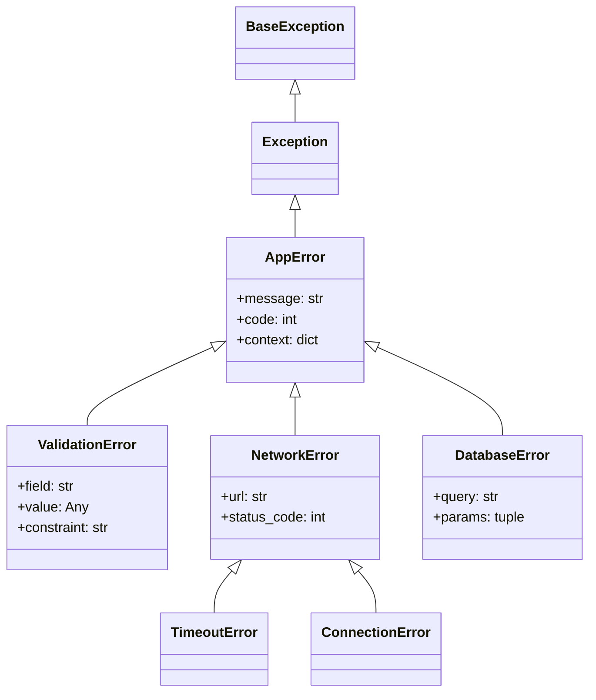

# :material-alert-circle: Day 15 — Error Handling & Custom Exceptions

!!! abstract "Day at a Glance"
    **Goal:** Master Python's exception hierarchy, build rich custom exception classes, chain errors with `raise X from Y`, leverage `ExceptionGroup` for concurrent error aggregation, and integrate structured logging.
    **C++ Equivalent:** Day 15 of Learn-Modern-CPP-OOP-30-Days (`try/catch`, `std::exception`, `std::expected<T,E>` C++23)
    **Estimated Time:** 60–90 minutes

<div class="grid cards" markdown>
- :material-lightbulb-on: **Core Concept** — Exceptions are objects; the hierarchy lets you catch at any level of specificity
- :material-snake: **Python Way** — `try/except/else/finally` + context-rich custom classes + chained causes
- :material-alert: **Watch Out** — Bare `except:` swallows `KeyboardInterrupt`; always catch `Exception` at minimum
- :material-check-circle: **By End of Day** — Design a multi-level exception hierarchy and handle concurrent error groups
</div>

---

## :material-lightbulb-on: Intuition

!!! info "Core Idea"
    Every exception is an instance of a class that inherits — directly or indirectly — from `BaseException`.
    The interpreter walks up the MRO when matching `except` clauses, so catching `OSError` also catches
    `FileNotFoundError` and `PermissionError`. Custom exceptions follow the same rules: inherit from the
    closest built-in that semantically fits, add structured attributes, and attach a `__cause__` via
    `raise X from Y` to preserve the full causal chain.

!!! success "Python vs C++"
    | Feature | Python | C++ |
    |---|---|---|
    | Base class | `BaseException` | `std::exception` |
    | Catch-all | `except Exception` | `catch (...)` |
    | Chaining | `raise X from Y` → `__cause__` | No standard mechanism |
    | Value-or-error | `Result` pattern (manual) | `std::expected<T,E>` (C++23) |
    | Finally | `finally:` block | RAII destructors |
    | Group errors | `ExceptionGroup` (3.11+) | No equivalent |

---

## :material-family-tree: Exception Hierarchy



---

## :material-book-open-variant: Lesson

### The `try/except/else/finally` Quad

```python
import logging

logger = logging.getLogger(__name__)

def parse_positive_int(text: str) -> int:
    try:
        value = int(text)          # may raise ValueError
    except ValueError as exc:
        logger.warning("Bad input %r: %s", text, exc)
        raise                      # re-raise preserving traceback
    else:
        # Only runs when NO exception occurred in try
        if value <= 0:
            raise ValueError(f"Expected positive, got {value}")
        return value
    finally:
        # ALWAYS runs — perfect for cleanup
        logger.debug("parse_positive_int finished for input %r", text)
```

### Custom Exception Hierarchy

```python
from __future__ import annotations
from typing import Any


class AppError(Exception):
    """Root for all application-level errors."""

    def __init__(
        self,
        message: str,
        *,
        code: int = 0,
        context: dict[str, Any] | None = None,
    ) -> None:
        super().__init__(message)
        self.code = code
        self.context: dict[str, Any] = context or {}

    def __str__(self) -> str:
        base = super().__str__()
        if self.context:
            return f"{base} | code={self.code} context={self.context}"
        return f"{base} | code={self.code}"


class ValidationError(AppError):
    """Raised when user-supplied data fails a constraint."""

    def __init__(self, field: str, value: Any, constraint: str) -> None:
        super().__init__(
            f"Validation failed on '{field}'",
            code=422,
            context={"field": field, "value": value, "constraint": constraint},
        )
        self.field = field
        self.value = value
        self.constraint = constraint


class NetworkError(AppError):
    """Raised on network-level failures."""

    def __init__(self, url: str, status_code: int = 0) -> None:
        super().__init__(
            f"Network error calling {url}",
            code=status_code or 503,
            context={"url": url, "status_code": status_code},
        )
        self.url = url
        self.status_code = status_code


# Usage
try:
    raise ValidationError("age", -5, "must be >= 0")
except ValidationError as exc:
    print(exc)                     # Validation failed on 'age' | code=422 ...
    print(exc.field)               # age
    print(exc.context)             # {'field': 'age', 'value': -5, ...}
```

### Exception Chaining with `raise X from Y`

```python
import json


def load_config(path: str) -> dict:
    try:
        with open(path) as f:
            return json.load(f)
    except FileNotFoundError as exc:
        raise AppError(f"Config file missing: {path}", code=404) from exc
    except json.JSONDecodeError as exc:
        raise AppError(f"Config file malformed: {path}", code=500) from exc


# When AppError is raised, __cause__ points to the original exception.
# Traceback shows both: "The above exception was the direct cause of..."
try:
    load_config("/nonexistent/config.json")
except AppError as exc:
    print(type(exc.__cause__))     # <class 'FileNotFoundError'>
```

### `contextlib.suppress` — Silent Swallowing

```python
from contextlib import suppress
import os

with suppress(FileNotFoundError):
    os.remove("/tmp/maybe_exists.tmp")
# If the file didn't exist, we just move on — no if/try boilerplate
```

### `ExceptionGroup` and `except*` (Python 3.11+)

```python
# Useful when running multiple async tasks that can each fail independently
def validate_all(data: dict) -> None:
    errors = []
    if not data.get("name"):
        errors.append(ValidationError("name", data.get("name"), "required"))
    if (age := data.get("age", -1)) < 0:
        errors.append(ValidationError("age", age, "must be >= 0"))
    if errors:
        raise ExceptionGroup("validation failures", errors)


try:
    validate_all({"name": "", "age": -1})
except* ValidationError as eg:
    for exc in eg.exceptions:
        print(f"  - {exc.field}: {exc.constraint}")
# except* catches ALL matching exceptions in the group, not just the first
```

### Logging Integration

```python
import logging
import sys

logging.basicConfig(
    level=logging.DEBUG,
    format="%(asctime)s %(levelname)-8s %(name)s — %(message)s",
    handlers=[logging.StreamHandler(sys.stderr)],
)
logger = logging.getLogger("myapp")


def risky_operation(x: int) -> float:
    try:
        return 1 / x
    except ZeroDivisionError:
        logger.exception("Division by zero for x=%d", x)  # includes traceback
        raise AppError("Cannot divide by zero", code=400) from None
        # `from None` suppresses __context__ chaining in the traceback
```

### Result-Type Alternative (No Exceptions)

```python
from dataclasses import dataclass
from typing import Generic, TypeVar

T = TypeVar("T")
E = TypeVar("E", bound=Exception)


@dataclass(frozen=True)
class Ok(Generic[T]):
    value: T
    ok: bool = True


@dataclass(frozen=True)
class Err(Generic[E]):
    error: E
    ok: bool = False


Result = Ok[T] | Err[E]


def safe_divide(a: float, b: float) -> Result:
    if b == 0:
        return Err(AppError("Division by zero", code=400))
    return Ok(a / b)


match safe_divide(10, 0):
    case Ok(value=v):
        print(f"Result: {v}")
    case Err(error=e):
        print(f"Error: {e}")
```

---

## :material-alert: Common Pitfalls

!!! warning "Catching Too Broadly"
    ```python
    # BAD — swallows KeyboardInterrupt, SystemExit, GeneratorExit
    try:
        risky()
    except:        # bare except!
        pass

    # GOOD — only catches non-system errors
    try:
        risky()
    except Exception as exc:
        handle(exc)
    ```

!!! warning "Losing the Original Traceback"
    ```python
    # BAD — new raise loses original location
    try:
        open("x")
    except FileNotFoundError:
        raise RuntimeError("not found")   # __context__ set implicitly

    # GOOD — explicit chain
    try:
        open("x")
    except FileNotFoundError as exc:
        raise RuntimeError("not found") from exc   # __cause__ set
    ```

!!! danger "Mutable Default in Exception `__init__`"
    ```python
    # BAD — all instances share the same dict
    class MyError(Exception):
        def __init__(self, context={}):   # mutable default!
            self.context = context

    # GOOD
    class MyError(Exception):
        def __init__(self, context=None):
            self.context = context or {}
    ```

!!! danger "`except*` Requires Python 3.11+"
    Using `except*` on Python 3.10 or earlier is a `SyntaxError`.
    Guard with a version check or `sys.version_info >= (3, 11)` at import time.

---

## :material-help-circle: Flashcards

???+ question "What is the difference between `__cause__` and `__context__`?"
    `__cause__` is set **explicitly** by `raise X from Y` — it signals intentional chaining.
    `__context__` is set **implicitly** whenever an exception is raised inside an `except` block.
    Use `raise X from None` to suppress `__context__` and display only the new error.

???+ question "When does the `else` clause of a `try` block run?"
    Only when the `try` block completes **without raising any exception**.
    It is logically equivalent to code at the end of the `try` block, but it signals intent: this
    code only makes sense if no error occurred. It is NOT protected by the `except` clauses above it.

???+ question "How does `ExceptionGroup` differ from a plain list of errors?"
    `ExceptionGroup` is a proper `BaseException` subclass that can be raised and caught.
    `except*` clauses can filter specific types from the group while letting others propagate,
    enabling fine-grained handling of concurrent or batch failures.

???+ question "Why prefer `raise AppError(...) from exc` over `raise AppError(str(exc))`?"
    Embedding `str(exc)` in the message loses the original traceback and type.
    `from exc` preserves the full `__cause__` chain so debugging tools and loggers can display
    the root cause location without any string surgery.

---

## :material-clipboard-check: Self Test

=== "Question 1"
    You have a function `fetch(url)` that can raise `requests.HTTPError`. You want callers to
    receive a `NetworkError` (your custom class) instead, while still being able to inspect the
    original HTTP error for its status code. Write the `except` clause.

=== "Answer 1"
    ```python
    import requests

    def fetch(url: str) -> bytes:
        try:
            response = requests.get(url, timeout=10)
            response.raise_for_status()
            return response.content
        except requests.HTTPError as exc:
            raise NetworkError(url, exc.response.status_code) from exc
    ```
    `from exc` sets `NetworkError.__cause__ = exc`, so callers can do
    `exc.__cause__.response.status_code` if they need the original detail.

=== "Question 2"
    Three validation checks run on a form. All three may fail independently. How do you collect
    all failures and surface them together with `ExceptionGroup`?

=== "Answer 2"
    ```python
    def validate_form(data: dict) -> None:
        errors: list[ValidationError] = []

        if not data.get("email"):
            errors.append(ValidationError("email", data.get("email"), "required"))
        if len(data.get("password", "")) < 8:
            errors.append(ValidationError("password", "***", "min length 8"))
        if data.get("age", 0) < 18:
            errors.append(ValidationError("age", data.get("age"), "must be >= 18"))

        if errors:
            raise ExceptionGroup("form validation errors", errors)

    try:
        validate_form({"email": "", "password": "abc", "age": 16})
    except* ValidationError as eg:
        for err in eg.exceptions:
            print(f"{err.field}: {err.constraint}")
    ```

---

## :material-check-circle: Summary

!!! success "Key Takeaways"
    - The `try/except/else/finally` quartet gives precise control: `else` runs on success, `finally` always runs.
    - Inherit custom exceptions from the most specific built-in that fits; add structured attributes for machine-readable context.
    - Use `raise X from Y` to preserve causal chains; use `raise X from None` to suppress them.
    - `ExceptionGroup` + `except*` (Python 3.11+) model concurrent/batch failures elegantly.
    - Integrate `logger.exception(...)` inside `except` blocks to capture tracebacks automatically.
    - For pure functional code, a `Result = Ok | Err` union type avoids exception flow entirely.
