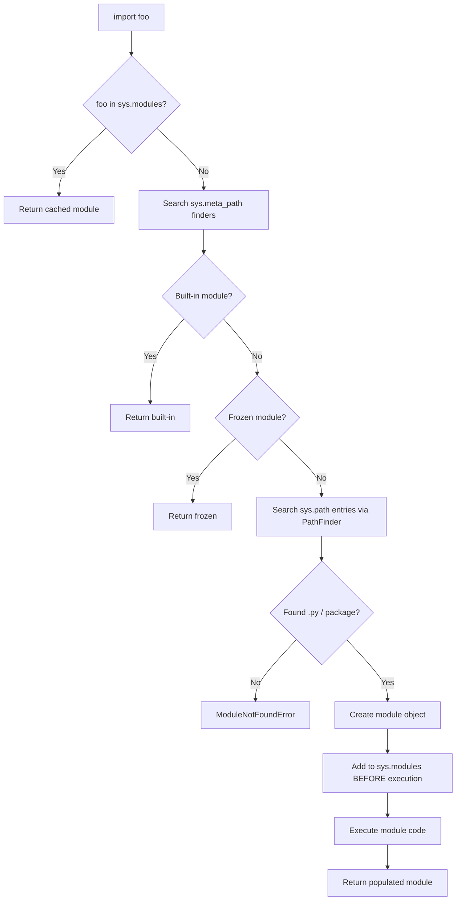

# :material-package-variant: Day 16 — Modules, Packages & Imports

!!! abstract "Day at a Glance"
    **Goal:** Understand Python's import system end-to-end: resolution order, package structure, relative imports, dynamic loading with `importlib`, and strategies for avoiding circular imports.
    **C++ Equivalent:** Day 16 of Learn-Modern-CPP-OOP-30-Days (`#include`, header guards, C++20 Modules)
    **Estimated Time:** 60–90 minutes

<div class="grid cards" markdown>
- :material-lightbulb-on: **Core Concept** — `import` is a runtime operation that executes module code once and caches the result in `sys.modules`
- :material-snake: **Python Way** — Packages are directories with `__init__.py`; `importlib` makes plugins dynamic
- :material-alert: **Watch Out** — Circular imports silently produce partially-initialised modules, not errors
- :material-check-circle: **By End of Day** — Structure a multi-package project and build a `importlib`-based plugin loader
</div>

---

## :material-lightbulb-on: Intuition

!!! info "Core Idea"
    When you write `import mypackage.utils`, Python searches `sys.path` left-to-right for a directory
    named `mypackage`, then looks for `utils.py` (or `utils/__init__.py`) inside it. The module object
    is created, its code is executed **once**, and the result is stored in `sys.modules`. Every subsequent
    `import` of the same name returns the cached object — no re-execution. This single-execution guarantee
    is the foundation of the plugin pattern: register objects at module level and they persist.

!!! success "Python vs C++"
    | Feature | Python | C++ |
    |---|---|---|
    | Unit of reuse | Module (`.py` file) | Translation unit (`.cpp`) |
    | Declaration sharing | `import` | `#include` header |
    | One-time execution | `sys.modules` cache | Include guards / `#pragma once` |
    | Namespace package | Directory without `__init__.py` | No equivalent |
    | Dynamic loading | `importlib.import_module()` | `dlopen()` / `LoadLibrary()` |
    | Modern alternative | — | C++20 `import std;` modules |

---

## :material-file-tree: Import Resolution Order



---

## :material-book-open-variant: Lesson

### Basic Import Forms

```python
import os                           # binds name 'os' in current namespace
import os.path                      # also binds 'os'; os.path is attribute

from pathlib import Path            # binds only 'Path'
from pathlib import Path, PurePath  # multiple names

import numpy as np                  # alias — idiomatic for heavy libs
from collections import defaultdict as dd

# Star import — only use in REPL or if __all__ is defined
from mymodule import *
```

### `__all__` — Public API Declaration

```python
# mymodule.py
__all__ = ["PublicClass", "public_func"]   # controls 'from mymodule import *'

class PublicClass: ...
def public_func(): ...
def _internal(): ...        # underscore prefix + absent from __all__ = private
```

### Package Structure

```
myapp/
├── __init__.py          ← makes myapp a package; runs on 'import myapp'
├── core/
│   ├── __init__.py
│   ├── models.py
│   └── utils.py
├── plugins/
│   ├── __init__.py
│   ├── base.py
│   └── csv_plugin.py
└── cli.py
```

```python
# myapp/__init__.py
from myapp.core.models import User   # absolute import — always preferred
__version__ = "1.0.0"
```

### Relative Imports

```python
# myapp/core/utils.py
from . import models           # same package (core)
from .models import User       # specific name from sibling module
from .. import cli             # parent package (myapp)
from ..plugins.base import Plugin  # cousin module

# Relative imports only work INSIDE packages — not in top-level scripts
```

### `sys.path` Manipulation

```python
import sys

# Prepend a directory so Python finds modules there first
sys.path.insert(0, "/opt/myapp/lib")

# Inspect the full search path
for p in sys.path:
    print(p)

# Preferred alternative: set PYTHONPATH env var or use .pth files in site-packages
```

### Dynamic Loading with `importlib`

```python
import importlib
import importlib.util
from pathlib import Path


def load_plugin(module_name: str):
    """Load a plugin by dotted module name, return its module object."""
    module = importlib.import_module(module_name)
    return module


def load_plugin_from_path(file_path: str | Path):
    """Load an arbitrary .py file as a module regardless of sys.path."""
    path = Path(file_path)
    spec = importlib.util.spec_from_file_location(path.stem, path)
    module = importlib.util.module_from_spec(spec)
    spec.loader.exec_module(module)
    return module


# Example: discover and load all plugins in a directory
def discover_plugins(plugin_dir: Path) -> dict[str, object]:
    plugins = {}
    for py_file in plugin_dir.glob("*.py"):
        if py_file.name.startswith("_"):
            continue
        mod = load_plugin_from_path(py_file)
        if hasattr(mod, "register"):
            plugins[py_file.stem] = mod.register()
    return plugins
```

### Plugin System — Full Example

```python
# myapp/plugins/base.py
from abc import ABC, abstractmethod

class Plugin(ABC):
    name: str = "unnamed"

    @abstractmethod
    def run(self, data: dict) -> dict: ...


# myapp/plugins/csv_plugin.py
from myapp.plugins.base import Plugin

class CSVPlugin(Plugin):
    name = "csv"

    def run(self, data: dict) -> dict:
        return {k: str(v) for k, v in data.items()}

def register() -> Plugin:
    return CSVPlugin()


# myapp/plugin_loader.py
import importlib
from myapp.plugins.base import Plugin

_REGISTRY: dict[str, Plugin] = {}

def load(dotted_name: str) -> None:
    mod = importlib.import_module(dotted_name)
    plugin: Plugin = mod.register()
    _REGISTRY[plugin.name] = plugin

def get(name: str) -> Plugin:
    return _REGISTRY[name]

# Usage
load("myapp.plugins.csv_plugin")
plugin = get("csv")
print(plugin.run({"x": 1, "y": 2}))   # {'x': '1', 'y': '2'}
```

### Namespace Packages (PEP 420)

```python
# No __init__.py needed — Python 3.3+ treats bare directories as namespace packages
# Useful for splitting a logical package across multiple directories / distributions:

# /dist-a/myns/feature_a.py
# /dist-b/myns/feature_b.py
# Both /dist-a and /dist-b on sys.path → 'from myns import feature_a, feature_b' works
```

### Avoiding Circular Imports

```python
# BAD — circular: a.py imports b, b.py imports a at module level

# GOOD strategies:

# 1. Move shared code to a third module (c.py) that neither a nor b imports
# 2. Import inside a function (deferred import)
def get_helper():
    from myapp.core.utils import helper   # imported only when called
    return helper()

# 3. Use TYPE_CHECKING guard for type annotations only
from __future__ import annotations
from typing import TYPE_CHECKING
if TYPE_CHECKING:
    from myapp.core.models import User   # only used by type checkers, not at runtime

def process(user: "User") -> None: ...
```

---

## :material-alert: Common Pitfalls

!!! warning "Shadowing Standard Library Modules"
    ```python
    # If you create a file named 'os.py', 'json.py', or 'random.py' in your project,
    # it shadows the stdlib module and causes cryptic ImportErrors.
    # Always check: python -c "import <name>; print(<name>.__file__)"
    ```

!!! warning "Star Imports Pollute the Namespace"
    ```python
    from os.path import *      # imports join, exists, split, ... ~30 names
    from json import *         # now 'loads' exists but who knows its origin?

    # Result: name collisions are silent and hard to debug.
    # Reserve star imports for interactive sessions only.
    ```

!!! danger "Circular Import Gives Partial Module"
    ```python
    # a.py: from b import B_CLASS   ← runs before b.py finishes executing
    # b.py: from a import A_CLASS   ← a is half-initialized; A_CLASS may not exist yet
    # You get AttributeError at import time, NOT a clean circular-import message.
    # Fix: restructure, use deferred imports, or extract shared types to a third module.
    ```

!!! danger "`sys.path.insert` in Library Code"
    Mutating `sys.path` inside a library module affects every other import in the process.
    This is acceptable in scripts and test bootstraps, but **never** do it inside a package
    that will be installed and reused by others.

---

## :material-help-circle: Flashcards

???+ question "Why is `sys.modules` checked before anything else during an import?"
    Because module-level code should run **exactly once**. If a module is already in `sys.modules`,
    returning the cached object is both faster and correct — it preserves any state the module
    accumulated (registries, singletons, monkey-patches). Re-executing module code would reset that state.

???+ question "What is the difference between a regular package and a namespace package?"
    A **regular package** has an `__init__.py` file. Its `__path__` is a plain list containing one
    directory. A **namespace package** (PEP 420) has no `__init__.py`; its `__path__` is a
    `_NamespacePath` that can span multiple directories on `sys.path`, enabling a single logical
    package to be split across separate distributions.

???+ question "When should you use `importlib.util.spec_from_file_location` vs `importlib.import_module`?"
    Use `import_module` when the target module is already discoverable via `sys.path` (the normal case).
    Use `spec_from_file_location` when you have an **absolute file path** that may not be on `sys.path` —
    for example, loading a user-installed plugin from an arbitrary directory.

???+ question "How does `from __future__ import annotations` help with circular imports?"
    It makes all annotations in the file into **strings** (lazy evaluation) rather than evaluated
    expressions at parse time. Combined with `if TYPE_CHECKING:` guards, you can reference types from
    other modules in annotations without triggering a runtime import, breaking the cycle.

---

## :material-clipboard-check: Self Test

=== "Question 1"
    You have a `plugins/` directory containing `csv_plugin.py`, `json_plugin.py`, and `xml_plugin.py`.
    Each exports a `register()` function returning a `Plugin` instance. Write a function
    `load_all_plugins(plugin_dir)` that discovers and loads all of them dynamically.

=== "Answer 1"
    ```python
    import importlib.util
    from pathlib import Path
    from myapp.plugins.base import Plugin

    def load_all_plugins(plugin_dir: Path) -> dict[str, Plugin]:
        registry: dict[str, Plugin] = {}
        for py_file in sorted(plugin_dir.glob("*_plugin.py")):
            spec = importlib.util.spec_from_file_location(py_file.stem, py_file)
            mod = importlib.util.module_from_spec(spec)
            spec.loader.exec_module(mod)
            plugin: Plugin = mod.register()
            registry[plugin.name] = plugin
        return registry
    ```

=== "Question 2"
    Module `a.py` imports `B` from `b.py`, and `b.py` imports `A` from `a.py` at module level.
    List two concrete fixes without changing the public API.

=== "Answer 2"
    **Fix 1 — Deferred import (import inside function):**
    ```python
    # b.py
    def create_pair():
        from a import A   # only imported when create_pair() is called
        return A(), B()
    ```

    **Fix 2 — TYPE_CHECKING guard (annotations only):**
    ```python
    # b.py
    from __future__ import annotations
    from typing import TYPE_CHECKING
    if TYPE_CHECKING:
        from a import A   # not executed at runtime

    def process(obj: "A") -> "B": ...
    ```

---

## :material-check-circle: Summary

!!! success "Key Takeaways"
    - `import` executes module code **once** and caches the result in `sys.modules`; subsequent imports are free lookups.
    - Packages are directories with `__init__.py`; namespace packages (PEP 420) omit `__init__.py` and can span multiple locations.
    - Prefer **absolute imports** everywhere; use **relative imports** only for intra-package references.
    - `__all__` defines the public API and controls `from module import *`.
    - `importlib.import_module()` loads by dotted name; `spec_from_file_location` loads from an arbitrary file path.
    - Circular imports produce silently broken partial modules — fix by restructuring, deferring, or using `TYPE_CHECKING` guards.
