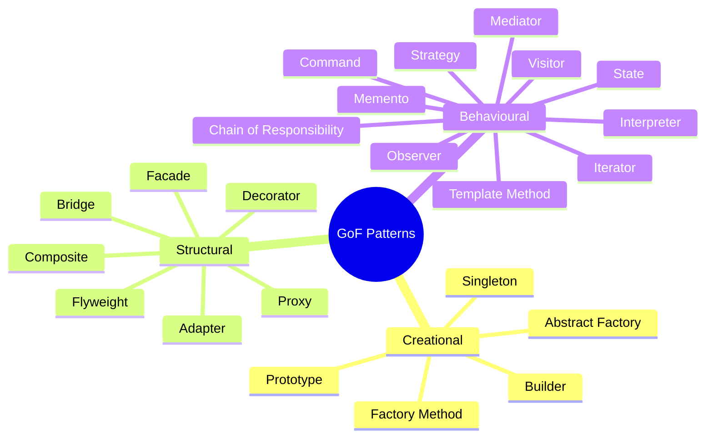

# :material-puzzle: Day 17 — Design Patterns in Python

!!! abstract "Day at a Glance"
    **Goal:** Survey all 23 GoF patterns, then implement three idiomatic Python variants (Strategy as callable, Observer as callable list, Registry via metaclass) plus Borg and Null Object.
    **C++ Equivalent:** Day 17 of Learn-Modern-CPP-OOP-30-Days (GoF patterns with virtual dispatch and templates)
    **Estimated Time:** 60–90 minutes

<div class="grid cards" markdown>
- :material-lightbulb-on: **Core Concept** — In Python many patterns collapse to first-class functions, callables, or simple data structures
- :material-snake: **Python Way** — Strategy = callable; Observer = list of callbacks; Singleton = module or `__new__`
- :material-alert: **Watch Out** — Cargo-culting C++ patterns verbatim produces needless boilerplate in Python
- :material-check-circle: **By End of Day** — Identify which GoF patterns Python simplifies and implement the idiomatic versions
</div>

---

## :material-lightbulb-on: Intuition

!!! info "Core Idea"
    The Gang of Four patterns were documented for statically-typed OO languages (C++/Java) that lack
    first-class functions, mixins, and duck typing. In Python, many patterns either collapse entirely
    (Strategy → any callable) or shrink dramatically (Observer → list of functions). Understanding
    *why* a pattern exists lets you pick the simplest implementation that satisfies the forces at play.

!!! success "Python vs C++"
    | Pattern | C++ approach | Python idiom |
    |---|---|---|
    | Strategy | Abstract class + subclasses | Any callable (function, lambda, class) |
    | Observer | `Subject` class with virtual `notify` | List of callbacks / signal library |
    | Singleton | Static member + private ctor | Module-level object or `__new__` |
    | Decorator | Wrapper class hierarchy | `@decorator` function or `functools.wraps` |
    | Template Method | Abstract base with hook methods | ABCs or `__init_subclass__` |
    | Null Object | Derived class doing nothing | Object with no-op methods |

---

## :material-brain: All 23 GoF Patterns



### Quick Reference Table

| # | Pattern | Category | Python Simplification |
|---|---|---|---|
| 1 | Singleton | Creational | Module object; `__new__`; Borg |
| 2 | Factory Method | Creational | `classmethod` or plain function |
| 3 | Abstract Factory | Creational | `Protocol` + factory functions |
| 4 | Builder | Creational | Keyword args + `dataclass` |
| 5 | Prototype | Creational | `copy.deepcopy()` |
| 6 | Adapter | Structural | Wrapper class or `__getattr__` delegation |
| 7 | Bridge | Structural | Composition + Protocol |
| 8 | Composite | Structural | Recursive dataclass tree |
| 9 | Decorator | Structural | `@decorator` syntax |
| 10 | Facade | Structural | Module-level functions hiding subsystem |
| 11 | Flyweight | Structural | `__slots__` + `sys.intern()` |
| 12 | Proxy | Structural | `__getattr__` forwarding |
| 13 | Chain of Responsibility | Behavioural | List of handlers; generator pipeline |
| 14 | Command | Behavioural | Callable object or `functools.partial` |
| 15 | Interpreter | Behavioural | `ast` module + visitor |
| 16 | Iterator | Behavioural | `__iter__`/`__next__` or `yield` |
| 17 | Mediator | Behavioural | Central event bus |
| 18 | Memento | Behavioural | `copy.deepcopy()` snapshots |
| 19 | Observer | Behavioural | List of callbacks |
| 20 | State | Behavioural | Enum + dict dispatch |
| 21 | Strategy | Behavioural | Any callable |
| 22 | Template Method | Behavioural | ABC hook methods |
| 23 | Visitor | Behavioural | `singledispatch` or `match` |

---

## :material-book-open-variant: Lesson

### Deep Dive 1 — Strategy as Callable

```python
from typing import Callable

# C++ style (needless in Python):
# class SortStrategy(ABC):
#     @abstractmethod
#     def sort(self, data): ...
# class BubbleSort(SortStrategy): ...

# Python style: any callable IS a strategy
Sorter = Callable[[list], list]

class DataProcessor:
    def __init__(self, sort_strategy: Sorter = sorted) -> None:
        self._sort = sort_strategy

    def process(self, data: list) -> list:
        return self._sort(data)


# Swap strategies at runtime — no class hierarchy needed
proc = DataProcessor()
print(proc.process([3, 1, 2]))              # [1, 2, 3]

proc2 = DataProcessor(lambda x: sorted(x, reverse=True))
print(proc2.process([3, 1, 2]))             # [3, 2, 1]

# Or a named function strategy
def case_insensitive_sort(data: list[str]) -> list[str]:
    return sorted(data, key=str.lower)

proc3 = DataProcessor(case_insensitive_sort)
print(proc3.process(["Banana", "apple", "Cherry"]))
```

### Deep Dive 2 — Observer as Callable List

```python
from __future__ import annotations
from typing import Callable, Any


class Event:
    """A simple, typed event slot."""

    def __init__(self) -> None:
        self._handlers: list[Callable[..., Any]] = []

    def subscribe(self, handler: Callable[..., Any]) -> None:
        self._handlers.append(handler)

    def unsubscribe(self, handler: Callable[..., Any]) -> None:
        self._handlers.remove(handler)

    def fire(self, *args: Any, **kwargs: Any) -> None:
        for h in self._handlers:
            h(*args, **kwargs)

    # Support decorator syntax
    def __call__(self, fn: Callable) -> Callable:
        self.subscribe(fn)
        return fn


class Button:
    def __init__(self, label: str) -> None:
        self.label = label
        self.clicked = Event()

    def click(self) -> None:
        self.clicked.fire(self)


# Usage
btn = Button("Save")

@btn.clicked
def on_click(b: Button) -> None:
    print(f"Button '{b.label}' was clicked!")

def log_click(b: Button) -> None:
    print(f"[LOG] {b.label} click recorded")

btn.clicked.subscribe(log_click)
btn.click()
# Button 'Save' was clicked!
# [LOG] Save click recorded
```

### Deep Dive 3 — Null Object

```python
from abc import ABC, abstractmethod


class Logger(ABC):
    @abstractmethod
    def log(self, message: str) -> None: ...


class ConsoleLogger(Logger):
    def log(self, message: str) -> None:
        print(f"[LOG] {message}")


class NullLogger(Logger):
    """Drop-in replacement that silently discards all log messages."""
    def log(self, message: str) -> None:
        pass   # intentional no-op


class Service:
    def __init__(self, logger: Logger | None = None) -> None:
        self._logger = logger or NullLogger()   # never None internally

    def do_work(self) -> None:
        self._logger.log("Starting work")
        # ... logic ...
        self._logger.log("Work complete")


Service().do_work()                          # silent
Service(ConsoleLogger()).do_work()           # prints to console
```

### Borg Singleton (Shared State)

```python
class BorgSingleton:
    """All instances share the same __dict__ (state), not the same id."""
    _shared_state: dict = {}

    def __init__(self) -> None:
        self.__dict__ = self._shared_state

    def set(self, key: str, value: object) -> None:
        self._shared_state[key] = value


a = BorgSingleton()
b = BorgSingleton()
a.set("x", 42)
print(b.x)          # 42 — same state, different objects
print(a is b)       # False — but behaviour is singleton-like
```

### Registry Pattern via Class Dictionary

```python
from typing import Type


class PluginRegistry:
    _registry: dict[str, Type] = {}

    def __init_subclass__(cls, plugin_name: str = "", **kwargs: object) -> None:
        super().__init_subclass__(**kwargs)
        if plugin_name:
            PluginRegistry._registry[plugin_name] = cls

    @classmethod
    def get(cls, name: str) -> Type:
        try:
            return cls._registry[name]
        except KeyError:
            raise KeyError(f"No plugin registered as '{name}'") from None

    @classmethod
    def list_plugins(cls) -> list[str]:
        return list(cls._registry)


class CSVExporter(PluginRegistry, plugin_name="csv"):
    def export(self, data: list) -> str:
        return ",".join(str(x) for x in data)


class JSONExporter(PluginRegistry, plugin_name="json"):
    import json as _json
    def export(self, data: list) -> str:
        return self._json.dumps(data)


print(PluginRegistry.list_plugins())          # ['csv', 'json']
exporter = PluginRegistry.get("csv")()
print(exporter.export([1, 2, 3]))             # 1,2,3
```

---

## :material-alert: Common Pitfalls

!!! warning "Forcing OOP Patterns Where Functions Suffice"
    ```python
    # Needlessly verbose Strategy in Python:
    class MultiplyStrategy:
        def execute(self, x, y): return x * y

    processor.set_strategy(MultiplyStrategy())
    processor.execute(3, 4)

    # Pythonic:
    processor.set_strategy(lambda x, y: x * y)
    processor.execute(3, 4)
    ```

!!! warning "Classic Singleton Breaks in Multi-threaded Code"
    ```python
    # This double-checked locking is NOT needed in Python for module-level objects
    # Use threading.Lock() only if you truly need lazy initialisation under threads.
    # Simplest safe singleton: just define the object at module level.
    # config.py
    _instance = Config()   # created once at import time, thread-safe
    ```

!!! danger "Mutable Class-Level Shared State in Borg"
    The Borg `_shared_state` dict is a class variable shared across **all** subclasses unless each
    subclass defines its own `_shared_state = {}`. Forgetting this leaks state between unrelated classes.

!!! danger "Observer Memory Leaks with Bound Methods"
    Storing `self.method` in an observer list keeps `self` alive even after all other references are
    gone. Use `weakref.WeakMethod` or ensure explicit `unsubscribe()` calls in `__del__` / context managers.

---

## :material-help-circle: Flashcards

???+ question "Which GoF patterns become trivial or disappear in Python?"
    **Iterator** — `__iter__`/`__next__` or `yield` is built into the language.
    **Command** — any callable or `functools.partial` works.
    **Template Method** — ABC with hook methods, or `__init_subclass__`.
    **Strategy** — any callable.
    **Prototype** — `copy.deepcopy()`.
    These patterns solve language-level limitations that Python doesn't have.

???+ question "What is the difference between Singleton and Borg?"
    **Singleton** enforces that only one instance is ever created (`id()` is always the same).
    **Borg** allows multiple instances but forces them all to share the same `__dict__`, so they
    behave identically. Borg is often more flexible: you can subclass and still inject different
    behaviours, whereas Singleton's `__new__` guard makes subclassing tricky.

???+ question "How does `__init_subclass__` implement the Registry pattern without a metaclass?"
    Python calls `__init_subclass__` on the **base class** whenever a new subclass is created.
    The base class can use keyword arguments passed in the class statement
    (`class Foo(Base, plugin_name="foo")`) to populate a class-level registry dict — no metaclass needed.

???+ question "Why is the Observer pattern's `fire()` method better than directly iterating `_handlers`?"
    Encapsulation: callers can't mutate the handler list directly, and `fire()` can safely copy the
    list before iteration so that handlers that unsubscribe during firing don't cause index errors.
    It also provides a single place to add error handling, logging, or async dispatch later.

---

## :material-clipboard-check: Self Test

=== "Question 1"
    Implement a `Pipeline` class that holds a list of transformation functions (Strategy pattern)
    and applies them in sequence to an input value. Support adding stages via `|=` operator.

=== "Answer 1"
    ```python
    from typing import Callable, TypeVar

    T = TypeVar("T")

    class Pipeline:
        def __init__(self) -> None:
            self._stages: list[Callable] = []

        def __ior__(self, stage: Callable) -> "Pipeline":
            self._stages.append(stage)
            return self

        def run(self, value):
            for stage in self._stages:
                value = stage(value)
            return value


    p = Pipeline()
    p |= str.strip
    p |= str.upper
    p |= lambda s: s + "!"
    print(p.run("  hello  "))   # HELLO!
    ```

=== "Question 2"
    Using `__init_subclass__`, build a `Shape` registry that maps shape names to classes,
    then instantiate a shape by name string.

=== "Answer 2"
    ```python
    class Shape:
        _registry: dict[str, type] = {}

        def __init_subclass__(cls, name: str = "", **kwargs):
            super().__init_subclass__(**kwargs)
            if name:
                Shape._registry[name] = cls

        @classmethod
        def create(cls, name: str, **kwargs) -> "Shape":
            klass = cls._registry[name]
            return klass(**kwargs)

        def area(self) -> float:
            raise NotImplementedError

    class Circle(Shape, name="circle"):
        def __init__(self, radius: float) -> None:
            self.radius = radius
        def area(self) -> float:
            import math
            return math.pi * self.radius ** 2

    class Square(Shape, name="square"):
        def __init__(self, side: float) -> None:
            self.side = side
        def area(self) -> float:
            return self.side ** 2

    s = Shape.create("circle", radius=5)
    print(f"{s.area():.2f}")   # 78.54
    ```

---

## :material-check-circle: Summary

!!! success "Key Takeaways"
    - All 23 GoF patterns remain conceptually valid; Python's first-class functions, duck typing, and decorators collapse many into simpler forms.
    - **Strategy** = any callable; **Observer** = list of callbacks; **Command** = `functools.partial`; **Prototype** = `copy.deepcopy`.
    - The **Borg** pattern shares state across instances via a shared `__dict__` — more flexible than classic Singleton.
    - `__init_subclass__` provides a lightweight Registry without metaclass complexity.
    - Apply patterns to solve real forces (extensibility, decoupling, lifecycle management) — not as architectural decoration.
