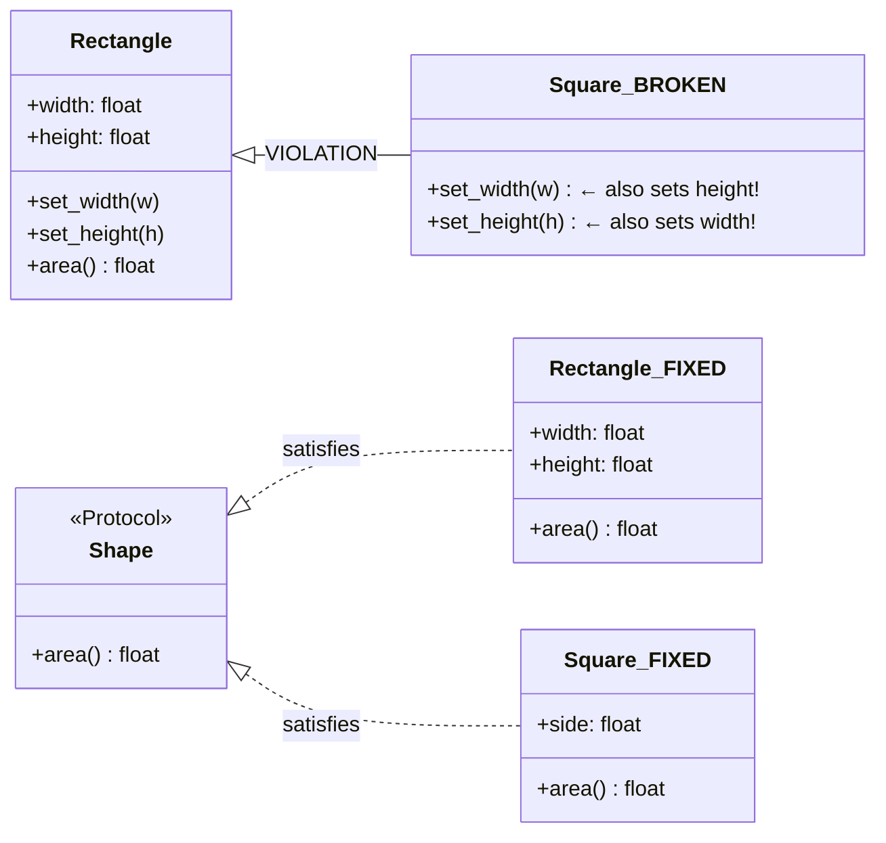

# :material-pillar: Day 18 — SOLID Principles

!!! abstract "Day at a Glance"
    **Goal:** Understand and apply all five SOLID principles in idiomatic Python, spotting violations (Rectangle/Square LSP) and using `Protocol` for Dependency Inversion without abstract base class overhead.
    **C++ Equivalent:** Day 18 of Learn-Modern-CPP-OOP-30-Days (SOLID with abstract classes and templates)
    **Estimated Time:** 60–90 minutes

<div class="grid cards" markdown>
- :material-lightbulb-on: **Core Concept** — SOLID guides class design to maximise cohesion and minimise coupling
- :material-snake: **Python Way** — `Protocol` replaces heavyweight ABCs; duck typing satisfies LSP structurally
- :material-alert: **Watch Out** — Square inheriting from Rectangle is the canonical LSP violation — know it cold
- :material-check-circle: **By End of Day** — Refactor a violation of each principle with before/after code
</div>

---

## :material-lightbulb-on: Intuition

!!! info "Core Idea"
    SOLID is an acronym for five object-oriented design principles that, together, make codebases
    easier to extend without modification, testable in isolation, and resilient to changing requirements.
    They are language-agnostic, but Python's `Protocol` (structural subtyping) and first-class functions
    give unusually clean implementations of the Open/Closed and Dependency Inversion principles.

!!! success "Python vs C++"
    | Principle | C++ tool | Python tool |
    |---|---|---|
    | Single Responsibility | Free functions, namespaces | Separate modules / classes |
    | Open/Closed | Abstract base + subclasses | `Protocol` + new implementations |
    | Liskov Substitution | `virtual` + contracts | Duck typing + `isinstance` checks |
    | Interface Segregation | Multiple pure-virtual interfaces | Multiple narrow `Protocol`s |
    | Dependency Inversion | Inject abstract pointer | Inject `Protocol`-typed parameter |

---

## :material-swap-horizontal: LSP Violation and Fix



---

## :material-book-open-variant: Lesson

### S — Single Responsibility Principle

> A class should have only one reason to change.

```python
# BEFORE — UserManager does too many things
class UserManager:
    def create_user(self, name: str, email: str) -> dict:
        user = {"name": name, "email": email}
        # validation logic
        if "@" not in email:
            raise ValueError("Bad email")
        # persistence logic
        with open("users.json", "a") as f:
            import json
            f.write(json.dumps(user) + "\n")
        # notification logic
        print(f"Welcome email sent to {email}")
        return user


# AFTER — each class has one reason to change
class UserValidator:
    def validate(self, name: str, email: str) -> None:
        if not name:
            raise ValueError("Name required")
        if "@" not in email:
            raise ValueError(f"Invalid email: {email}")


class UserRepository:
    def save(self, user: dict) -> None:
        import json
        with open("users.json", "a") as f:
            f.write(json.dumps(user) + "\n")


class UserNotifier:
    def welcome(self, email: str) -> None:
        print(f"Welcome email sent to {email}")


class UserService:
    def __init__(
        self,
        validator: UserValidator,
        repo: UserRepository,
        notifier: UserNotifier,
    ) -> None:
        self._validator = validator
        self._repo = repo
        self._notifier = notifier

    def create_user(self, name: str, email: str) -> dict:
        self._validator.validate(name, email)
        user = {"name": name, "email": email}
        self._repo.save(user)
        self._notifier.welcome(email)
        return user
```

### O — Open/Closed Principle

> Open for extension, closed for modification.

```python
from typing import Protocol

# BEFORE — every new discount type requires modifying Order
class Order:
    def __init__(self, total: float, discount_type: str) -> None:
        self.total = total
        self.discount_type = discount_type

    def final_price(self) -> float:
        if self.discount_type == "none":
            return self.total
        elif self.discount_type == "ten_percent":
            return self.total * 0.9
        elif self.discount_type == "vip":
            return self.total * 0.7
        # Adding a new type MODIFIES this method — violates OCP


# AFTER — new discounts are added without touching Order
class DiscountStrategy(Protocol):
    def apply(self, total: float) -> float: ...


class NoDiscount:
    def apply(self, total: float) -> float:
        return total


class PercentDiscount:
    def __init__(self, percent: float) -> None:
        self._factor = 1 - percent / 100

    def apply(self, total: float) -> float:
        return total * self._factor


class FixedDiscount:
    def __init__(self, amount: float) -> None:
        self._amount = amount

    def apply(self, total: float) -> float:
        return max(0.0, total - self._amount)


class OrderV2:
    def __init__(self, total: float, discount: DiscountStrategy = NoDiscount()) -> None:
        self.total = total
        self._discount = discount

    def final_price(self) -> float:
        return self._discount.apply(self.total)


# Adding LoyaltyDiscount requires ZERO changes to OrderV2
class LoyaltyDiscount:
    def apply(self, total: float) -> float:
        return total * 0.85

order = OrderV2(100.0, PercentDiscount(10))
print(order.final_price())   # 90.0
```

### L — Liskov Substitution Principle

> If S is a subtype of T, objects of type T may be replaced with objects of type S without altering correctness.

```python
# VIOLATION — Square breaks Rectangle's postcondition
class Rectangle:
    def __init__(self, width: float, height: float) -> None:
        self.width = width
        self.height = height

    def set_width(self, w: float) -> None:
        self.width = w

    def set_height(self, h: float) -> None:
        self.height = h

    def area(self) -> float:
        return self.width * self.height


class SquareBroken(Rectangle):
    def set_width(self, w: float) -> None:
        self.width = w
        self.height = w       # breaks the postcondition: height unchanged

    def set_height(self, h: float) -> None:
        self.width = h
        self.height = h


def check_area(rect: Rectangle) -> None:
    rect.set_width(4)
    rect.set_height(5)
    assert rect.area() == 20, f"Expected 20, got {rect.area()}"  # fails for Square!

check_area(Rectangle(1, 1))    # OK
# check_area(SquareBroken(1))  # AssertionError — LSP violated


# FIX — separate classes, common Protocol
from typing import Protocol

class Shape(Protocol):
    def area(self) -> float: ...

class RectangleFixed:
    def __init__(self, width: float, height: float) -> None:
        self.width = width
        self.height = height
    def area(self) -> float:
        return self.width * self.height

class SquareFixed:
    def __init__(self, side: float) -> None:
        self.side = side
    def area(self) -> float:
        return self.side ** 2

def total_area(shapes: list[Shape]) -> float:
    return sum(s.area() for s in shapes)

print(total_area([RectangleFixed(4, 5), SquareFixed(3)]))   # 29.0
```

### I — Interface Segregation Principle

> Clients should not be forced to depend on interfaces they don't use.

```python
from typing import Protocol
from abc import ABC, abstractmethod

# VIOLATION — fat ABC forces all implementors to define methods they don't need
class FatWorker(ABC):
    @abstractmethod
    def work(self) -> None: ...
    @abstractmethod
    def eat(self) -> None: ...
    @abstractmethod
    def sleep(self) -> None: ...

class Robot(FatWorker):
    def work(self) -> None: print("Robot working")
    def eat(self) -> None: raise NotImplementedError("Robots don't eat")
    def sleep(self) -> None: raise NotImplementedError("Robots don't sleep")


# FIX — narrow Protocols; implement only what you need
class Workable(Protocol):
    def work(self) -> None: ...

class Eatable(Protocol):
    def eat(self) -> None: ...

class Sleepable(Protocol):
    def sleep(self) -> None: ...


class Human:
    def work(self) -> None: print("Human working")
    def eat(self) -> None: print("Human eating")
    def sleep(self) -> None: print("Human sleeping")


class RobotFixed:
    def work(self) -> None: print("Robot working")
    # No eat/sleep — doesn't implement those Protocols


def make_work(worker: Workable) -> None:
    worker.work()

make_work(Human())       # Human working
make_work(RobotFixed())  # Robot working
```

### D — Dependency Inversion Principle

> High-level modules should not depend on low-level modules. Both should depend on abstractions.

```python
from typing import Protocol


# Abstraction
class MessageSender(Protocol):
    def send(self, recipient: str, body: str) -> None: ...


# Low-level modules
class EmailSender:
    def send(self, recipient: str, body: str) -> None:
        print(f"EMAIL → {recipient}: {body}")


class SMSSender:
    def send(self, recipient: str, body: str) -> None:
        print(f"SMS → {recipient}: {body}")


class SlackSender:
    def send(self, recipient: str, body: str) -> None:
        print(f"SLACK → {recipient}: {body}")


# High-level module — depends only on the Protocol abstraction
class NotificationService:
    def __init__(self, sender: MessageSender) -> None:
        self._sender = sender   # injected — not constructed here

    def notify(self, user: str, message: str) -> None:
        self._sender.send(user, message)


# Wire up at the composition root (main / factory / DI container)
svc = NotificationService(EmailSender())
svc.notify("alice@example.com", "Your order shipped!")

svc2 = NotificationService(SlackSender())
svc2.notify("#ops", "Deployment complete")
```

---

## :material-alert: Common Pitfalls

!!! warning "God Classes Violate SRP"
    ```python
    # Red flag: class names ending in Manager, Handler, Processor, Controller
    # that do validation + persistence + notification + logging in one place.
    # Split by axis of change: domain logic, IO, presentation, cross-cutting.
    ```

!!! warning "Inheriting for Reuse Violates LSP"
    ```python
    # Reusing Stack as a subclass of list exposes list methods (insert, pop(i))
    # that violate the Stack contract (LIFO only). Prefer composition:
    class Stack:
        def __init__(self): self._data = []
        def push(self, v): self._data.append(v)
        def pop(self): return self._data.pop()
    ```

!!! danger "Concrete Dependency in Constructor Violates DIP"
    ```python
    # WRONG — high-level module creates its own dependency
    class ReportService:
        def __init__(self):
            self._db = PostgresDatabase()   # hardcoded low-level module

    # RIGHT — inject via constructor
    class ReportService:
        def __init__(self, db: DatabaseProtocol) -> None:
            self._db = db
    ```

!!! danger "Using `isinstance` in Business Logic Violates OCP"
    ```python
    # Every new type requires modifying this function
    def render(shape):
        if isinstance(shape, Circle):
            draw_circle(shape)
        elif isinstance(shape, Square):
            draw_square(shape)
    # FIX: define shape.render() and call it polymorphically
    ```

---

## :material-help-circle: Flashcards

???+ question "State the Liskov Substitution Principle in one sentence and give the Rectangle/Square violation."
    A subtype must be substitutable for its supertype without breaking program correctness.
    `Square` violates this because setting `width` on a `Rectangle` must not change `height`, but
    `Square.set_width` changes both — breaking any code that relies on that postcondition.

???+ question "How does Python's `Protocol` help with Interface Segregation compared to ABCs?"
    `Protocol` uses **structural subtyping** (duck typing): a class satisfies a `Protocol` simply
    by having the required methods, without any `class Foo(Protocol)` declaration. This makes it
    trivial to define small, narrow protocols and have existing classes satisfy them without modification —
    impossible with nominal ABCs.

???+ question "What is the 'composition root' in Dependency Inversion?"
    The composition root is the single place in the application (usually `main()` or a DI container)
    where concrete implementations are instantiated and injected into high-level modules.
    Everywhere else in the codebase, code depends only on abstractions (Protocols / ABCs).

???+ question "How do you detect a Single Responsibility violation in code review?"
    Look for: (1) class names with multiple nouns or `And` in them, (2) methods that touch
    unrelated subsystems (DB + email + logging), (3) tests that require many unrelated mocks,
    (4) frequent changes to the same file from multiple independent features.

---

## :material-clipboard-check: Self Test

=== "Question 1"
    A `FileLogger` class opens a file in `__init__` and writes to it in `log()`. Later, a
    `DatabaseLogger` is added. The code that calls logging is:
    ```python
    logger = FileLogger("app.log")
    service = ReportService(logger)
    ```
    Which SOLID principle does this violate, and how do you fix it?

=== "Answer 1"
    **Dependency Inversion Principle** — `ReportService` depends on the concrete `FileLogger`
    rather than an abstraction.

    ```python
    from typing import Protocol

    class Logger(Protocol):
        def log(self, message: str) -> None: ...

    class FileLogger:
        def __init__(self, path: str) -> None:
            self._path = path
        def log(self, message: str) -> None:
            with open(self._path, "a") as f:
                f.write(message + "\n")

    class DatabaseLogger:
        def log(self, message: str) -> None:
            print(f"[DB] {message}")   # simplified

    class ReportService:
        def __init__(self, logger: Logger) -> None:  # depends on abstraction
            self._logger = logger

        def generate(self) -> None:
            self._logger.log("Report generated")

    # Wire at composition root:
    svc = ReportService(FileLogger("app.log"))
    ```

=== "Question 2"
    Explain why `class Stack(list)` violates the Liskov Substitution Principle and provide
    a composition-based fix.

=== "Answer 2"
    `list` exposes `insert(i, v)`, `pop(i)`, `__setitem__`, etc. A Stack should only allow
    LIFO access. Code that receives a `Stack` as a `list` can call `stack[0]` or `stack.insert(0, x)`,
    breaking the LIFO contract. Stack is **not** substitutable for list.

    ```python
    class Stack:
        """LIFO container — composition over inheritance."""
        def __init__(self) -> None:
            self._data: list = []

        def push(self, value) -> None:
            self._data.append(value)

        def pop(self):
            if not self._data:
                raise IndexError("pop from empty stack")
            return self._data.pop()

        def peek(self):
            return self._data[-1]

        def __len__(self) -> int:
            return len(self._data)

        def __bool__(self) -> bool:
            return bool(self._data)
    ```
    Only Stack's own interface is exposed — no list methods leak through.

---

## :material-check-circle: Summary

!!! success "Key Takeaways"
    - **S**ingle Responsibility: one class, one axis of change — split by domain / IO / presentation.
    - **O**pen/Closed: new behaviour via new classes satisfying a `Protocol`, not by modifying existing code.
    - **L**iskov Substitution: subtypes must honour all postconditions of the supertype — Square/Rectangle is the classic violation; fix with composition or a shared Protocol.
    - **I**nterface Segregation: define narrow `Protocol`s so implementations are not forced to stub unused methods.
    - **D**ependency Inversion: inject abstractions at the composition root; high-level code never constructs its own low-level dependencies.
