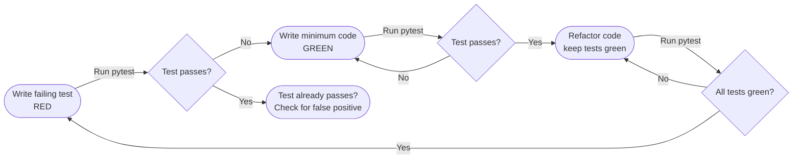

# :material-test-tube: Day 19 — Testing with Pytest & TDD

!!! abstract "Day at a Glance"
    **Goal:** Write tests first (TDD), master pytest fixtures and parametrize, mock external dependencies with `unittest.mock`, measure coverage, and explore property-based testing with Hypothesis.
    **C++ Equivalent:** Day 19 of Learn-Modern-CPP-OOP-30-Days (Catch2, Google Test, CMake CTest)
    **Estimated Time:** 60–90 minutes

<div class="grid cards" markdown>
- :material-lightbulb-on: **Core Concept** — Tests are executable specifications; write them before the code to drive design
- :material-snake: **Python Way** — `pytest` discovers and runs tests with minimal boilerplate; fixtures handle setup/teardown
- :material-alert: **Watch Out** — Patching the wrong namespace is the most common mocking mistake
- :material-check-circle: **By End of Day** — Build a TDD Stack with fixtures, parametrize, mocks, and a coverage report
</div>

---

## :material-lightbulb-on: Intuition

!!! info "Core Idea"
    Test-Driven Development inverts the normal workflow: write a failing test first (Red), write the
    minimum code to make it pass (Green), then improve the code without changing behaviour (Refactor).
    The test suite becomes a safety net that lets you refactor with confidence and documents intended
    behaviour better than prose comments ever could.

!!! success "Python vs C++"
    | Feature | Python (pytest) | C++ (Catch2 / Google Test) |
    |---|---|---|
    | Test discovery | File `test_*.py`, function `test_*` | `TEST_CASE`, `TEST` macros |
    | Assertions | Plain `assert` | `REQUIRE`, `EXPECT_*` macros |
    | Fixtures | `@pytest.fixture` | `SetUp`/`TearDown` methods |
    | Parametrize | `@pytest.mark.parametrize` | `GENERATE`, typed test suites |
    | Mocking | `unittest.mock` | GMock |
    | Coverage | `pytest-cov` | `gcov`, `llvm-cov` |
    | Property-based | `hypothesis` | RapidCheck |

---

## :material-refresh: TDD Red-Green-Refactor Cycle



---

## :material-book-open-variant: Lesson

### TDD Stack — Test First

```python
# tests/test_stack.py  ← write this BEFORE implementing Stack

import pytest
from myapp.stack import Stack


# --- fixtures ---
@pytest.fixture
def empty_stack() -> Stack:
    return Stack()


@pytest.fixture
def three_item_stack() -> Stack:
    s = Stack()
    s.push(1)
    s.push(2)
    s.push(3)
    return s


# --- RED phase tests ---
def test_new_stack_is_empty(empty_stack):
    assert len(empty_stack) == 0
    assert not empty_stack


def test_push_increases_length(empty_stack):
    empty_stack.push(42)
    assert len(empty_stack) == 1


def test_pop_returns_last_pushed(three_item_stack):
    assert three_item_stack.pop() == 3


def test_pop_decreases_length(three_item_stack):
    three_item_stack.pop()
    assert len(three_item_stack) == 2


def test_peek_does_not_remove(three_item_stack):
    top = three_item_stack.peek()
    assert top == 3
    assert len(three_item_stack) == 3


def test_pop_empty_raises(empty_stack):
    with pytest.raises(IndexError, match="empty stack"):
        empty_stack.pop()


def test_peek_empty_raises(empty_stack):
    with pytest.raises(IndexError):
        empty_stack.peek()
```

```python
# myapp/stack.py  ← GREEN phase — minimal implementation

class Stack:
    def __init__(self) -> None:
        self._data: list = []

    def push(self, value) -> None:
        self._data.append(value)

    def pop(self):
        if not self._data:
            raise IndexError("pop from empty stack")
        return self._data.pop()

    def peek(self):
        if not self._data:
            raise IndexError("peek at empty stack")
        return self._data[-1]

    def __len__(self) -> int:
        return len(self._data)

    def __bool__(self) -> bool:
        return bool(self._data)
```

### `conftest.py` — Shared Fixtures

```python
# tests/conftest.py
import pytest
from myapp.stack import Stack


@pytest.fixture(scope="session")
def db_connection():
    """Expensive fixture shared across all tests in the session."""
    conn = create_test_db()
    yield conn
    conn.close()


@pytest.fixture(autouse=True)
def reset_global_state():
    """Automatically applied to every test — no decorator needed."""
    yield
    # teardown: reset any module-level state
    import myapp.cache
    myapp.cache._store.clear()
```

### `@pytest.mark.parametrize`

```python
import pytest
import math


@pytest.mark.parametrize("base,exp,expected", [
    (2, 0, 1),
    (2, 1, 2),
    (2, 10, 1024),
    (0, 0, 1),
    (3, 3, 27),
])
def test_power(base, exp, expected):
    assert base ** exp == expected


@pytest.mark.parametrize("angle,expected", [
    (0, 0.0),
    (30, 0.5),
    (90, 1.0),
    (180, 0.0),
], ids=["0deg", "30deg", "90deg", "180deg"])
def test_sin_degrees(angle, expected):
    result = math.sin(math.radians(angle))
    assert result == pytest.approx(expected, abs=1e-9)
```

### `pytest.approx` for Floating-Point

```python
def test_floating_point():
    assert 0.1 + 0.2 == pytest.approx(0.3)          # passes
    assert [0.1, 0.2] == pytest.approx([0.1, 0.2])  # works on sequences

    # Custom tolerance
    assert 1.001 == pytest.approx(1.0, rel=1e-2)    # within 1%
    assert 1.001 == pytest.approx(1.0, abs=0.01)    # absolute tolerance
```

### Mocking with `unittest.mock`

```python
# myapp/weather.py
import requests

def get_temperature(city: str) -> float:
    response = requests.get(f"https://api.weather.example.com/{city}")
    response.raise_for_status()
    return response.json()["temp"]
```

```python
# tests/test_weather.py
from unittest.mock import patch, MagicMock
from myapp.weather import get_temperature


def test_get_temperature_success():
    mock_response = MagicMock()
    mock_response.json.return_value = {"temp": 22.5}
    mock_response.raise_for_status.return_value = None

    # Patch in the MODULE where it is USED, not where it is defined
    with patch("myapp.weather.requests.get", return_value=mock_response) as mock_get:
        result = get_temperature("London")

    assert result == 22.5
    mock_get.assert_called_once_with(
        "https://api.weather.example.com/London"
    )


def test_get_temperature_http_error():
    mock_response = MagicMock()
    mock_response.raise_for_status.side_effect = requests.HTTPError("404")

    with patch("myapp.weather.requests.get", return_value=mock_response):
        with pytest.raises(requests.HTTPError):
            get_temperature("UnknownCity")


# Using @patch decorator
@patch("myapp.weather.requests.get")
def test_with_decorator(mock_get):
    mock_get.return_value.json.return_value = {"temp": 15.0}
    mock_get.return_value.raise_for_status.return_value = None
    assert get_temperature("Berlin") == 15.0
```

### Mock vs MagicMock

```python
from unittest.mock import Mock, MagicMock

m = Mock()
m.some_method()           # auto-creates attribute
m.some_method.return_value = 42
assert m.some_method() == 42

mm = MagicMock()
# MagicMock also supports dunder methods:
mm.__len__.return_value = 5
assert len(mm) == 5
mm.__iter__.return_value = iter([1, 2, 3])
assert list(mm) == [1, 2, 3]
```

### pytest-cov — Coverage

```bash
# Install
pip install pytest-cov

# Run with coverage
pytest --cov=myapp --cov-report=term-missing tests/

# Generate HTML report
pytest --cov=myapp --cov-report=html tests/
# Open htmlcov/index.html

# Fail if coverage drops below threshold
pytest --cov=myapp --cov-fail-under=90 tests/
```

### Hypothesis — Property-Based Testing

```python
from hypothesis import given, strategies as st
from myapp.stack import Stack


@given(st.lists(st.integers(), min_size=1))
def test_stack_pop_lifo(items):
    """Property: Stack always pops in reverse push order."""
    s = Stack()
    for item in items:
        s.push(item)
    result = []
    while s:
        result.append(s.pop())
    assert result == list(reversed(items))


@given(st.floats(allow_nan=False, allow_infinity=False))
def test_negate_twice_is_identity(x):
    assert -(-x) == x


@given(st.text(), st.text())
def test_concatenation_length(s1, s2):
    assert len(s1 + s2) == len(s1) + len(s2)
```

---

## :material-alert: Common Pitfalls

!!! warning "Patching the Wrong Namespace"
    ```python
    # weather.py does: import requests
    # WRONG — patching the source module doesn't affect already-imported name
    with patch("requests.get", ...):
        get_temperature("London")   # still calls real requests.get

    # RIGHT — patch where the name is LOOKED UP (the consumer module)
    with patch("myapp.weather.requests.get", ...):
        get_temperature("London")
    ```

!!! warning "Fixture Scope Mismatch"
    ```python
    # session-scoped fixture returning a mutable object shared across all tests
    # → one test's mutation affects another test's state
    @pytest.fixture(scope="session")
    def config():
        return {"debug": False}   # MUTABLE — dangerous at session scope

    # FIX: use scope="function" (default) or return an immutable/deepcopy
    ```

!!! danger "Asserting on Mock Call Count Too Early"
    ```python
    mock_sender = Mock()
    service.send_all(["a@b.com", "c@d.com"])
    mock_sender.send.assert_called_once()   # FAILS — was called TWICE
    # Use: assert_called(), call_count == 2, or assert_has_calls([...])
    ```

!!! danger "Tests That Depend on Each Other's Side Effects"
    Each test must be **independent**: it sets up its own state, exercises one behaviour, and
    asserts. If test B relies on state left by test A, adding a new test between them breaks B.
    Use fixtures for shared setup, not shared state.

---

## :material-help-circle: Flashcards

???+ question "What is the difference between `Mock` and `MagicMock`?"
    `Mock` creates a generic mock object where attribute access and method calls return new `Mock`
    instances. `MagicMock` is a `Mock` subclass that additionally pre-configures all Python dunder
    methods (`__len__`, `__iter__`, `__enter__`, `__exit__`, etc.), making it a drop-in replacement
    for objects used in `with` statements, `len()`, `for` loops, and comparisons.

???+ question "What does `pytest.approx` do that `==` cannot?"
    Floating-point arithmetic is not exact (`0.1 + 0.2 != 0.3` in IEEE 754). `pytest.approx`
    wraps a value with a tolerance (default: relative `1e-6`, absolute `1e-12`) so the `==`
    comparison succeeds when the difference is within that tolerance. It also works on
    sequences, mappings, and NumPy arrays.

???+ question "What is `conftest.py` and where should it live?"
    `conftest.py` is a pytest plugin file that is automatically loaded by pytest. Fixtures,
    hooks, and plugins defined there are available to all tests in the same directory and all
    subdirectories. Place it at the root of your test tree for project-wide fixtures, or in a
    subdirectory for package-scoped fixtures.

???+ question "How does Hypothesis differ from example-based parametrize tests?"
    `@pytest.mark.parametrize` tests a finite set of hand-picked examples. Hypothesis
    **generates** hundreds of random inputs satisfying the given strategy, then **shrinks**
    any failing input to its minimal form. This surface-covers edge cases you wouldn't think
    to write manually (empty strings, `MAX_INT`, NaN, special Unicode, etc.).

---

## :material-clipboard-check: Self Test

=== "Question 1"
    Write a parametrized pytest test for a function `is_palindrome(s: str) -> bool` covering
    at least: an empty string, a single character, a true palindrome, a false one, and a
    mixed-case palindrome (e.g. "Racecar").

=== "Answer 1"
    ```python
    import pytest

    def is_palindrome(s: str) -> bool:
        s = s.lower()
        return s == s[::-1]


    @pytest.mark.parametrize("s,expected", [
        ("", True),
        ("a", True),
        ("racecar", True),
        ("Racecar", True),
        ("hello", False),
        ("abcba", True),
        ("abcd", False),
    ])
    def test_is_palindrome(s, expected):
        assert is_palindrome(s) == expected
    ```

=== "Question 2"
    A `send_notification(user_id, message)` function calls `db.get_user(user_id)` and then
    `email.send(user.email, message)`. Write a test using `unittest.mock.patch` that verifies
    `email.send` is called with the correct address without hitting the real database.

=== "Answer 2"
    ```python
    from unittest.mock import patch, MagicMock
    import pytest

    # Assume: myapp/notifications.py
    # from myapp import db, email
    # def send_notification(user_id, message):
    #     user = db.get_user(user_id)
    #     email.send(user.email, message)

    from myapp.notifications import send_notification

    def test_send_notification_calls_email():
        fake_user = MagicMock()
        fake_user.email = "alice@example.com"

        with patch("myapp.notifications.db.get_user", return_value=fake_user) as mock_db, \
             patch("myapp.notifications.email.send") as mock_email:

            send_notification(user_id=1, message="Hello!")

            mock_db.assert_called_once_with(1)
            mock_email.assert_called_once_with("alice@example.com", "Hello!")
    ```

---

## :material-check-circle: Summary

!!! success "Key Takeaways"
    - TDD's Red-Green-Refactor cycle drives better design: write the test first, then the minimal code, then clean up.
    - `@pytest.fixture` handles setup/teardown with dependency injection; `scope` controls lifetime (`function`, `class`, `module`, `session`).
    - `@pytest.mark.parametrize` eliminates duplicated test logic across input variants.
    - `pytest.raises` and `pytest.approx` make exception and float assertions clean and precise.
    - Always patch the name **where it is used** (`myapp.weather.requests.get`), not where it is defined.
    - `pytest-cov` reports which lines are untested; aim for meaningful coverage, not 100% at all costs.
    - Hypothesis generates and shrinks inputs automatically — use it for pure functions with well-defined properties.
