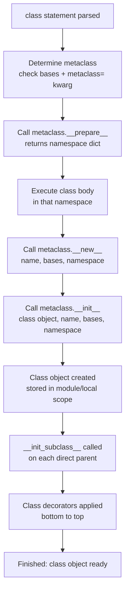

# :material-dna: Day 20 — Metaclasses & Class Internals

!!! abstract "Day at a Glance"
    **Goal:** Understand how Python creates classes at runtime, write metaclasses for plugin registries and singletons, use `__prepare__` for ordered namespaces, and reach for the lighter `__init_subclass__` alternative.
    **C++ Equivalent:** Day 20 of Learn-Modern-CPP-OOP-30-Days (CRTP, template metaprogramming, `static` class members)
    **Estimated Time:** 60–90 minutes

<div class="grid cards" markdown>
- :material-lightbulb-on: **Core Concept** — A metaclass is simply the class of a class; `type` is the default metaclass for every Python class
- :material-snake: **Python Way** — `type(name, bases, namespace)` builds classes at runtime; metaclasses intercept that process
- :material-alert: **Watch Out** — Metaclass conflicts arise when two bases use different metaclasses; use `__init_subclass__` when possible
- :material-check-circle: **By End of Day** — Implement a `RegistryMeta` plugin system and a `SingletonMeta`, understanding each step
</div>

---

## :material-lightbulb-on: Intuition

!!! info "Core Idea"
    When Python executes a `class` statement it calls `type.__new__(mcs, name, bases, namespace)` to
    produce the class object. A metaclass is a class that inherits from `type` and overrides `__new__`
    or `__init__` to intercept this moment — injecting attributes, registering the class, enforcing
    constraints, or transforming the namespace. Most of the time `__init_subclass__` covers the same
    use-cases with far less complexity.

!!! success "Python vs C++"
    | Feature | Python | C++ |
    |---|---|---|
    | Class-as-object | First-class; `type(MyClass)` is its metaclass | No equivalent |
    | Metaclass | `class Foo(metaclass=Meta)` | CRTP `template<class Derived>` |
    | Static members | Class-level attributes | `static` member variables |
    | Class registry | `RegistryMeta` or `__init_subclass__` | `static` registry map + CRTP |
    | Compile-time meta | Limited (decorators, metaclasses) | Template metaprogramming |
    | `__prepare__` | Custom namespace dict | No equivalent |

---

## :material-pipe: Class Creation Pipeline



---

## :material-book-open-variant: Lesson

### `type()` — Dynamic Class Creation

```python
# The two forms of type():
print(type(42))          # <class 'int'>  — query form
print(type("hello"))     # <class 'str'>

# Three-argument form: dynamically create a class
Dog = type(
    "Dog",                                # class name
    (object,),                            # base classes tuple
    {                                     # namespace (attribute dict)
        "species": "Canis lupus familiaris",
        "bark": lambda self: "Woof!",
        "__repr__": lambda self: f"Dog({self.name!r})",
    }
)

fido = Dog()
fido.name = "Fido"
print(fido.bark())       # Woof!
print(fido.species)      # Canis lupus familiaris

# Equivalent class statement:
class DogEquiv:
    species = "Canis lupus familiaris"
    def bark(self): return "Woof!"
```

### `__new__` vs `__init__` on Metaclasses

```python
class TracingMeta(type):
    def __new__(mcs, name, bases, namespace):
        """Called BEFORE the class object exists — can modify namespace."""
        print(f"[Meta.__new__] Creating class '{name}'")
        namespace["_created_by"] = "TracingMeta"
        cls = super().__new__(mcs, name, bases, namespace)
        return cls

    def __init__(cls, name, bases, namespace):
        """Called AFTER the class object exists — cls is already built."""
        print(f"[Meta.__init__] Initialising class '{cls.__name__}'")
        super().__init__(name, bases, namespace)


class MyModel(metaclass=TracingMeta):
    pass
# [Meta.__new__] Creating class 'MyModel'
# [Meta.__init__] Initialising class 'MyModel'

print(MyModel._created_by)   # TracingMeta
```

### `SingletonMeta`

```python
import threading


class SingletonMeta(type):
    """Thread-safe Singleton metaclass."""
    _instances: dict[type, object] = {}
    _lock: threading.Lock = threading.Lock()

    def __call__(cls, *args, **kwargs):
        if cls not in cls._instances:
            with cls._lock:
                if cls not in cls._instances:   # double-checked locking
                    instance = super().__call__(*args, **kwargs)
                    cls._instances[cls] = instance
        return cls._instances[cls]


class AppConfig(metaclass=SingletonMeta):
    def __init__(self) -> None:
        self.debug = False
        self.db_url = "sqlite:///app.db"


cfg1 = AppConfig()
cfg2 = AppConfig()
assert cfg1 is cfg2          # True
cfg1.debug = True
print(cfg2.debug)            # True — same instance
```

### `RegistryMeta` Plugin System

```python
from __future__ import annotations


class RegistryMeta(type):
    """Metaclass that maintains a class-level registry of all subclasses."""

    def __new__(mcs, name, bases, namespace):
        cls = super().__new__(mcs, name, bases, namespace)
        # Bootstrap: the base class itself has no registry yet
        if not hasattr(cls, "_registry"):
            cls._registry: dict[str, type] = {}
        # Register concrete (non-abstract) subclasses
        if bases:
            plugin_name = namespace.get("name", name.lower())
            cls._registry[plugin_name] = cls
        return cls

    @classmethod
    def get_plugin(mcs, name: str) -> type:
        # Walk all subclasses of any class using this metaclass
        for klass in mcs.__instancecheck__.__self__._registry.values():
            if klass.name == name:
                return klass
        raise KeyError(name)


class Serializer(metaclass=RegistryMeta):
    name: str = "base"

    def serialize(self, data: object) -> str:
        raise NotImplementedError

    @classmethod
    def create(cls, format_name: str) -> "Serializer":
        klass = cls._registry[format_name]
        return klass()


class JSONSerializer(Serializer):
    name = "json"

    def serialize(self, data: object) -> str:
        import json
        return json.dumps(data)


class CSVSerializer(Serializer):
    name = "csv"

    def serialize(self, data: object) -> str:
        if isinstance(data, list):
            return ",".join(str(x) for x in data)
        return str(data)


print(Serializer._registry)   # {'json': JSONSerializer, 'csv': CSVSerializer}
s = Serializer.create("json")
print(s.serialize({"key": "value"}))   # {"key": "value"}
```

### `__prepare__` — Ordered / Custom Namespace

```python
class OrderedMeta(type):
    """Track the order in which class attributes are defined."""

    @classmethod
    def __prepare__(mcs, name, bases, **kwargs):
        """Returns the namespace dict used during class body execution."""
        # Return an OrderedDict (redundant in Python 3.7+ but illustrative)
        from collections import OrderedDict
        ns = OrderedDict()
        ns["_field_order"] = []
        return ns

    def __new__(mcs, name, bases, namespace):
        # Capture attribute definition order before converting to plain dict
        field_order = [
            k for k in namespace
            if not k.startswith("_") and not callable(namespace[k])
        ]
        cls = super().__new__(mcs, name, bases, dict(namespace))
        cls._field_order = field_order
        return cls


class Record(metaclass=OrderedMeta):
    first_name: str = ""
    last_name: str = ""
    age: int = 0
    email: str = ""


print(Record._field_order)   # ['first_name', 'last_name', 'age', 'email']
```

### `__init_subclass__` — The Lighter Alternative

```python
class Plugin:
    """Base class with automatic subclass registration — no metaclass needed."""
    _registry: dict[str, type] = {}

    def __init_subclass__(cls, plugin_name: str = "", **kwargs: object) -> None:
        super().__init_subclass__(**kwargs)
        if plugin_name:
            Plugin._registry[plugin_name] = cls

    @classmethod
    def create(cls, name: str) -> "Plugin":
        return cls._registry[name]()


class PDFPlugin(Plugin, plugin_name="pdf"):
    def render(self) -> str:
        return "Rendering PDF"


class HTMLPlugin(Plugin, plugin_name="html"):
    def render(self) -> str:
        return "Rendering HTML"


print(Plugin._registry)               # {'pdf': PDFPlugin, 'html': HTMLPlugin}
print(Plugin.create("pdf").render())  # Rendering PDF
```

### Introspection Tools

```python
class Point:
    x: int
    y: int

    def __init__(self, x: int, y: int) -> None:
        self.x = x
        self.y = y

    def distance(self) -> float:
        return (self.x**2 + self.y**2) ** 0.5


p = Point(3, 4)

# vars() — instance/class __dict__
print(vars(p))                    # {'x': 3, 'y': 4}
print(vars(Point))                # includes 'distance', '__init__', ...

# dir() — all attributes including inherited
print([a for a in dir(p) if not a.startswith("__")])  # ['distance', 'x', 'y']

# getattr / setattr / hasattr / delattr
print(getattr(p, "x"))            # 3
setattr(p, "z", 0)
print(hasattr(p, "z"))            # True
delattr(p, "z")

# type() and __mro__
print(type(p))                    # <class '__main__.Point'>
print(Point.__mro__)              # (Point, object)
print(type(Point))                # <class 'type'>  — metaclass
```

---

## :material-alert: Common Pitfalls

!!! warning "Metaclass Conflict from Multiple Inheritance"
    ```python
    class MetaA(type): pass
    class MetaB(type): pass

    class A(metaclass=MetaA): pass
    class B(metaclass=MetaB): pass

    class C(A, B): pass   # TypeError: metaclass conflict!
    # Fix: create a combined metaclass
    class MetaC(MetaA, MetaB): pass
    class C(A, B, metaclass=MetaC): pass
    ```

!!! warning "`__init_subclass__` Is Called on Abstract Base Too"
    ```python
    class Plugin:
        _registry = {}
        def __init_subclass__(cls, plugin_name="", **kwargs):
            super().__init_subclass__(**kwargs)
            if plugin_name:                  # guard against unnamed base
                Plugin._registry[plugin_name] = cls

    # Without the guard, intermediate abstract classes with no plugin_name
    # would be registered under an empty-string key.
    ```

!!! danger "Metaclass `__call__` Bypasses Normal `__init__`"
    When you override `SingletonMeta.__call__`, you control the entire construction process.
    If you return the cached instance **without** calling `super().__call__()`, `__init__`
    is never called on subsequent accesses — which is intentional for Singleton, but can
    surprise you if you expect `__init__` to run each time.

!!! danger "Modifying `__dict__` of a Class After Creation"
    Class `__dict__` is a `mappingproxy` — it's read-only. To add attributes after class
    creation, use `setattr(cls, "attr", value)`, not `cls.__dict__["attr"] = value`
    (which raises `TypeError`).

---

## :material-help-circle: Flashcards

???+ question "What is the execution order when Python encounters a `class` statement?"
    1. Python determines the metaclass (from `metaclass=` kwarg, or inherits from base, or defaults to `type`).
    2. `metaclass.__prepare__()` is called to get the namespace dict.
    3. The class body is executed inside that namespace.
    4. `metaclass.__new__(mcs, name, bases, namespace)` creates the class object.
    5. `metaclass.__init__(cls, name, bases, namespace)` initialises it.
    6. `__init_subclass__` is called on each base.
    7. Class decorators are applied.

???+ question "When should you use a metaclass vs `__init_subclass__`?"
    Use `__init_subclass__` for the vast majority of cases: auto-registration, attribute validation,
    required method enforcement, and keyword argument passing. Use a metaclass only when you need
    `__prepare__` (custom namespace), need to intercept `__new__` before the class exists,
    or need `__call__` on the class itself (e.g., Singleton).

???+ question "What does `vars(obj)` return, and how does it differ from `dir(obj)`?"
    `vars(obj)` returns `obj.__dict__` — only attributes stored directly on that object
    (not inherited). `dir(obj)` returns a sorted list of **all** attribute names including
    inherited ones, class methods, and built-in dunder methods. `vars()` raises `TypeError`
    for objects without `__dict__` (e.g., those using `__slots__`).

???+ question "Why is `type(MyClass)` the metaclass, not the parent class?"
    Python separates the **instance-of** relationship (metaclass) from the **subclass-of**
    relationship (base class). `MyClass` is an **instance** of its metaclass; `isinstance(MyClass, type)`
    is `True`. `MyClass` is a **subclass** of its bases. `type` is both the default metaclass
    (creates all classes) and a base class (all metaclasses inherit from it).

---

## :material-clipboard-check: Self Test

=== "Question 1"
    Without using a metaclass, write a `Validator` base class that uses `__init_subclass__` to
    enforce that every subclass defines a `validate(value) -> bool` method, raising
    `TypeError` at class creation time if it does not.

=== "Answer 1"
    ```python
    class Validator:
        def __init_subclass__(cls, **kwargs):
            super().__init_subclass__(**kwargs)
            if "validate" not in cls.__dict__:
                raise TypeError(
                    f"Class '{cls.__name__}' must define a 'validate' method"
                )

        def validate(self, value) -> bool:
            raise NotImplementedError


    class EmailValidator(Validator):
        def validate(self, value: str) -> bool:
            return "@" in value


    # This would raise TypeError at class definition time:
    # class BrokenValidator(Validator):
    #     pass   # no validate method!

    ev = EmailValidator()
    print(ev.validate("a@b.com"))    # True
    print(ev.validate("notanemail")) # False
    ```

=== "Question 2"
    Implement an `AutoSlotsMeta` metaclass that automatically sets `__slots__` on the new
    class to the list of annotations defined in the class body (i.e., replaces the need to
    write `__slots__ = (...)` manually).

=== "Answer 2"
    ```python
    class AutoSlotsMeta(type):
        def __new__(mcs, name, bases, namespace):
            annotations = namespace.get("__annotations__", {})
            # Only slot names declared in THIS class, not bases
            slots = tuple(annotations.keys())
            namespace["__slots__"] = slots
            # Remove defaults if provided (slots can't have class-level defaults
            # unless they are descriptors — keep it simple here)
            cls = super().__new__(mcs, name, bases, namespace)
            return cls


    class Point(metaclass=AutoSlotsMeta):
        x: float
        y: float

        def __init__(self, x: float, y: float) -> None:
            self.x = x
            self.y = y

        def distance(self) -> float:
            return (self.x**2 + self.y**2) ** 0.5


    p = Point(3.0, 4.0)
    print(p.distance())          # 5.0
    print(Point.__slots__)       # ('x', 'y')
    # p.z = 1                    # AttributeError — no __dict__
    ```

---

## :material-check-circle: Summary

!!! success "Key Takeaways"
    - `type(name, bases, namespace)` is the runtime factory for all classes; metaclasses override this factory.
    - Class creation order: `__prepare__` → class body execution → `__new__` → `__init__` → `__init_subclass__` → decorators.
    - `SingletonMeta` overrides `__call__` to return a cached instance; double-checked locking makes it thread-safe.
    - `RegistryMeta.__new__` intercepts class creation to register concrete subclasses automatically.
    - `__prepare__` returns the namespace dict used during class body execution — useful for ordered or instrumented namespaces.
    - Prefer `__init_subclass__` over metaclasses for registration, validation, and keyword-argument patterns; reach for metaclasses only when you need `__prepare__` or `__call__`-level control.
    - `vars()`, `dir()`, `getattr()`, `setattr()`, `hasattr()`, and `type()` form the introspection toolkit for runtime class exploration.
