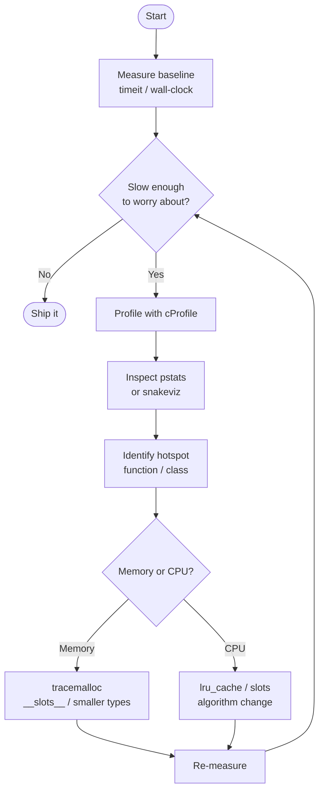

# :material-speedometer: Day 22 — Performance & Profiling

!!! abstract "Day at a Glance"
    **Goal:** Measure, locate, and eliminate performance bottlenecks in Python OOP code using the standard-library toolchain.
    **C++ Equivalent:** Day 22 of Learn-Modern-CPP-OOP-30-Days
    **Estimated Time:** 60–90 minutes

<div class="grid cards" markdown>
- :material-lightbulb-on: **Core Concept** — You cannot optimise what you have not measured first.
- :material-snake: **Python Way** — `timeit`, `cProfile`, `tracemalloc`, `__slots__`, and `lru_cache` are your standard toolkit.
- :material-alert: **Watch Out** — Micro-optimising before profiling wastes time and produces unmaintainable code.
- :material-check-circle: **By End of Day** — You can profile a class hierarchy, find the hot-spot, and apply the right fix.
</div>

---

## :material-lightbulb-on: Intuition

!!! info "Core Idea"
    Python's dynamic runtime is convenient but has costs: every attribute access goes through a dictionary lookup, every method call involves descriptor resolution, and every object carries a `__dict__` that consumes memory.  
    The profiling loop is **measure → profile → identify hotspot → optimise → re-measure**.  
    Skipping any step leads to either premature pessimism ("Python is slow") or wasted effort on irrelevant code.

!!! success "Python vs C++"
    | Concern | C++ | Python |
    |---|---|---|
    | Micro-benchmark | Google Benchmark | `timeit` module |
    | Call-graph profiling | gprof / perf | `cProfile` + `pstats` |
    | Memory profiling | Valgrind / AddressSanitizer | `tracemalloc` |
    | Avoid per-instance dict | N/A (structs are fixed) | `__slots__` |
    | Memoisation | Manual / `std::unordered_map` | `functools.lru_cache` |
    | SIMD arrays | `std::vector<double>` | `array.array` / NumPy |

---

## :material-transit-connection-variant: Profiling Workflow



---

## :material-book-open-variant: Lesson

### 1. `timeit` — Micro-benchmarks

```python
import timeit

# Compare list vs tuple construction
list_time  = timeit.timeit("x = [1, 2, 3, 4, 5]", number=1_000_000)
tuple_time = timeit.timeit("x = (1, 2, 3, 4, 5)", number=1_000_000)

print(f"list:  {list_time:.3f}s")   # typically ~0.06 s
print(f"tuple: {tuple_time:.3f}s")  # typically ~0.02 s
```

Use `timeit` only for **isolated, repeatable** snippets. For whole-program timing, reach for `cProfile`.

---

### 2. `cProfile` + `pstats` — Call-graph Profiling

```python
import cProfile
import pstats
import io

class Vector:
    def __init__(self, x, y, z):
        self.x, self.y, self.z = x, y, z

    def magnitude(self):
        return (self.x**2 + self.y**2 + self.z**2) ** 0.5

def heavy_computation():
    vectors = [Vector(i, i+1, i+2) for i in range(100_000)]
    return sum(v.magnitude() for v in vectors)

# Profile it
profiler = cProfile.Profile()
profiler.enable()
result = heavy_computation()
profiler.disable()

stream = io.StringIO()
stats  = pstats.Stats(profiler, stream=stream).sort_stats("cumulative")
stats.print_stats(10)          # top-10 functions
print(stream.getvalue())
```

Key columns in `pstats` output:

| Column | Meaning |
|---|---|
| `ncalls` | Total calls |
| `tottime` | Time **in** this function (excluding callees) |
| `cumtime` | Time **including** callees |
| `percall` | `cumtime / ncalls` |

---

### 3. `__slots__` — Eliminate the Instance Dictionary

Without `__slots__` every instance carries a `__dict__` (~200 bytes overhead).

```python
import tracemalloc
from dataclasses import dataclass

# ---- Without slots ----
class PointDict:
    def __init__(self, x, y, z):
        self.x, self.y, self.z = x, y, z

# ---- With slots ----
class PointSlots:
    __slots__ = ("x", "y", "z")
    def __init__(self, x, y, z):
        self.x, self.y, self.z = x, y, z

N = 100_000

tracemalloc.start()
pts_dict = [PointDict(i, i, i) for i in range(N)]
_, peak_dict = tracemalloc.get_traced_memory()
tracemalloc.reset_peak()

pts_slots = [PointSlots(i, i, i) for i in range(N)]
_, peak_slots = tracemalloc.get_traced_memory()
tracemalloc.stop()

print(f"dict  peak: {peak_dict  / 1_048_576:.1f} MB")   # ~35 MB
print(f"slots peak: {peak_slots / 1_048_576:.1f} MB")   # ~12 MB
```

!!! warning "__slots__ with inheritance"
    If a parent class does **not** define `__slots__`, its subclass will still have a `__dict__` even if the child declares `__slots__`.  Every class in the chain must opt in.

---

### 4. `lru_cache` — Transparent Memoisation

```python
from functools import lru_cache
import timeit

# Without cache — exponential recomputation
def fib_slow(n: int) -> int:
    if n < 2:
        return n
    return fib_slow(n - 1) + fib_slow(n - 2)

# With cache — linear in the number of unique calls
@lru_cache(maxsize=None)
def fib_fast(n: int) -> int:
    if n < 2:
        return n
    return fib_fast(n - 1) + fib_fast(n - 2)

slow_time = timeit.timeit(lambda: fib_slow(30), number=10)
fast_time = timeit.timeit(lambda: fib_fast(30), number=10)
print(f"slow: {slow_time:.3f}s  fast: {fast_time:.6f}s")
# slow: ~3 s   fast: ~0.000002 s
```

For methods on instances use `functools.cached_property` (computed once, stored in `__dict__`):

```python
import math
from functools import cached_property

class Circle:
    def __init__(self, radius: float) -> None:
        self.radius = radius

    @cached_property
    def area(self) -> float:
        print("computing …")
        return math.pi * self.radius ** 2

c = Circle(5)
print(c.area)   # prints "computing …" then result
print(c.area)   # returns instantly from __dict__
```

---

### 5. `tracemalloc` — Memory Snapshots

```python
import tracemalloc

tracemalloc.start()

data = {i: [j for j in range(100)] for i in range(1000)}

snapshot = tracemalloc.take_snapshot()
top_stats = snapshot.statistics("lineno")

for stat in top_stats[:5]:
    print(stat)
```

---

### 6. Container Performance Cheat-Sheet

| Operation | `list` | `tuple` | `array.array` | `collections.deque` |
|---|---|---|---|---|
| Append (end) | O(1) amortised | N/A | O(1) amortised | O(1) |
| Prepend | O(n) | N/A | O(n) | O(1) |
| Random access | O(1) | O(1) | O(1) | O(n) |
| Memory / element | ~56 bytes | ~40 bytes | ~8 bytes (float64) | ~56 bytes |
| Iteration speed | Fast | Fast | **Fastest** (typed) | Moderate |

---

### 7. OOP-Specific Pitfalls to Profile

```python
# Pitfall 1: Repeated attribute lookup in tight loop
class Particle:
    def __init__(self, mass):
        self.mass = mass

particles = [Particle(i) for i in range(100_000)]

# Slow — re-resolves .mass every iteration
total_slow = sum(p.mass for p in particles)

# Faster — cache the lookup
get_mass = Particle.mass.fget if hasattr(Particle.mass, 'fget') else None
# Or simply: use __slots__ so .mass is a slot descriptor, not a dict lookup
```

---

## :material-alert: Common Pitfalls

!!! warning "Optimising Without Measuring"
    Intuition about Python bottlenecks is often wrong. A list comprehension **may** be slower than a for-loop if the body is complex — profile first.

!!! warning "`__slots__` Breaks `pickle` and `copy` by Default"
    If you use `__slots__`, implement `__getstate__` / `__setstate__` if you need serialisation, or include `__dict__` in `__slots__` to regain the standard behaviour.

!!! danger "`lru_cache` on Instance Methods Leaks Memory"
    ```python
    # BAD — the cache holds a strong reference to `self`, preventing GC
    class Processor:
        @lru_cache(maxsize=128)
        def compute(self, value):
            ...
    ```
    Use `functools.cached_property` for per-instance caching, or apply `lru_cache` only to module-level or `@staticmethod` functions.

!!! danger "Profiling in Debug Mode"
    Always profile with the same flags you use in production. Debug builds (e.g., assertions enabled, extra logging) will report completely different hotspots.

---

## :material-help-circle: Flashcards

???+ question "What does `tottime` mean in `pstats` output?"
    **`tottime`** is the total time spent **inside** that function, excluding time spent in functions it called.  Compare with `cumtime` which includes callee time.  Focus on `tottime` to find functions doing unnecessary work themselves.

???+ question "When should you choose `__slots__` over a plain class?"
    Use `__slots__` when you create **large numbers of small objects** (e.g., particles, nodes, records) and memory is a concern.  The trade-off is loss of dynamic attribute assignment and slightly more complex inheritance.

???+ question "Why does `lru_cache` on an instance method cause a memory leak?"
    The cache is attached to the **function object** (shared across all instances), and each unique `self` becomes a cache key — holding a strong reference and preventing garbage collection of the instances.

???+ question "What is the difference between `timeit` and `cProfile`?"
    `timeit` measures the **wall-clock time of a small code snippet** in isolation (no call breakdown).  `cProfile` instruments the entire call graph and reports per-function call counts and times — use it to find *where* time is spent.

---

## :material-clipboard-check: Self Test

=== "Question 1"
    A class `Node` is instantiated millions of times as part of a graph.  Peak memory is 2 GB.  What is the single most effective change to reduce memory?

=== "Answer 1"
    Add `__slots__ = ("value", "next", "prev")` (or whatever attributes `Node` uses).  This removes the per-instance `__dict__`, typically cutting per-object overhead by 40–60 %.

=== "Question 2"
    You find that `cProfile` shows `fib` is the top cumulative-time function with 2^30 calls.  What one decorator would reduce calls to O(n)?

=== "Answer 2"
    `@functools.lru_cache(maxsize=None)` (or `@functools.cache` in Python 3.9+).  It stores previously computed results, transforming exponential recursion into linear work.

---

## :material-check-circle: Summary

!!! success "Key Takeaways"
    - **Measure first**: use `timeit` for snippets, `cProfile` + `pstats` for call graphs, `tracemalloc` for memory.
    - **`__slots__`** removes the per-instance dictionary — big win for millions of small objects.
    - **`lru_cache`** / `cache` provides transparent memoisation with near-zero boilerplate.
    - **Container choice matters**: `array.array` and `tuple` are faster and leaner than `list` for read-heavy numeric data.
    - **Profile in production conditions** — debug mode overhead skews results.
    - The profiling cycle is **measure → profile → hotspot → optimise → re-measure**.
