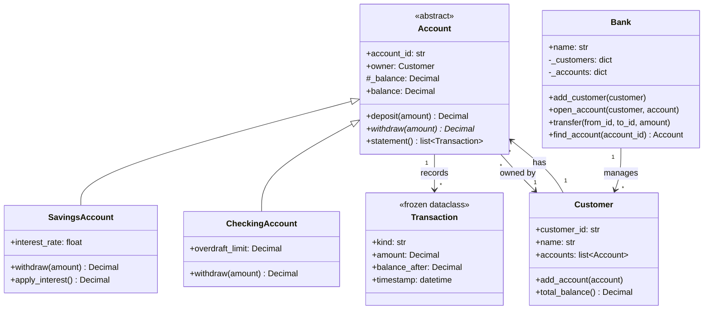

# :material-bank: Day 24 — Mini Project 1: Bank System

!!! abstract "Day at a Glance"
    **Goal:** Build a complete, production-quality OOP bank system that consolidates every concept from Days 1–21: ABCs, dataclasses, descriptors, `Decimal`, overdraft protection, and transaction history.
    **C++ Equivalent:** Day 24 of Learn-Modern-CPP-OOP-30-Days
    **Estimated Time:** 60–90 minutes

<div class="grid cards" markdown>
- :material-lightbulb-on: **Core Concept** — A real project exposes gaps that isolated exercises hide; every OOP concept must earn its place.
- :material-snake: **Python Way** — `ABC`, frozen `dataclass`, `Decimal`, `property`, `__repr__`, `__str__`, type hints throughout.
- :material-alert: **Watch Out** — Never use `float` for money; rounding errors accumulate silently.
- :material-check-circle: **By End of Day** — You have a runnable, extensible bank system and can explain which OOP pattern solves which business rule.
</div>

---

## :material-lightbulb-on: Intuition

!!! info "Core Idea"
    A bank system is a canonical OOP kata because it demands almost every tool in the toolkit at once: **abstraction** (what is an Account?), **encapsulation** (balances are not public), **inheritance** (Savings vs Checking), **polymorphism** (deposit/withdraw behave differently per type), **composition** (a Customer has Accounts; a Bank has Customers), and **value objects** (an immutable Transaction record).

!!! success "Python vs C++"
    | OOP Concept | C++ mechanism | Python mechanism used here |
    |---|---|---|
    | Abstract base class | `= 0` pure virtual | `ABC` + `@abstractmethod` |
    | Immutable record | `const` struct | frozen `@dataclass` |
    | Encapsulation | `private:` | `_balance` + `@property` |
    | Operator overload | `operator+` | `__add__`, `__repr__` |
    | Money type | `long` cents / Boost.Multiprecision | `decimal.Decimal` |
    | Collection of accounts | `std::vector<unique_ptr<Account>>` | `list[Account]` |

---

## :material-transit-connection-variant: Class Diagram



---

## :material-book-open-variant: Lesson

### 1. `Transaction` — Frozen Dataclass (Value Object)

```python
from __future__ import annotations
from dataclasses import dataclass, field
from datetime import datetime, timezone
from decimal import Decimal

@dataclass(frozen=True, order=True)
class Transaction:
    """Immutable record of a single account event."""
    kind:          str             # "deposit" | "withdrawal" | "interest" | "transfer"
    amount:        Decimal
    balance_after: Decimal
    timestamp:     datetime = field(
        default_factory=lambda: datetime.now(timezone.utc),
        compare=False,
    )

    def __str__(self) -> str:
        ts = self.timestamp.strftime("%Y-%m-%d %H:%M:%S")
        sign = "+" if self.kind in ("deposit", "interest") else "-"
        return (
            f"[{ts}] {self.kind:>12}  "
            f"{sign}{self.amount:>10.2f}  "
            f"balance: {self.balance_after:>10.2f}"
        )
```

Using `frozen=True` means the object is hashable, can be stored in sets, and cannot be accidentally mutated — perfect for an audit log.

---

### 2. `Account` — Abstract Base Class

```python
from abc import ABC, abstractmethod
from typing import TYPE_CHECKING

if TYPE_CHECKING:
    from .customer import Customer

class InsufficientFundsError(Exception):
    """Raised when a withdrawal would exceed the available balance."""

class NegativeAmountError(ValueError):
    """Raised when a monetary amount is zero or negative."""

class Account(ABC):
    def __init__(
        self,
        account_id: str,
        owner: "Customer",
        initial_balance: Decimal = Decimal("0.00"),
    ) -> None:
        self.account_id = account_id
        self.owner      = owner
        self._balance   = Decimal(str(initial_balance))
        self._history:  list[Transaction] = []

    # ── Properties ──────────────────────────────────────────────────────────
    @property
    def balance(self) -> Decimal:
        return self._balance

    # ── Concrete helpers ─────────────────────────────────────────────────────
    def _validate_amount(self, amount: Decimal) -> None:
        if amount <= 0:
            raise NegativeAmountError(f"Amount must be positive, got {amount}")

    def deposit(self, amount: Decimal) -> Decimal:
        amount = Decimal(str(amount))
        self._validate_amount(amount)
        self._balance += amount
        self._history.append(
            Transaction("deposit", amount, self._balance)
        )
        return self._balance

    def statement(self) -> list[Transaction]:
        return list(self._history)   # defensive copy

    # ── Abstract ─────────────────────────────────────────────────────────────
    @abstractmethod
    def withdraw(self, amount: Decimal) -> Decimal:
        """Withdraw money; raise InsufficientFundsError if not possible."""

    # ── Dunder ───────────────────────────────────────────────────────────────
    def __repr__(self) -> str:
        return (
            f"{type(self).__name__}("
            f"id={self.account_id!r}, "
            f"owner={self.owner.name!r}, "
            f"balance={self._balance})"
        )
```

---

### 3. `SavingsAccount` and `CheckingAccount`

```python
class SavingsAccount(Account):
    def __init__(
        self,
        account_id: str,
        owner: "Customer",
        initial_balance: Decimal = Decimal("0.00"),
        interest_rate: float = 0.03,
    ) -> None:
        super().__init__(account_id, owner, initial_balance)
        self.interest_rate = interest_rate

    def withdraw(self, amount: Decimal) -> Decimal:
        amount = Decimal(str(amount))
        self._validate_amount(amount)
        if amount > self._balance:
            raise InsufficientFundsError(
                f"Cannot withdraw {amount}; balance is {self._balance}"
            )
        self._balance -= amount
        self._history.append(Transaction("withdrawal", amount, self._balance))
        return self._balance

    def apply_interest(self) -> Decimal:
        interest = (self._balance * Decimal(str(self.interest_rate))).quantize(
            Decimal("0.01")
        )
        self._balance += interest
        self._history.append(Transaction("interest", interest, self._balance))
        return self._balance


class CheckingAccount(Account):
    def __init__(
        self,
        account_id: str,
        owner: "Customer",
        initial_balance: Decimal = Decimal("0.00"),
        overdraft_limit: Decimal = Decimal("500.00"),
    ) -> None:
        super().__init__(account_id, owner, initial_balance)
        self.overdraft_limit = Decimal(str(overdraft_limit))

    def withdraw(self, amount: Decimal) -> Decimal:
        amount = Decimal(str(amount))
        self._validate_amount(amount)
        if amount > self._balance + self.overdraft_limit:
            raise InsufficientFundsError(
                f"Cannot withdraw {amount}; "
                f"balance {self._balance} + overdraft {self.overdraft_limit} exceeded"
            )
        self._balance -= amount
        self._history.append(Transaction("withdrawal", amount, self._balance))
        return self._balance
```

---

### 4. `Customer` and `Bank`

```python
from decimal import Decimal
from typing import Optional
import uuid

class Customer:
    def __init__(self, name: str, customer_id: Optional[str] = None) -> None:
        self.customer_id = customer_id or str(uuid.uuid4())[:8]
        self.name        = name
        self.accounts:   list[Account] = []

    def add_account(self, account: Account) -> None:
        self.accounts.append(account)

    def total_balance(self) -> Decimal:
        return sum((a.balance for a in self.accounts), Decimal("0.00"))

    def __repr__(self) -> str:
        return f"Customer(id={self.customer_id!r}, name={self.name!r})"


class Bank:
    def __init__(self, name: str) -> None:
        self.name       = name
        self._customers: dict[str, Customer] = {}
        self._accounts:  dict[str, Account]  = {}

    # ── Customer management ──────────────────────────────────────────────────
    def add_customer(self, customer: Customer) -> None:
        self._customers[customer.customer_id] = customer

    def open_account(self, customer: Customer, account: Account) -> None:
        if customer.customer_id not in self._customers:
            raise ValueError(f"Unknown customer {customer}")
        customer.add_account(account)
        self._accounts[account.account_id] = account

    # ── Transfers ────────────────────────────────────────────────────────────
    def transfer(
        self,
        from_account_id: str,
        to_account_id: str,
        amount: Decimal,
    ) -> None:
        """Atomic transfer: both sides must succeed or neither changes."""
        source = self.find_account(from_account_id)
        target = self.find_account(to_account_id)
        amount = Decimal(str(amount))

        # Validate first (raises before any mutation)
        if amount <= 0:
            raise NegativeAmountError("Transfer amount must be positive")
        available = source.balance + (
            source.overdraft_limit
            if isinstance(source, CheckingAccount)
            else Decimal("0")
        )
        if amount > available:
            raise InsufficientFundsError(
                f"Insufficient funds in {from_account_id}"
            )

        source.withdraw(amount)
        target.deposit(amount)

    def find_account(self, account_id: str) -> Account:
        try:
            return self._accounts[account_id]
        except KeyError:
            raise KeyError(f"No account with id {account_id!r}")

    def __repr__(self) -> str:
        return (
            f"Bank({self.name!r}, "
            f"customers={len(self._customers)}, "
            f"accounts={len(self._accounts)})"
        )
```

---

### 5. Putting It All Together

```python
from decimal import Decimal

# Setup
bank  = Bank("PyBank")
alice = Customer("Alice")
bob   = Customer("Bob")
bank.add_customer(alice)
bank.add_customer(bob)

# Open accounts
savings  = SavingsAccount("SAV-001", alice, Decimal("1000.00"), interest_rate=0.05)
checking = CheckingAccount("CHK-001", alice, Decimal("500.00"), overdraft_limit=Decimal("200.00"))
bobs_acc = SavingsAccount("SAV-002", bob, Decimal("250.00"))

bank.open_account(alice, savings)
bank.open_account(alice, checking)
bank.open_account(bob,   bobs_acc)

# Operations
savings.deposit(Decimal("200.00"))
savings.apply_interest()
checking.withdraw(Decimal("650.00"))   # uses overdraft

bank.transfer("SAV-001", "SAV-002", Decimal("100.00"))

# Print statement
for tx in savings.statement():
    print(tx)

print(f"\nAlice total: {alice.total_balance()}")
print(f"Bob   total: {bob.total_balance()}")
```

---

### 6. OOP Concept Map

| Business Rule | OOP Mechanism |
|---|---|
| Every account must implement `withdraw` | `@abstractmethod` on `Account` |
| Balance can't be set directly | `@property` with no setter |
| Transaction records are immutable | `frozen=True` dataclass |
| Savings and Checking behave differently | Polymorphism via override |
| A customer owns multiple accounts | Composition (`Customer.accounts`) |
| Bank orchestrates cross-account operations | Facade / controller class |
| Money never loses precision | `decimal.Decimal` |

---

## :material-alert: Common Pitfalls

!!! warning "Using `float` for Money"
    ```python
    # BAD
    balance = 0.1 + 0.2
    print(balance)  # 0.30000000000000004

    # GOOD
    from decimal import Decimal
    balance = Decimal("0.1") + Decimal("0.2")
    print(balance)  # 0.3
    ```

!!! warning "Non-Atomic Transfers"
    If you call `source.withdraw()` and then the program crashes before `target.deposit()`, money disappears. Always validate both sides before mutating either, or use a transactional data store.

!!! danger "Mutable Default in `__init__`"
    ```python
    # BAD — all instances share the same list!
    class Account:
        def __init__(self, history=[]):
            self._history = history

    # GOOD
    class Account:
        def __init__(self):
            self._history: list[Transaction] = []
    ```

!!! danger "Forgetting `super().__init__()` in Subclasses"
    `SavingsAccount.__init__` must call `super().__init__(account_id, owner, initial_balance)` or `_balance` and `_history` won't exist.

---

## :material-help-circle: Flashcards

???+ question "Why is `Transaction` a frozen dataclass instead of a plain class?"
    Frozen dataclasses are **immutable** — attributes cannot be changed after construction — which models the real-world constraint that financial records must not be altered.  They are also automatically hashable, so they can be stored in sets or used as dict keys.

???+ question "Why does `Account.withdraw` need to be abstract?"
    Savings and Checking have fundamentally different withdrawal rules (no overdraft vs. overdraft limit).  Making `withdraw` abstract forces every subclass to provide its own implementation and prevents an incomplete `Account` from being instantiated.

???+ question "What pattern does `Bank.transfer` use to ensure atomicity?"
    **Validate-then-mutate**: all preconditions are checked (and exceptions raised) **before** any balance is changed.  If either check fails, no mutation has occurred, so the system remains consistent.

???+ question "Why use `Decimal(str(amount))` instead of `Decimal(amount)` when `amount` is a float?"
    `Decimal(0.1)` captures the binary floating-point approximation of `0.1` (e.g. `Decimal('0.1000000000000000055511151231257827021181583404541015625')`).  `Decimal("0.1")` or `Decimal(str(0.1))` gives the exact decimal representation.

---

## :material-clipboard-check: Self Test

=== "Question 1"
    A junior developer adds `balance = 0` as a class-level attribute on `Account` before `__init__`.  What bug does this introduce?

=== "Answer 1"
    The class-level `balance = 0` would be shadowed by the instance attribute `self._balance` set in `__init__`, so it has no practical effect **if** the property is used.  However, if any code accidentally reads `Account.balance` (the class attribute) instead of `instance.balance`, it gets `0`.  More dangerously, if the developer meant to make `_balance` a class attribute shared across all instances, every deposit/withdrawal would corrupt every account simultaneously.  The fix: never define mutable shared state at class level; always initialise per-instance data in `__init__`.

=== "Question 2"
    How would you add a `minimum_balance` constraint to `SavingsAccount.withdraw` without duplicating the validation code in `CheckingAccount`?

=== "Answer 2"
    Add a `_minimum_balance` attribute (default `Decimal("0")`) on `Account` and a protected helper `_check_withdrawal(amount)` on `Account` that raises `InsufficientFundsError` if `self._balance - amount < self._minimum_balance`.  Both subclasses call `self._check_withdrawal(amount)` before mutating `_balance`.  `SavingsAccount` sets `_minimum_balance = Decimal("0")` and `CheckingAccount` sets it to `-self.overdraft_limit`, keeping the rule in one place.

---

## :material-check-circle: Summary

!!! success "Key Takeaways"
    - **Abstract Base Classes** enforce the contract that every `Account` subtype must implement `withdraw`.
    - **Frozen dataclasses** create immutable value objects perfect for audit logs.
    - **`Decimal`** is non-negotiable for financial arithmetic — never use `float`.
    - **Composition** (`Customer` has `Account`s; `Bank` has `Customer`s) models real ownership relationships.
    - **Validate before mutating** achieves pseudo-atomicity without a database transaction.
    - Every OOP concept from Days 1–21 has a concrete business justification in this project.
