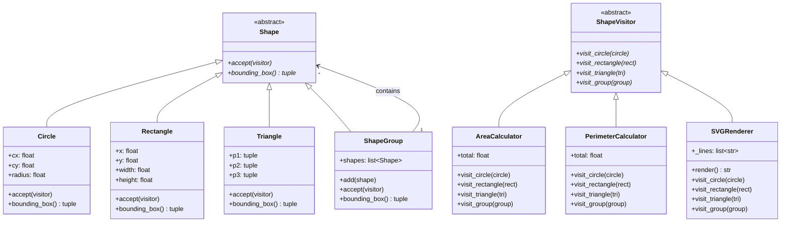

# :material-vector-square: Day 25 — Mini Project 2: Shape Editor

!!! abstract "Day at a Glance"
    **Goal:** Build a polymorphic shape hierarchy with the Visitor pattern, demonstrating double-dispatch in pure Python.
    **C++ Equivalent:** Day 25 of Learn-Modern-CPP-OOP-30-Days
    **Estimated Time:** 60–90 minutes

<div class="grid cards" markdown>
- :material-lightbulb-on: **Core Concept** — The Visitor pattern separates *algorithms* from *data structures*, letting you add new operations without touching the shape classes.
- :material-snake: **Python Way** — `ABC`, `@dataclass` with `__post_init__` validation, `Protocol`-style visitors, and the Composite pattern for `ShapeGroup`.
- :material-alert: **Watch Out** — Python has no function overloading; simulate double-dispatch with `isinstance` chains or `singledispatch`.
- :material-check-circle: **By End of Day** — You can add a new rendering backend (e.g., CanvasRenderer) without modifying any Shape class.
</div>

---

## :material-lightbulb-on: Intuition

!!! info "Core Idea"
    Without Visitor, adding "export to SVG" requires touching every shape class.  With Visitor, the shape classes only know how to `accept(visitor)` — the visitor carries the algorithm.  This is the **Open/Closed Principle** in action: shapes are *closed* for modification, *open* for extension via new visitors.

!!! success "Python vs C++"
    | Concept | C++ | Python |
    |---|---|---|
    | Abstract shape | Pure virtual class | `ABC` + `@abstractmethod` |
    | Double dispatch | Virtual `accept` + overloaded `visit` | `accept(visitor)` + `isinstance` / `singledispatch` |
    | Composite pattern | `std::vector<unique_ptr<Shape>>` | `ShapeGroup` holding `list[Shape]` |
    | Validation in constructor | Constructor body | `@dataclass` with `__post_init__` |
    | Immutable geometry | `const` member | `frozen=True` dataclass field |

---

## :material-transit-connection-variant: Class Diagram



---

## :material-book-open-variant: Lesson

### 1. `Shape` Abstract Base Class

```python
from __future__ import annotations
from abc import ABC, abstractmethod
from typing import TYPE_CHECKING

if TYPE_CHECKING:
    from .visitor import ShapeVisitor

class Shape(ABC):
    """Abstract base for all geometric shapes."""

    @abstractmethod
    def accept(self, visitor: "ShapeVisitor") -> None:
        """Double-dispatch hook — call the correct visitor method."""

    @abstractmethod
    def bounding_box(self) -> tuple[float, float, float, float]:
        """Return (x_min, y_min, x_max, y_max)."""
```

---

### 2. Concrete Shapes with `@dataclass` and `__post_init__` Validation

```python
import math
from dataclasses import dataclass, field

@dataclass
class Circle(Shape):
    cx: float
    cy: float
    radius: float

    def __post_init__(self) -> None:
        if self.radius <= 0:
            raise ValueError(f"Circle radius must be positive, got {self.radius}")

    def accept(self, visitor: "ShapeVisitor") -> None:
        visitor.visit_circle(self)

    def bounding_box(self) -> tuple[float, float, float, float]:
        return (
            self.cx - self.radius, self.cy - self.radius,
            self.cx + self.radius, self.cy + self.radius,
        )


@dataclass
class Rectangle(Shape):
    x: float
    y: float
    width: float
    height: float

    def __post_init__(self) -> None:
        if self.width <= 0 or self.height <= 0:
            raise ValueError("Rectangle dimensions must be positive")

    def accept(self, visitor: "ShapeVisitor") -> None:
        visitor.visit_rectangle(self)

    def bounding_box(self) -> tuple[float, float, float, float]:
        return (self.x, self.y, self.x + self.width, self.y + self.height)


@dataclass
class Triangle(Shape):
    p1: tuple[float, float]
    p2: tuple[float, float]
    p3: tuple[float, float]

    def accept(self, visitor: "ShapeVisitor") -> None:
        visitor.visit_triangle(self)

    def bounding_box(self) -> tuple[float, float, float, float]:
        xs = [self.p1[0], self.p2[0], self.p3[0]]
        ys = [self.p1[1], self.p2[1], self.p3[1]]
        return (min(xs), min(ys), max(xs), max(ys))

    def _side_length(
        self,
        a: tuple[float, float],
        b: tuple[float, float],
    ) -> float:
        return math.hypot(b[0] - a[0], b[1] - a[1])
```

---

### 3. `ShapeGroup` — Composite Pattern

```python
@dataclass
class ShapeGroup(Shape):
    """A group of shapes treated as a single shape (Composite)."""
    shapes: list[Shape] = field(default_factory=list)

    def add(self, shape: Shape) -> "ShapeGroup":
        self.shapes.append(shape)
        return self                 # fluent interface

    def accept(self, visitor: "ShapeVisitor") -> None:
        visitor.visit_group(self)

    def bounding_box(self) -> tuple[float, float, float, float]:
        if not self.shapes:
            return (0.0, 0.0, 0.0, 0.0)
        boxes = [s.bounding_box() for s in self.shapes]
        return (
            min(b[0] for b in boxes), min(b[1] for b in boxes),
            max(b[2] for b in boxes), max(b[3] for b in boxes),
        )
```

---

### 4. `ShapeVisitor` ABC and Concrete Visitors

```python
from abc import ABC, abstractmethod

class ShapeVisitor(ABC):
    @abstractmethod
    def visit_circle(self, circle: Circle) -> None: ...

    @abstractmethod
    def visit_rectangle(self, rect: Rectangle) -> None: ...

    @abstractmethod
    def visit_triangle(self, tri: Triangle) -> None: ...

    @abstractmethod
    def visit_group(self, group: ShapeGroup) -> None: ...


# ── Area Calculator ──────────────────────────────────────────────────────────
class AreaCalculator(ShapeVisitor):
    def __init__(self) -> None:
        self.total: float = 0.0

    def visit_circle(self, circle: Circle) -> None:
        self.total += math.pi * circle.radius ** 2

    def visit_rectangle(self, rect: Rectangle) -> None:
        self.total += rect.width * rect.height

    def visit_triangle(self, tri: Triangle) -> None:
        # Shoelace formula
        x1, y1 = tri.p1
        x2, y2 = tri.p2
        x3, y3 = tri.p3
        self.total += abs(x1*(y2-y3) + x2*(y3-y1) + x3*(y1-y2)) / 2

    def visit_group(self, group: ShapeGroup) -> None:
        for shape in group.shapes:
            shape.accept(self)


# ── Perimeter Calculator ─────────────────────────────────────────────────────
class PerimeterCalculator(ShapeVisitor):
    def __init__(self) -> None:
        self.total: float = 0.0

    def visit_circle(self, circle: Circle) -> None:
        self.total += 2 * math.pi * circle.radius

    def visit_rectangle(self, rect: Rectangle) -> None:
        self.total += 2 * (rect.width + rect.height)

    def visit_triangle(self, tri: Triangle) -> None:
        self.total += (
            math.hypot(tri.p2[0]-tri.p1[0], tri.p2[1]-tri.p1[1]) +
            math.hypot(tri.p3[0]-tri.p2[0], tri.p3[1]-tri.p2[1]) +
            math.hypot(tri.p1[0]-tri.p3[0], tri.p1[1]-tri.p3[1])
        )

    def visit_group(self, group: ShapeGroup) -> None:
        for shape in group.shapes:
            shape.accept(self)


# ── SVG Renderer ─────────────────────────────────────────────────────────────
class SVGRenderer(ShapeVisitor):
    """Generates an SVG fragment for each shape."""

    def __init__(self, stroke: str = "black", fill: str = "none") -> None:
        self._lines: list[str] = []
        self._stroke = stroke
        self._fill   = fill

    def _attrs(self) -> str:
        return f'stroke="{self._stroke}" fill="{self._fill}"'

    def visit_circle(self, circle: Circle) -> None:
        self._lines.append(
            f'<circle cx="{circle.cx}" cy="{circle.cy}" '
            f'r="{circle.radius}" {self._attrs()}/>'
        )

    def visit_rectangle(self, rect: Rectangle) -> None:
        self._lines.append(
            f'<rect x="{rect.x}" y="{rect.y}" '
            f'width="{rect.width}" height="{rect.height}" {self._attrs()}/>'
        )

    def visit_triangle(self, tri: Triangle) -> None:
        pts = " ".join(f"{x},{y}" for x, y in [tri.p1, tri.p2, tri.p3])
        self._lines.append(f'<polygon points="{pts}" {self._attrs()}/>')

    def visit_group(self, group: ShapeGroup) -> None:
        self._lines.append('<g>')
        for shape in group.shapes:
            shape.accept(self)
        self._lines.append('</g>')

    def render(self) -> str:
        body = "\n  ".join(self._lines)
        return f'<svg xmlns="http://www.w3.org/2000/svg">\n  {body}\n</svg>'
```

---

### 5. Double-Dispatch Explained

```python
# Double-dispatch at work:
#   1. shape.accept(visitor)  → dispatches on the SHAPE type (Circle, Rectangle …)
#   2. visitor.visit_circle() → dispatches on the VISITOR type (Area, SVG …)

shapes: list[Shape] = [
    Circle(50, 50, 30),
    Rectangle(10, 10, 80, 40),
    Triangle((0,0), (100,0), (50,87)),
]

group = ShapeGroup().add(Circle(5,5,5)).add(Rectangle(0,0,20,10))

canvas: list[Shape] = shapes + [group]

# Calculate total area
area_visitor = AreaCalculator()
for s in canvas:
    s.accept(area_visitor)
print(f"Total area: {area_visitor.total:.2f}")

# Render to SVG
renderer = SVGRenderer(fill="lightblue")
for s in canvas:
    s.accept(renderer)
print(renderer.render())
```

---

## :material-alert: Common Pitfalls

!!! warning "`__post_init__` Is Not Called on `frozen=True` After Construction"
    `frozen=True` dataclasses still call `__post_init__` during `__init__`, so validation runs.  But you cannot assign to attributes afterwards — if you try, Python raises `FrozenInstanceError`.  For mutable geometry, omit `frozen=True`.

!!! warning "Forgetting to Recurse in `visit_group`"
    If `visit_group` does not iterate over `group.shapes` and call `shape.accept(self)`, nested groups and shapes are silently ignored — producing wrong totals with no error.

!!! danger "Adding Behaviour Directly to Shape Classes"
    ```python
    # BAD — every new algorithm pollutes every shape class
    class Circle:
        def area(self): ...
        def perimeter(self): ...
        def to_svg(self): ...
        def to_canvas(self): ...

    # GOOD — one visitor per algorithm; shapes stay clean
    class AreaCalculator(ShapeVisitor):
        def visit_circle(self, c): ...
    ```

!!! danger "Missing `accept` in a New Concrete Shape"
    If you add `Polygon` but forget to implement `accept`, calling `polygon.accept(visitor)` raises `TypeError`.  The ABC catches this at instantiation time — ensure `Polygon` inherits from `Shape` and the abstract method check fires.

---

## :material-help-circle: Flashcards

???+ question "What problem does the Visitor pattern solve?"
    It separates **algorithms** from the **object structure** they operate on.  You can add new operations (visitors) without modifying the shape classes, satisfying the Open/Closed Principle.

???+ question "What is double-dispatch and why does Python need a workaround?"
    Double-dispatch means a method call is resolved on **two** types — the receiver and the argument.  Python only supports single-dispatch (resolved on the receiver).  The workaround is `shape.accept(visitor)` which then calls `visitor.visit_<shape_type>(self)` — effectively two virtual calls in sequence.

???+ question "What does `__post_init__` do in a dataclass?"
    `__post_init__` is called by the generated `__init__` after all fields are assigned.  It is the place to run validation, compute derived fields, or call `super().__init__()` when the dataclass inherits from a non-dataclass.

???+ question "How does `ShapeGroup` implement the Composite pattern?"
    `ShapeGroup` is itself a `Shape` (same interface) but contains a list of `Shape`s.  Code that works with a single shape automatically works with a group — the group recursively delegates to its children.  This is the essence of Composite.

---

## :material-clipboard-check: Self Test

=== "Question 1"
    You want to add a `BoundingBoxPrinter` visitor that prints the bounding box of every shape.  What do you need to write?

=== "Answer 1"
    ```python
    class BoundingBoxPrinter(ShapeVisitor):
        def _print(self, shape: Shape) -> None:
            bb = shape.bounding_box()
            print(f"{type(shape).__name__}: {bb}")

        def visit_circle(self, circle: Circle) -> None:
            self._print(circle)

        def visit_rectangle(self, rect: Rectangle) -> None:
            self._print(rect)

        def visit_triangle(self, tri: Triangle) -> None:
            self._print(tri)

        def visit_group(self, group: ShapeGroup) -> None:
            self._print(group)
            for shape in group.shapes:
                shape.accept(self)   # recurse into children
    ```
    Zero changes to any Shape class.

=== "Question 2"
    Why must `Triangle.__post_init__` validate that the three points are not collinear for a "real" implementation?

=== "Answer 2"
    Three collinear points form a degenerate triangle with area = 0.  The shoelace formula will silently return 0, which is numerically correct but semantically meaningless (it's a line segment, not a triangle).  Validation raises `ValueError` early, making the caller aware of invalid input rather than producing a misleading zero area later.

---

## :material-check-circle: Summary

!!! success "Key Takeaways"
    - **Visitor** decouples algorithms from the shape hierarchy; new operations are new visitor classes, never new shape methods.
    - **Double-dispatch** in Python: `shape.accept(visitor)` → `visitor.visit_<type>(self)`.
    - **`@dataclass` + `__post_init__`** gives free `__init__`, `__repr__`, and `__eq__` plus custom validation in one class.
    - **Composite** (`ShapeGroup`) lets clients treat individual shapes and groups uniformly.
    - The Visitor pattern shines when the shape hierarchy is stable but the set of operations changes frequently — e.g., adding renderers, exporters, or analysers.
