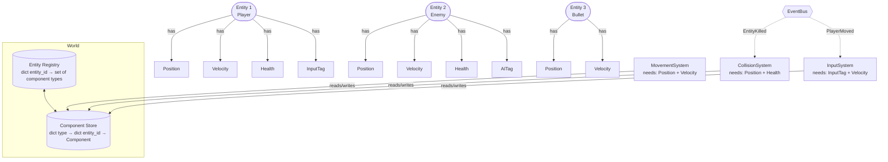

# :material-controller-classic: Day 26 — Mini Project 3: Game Entities (ECS)

!!! abstract "Day at a Glance"
    **Goal:** Implement a data-oriented Entity Component System (ECS) architecture and understand why it outperforms deep inheritance hierarchies for game-like domains.
    **C++ Equivalent:** Day 26 of Learn-Modern-CPP-OOP-30-Days
    **Estimated Time:** 60–90 minutes

<div class="grid cards" markdown>
- :material-lightbulb-on: **Core Concept** — ECS replaces inheritance with composition: an Entity is just an ID; behaviour comes from attaching Components; Systems iterate over entities that have the right components.
- :material-snake: **Python Way** — `dataclass` Components, `ABC` Systems, a `World` registry using `dict[type, dict[int, Component]]`, a typed `EventBus`.
- :material-alert: **Watch Out** — ECS trades readability for flexibility; don't use it for simple domain models where plain OOP is clearer.
- :material-check-circle: **By End of Day** — You can define new entity types purely by composing components — zero new classes, zero inheritance.
</div>

---

## :material-lightbulb-on: Intuition

!!! info "Core Idea"
    Classic game OOP leads to "the diamond of death": `FlyingFish` needs both `FlyingCreature` and `SwimmingCreature`, but multiple inheritance grows messy fast.  ECS solves this by making every capability a **Component** (a plain data bag) and every behaviour a **System** (a function that runs over entities with the right components).  A `FlyingFish` entity simply has both `FlyComponent` and `SwimComponent` — no class needed.

!!! success "Python vs C++ ECS Comparison"
    | ECS Element | C++ | Python |
    |---|---|---|
    | Entity | `uint32_t` ID | `int` ID |
    | Component | POD struct | frozen/mutable `@dataclass` |
    | System | Free function / class | `ABC` subclass with `update()` |
    | World / Registry | `entt::registry` (EnTT) | `World` dict-of-dicts |
    | Event bus | Signals / callbacks | `EventBus` with `dict[type, list[Callable]]` |
    | Archetype storage | Contiguous array per archetype | `dict[type, dict[int, Component]]` |

---

## :material-transit-connection-variant: ECS Architecture



---

## :material-book-open-variant: Lesson

### 1. Components — Pure Data Bags

```python
from __future__ import annotations
from dataclasses import dataclass, field
from typing import Any

# ── Position ──────────────────────────────────────────────────────────────────
@dataclass
class Position:
    x: float = 0.0
    y: float = 0.0

    def __add__(self, other: "Velocity") -> "Position":
        return Position(self.x + other.vx, self.y + other.vy)

# ── Velocity ──────────────────────────────────────────────────────────────────
@dataclass
class Velocity:
    vx: float = 0.0
    vy: float = 0.0
    max_speed: float = 10.0

    def clamp(self) -> None:
        import math
        speed = math.hypot(self.vx, self.vy)
        if speed > self.max_speed:
            factor = self.max_speed / speed
            self.vx *= factor
            self.vy *= factor

# ── Health ────────────────────────────────────────────────────────────────────
@dataclass
class Health:
    current: int
    maximum: int

    @property
    def is_alive(self) -> bool:
        return self.current > 0

    def take_damage(self, amount: int) -> None:
        self.current = max(0, self.current - amount)

    def heal(self, amount: int) -> None:
        self.current = min(self.maximum, self.current + amount)

# ── Tag components (zero data — existence signals capability) ─────────────────
@dataclass
class PlayerTag:
    name: str = "Player"

@dataclass
class AITag:
    behaviour: str = "patrol"   # "patrol" | "chase" | "flee"
```

---

### 2. `World` — The Central Registry

```python
from typing import TypeVar, Type, Iterator

Component = Any          # type alias for readability
EntityId   = int
CT = TypeVar("CT")       # component type variable

class World:
    """Central registry: creates entities, stores components, queries both."""

    def __init__(self) -> None:
        self._next_id:   EntityId = 0
        # component_type → {entity_id → component_instance}
        self._store:     dict[type, dict[EntityId, Any]] = {}
        self._alive:     set[EntityId] = set()

    # ── Entity lifecycle ──────────────────────────────────────────────────────
    def create_entity(self) -> EntityId:
        eid = self._next_id
        self._next_id += 1
        self._alive.add(eid)
        return eid

    def destroy_entity(self, eid: EntityId) -> None:
        self._alive.discard(eid)
        for store in self._store.values():
            store.pop(eid, None)

    # ── Component management ──────────────────────────────────────────────────
    def add(self, eid: EntityId, component: Any) -> None:
        ctype = type(component)
        self._store.setdefault(ctype, {})[eid] = component

    def get(self, eid: EntityId, ctype: Type[CT]) -> CT | None:
        return self._store.get(ctype, {}).get(eid)

    def has(self, eid: EntityId, *ctypes: type) -> bool:
        return all(eid in self._store.get(ct, {}) for ct in ctypes)

    # ── Query — iterate entities that have ALL requested component types ───────
    def query(self, *ctypes: type) -> Iterator[tuple[EntityId, ...]]:
        if not ctypes:
            return
        # Start with the smallest store to minimise iterations
        primary = min(ctypes, key=lambda ct: len(self._store.get(ct, {})))
        for eid in list(self._store.get(primary, {})):
            if eid in self._alive and self.has(eid, *ctypes):
                yield (eid, *(self._store[ct][eid] for ct in ctypes))
```

---

### 3. Systems — Logic Over Component Sets

```python
from abc import ABC, abstractmethod

class System(ABC):
    """Base class for all ECS systems."""

    @abstractmethod
    def update(self, world: World, dt: float) -> None:
        """Called once per game tick."""


class MovementSystem(System):
    """Moves every entity that has both Position and Velocity."""

    def update(self, world: World, dt: float) -> None:
        for eid, pos, vel in world.query(Position, Velocity):
            vel.clamp()
            pos.x += vel.vx * dt
            pos.y += vel.vy * dt


class CollisionSystem(System):
    """Naive O(n²) collision: damage health when positions overlap."""

    COLLISION_RADIUS = 1.5

    def update(self, world: World, dt: float) -> None:
        import math
        entities = list(world.query(Position, Health))
        for i, (eid_a, pos_a, hp_a) in enumerate(entities):
            for eid_b, pos_b, hp_b in entities[i+1:]:
                dist = math.hypot(pos_a.x - pos_b.x, pos_a.y - pos_b.y)
                if dist < self.COLLISION_RADIUS:
                    hp_a.take_damage(10)
                    hp_b.take_damage(10)


class AISystem(System):
    """Simple patrol AI: reverse velocity when out of bounds."""

    BOUNDS = 50.0

    def update(self, world: World, dt: float) -> None:
        for eid, pos, vel, ai in world.query(Position, Velocity, AITag):
            if ai.behaviour == "patrol":
                if abs(pos.x) > self.BOUNDS:
                    vel.vx = -vel.vx
                if abs(pos.y) > self.BOUNDS:
                    vel.vy = -vel.vy
```

---

### 4. Typed `EventBus`

```python
from collections import defaultdict
from dataclasses import dataclass as event_dataclass
from typing import Callable

@event_dataclass
class EntityKilled:
    entity_id: int
    killer_id: int | None

@event_dataclass
class DamageTaken:
    entity_id: int
    amount: int

class EventBus:
    def __init__(self) -> None:
        self._handlers: dict[type, list[Callable]] = defaultdict(list)

    def subscribe(self, event_type: type, handler: Callable) -> None:
        self._handlers[event_type].append(handler)

    def publish(self, event: Any) -> None:
        for handler in self._handlers.get(type(event), []):
            handler(event)

    def unsubscribe(self, event_type: type, handler: Callable) -> None:
        handlers = self._handlers.get(event_type, [])
        if handler in handlers:
            handlers.remove(handler)
```

---

### 5. `CharacterStateMachine` — Optional FSM Layer

```python
from enum import Enum, auto

class CharacterState(Enum):
    IDLE    = auto()
    RUNNING = auto()
    JUMPING = auto()
    DEAD    = auto()

class CharacterStateMachine:
    _transitions: dict[CharacterState, set[CharacterState]] = {
        CharacterState.IDLE:    {CharacterState.RUNNING, CharacterState.JUMPING},
        CharacterState.RUNNING: {CharacterState.IDLE, CharacterState.JUMPING},
        CharacterState.JUMPING: {CharacterState.IDLE},
        CharacterState.DEAD:    set(),
    }

    def __init__(self) -> None:
        self._state = CharacterState.IDLE

    @property
    def state(self) -> CharacterState:
        return self._state

    def transition(self, new_state: CharacterState) -> bool:
        if new_state in self._transitions[self._state]:
            print(f"  {self._state.name} → {new_state.name}")
            self._state = new_state
            return True
        print(f"  Invalid transition: {self._state.name} → {new_state.name}")
        return False
```

---

### 6. Complete Demo

```python
def main() -> None:
    world  = World()
    bus    = EventBus()
    systems: list[System] = [MovementSystem(), CollisionSystem(), AISystem()]

    # Create player
    player = world.create_entity()
    world.add(player, Position(0, 0))
    world.add(player, Velocity(2.0, 1.5))
    world.add(player, Health(100, 100))
    world.add(player, PlayerTag("Hero"))

    # Create enemy
    enemy = world.create_entity()
    world.add(enemy, Position(3, 0))
    world.add(enemy, Velocity(-1.0, 0.5))
    world.add(enemy, Health(50, 50))
    world.add(enemy, AITag("patrol"))

    # Subscribe to events
    def on_killed(evt: EntityKilled) -> None:
        print(f"Entity {evt.entity_id} was killed!")
    bus.subscribe(EntityKilled, on_killed)

    # Game loop — 10 ticks at dt=0.016 s (≈60 fps)
    DT = 0.016
    for tick in range(10):
        for system in systems:
            system.update(world, DT)

        # Check for deaths
        for eid, hp in world.query(Health):
            if not hp.is_alive:
                bus.publish(EntityKilled(entity_id=eid, killer_id=None))
                world.destroy_entity(eid)

    # Print final state
    for eid, pos, hp in world.query(Position, Health):
        print(f"Entity {eid}: pos=({pos.x:.2f},{pos.y:.2f}) hp={hp.current}")

main()
```

---

## :material-alert: Common Pitfalls

!!! warning "Iterating While Destroying"
    Calling `world.destroy_entity()` inside a `world.query()` loop modifies the underlying dict mid-iteration — use `list(world.query(...))` to snapshot first, then destroy after.

!!! warning "Components With Business Logic"
    Components should be **data only**.  Putting `move()` logic inside `Velocity` couples data and behaviour — that's what Systems are for.

!!! danger "Shared Mutable Component Instances"
    ```python
    DEFAULT_VEL = Velocity(0, 0)
    world.add(entity_a, DEFAULT_VEL)
    world.add(entity_b, DEFAULT_VEL)   # BAD — same object!
    ```
    Always pass a fresh instance per entity, or use `dataclasses.replace()` to copy.

!!! danger "Using ECS for Simple CRUD Models"
    ECS is a powerful but complex pattern.  For a simple bank system or form validator, plain OOP classes are clearer and cheaper.  Use ECS when entity types are highly variable and composed at runtime.

---

## :material-help-circle: Flashcards

???+ question "What are the three pillars of ECS?"
    1. **Entity** — a unique integer ID with no data or behaviour of its own.
    2. **Component** — a plain data bag attached to an entity (position, health, velocity).
    3. **System** — a function/class that queries entities with specific components and applies logic.

???+ question "Why is ECS better than deep inheritance for game entities?"
    Deep inheritance forces you to commit to a type hierarchy upfront.  Adding "swimming" to a flying creature requires multiple inheritance or refactoring.  ECS simply attaches a `SwimComponent` — no hierarchy change needed.

???+ question "What does `world.query(Position, Velocity)` return?"
    An iterator of tuples `(entity_id, position_component, velocity_component)` for every entity that has **all** listed component types.

???+ question "What is the EventBus used for in ECS?"
    It decouples systems from each other.  The `CollisionSystem` publishes a `DamageTaken` event; a `UISystem` subscribes and updates a health bar — neither system knows the other exists.

---

## :material-clipboard-check: Self Test

=== "Question 1"
    How would you create a "bullet" entity that has position and velocity but no health, and make `CollisionSystem` ignore it?

=== "Answer 1"
    Add only `Position` and `Velocity` to the bullet entity — do **not** add `Health`.  Since `CollisionSystem` calls `world.query(Position, Health)`, entities missing `Health` are invisible to it.  No code change needed in the system.

=== "Question 2"
    Describe how you would add a `RenderSystem` that draws every entity with a `Position` and a `Sprite` component to a screen, without modifying any existing class.

=== "Answer 2"
    ```python
    @dataclass
    class Sprite:
        image_path: str
        width: int
        height: int

    class RenderSystem(System):
        def __init__(self, screen) -> None:
            self._screen = screen

        def update(self, world: World, dt: float) -> None:
            for eid, pos, sprite in world.query(Position, Sprite):
                self._screen.blit(sprite.image_path, int(pos.x), int(pos.y))
    ```
    Add `RenderSystem(screen)` to the systems list.  No existing code changes.

---

## :material-check-circle: Summary

!!! success "Key Takeaways"
    - **ECS** replaces type-based inheritance with data-based composition: Entity (ID) + Component (data) + System (logic).
    - The `World` registry stores `{component_type: {entity_id: component}}` and provides `query(*ctypes)` for efficient iteration.
    - Systems are **open for extension**: new behaviour = new system, new capability = new component.  Existing code is untouched.
    - The **EventBus** decouples systems that would otherwise need direct references to each other.
    - Use `list(world.query(...))` before mutating the world inside a loop to avoid iterator invalidation.
    - ECS shines for **highly variable, runtime-composed** entities (games, simulations); prefer plain OOP for stable domain models.
