# :material-wrench: Day 27 — Refactoring Legacy Code

!!! abstract "Day at a Glance"
    **Goal:** Apply the classic refactoring catalogue to a Python legacy monolith, step by step, with type hints and tests as safety nets.
    **C++ Equivalent:** Day 27 of Learn-Modern-CPP-OOP-30-Days
    **Estimated Time:** 60–90 minutes

<div class="grid cards" markdown>
- :material-lightbulb-on: **Core Concept** — Refactoring is behaviour-preserving transformation; tests prove behaviour is preserved at every step.
- :material-snake: **Python Way** — Extract Method, Extract Class, Replace Conditional with Polymorphism, add type hints incrementally, introduce dependency injection.
- :material-alert: **Watch Out** — Never refactor and add features simultaneously; the scope will explode and bugs become untraceable.
- :material-check-circle: **By End of Day** — You can transform a 100-line monolithic function into a layered, testable class hierarchy.
</div>

---

## :material-lightbulb-on: Intuition

!!! info "Core Idea"
    Legacy code is not bad code — it is code without tests.  Before touching a single line, write a **characterisation test** that captures current behaviour (even if that behaviour is wrong).  Then refactor in tiny, reversible steps.  Every green test run is a checkpoint you can return to.

!!! success "Python vs C++"
    | Refactoring | C++ challenge | Python advantage |
    |---|---|---|
    | Extract Method | Risk of ABI break | Pure runtime — extract freely |
    | Add type hints | Types are enforced at compile time | Gradual — `mypy --ignore-missing-imports` |
    | Dependency injection | Constructor injection, templates | Constructor injection or `functools.partial` |
    | Replace Conditional with Polymorphism | vtable overhead discussion | Duck-typing makes switching easy |
    | Introduce ABC | Abstract class with `= 0` | `abc.ABC` + `@abstractmethod` |

---

## :material-transit-connection-variant: Refactoring Roadmap

```mermaid
graph LR
    A([Legacy Monolith\nprocess_order]) --> B[Write characterisation\ntests]
    B --> C[Extract Validate\nMethod]
    C --> D[Extract Calculate\nMethod]
    D --> E[Extract Notify\nMethod]
    E --> F[Extract OrderValidator\nClass]
    F --> G[Extract PricingEngine\nClass]
    G --> H[Replace conditional\nwith polymorphism]
    H --> I[Introduce\nDependency Injection]
    I --> J[Add type hints\nand run mypy]
    J --> K([Clean Layered\nArchitecture])

    style A fill:#f66,color:#fff
    style K fill:#6a6,color:#fff
```



---

## :material-book-open-variant: Lesson

### Step 0 — The Legacy Monolith (Before)

```python
# legacy.py  — DO NOT EDIT until tests are written
import datetime

def process_order(order):
    # validate
    if not order.get('customer_id'):
        raise ValueError("Missing customer")
    if not order.get('items'):
        raise ValueError("No items")
    for item in order['items']:
        if item.get('qty', 0) <= 0:
            raise ValueError(f"Bad qty for {item.get('sku')}")
        if item.get('price', 0) <= 0:
            raise ValueError(f"Bad price for {item.get('sku')}")

    # calculate
    subtotal = 0
    for item in order['items']:
        subtotal += item['qty'] * item['price']
    discount = 0
    if order.get('coupon') == 'SAVE10':
        discount = subtotal * 0.10
    elif order.get('coupon') == 'SAVE20':
        discount = subtotal * 0.20
    tax = (subtotal - discount) * 0.08
    total = subtotal - discount + tax

    # persist
    order['status']     = 'processed'
    order['total']      = round(total, 2)
    order['processed_at'] = str(datetime.datetime.utcnow())

    # notify
    if order.get('email'):
        print(f"[EMAIL] Sending receipt to {order['email']}")
    if order.get('sms'):
        print(f"[SMS] Sending receipt to {order['sms']}")

    return order
```

This function violates SRP in four different ways: validation, pricing, persistence, and notification are all tangled together.

---

### Step 1 — Write Characterisation Tests

```python
# test_legacy.py
import pytest
from legacy import process_order

VALID_ORDER = {
    "customer_id": "C001",
    "items": [
        {"sku": "A1", "qty": 2, "price": 10.00},
        {"sku": "B2", "qty": 1, "price": 5.00},
    ],
    "email": "alice@example.com",
}

def test_valid_order_total():
    result = process_order(dict(VALID_ORDER))
    # subtotal=25, no discount, tax=2, total=27
    assert result["total"] == 27.0

def test_coupon_save10():
    order = {**VALID_ORDER, "coupon": "SAVE10"}
    result = process_order(dict(order))
    # subtotal=25, discount=2.5, tax=1.8, total=24.3
    assert result["total"] == 24.3

def test_missing_customer_raises():
    with pytest.raises(ValueError, match="Missing customer"):
        process_order({"items": [{"sku": "A", "qty": 1, "price": 1}]})
```

Run these first.  They are your safety net throughout the refactoring.

---

### Step 2 — Extract Method (Validation)

```python
def _validate_order(order: dict) -> None:
    """Raise ValueError if order data is invalid."""
    if not order.get("customer_id"):
        raise ValueError("Missing customer")
    if not order.get("items"):
        raise ValueError("No items")
    for item in order["items"]:
        if item.get("qty", 0) <= 0:
            raise ValueError(f"Bad qty for {item.get('sku')}")
        if item.get("price", 0) <= 0:
            raise ValueError(f"Bad price for {item.get('sku')}")


def _calculate_total(order: dict) -> float:
    subtotal = sum(i["qty"] * i["price"] for i in order["items"])
    coupons  = {"SAVE10": 0.10, "SAVE20": 0.20}
    discount = subtotal * coupons.get(order.get("coupon", ""), 0.0)
    tax      = (subtotal - discount) * 0.08
    return round(subtotal - discount + tax, 2)


def _notify(order: dict) -> None:
    if order.get("email"):
        print(f"[EMAIL] Sending receipt to {order['email']}")
    if order.get("sms"):
        print(f"[SMS] Sending receipt to {order['sms']}")


def process_order(order: dict) -> dict:
    _validate_order(order)
    order["total"]        = _calculate_total(order)
    order["status"]       = "processed"
    order["processed_at"] = str(__import__("datetime").datetime.utcnow())
    _notify(order)
    return order
```

Run tests. Green. Commit.

---

### Step 3 — Extract Class

```python
from __future__ import annotations
from dataclasses import dataclass, field
from decimal import Decimal
import datetime

# ── Value objects ─────────────────────────────────────────────────────────────
@dataclass(frozen=True)
class OrderItem:
    sku:   str
    qty:   int
    price: Decimal

    def __post_init__(self) -> None:
        if self.qty <= 0:
            raise ValueError(f"Bad qty for {self.sku}")
        if self.price <= 0:
            raise ValueError(f"Bad price for {self.sku}")

    @property
    def subtotal(self) -> Decimal:
        return self.qty * self.price


@dataclass
class Order:
    customer_id:  str
    items:        list[OrderItem]
    coupon:       str | None = None
    email:        str | None = None
    sms:          str | None = None
    status:       str = "pending"
    total:        Decimal = Decimal("0")
    processed_at: datetime.datetime | None = None

    def __post_init__(self) -> None:
        if not self.customer_id:
            raise ValueError("Missing customer")
        if not self.items:
            raise ValueError("No items")
```

---

### Step 4 — Replace Conditional with Polymorphism

```python
from abc import ABC, abstractmethod

class DiscountStrategy(ABC):
    @abstractmethod
    def apply(self, subtotal: Decimal) -> Decimal:
        """Return the discount amount."""

class NoDiscount(DiscountStrategy):
    def apply(self, subtotal: Decimal) -> Decimal:
        return Decimal("0")

class PercentageDiscount(DiscountStrategy):
    def __init__(self, rate: Decimal) -> None:
        self._rate = rate

    def apply(self, subtotal: Decimal) -> Decimal:
        return (subtotal * self._rate).quantize(Decimal("0.01"))

# Registry — replaces the dict-based coupon lookup
COUPON_REGISTRY: dict[str, DiscountStrategy] = {
    "SAVE10": PercentageDiscount(Decimal("0.10")),
    "SAVE20": PercentageDiscount(Decimal("0.20")),
}

def get_discount(coupon: str | None) -> DiscountStrategy:
    if coupon is None:
        return NoDiscount()
    try:
        return COUPON_REGISTRY[coupon]
    except KeyError:
        raise ValueError(f"Unknown coupon: {coupon!r}")
```

Adding a new coupon type (e.g., `FlatDiscount`) requires only a new class and a registry entry — zero changes to `PricingEngine`.

---

### Step 5 — Introduce Dependency Injection

```python
from typing import Protocol

class Notifier(Protocol):
    def send(self, order: Order) -> None: ...

class EmailNotifier:
    def send(self, order: Order) -> None:
        if order.email:
            print(f"[EMAIL] Receipt to {order.email}: total={order.total}")

class SMSNotifier:
    def send(self, order: Order) -> None:
        if order.sms:
            print(f"[SMS] Receipt to {order.sms}: total={order.total}")

class CompositeNotifier:
    def __init__(self, *notifiers: Notifier) -> None:
        self._notifiers = notifiers

    def send(self, order: Order) -> None:
        for n in self._notifiers:
            n.send(order)

class OrderProcessor:
    TAX_RATE = Decimal("0.08")

    def __init__(self, notifier: Notifier) -> None:
        self._notifier = notifier          # injected — easy to mock in tests

    def process(self, order: Order) -> Order:
        subtotal = sum(i.subtotal for i in order.items)
        discount = get_discount(order.coupon).apply(subtotal)
        tax      = ((subtotal - discount) * self.TAX_RATE).quantize(Decimal("0.01"))
        order.total        = subtotal - discount + tax
        order.status       = "processed"
        order.processed_at = datetime.datetime.utcnow()
        self._notifier.send(order)
        return order
```

Now you can test `OrderProcessor` with a `FakeNotifier` that records calls instead of printing.

---

### Step 6 — Verify with Type Hints

```bash
# Run mypy on the refactored module
mypy order_processor.py --strict
```

Gradually add type hints, starting with public method signatures, then parameters, then return types.

---

## :material-alert: Common Pitfalls

!!! warning "Refactoring Without Tests"
    Without characterisation tests, every rename risks breaking undocumented behaviour.  Even bad legacy code has callers that depend on its exact outputs.

!!! warning "Doing Too Much in One Step"
    A refactoring step should change **structure** only — the observable outputs must stay identical.  If you also fix a bug or add a feature in the same commit, it becomes impossible to bisect failures.

!!! danger "Breaking the Public API"
    If `process_order(order: dict) -> dict` is a public API used by callers you don't control, renaming it to `OrderProcessor.process(order: Order) -> Order` is a **breaking change** — not a refactoring.  Keep the old function as a compatibility shim until all callers are migrated.

!!! danger "Injecting Too Many Dependencies"
    ```python
    # BAD — constructor with 8 parameters is a sign of too many responsibilities
    class OrderProcessor:
        def __init__(self, db, cache, email, sms, logger, metrics, feature_flags, ...):
    ```
    If DI leads to many injected services, the class likely violates SRP.  Split it.

---

## :material-help-circle: Flashcards

???+ question "What is a characterisation test?"
    A test that documents the **current** (possibly incorrect) behaviour of legacy code before refactoring.  It acts as a regression net: if the refactoring changes observable output, the test fails and you know you've changed behaviour.

???+ question "What does 'Replace Conditional with Polymorphism' mean?"
    An `if/elif` chain that branches on a type or category is replaced by a class hierarchy where each subclass overrides a method.  The `if` disappears into the runtime dispatch mechanism.  Adding a new case = adding a new class, not editing the chain.

???+ question "What is Dependency Injection and why does it aid testing?"
    DI means a class receives its collaborators (database, notifier, logger) via its constructor rather than creating them internally.  In tests, you pass a fake/mock collaborator, making the class testable in isolation without real databases or network calls.

???+ question "What is the Extract Method refactoring?"
    Identifying a cohesive block of code inside a long method, moving it into a new method with a descriptive name, and replacing the original block with a call to the new method.  The behaviour is unchanged; readability and testability improve.

---

## :material-clipboard-check: Self Test

=== "Question 1"
    The original `process_order` function mixes validation, pricing, persistence, and notification.  Name the design principle this violates and explain it.

=== "Answer 1"
    The **Single Responsibility Principle (SRP)**: a class/function should have only one reason to change.  If the tax rate changes, the pricing logic must change.  If the email template changes, the notification logic must change.  If the database schema changes, the persistence logic must change.  All four reasons require touching the same function — a clear SRP violation.

=== "Question 2"
    After Step 5, how would you write a unit test for `OrderProcessor.process` that verifies the total is calculated correctly **without** sending any real emails?

=== "Answer 2"
    ```python
    class FakeNotifier:
        def __init__(self) -> None:
            self.sent: list[Order] = []
        def send(self, order: Order) -> None:
            self.sent.append(order)

    def test_total_calculation():
        notifier  = FakeNotifier()
        processor = OrderProcessor(notifier)
        order = Order(
            customer_id="C1",
            items=[OrderItem("X", 2, Decimal("10.00"))],
        )
        processor.process(order)
        # subtotal=20, no discount, tax=1.60, total=21.60
        assert order.total == Decimal("21.60")
        assert len(notifier.sent) == 1   # notification was attempted
    ```

---

## :material-check-circle: Summary

!!! success "Key Takeaways"
    - **Write characterisation tests first** — they are your safety net, not proof the code is correct.
    - Refactor in **tiny, reversible steps**: Extract Method → Extract Class → Replace Conditional with Polymorphism → Dependency Injection.
    - **Type hints** added incrementally with `mypy` catch an entire class of regressions at zero runtime cost.
    - **Dependency Injection** replaces hard-coded collaborators with injected interfaces, making classes independently testable.
    - **Never refactor and feature-add simultaneously** — keep commits atomic so bisect works.
    - The goal is not a perfectly abstract architecture, but code where each class has one reason to change.
