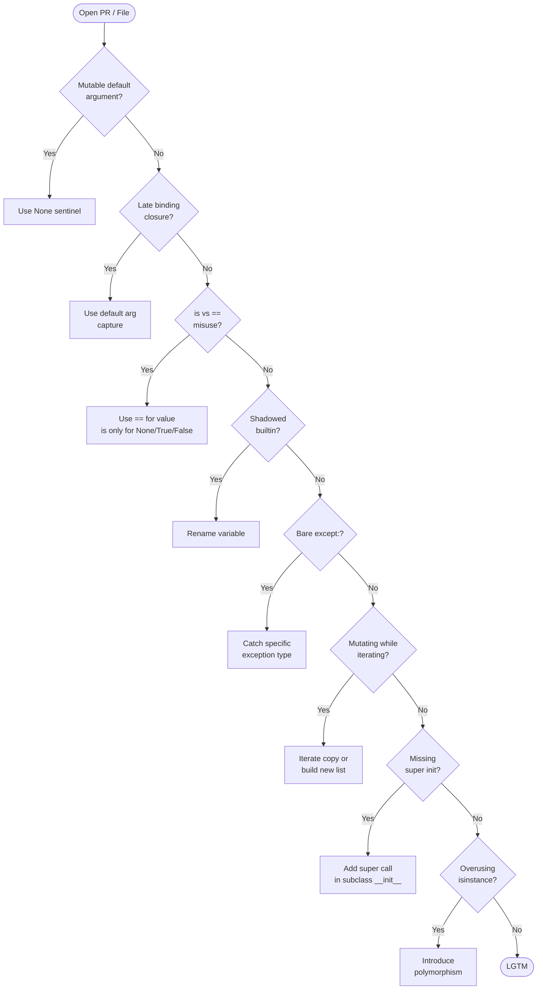

# :material-magnify: Day 28 — Code Review & Common Pitfalls

!!! abstract "Day at a Glance"
    **Goal:** Recognise the eight most common Python OOP bugs on sight and apply the correct fix immediately.
    **C++ Equivalent:** Day 28 of Learn-Modern-CPP-OOP-30-Days
    **Estimated Time:** 60–90 minutes

<div class="grid cards" markdown>
- :material-lightbulb-on: **Core Concept** — Most Python bugs in production share a small set of root causes; pattern recognition is more valuable than memorising syntax.
- :material-snake: **Python Way** — Lint with `ruff`/`pylint`, enforce types with `mypy`, and let the language's idioms guide you away from traps.
- :material-alert: **Watch Out** — Several of these bugs are syntactically valid and produce no error — only wrong runtime behaviour.
- :material-check-circle: **By End of Day** — You can spot all 8 bug categories in a code review and suggest the idiomatic fix.
</div>

---

## :material-lightbulb-on: Intuition

!!! info "Core Idea"
    Python's dynamic nature is a superpower — and a footgun.  The bugs below share a common theme: Python does something *legal* that surprises programmers coming from statically-typed languages.  Understanding *why* each bug exists makes you immune to the whole family.

!!! success "Python vs C++ Mental Model"
    | Pitfall | C++ analogy | Why it surprises |
    |---|---|---|
    | Mutable default arg | Static local variable shared across calls | You expect a fresh list each call |
    | Late binding closure | Capturing a reference, not a value | You expect a snapshot of the variable |
    | `is` vs `==` | Pointer comparison vs value comparison | Small-int cache makes `is` look right |
    | Shadowing builtins | Redefining `std::list` | No error, silent breakage |
    | Bare `except:` | Catching `...` (all exceptions) | Swallows `KeyboardInterrupt`, `SystemExit` |
    | Mutating while iterating | Iterator invalidation | Skips elements silently |
    | Missing `super().__init__` | Forgetting base ctor | Attributes not initialised |
    | Overusing `isinstance` | Excessive `dynamic_cast` | Violates Open/Closed Principle |

---

## :material-transit-connection-variant: Code Review Checklist



---

## :material-book-open-variant: Lesson

### Bug 1 — Mutable Default Argument

```python
# ❌ BUG — the list is created ONCE at function-definition time
class Cart:
    def __init__(self, items=[]):
        self.items = items          # all instances share the SAME list!

c1 = Cart()
c2 = Cart()
c1.items.append("apple")
print(c2.items)   # ['apple']  ← unexpected!

# ✅ FIX — use None sentinel, create list inside __init__
class Cart:
    def __init__(self, items=None):
        self.items = list(items) if items is not None else []
```

**Root cause:** Default argument expressions are evaluated *once* at function definition, not on each call.

---

### Bug 2 — Late Binding Closures

```python
# ❌ BUG — all lambdas see the FINAL value of i (= 4)
multipliers = [lambda x: x * i for i in range(5)]
print(multipliers[0](10))   # 40, not 0
print(multipliers[3](10))   # 40, not 30

# ✅ FIX — capture current value via default argument
multipliers = [lambda x, i=i: x * i for i in range(5)]
print(multipliers[0](10))   # 0
print(multipliers[3](10))   # 30
```

**Root cause:** Closures capture *variables* (references), not values.  By the time the lambda is called, the loop has finished and `i == 4`.

---

### Bug 3 — `is` vs `==`

```python
# ❌ BUG — CPython caches small integers (-5 to 256) and interned strings,
#          making `is` appear to work, but it's an implementation detail
a = 1000
b = 1000
print(a is b)    # False (different objects)
print(a == b)    # True  (same value)

# ❌ BUG — comparing strings with `is`
name = input("Name: ")   # "Alice"
if name is "Alice":      # ALWAYS False outside REPL — different string objects
    greet()

# ✅ FIX — use `is` ONLY for singletons: None, True, False
if name == "Alice":      # correct value comparison
    greet()

if result is None:       # correct — None is always the same singleton
    handle_missing()
```

---

### Bug 4 — Shadowing Built-ins

```python
# ❌ BUG — `list`, `dict`, `type`, `id`, `input`, `sum` are all built-ins
def process(list, dict):            # shadows built-in list and dict
    result = list(range(10))        # TypeError: 'list' object is not callable

# ❌ BUG — module-level shadowing is even worse
list = [1, 2, 3]                    # list() is now unusable in this scope

# ✅ FIX — choose non-conflicting names
def process(items: list, mapping: dict):
    result = list(range(10))        # fine — `list` is the built-in again
```

**Detection:** `pylint`, `ruff` (rule `A001`/`A002`) flag all built-in shadows.

---

### Bug 5 — Bare `except:`

```python
# ❌ BUG — catches EVERYTHING including KeyboardInterrupt, SystemExit
try:
    risky_operation()
except:                   # bare except — never do this
    print("something went wrong")

# ❌ SLIGHTLY BETTER but still wrong — catches all Exception subclasses
try:
    risky_operation()
except Exception:         # still swallows unexpected bugs
    print("something went wrong")

# ✅ FIX — catch only what you expect and can handle
try:
    risky_operation()
except FileNotFoundError as exc:
    logger.warning("File missing: %s", exc)
except PermissionError as exc:
    logger.error("Permission denied: %s", exc)
    raise                 # re-raise if you can't recover
```

**Root cause:** Bare `except:` catches `BaseException`, including signals that indicate the program should exit.

---

### Bug 6 — Modifying a List While Iterating

```python
numbers = [1, 2, 3, 4, 5, 6]

# ❌ BUG — removes every other element silently
for n in numbers:
    if n % 2 == 0:
        numbers.remove(n)   # shifts elements; iterator skips next item
print(numbers)   # [1, 3, 5]  ← missing 4!

# ✅ FIX option A — iterate a copy
for n in list(numbers):
    if n % 2 == 0:
        numbers.remove(n)

# ✅ FIX option B — build a new list (preferred — O(n), readable)
numbers = [n for n in numbers if n % 2 != 0]
print(numbers)   # [1, 3, 5]  ← correct
```

---

### Bug 7 — Missing `super().__init__()`

```python
class Animal:
    def __init__(self, name: str) -> None:
        self.name = name

class Dog(Animal):
    def __init__(self, name: str, breed: str) -> None:
        # ❌ BUG — forgot to call super().__init__()
        self.breed = breed

d = Dog("Rex", "Labrador")
print(d.name)    # AttributeError: 'Dog' object has no attribute 'name'

# ✅ FIX
class Dog(Animal):
    def __init__(self, name: str, breed: str) -> None:
        super().__init__(name)    # always first!
        self.breed = breed
```

With cooperative multiple inheritance (MRO), every `__init__` in the chain must call `super().__init__(*args, **kwargs)` to ensure all base classes are initialised.

---

### Bug 8 — Overusing `isinstance`

```python
# ❌ BUG — type-switching violates Open/Closed Principle
class Renderer:
    def render(self, shape):
        if isinstance(shape, Circle):
            return f"<circle r={shape.radius}/>"
        elif isinstance(shape, Rectangle):
            return f"<rect w={shape.width} h={shape.height}/>"
        elif isinstance(shape, Triangle):
            return f"<polygon .../>"
        # Adding a new shape requires EDITING Renderer — violation!

# ✅ FIX — polymorphism: each shape knows how to render itself
class Shape(ABC):
    @abstractmethod
    def to_svg(self) -> str: ...

class Circle(Shape):
    def to_svg(self) -> str:
        return f"<circle r={self.radius}/>"

class Renderer:
    def render(self, shape: Shape) -> str:
        return shape.to_svg()   # no isinstance needed
```

When `isinstance` chains grow, it is a signal to introduce polymorphism or the Visitor pattern.

---

## :material-alert: Common Pitfalls

!!! warning "Mutable Class Attributes as Accidental Singletons"
    ```python
    class Config:
        settings = {}   # class-level mutable — shared across all instances!

    Config.settings["debug"] = True
    print(Config().settings)   # {'debug': True} — surprise!
    ```
    Move mutable state into `__init__` as instance attributes.

!!! danger "`except Exception as e: pass` — Swallow and Forget"
    Silently swallowing exceptions hides bugs that will surface in production as mysterious data corruption.  At minimum, log the exception.  Better: re-raise after logging, or let it propagate.

---

## :material-help-circle: Flashcards

???+ question "Why does Python's mutable default argument bug exist?"
    Default argument values are evaluated **once** at function/method definition time, not on each call.  The resulting object is stored on the function and reused.  Lists and dicts are mutable, so mutations persist across calls.

???+ question "What is the correct use of `is` in Python?"
    `is` tests **object identity** (same object in memory).  Use it *only* for singletons: `x is None`, `flag is True`, `flag is False`.  For all other equality checks, use `==`.

???+ question "Why does modifying a list mid-loop skip elements?"
    `for x in lst` uses an internal index.  When you `remove()` an element at position `i`, everything shifts left.  The iterator then advances to `i+1`, which is the element that *was* at `i+2` — skipping what was at `i+1`.

???+ question "What is cooperative multiple inheritance and why must every `__init__` call `super()`?"
    Python's MRO ensures each class in the inheritance chain is initialised exactly once.  If a class skips `super().__init__()`, the next class in the MRO is never initialised, leaving its attributes undefined.  Every `__init__` in a diamond hierarchy must call `super().__init__()` to keep the chain intact.

---

## :material-clipboard-check: Self Test

=== "Question 1"
    What does this code print, and why?
    ```python
    def make_adders():
        adders = []
        for n in range(3):
            adders.append(lambda x: x + n)
        return adders

    fns = make_adders()
    print(fns[0](10), fns[1](10), fns[2](10))
    ```

=== "Answer 1"
    Prints `12 12 12`.  All three lambdas close over the **variable** `n`, not the value at the time the lambda was created.  After the loop, `n == 2`.  Fix: `lambda x, n=n: x + n`.

=== "Question 2"
    A colleague writes `except Exception: pass` to "silence import errors".  What are two problems with this and what is the correct fix?

=== "Answer 2"
    **Problem 1:** It silences *all* exceptions (including bugs like `AttributeError`, `NameError`) making debugging impossible.  **Problem 2:** `pass` discards the exception with no logging, so there is no record that anything went wrong.  **Fix:** Catch `ImportError` specifically and at least log it:
    ```python
    try:
        import optional_module
    except ImportError:
        import logging
        logging.warning("optional_module not installed; feature disabled")
        optional_module = None
    ```

---

## :material-check-circle: Summary

!!! success "Key Takeaways"
    - **Mutable default arguments** — use `None` sentinel and create the mutable inside `__init__`.
    - **Late binding closures** — capture values with `default=value` in lambda/function signatures.
    - **`is` vs `==`** — `is` for `None`/`True`/`False` only; `==` for all value comparisons.
    - **Shadowing builtins** — pick meaningful names; run `ruff` / `pylint` to catch it automatically.
    - **Bare `except:`** — always name the exception type(s) you expect and can handle.
    - **Mutating while iterating** — iterate a copy (`list(seq)`) or build a new collection.
    - **Missing `super().__init__()`** — always call it as the first line in a subclass `__init__`.
    - **Overusing `isinstance`** — replace branching on type with polymorphism or the Visitor pattern.
