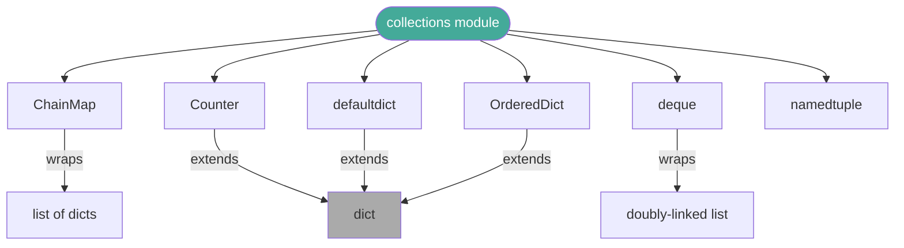

# :material-telescope: Day 29 — Advanced Topics Deep Dive

!!! abstract "Day at a Glance"
    **Goal:** Master the advanced Python standard-library features that separate senior developers from intermediate ones: `__slots__` edge cases, `__missing__`, `collections`, `weakref`, `copy`, `pickle`, `enum`, and `pathlib`.
    **C++ Equivalent:** Day 29 of Learn-Modern-CPP-OOP-30-Days
    **Estimated Time:** 60–90 minutes

<div class="grid cards" markdown>
- :material-lightbulb-on: **Core Concept** — The standard library already solved your problem; knowing where to look is the skill.
- :material-snake: **Python Way** — Compose stdlib building blocks (`ChainMap`, `Counter`, `deque`, `weakref`, `Enum`) instead of reimplementing them.
- :material-alert: **Watch Out** — `__slots__` with inheritance, mutable `Enum` values, and deep-copy traps are the most common advanced pitfalls.
- :material-check-circle: **By End of Day** — You can implement a weak-reference cache, a pickle-safe class, a ChainMap config system, and a rich Enum with methods.
</div>

---

## :material-lightbulb-on: Intuition

!!! info "Core Idea"
    Python's stdlib is vast, but a handful of modules cover 80 % of advanced OOP needs.  Each topic below is a tool with a specific job; forcing the wrong tool creates needless complexity.

!!! success "Python vs C++ Advanced Features"
    | Python feature | C++ equivalent | Use case |
    |---|---|---|
    | `__missing__` | `operator[]` on `map` | Auto-generate missing keys |
    | `ChainMap` | Layered lookup manually | Config hierarchy |
    | `Counter` | `unordered_map<K,int>` | Frequency counting |
    | `deque` | `std::deque` | Fast O(1) append/prepend |
    | `weakref.ref` | `std::weak_ptr` | Caches without owning |
    | `copy.deepcopy` | Deep copy ctor | Graph / tree duplication |
    | `pickle` | `boost::serialization` | Object persistence |
    | `Enum` | `enum class` | Named constants with methods |
    | `pathlib.Path` | `std::filesystem::path` | Cross-platform paths |

---

## :material-transit-connection-variant: Collections Module Hierarchy



---

## :material-book-open-variant: Lesson

### 1. `__slots__` with Inheritance — Edge Cases

```python
# ── Rule: EVERY class in the chain must declare __slots__ ────────────────────
class Base:
    __slots__ = ("x",)

class Child(Base):
    __slots__ = ("y",)   # only declares NEW slots; inherits (x,) from Base

c = Child()
c.x = 1   # OK — from Base.__slots__
c.y = 2   # OK — from Child.__slots__

# ── Common mistake: parent without __slots__ ─────────────────────────────────
class BadBase:
    pass   # no __slots__ — has __dict__

class BadChild(BadBase):
    __slots__ = ("z",)

bc = BadChild()
bc.z = 1       # slot works
bc.extra = 99  # ALSO works — BadBase's __dict__ is inherited!
# Memory saving is lost because __dict__ still exists.

# ── Including __dict__ and __weakref__ explicitly ─────────────────────────────
class Flexible:
    __slots__ = ("x", "y", "__dict__", "__weakref__")
    # Now supports dynamic attrs AND weak references
```

---

### 2. `__missing__` on Dict Subclasses

```python
from collections import defaultdict

# defaultdict uses __missing__ internally:
class AutoList(dict):
    """A dict that creates a new list for any missing key."""

    def __missing__(self, key):
        self[key] = value = []
        return value

graph = AutoList()
graph["a"].append("b")
graph["a"].append("c")
graph["b"].append("d")
print(dict(graph))   # {'a': ['b', 'c'], 'b': ['d']}

# ── Real-world: nested config with fallback ───────────────────────────────────
class FallbackDict(dict):
    def __init__(self, *args, fallback=None, **kwargs):
        super().__init__(*args, **kwargs)
        self._fallback = fallback

    def __missing__(self, key):
        if self._fallback is not None and key in self._fallback:
            return self._fallback[key]
        raise KeyError(key)

defaults  = FallbackDict({"debug": False, "log_level": "INFO"})
overrides = FallbackDict({"debug": True}, fallback=defaults)
print(overrides["debug"])      # True  — from overrides
print(overrides["log_level"])  # INFO  — falls back to defaults
```

---

### 3. `collections.ChainMap` — Config System

```python
from collections import ChainMap
import os

# Priority: CLI args > environment > config file > defaults
defaults   = {"host": "localhost", "port": 8080, "debug": False, "workers": 4}
from_file  = {"port": 9000, "workers": 8}
from_env   = {k.lower()[4:]: v                           # strip "APP_" prefix
              for k, v in os.environ.items()
              if k.startswith("APP_")}
from_cli   = {"debug": True}                             # imagine argparse output

config = ChainMap(from_cli, from_env, from_file, defaults)

print(config["host"])     # localhost  (from defaults)
print(config["port"])     # 9000       (from file, not defaults)
print(config["debug"])    # True       (from CLI — highest priority)

# Mutation only affects the FIRST map:
config["new_key"] = "value"
print(from_cli)   # {'debug': True, 'new_key': 'value'}
```

---

### 4. `collections.Counter`

```python
from collections import Counter

words = "the quick brown fox jumps over the lazy dog the fox".split()
freq  = Counter(words)

print(freq.most_common(3))     # [('the', 3), ('fox', 2), ...]
print(freq["the"])             # 3
print(freq["elephant"])        # 0  (no KeyError for missing keys)

# Arithmetic
a = Counter(["a", "b", "b", "c"])
b = Counter(["b", "c", "c", "d"])
print(a + b)    # Counter({'b': 3, 'c': 3, 'a': 1, 'd': 1})
print(a - b)    # Counter({'a': 1, 'b': 1})   # only positive results
```

---

### 5. `collections.deque` — O(1) at Both Ends

```python
from collections import deque

# Ring buffer — discard oldest when full
log = deque(maxlen=5)
for i in range(10):
    log.append(f"event-{i}")
print(list(log))   # ['event-5', 'event-6', 'event-7', 'event-8', 'event-9']

# Efficient sliding window
def moving_average(data, window):
    buf  = deque(maxlen=window)
    avgs = []
    for x in data:
        buf.append(x)
        avgs.append(sum(buf) / len(buf))
    return avgs

print(moving_average([1, 2, 3, 4, 5, 6], 3))
# [1.0, 1.5, 2.0, 3.0, 4.0, 5.0]
```

---

### 6. `weakref.ref` — Cache Without Owning

```python
import weakref

class ExpensiveResource:
    def __init__(self, name: str) -> None:
        self.name = name
        print(f"Created {name}")

    def __del__(self) -> None:
        print(f"Destroyed {self.name}")


class ResourceCache:
    def __init__(self) -> None:
        self._cache: dict[str, weakref.ref] = {}

    def get_or_create(self, name: str) -> ExpensiveResource:
        ref = self._cache.get(name)
        if ref is not None:
            obj = ref()                   # dereference
            if obj is not None:
                return obj
        obj = ExpensiveResource(name)
        self._cache[name] = weakref.ref(obj)
        return obj


cache = ResourceCache()
r1 = cache.get_or_create("DB-Connection")   # Created DB-Connection
r2 = cache.get_or_create("DB-Connection")   # returns same object — no print
print(r1 is r2)   # True

del r1, r2        # Destroyed DB-Connection
r3 = cache.get_or_create("DB-Connection")   # Created again (weak ref was dead)
```

Use `weakref.WeakValueDictionary` for an automatic weak-ref cache:

```python
cache = weakref.WeakValueDictionary()
cache["key"] = ExpensiveResource("R")
# When no strong references remain, the entry is automatically removed.
```

---

### 7. `copy.deepcopy` with `__copy__` / `__deepcopy__`

```python
import copy

class Graph:
    def __init__(self, name: str) -> None:
        self.name  = name
        self.edges: list["Graph"] = []

    def connect(self, other: "Graph") -> None:
        self.edges.append(other)

    def __deepcopy__(self, memo: dict) -> "Graph":
        # memo prevents infinite recursion on cyclic graphs
        if id(self) in memo:
            return memo[id(self)]
        clone = Graph(self.name + "_copy")
        memo[id(self)] = clone              # register before recursing
        clone.edges = copy.deepcopy(self.edges, memo)
        return clone

a = Graph("A")
b = Graph("B")
a.connect(b)
b.connect(a)    # cycle!

cloned_a = copy.deepcopy(a)
print(cloned_a.name)                      # A_copy
print(cloned_a.edges[0].name)             # B_copy
print(cloned_a.edges[0].edges[0] is cloned_a)  # True — cycle preserved
```

---

### 8. `pickle` with `__getstate__` / `__setstate__`

```python
import pickle

class DatabasePool:
    def __init__(self, dsn: str, size: int = 5) -> None:
        self.dsn   = dsn
        self.size  = size
        self._connections: list = self._open_connections()

    def _open_connections(self) -> list:
        return [object() for _ in range(self.size)]   # simulate real connections

    def __getstate__(self) -> dict:
        """Return picklable state — exclude live connections."""
        return {"dsn": self.dsn, "size": self.size}

    def __setstate__(self, state: dict) -> None:
        """Restore state; re-open connections after unpickling."""
        self.dsn   = state["dsn"]
        self.size  = state["size"]
        self._connections = self._open_connections()


pool  = DatabasePool("postgresql://localhost/db", size=3)
data  = pickle.dumps(pool)
pool2 = pickle.loads(data)
print(pool2.dsn, pool2.size, len(pool2._connections))
# postgresql://localhost/db 3 3
```

---

### 9. `enum.Enum` — Rich Named Constants

```python
from enum import Enum, IntEnum, Flag, auto
from functools import total_ordering

# ── Basic Enum with methods ───────────────────────────────────────────────────
class Direction(Enum):
    NORTH = "N"
    SOUTH = "S"
    EAST  = "E"
    WEST  = "W"

    def opposite(self) -> "Direction":
        opposites = {
            Direction.NORTH: Direction.SOUTH,
            Direction.SOUTH: Direction.NORTH,
            Direction.EAST:  Direction.WEST,
            Direction.WEST:  Direction.EAST,
        }
        return opposites[self]

    def __str__(self) -> str:
        return self.value

print(Direction.NORTH.opposite())   # S
print(Direction.EAST.name)          # EAST
print(Direction.EAST.value)         # E

# ── auto() — values assigned automatically ────────────────────────────────────
class Color(Enum):
    RED   = auto()   # 1
    GREEN = auto()   # 2
    BLUE  = auto()   # 3

# ── IntEnum — interoperable with int ─────────────────────────────────────────
class Priority(IntEnum):
    LOW    = 1
    MEDIUM = 2
    HIGH   = 3

print(Priority.HIGH > Priority.LOW)   # True (integer comparison)
print(Priority.HIGH + 1)              # 4 (integer arithmetic)

# ── Flag — bitwise combination ────────────────────────────────────────────────
class Permission(Flag):
    READ    = auto()   # 1
    WRITE   = auto()   # 2
    EXECUTE = auto()   # 4
    ALL     = READ | WRITE | EXECUTE

user_perms = Permission.READ | Permission.WRITE
print(Permission.READ in user_perms)    # True
print(Permission.EXECUTE in user_perms) # False
```

---

### 10. `pathlib.Path` — Modern File System Navigation

```python
from pathlib import Path

project = Path("/home/madhavan/projects/Python-advancced")

# Navigation
docs    = project / "MKwebsite" / "docs"
day22   = docs / "days" / "day22.md"

# Properties
print(day22.stem)     # day22
print(day22.suffix)   # .md
print(day22.parent)   # .../days

# Existence checks
print(day22.exists())
print(day22.is_file())

# Glob
for md in docs.glob("**/*.md"):
    print(md.relative_to(docs))

# Read / write
text  = day22.read_text(encoding="utf-8")
(docs / "days" / "day22_backup.md").write_text(text, encoding="utf-8")
```

---

## :material-alert: Common Pitfalls

!!! warning "`__slots__` and Multiple Inheritance"
    If *any* parent class lacks `__slots__`, the subclass will have `__dict__` even if the child declares `__slots__`.  You lose the memory saving silently — no error is raised.

!!! warning "Mutable Values in `Enum`"
    ```python
    class BadEnum(Enum):
        OPTIONS = []    # mutable value — shared across all accesses!

    BadEnum.OPTIONS.value.append(1)   # mutates the enum member's value
    ```
    Enum values should be immutable (int, str, tuple, frozenset).

!!! danger "`pickle` and Security"
    Never `pickle.loads()` data from an untrusted source — it executes arbitrary Python during deserialisation.  Use `json` or `msgpack` for external data exchange.

!!! danger "`deepcopy` on Cyclic Structures Without `memo`"
    Without the `memo` dict, `copy.deepcopy` on a cyclic graph will recurse infinitely until `RecursionError`.  Always accept and forward `memo` in `__deepcopy__`.

---

## :material-help-circle: Flashcards

???+ question "What is `weakref.ref` and when should you use it?"
    `weakref.ref(obj)` stores a reference to `obj` without preventing garbage collection.  Call the ref to retrieve the object (`ref()` returns `None` if the object was GC'd).  Use it for caches: you want to serve cached objects while they're alive, but not keep them alive just for the cache.

???+ question "What does `__missing__` do?"
    Called by `dict.__getitem__` when a key is not found.  Override it in a `dict` subclass to provide a default value (like `defaultdict`) or to auto-populate the dict.

???+ question "What is the difference between `Enum`, `IntEnum`, and `Flag`?"
    `Enum`: named constants, not comparable with raw integers.  `IntEnum`: subclass of `int` — members can be used wherever an integer is expected.  `Flag`: supports bitwise `|`, `&`, `~` for combining permissions/options.

???+ question "Why should `__getstate__` exclude file handles and sockets from pickle output?"
    File descriptors and socket connections are OS-level resources tied to the current process.  They cannot be serialised meaningfully.  Excluding them from `__getstate__` and recreating them in `__setstate__` (after load) is the correct pattern.

---

## :material-clipboard-check: Self Test

=== "Question 1"
    Implement a `Counter`-based function `top_n_words(text: str, n: int) -> list[tuple[str, int]]` that returns the `n` most common words (case-insensitive, ignoring punctuation).

=== "Answer 1"
    ```python
    import re
    from collections import Counter

    def top_n_words(text: str, n: int) -> list[tuple[str, int]]:
        words = re.findall(r"[a-zA-Z]+", text.lower())
        return Counter(words).most_common(n)

    sample = "The quick brown fox jumps over the lazy dog the fox"
    print(top_n_words(sample, 3))
    # [('the', 3), ('fox', 2), ('quick', 1)]
    ```

=== "Question 2"
    Write a `ConfigChain` class that layers three dicts (defaults, file, cli) so that CLI values take priority, and mutations go only to the CLI layer.

=== "Answer 2"
    ```python
    from collections import ChainMap

    class ConfigChain:
        def __init__(self, defaults: dict, from_file: dict, from_cli: dict) -> None:
            self._chain = ChainMap(from_cli, from_file, defaults)

        def __getitem__(self, key: str):
            return self._chain[key]

        def set_cli(self, key: str, value) -> None:
            self._chain.maps[0][key] = value   # writes to CLI (first) map

        def all_keys(self) -> set:
            return set(self._chain.keys())

    cfg = ConfigChain(
        defaults  = {"host": "localhost", "port": 8080},
        from_file = {"port": 9000},
        from_cli  = {},
    )
    print(cfg["port"])   # 9000
    cfg.set_cli("port", 7777)
    print(cfg["port"])   # 7777
    ```

---

## :material-check-circle: Summary

!!! success "Key Takeaways"
    - **`__slots__` + inheritance**: every class in the chain must opt in; one `__dict__`-bearing ancestor undoes the saving.
    - **`__missing__`** provides `defaultdict`-style auto-population without importing `defaultdict`.
    - **`ChainMap`** is the idiomatic config-layer pattern; mutations go to the first map only.
    - **`Counter`** handles frequency counting with arithmetic operators and `most_common()`.
    - **`deque`** gives O(1) append/prepend and fixed-size ring buffers via `maxlen`.
    - **`weakref.ref`** lets caches hold references without preventing GC.
    - **`__deepcopy__` + `memo`** handles cyclic structures safely.
    - **`__getstate__`/`__setstate__`** make pickle-safe by excluding non-serialisable resources.
    - **`Enum`/`IntEnum`/`Flag`** replace magic constants with type-safe, method-bearing named values.
    - **`pathlib.Path`** is the modern, cross-platform replacement for `os.path`.
