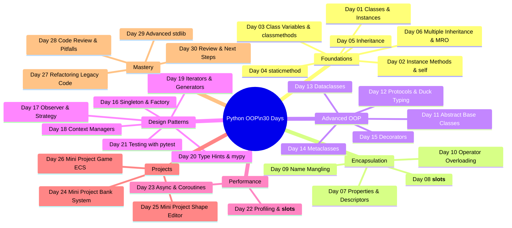

# :material-school: Day 30 — Review, Cert Prep & Next Steps

!!! abstract "Day at a Glance"
    **Goal:** Consolidate all 30 days into a single reference page, practise 10 interview questions, and chart the path forward.
    **C++ Equivalent:** Day 30 of Learn-Modern-CPP-OOP-30-Days
    **Estimated Time:** 60–90 minutes (pure review — no new exercises)

<div class="grid cards" markdown>
- :material-lightbulb-on: **Core Concept** — Mastery is the ability to recall and connect concepts across the whole course, not just the last chapter.
- :material-snake: **Python Way** — Python OOP is built on protocols and duck-typing; understanding the dunder method system unlocks every advanced feature.
- :material-alert: **Watch Out** — Interview questions probe *why*, not *what* — always explain the motivation, not just the syntax.
- :material-check-circle: **By End of Day** — You have a complete cheat-sheet, 10 practised Q&As, and a concrete next-steps roadmap.
</div>

---

## :material-lightbulb-on: 30-Day Mind Map



---

## :material-book-open-variant: Complete OOP Cheat-Sheet

### Classes, Instances, and Methods

```python
class MyClass:
    class_var = "shared"              # class variable — shared by all instances

    def __init__(self, x: int) -> None:
        self.x = x                    # instance variable

    def instance_method(self) -> int: # receives instance as first arg
        return self.x

    @classmethod
    def class_method(cls) -> str:     # receives class as first arg
        return cls.class_var

    @staticmethod
    def static_method(a: int, b: int) -> int:  # no implicit first arg
        return a + b
```

---

### Inheritance and MRO

```python
class A:
    def greet(self): return "A"

class B(A):
    def greet(self): return "B → " + super().greet()

class C(A):
    def greet(self): return "C → " + super().greet()

class D(B, C):    # MRO: D → B → C → A → object
    pass

print(D().greet())   # B → C → A
print(D.__mro__)     # (<class 'D'>, <class 'B'>, <class 'C'>, <class 'A'>, <class 'object'>)
```

---

### Abstract Base Classes and Protocols

```python
from abc import ABC, abstractmethod
from typing import Protocol, runtime_checkable

# ABC — enforced at class-instantiation time
class Shape(ABC):
    @abstractmethod
    def area(self) -> float: ...

# Protocol — structural subtyping (duck-typing with type checking)
@runtime_checkable
class Drawable(Protocol):
    def draw(self) -> None: ...
```

---

### Dunder Method Quick Reference

| Category | Dunder | Trigger |
|---|---|---|
| **Construction** | `__new__` | Object memory allocation |
| | `__init__` | Object initialisation |
| | `__del__` | Object destruction (GC) |
| **Representation** | `__repr__` | `repr(obj)`, REPL display |
| | `__str__` | `str(obj)`, `print(obj)` |
| | `__format__` | `f"{obj:spec}"` |
| **Comparison** | `__eq__` | `==` |
| | `__lt__` `__le__` `__gt__` `__ge__` | `<` `<=` `>` `>=` |
| | `__hash__` | `hash(obj)`, used in sets/dicts |
| **Arithmetic** | `__add__` `__sub__` `__mul__` | `+` `-` `*` |
| | `__truediv__` `__floordiv__` | `/` `//` |
| | `__mod__` `__pow__` | `%` `**` |
| | `__radd__` `__rsub__` … | Right-hand operand fallback |
| | `__iadd__` `__isub__` … | `+=` `-=` in-place |
| **Container** | `__len__` | `len(obj)` |
| | `__getitem__` | `obj[key]` |
| | `__setitem__` | `obj[key] = val` |
| | `__delitem__` | `del obj[key]` |
| | `__contains__` | `x in obj` |
| | `__iter__` | `iter(obj)`, `for x in obj` |
| | `__next__` | `next(obj)` |
| | `__reversed__` | `reversed(obj)` |
| **Context Manager** | `__enter__` | `with obj as x:` — start |
| | `__exit__` | `with` block end |
| **Async** | `__aenter__` `__aexit__` | `async with` |
| | `__aiter__` `__anext__` | `async for` |
| **Attribute Access** | `__getattr__` | Missing attribute lookup |
| | `__getattribute__` | ALL attribute lookups |
| | `__setattr__` | `obj.attr = val` |
| | `__delattr__` | `del obj.attr` |
| **Descriptor** | `__get__` `__set__` `__delete__` | Descriptor protocol |
| **Callable** | `__call__` | `obj()` |
| **Class Creation** | `__init_subclass__` | When a subclass is defined |
| | `__class_getitem__` | `MyClass[T]` generic syntax |

---

### Python vs C++ OOP Comparison

| Feature | C++ | Python |
|---|---|---|
| Access control | `public:` `protected:` `private:` | Convention: `_protected`, `__private` (name mangling) |
| Abstract method | `virtual f() = 0` | `@abstractmethod` |
| Interface | Pure abstract class | `ABC` or `Protocol` |
| Multiple inheritance | Supported (with complexity) | Supported via MRO (`super()`) |
| Operator overloading | `operator+` etc. | `__add__` etc. |
| Templates / generics | `template<typename T>` | `typing.Generic[T]` / type hints |
| RAII / resource cleanup | Destructor `~Class()` | `__del__` (unreliable) / context manager `__exit__` |
| Move semantics | `std::move`, rvalue refs | Not applicable (GC) |
| Const correctness | `const` member functions | `@property` with no setter |
| Static members | `static` keyword | Class variables / `@classmethod` |
| Friend classes | `friend` | No equivalent (use composition) |
| Metaclasses | None (template metaprogramming) | `type` subclasses |
| Reflection | RTTI / `typeid` | `type()`, `isinstance()`, `hasattr()` |
| Concurrency | `std::thread`, `co_await` | `threading`, `asyncio` |

---

## :material-help-circle: 10 Interview Questions

???+ question "1. What is the difference between `__new__` and `__init__`?"
    `__new__(cls)` is called first — it **allocates and returns** the new object (controls which class or singleton is returned).  `__init__(self)` is called next — it **initialises** the already-created object.  Override `__new__` for Singleton, immutable types (`tuple` subclasses), or metaclass magic.  Override `__init__` for almost everything else.

???+ question "2. Explain Python's MRO and why it matters."
    MRO (Method Resolution Order) defines the order in which Python searches base classes for a method.  Python uses the **C3 linearisation** algorithm, which guarantees: (a) subclasses appear before their parents, (b) the local precedence of each class's `__bases__` is preserved.  It matters because multiple inheritance requires a deterministic, conflict-free lookup order.  Access it via `ClassName.__mro__` or `ClassName.mro()`.

???+ question "3. What is the descriptor protocol?"
    An object is a **descriptor** if it defines `__get__` (and optionally `__set__` / `__delete__`).  When a descriptor is stored as a class attribute, attribute access on an instance calls `__get__` instead of returning the raw object.  `property`, `classmethod`, `staticmethod`, and `__slots__` are all implemented as descriptors.

???+ question "4. What is the difference between `@classmethod` and `@staticmethod`?"
    `@classmethod` receives the **class** (`cls`) as the first argument — useful for alternative constructors and factory methods.  `@staticmethod` receives **no implicit argument** — it is a plain function namespaced inside the class.  Neither has access to instance state.

???+ question "5. How does `super()` work in multiple inheritance?"
    `super()` returns a **proxy object** that delegates method calls to the **next class in the MRO**, not necessarily the direct parent.  This enables **cooperative multiple inheritance**: if every class in a diamond calls `super().method()`, each class is initialised exactly once in MRO order.

???+ question "6. What are the four pillars of OOP and how does Python implement each?"
    - **Abstraction**: `ABC` + `@abstractmethod`; `Protocol` for structural typing.
    - **Encapsulation**: `_protected` convention; `__private` name mangling; `@property` for controlled access.
    - **Inheritance**: `class Child(Parent):`; `super()`; MRO for multiple inheritance.
    - **Polymorphism**: duck-typing (if it has `quack()`, it's a duck); method overriding; `@abstractmethod` enforcement.

???+ question "7. When would you use a metaclass?"
    Metaclasses are classes whose instances are classes.  Use them when you need to **intercept class creation** itself: auto-registering subclasses, enforcing naming conventions, adding class-level validation, or implementing ORMs (e.g., Django's `Model` auto-generates database columns from class attributes).  For most problems, a class decorator or `__init_subclass__` is simpler.

???+ question "8. What is the difference between `__getattr__` and `__getattribute__`?"
    `__getattribute__` is called for **every** attribute access.  Override it carefully — every `self.x` inside it will recurse unless you call `super().__getattribute__()`.  `__getattr__` is called **only when the normal lookup fails** (attribute not found).  Use `__getattr__` for proxy objects and lazy attributes; avoid overriding `__getattribute__` unless you genuinely need to intercept all accesses.

???+ question "9. What are Python Protocols and how do they differ from ABCs?"
    A `Protocol` (from `typing`) defines an interface via **structural subtyping**: any class that has the required methods is considered compatible, without needing to inherit from the Protocol.  An `ABC` requires **nominal subtyping**: the class must explicitly inherit from the ABC.  Protocols work with `mypy` at static-analysis time; `@runtime_checkable` also enables `isinstance()` checks at runtime.

???+ question "10. How would you implement a thread-safe Singleton in Python?"
    ```python
    import threading

    class Singleton:
        _instance = None
        _lock = threading.Lock()

        def __new__(cls):
            if cls._instance is None:
                with cls._lock:
                    if cls._instance is None:   # double-checked locking
                        cls._instance = super().__new__(cls)
            return cls._instance
    ```
    The double-checked lock avoids taking the lock on every call once the singleton is created.

---

## :material-transit-connection-variant: Complete Python OOP at a Glance

```python
# ── The complete toolbox in one module ───────────────────────────────────────
from __future__ import annotations

from abc import ABC, abstractmethod
from collections import ChainMap, Counter, deque
from dataclasses import dataclass, field
from decimal import Decimal
from enum import Enum, auto
from functools import lru_cache, cached_property, total_ordering
from pathlib import Path
from typing import ClassVar, Generic, Protocol, TypeVar
import copy, pickle, weakref

T = TypeVar("T")

# Descriptor
class Validated:
    def __set_name__(self, owner, name): self._name = name
    def __get__(self, obj, cls): return None if obj is None else obj.__dict__.get(self._name)
    def __set__(self, obj, value):
        if not isinstance(value, (int, float)) or value < 0:
            raise ValueError(f"{self._name} must be a non-negative number")
        obj.__dict__[self._name] = value

# Abstract base with descriptor
class Shape(ABC):
    radius = Validated()
    @abstractmethod
    def area(self) -> float: ...
    def __repr__(self): return f"{type(self).__name__}(area={self.area():.2f})"

# Dataclass concrete shape
@dataclass
class Circle(Shape):
    _radius: float = field(repr=False)
    def __post_init__(self):
        self.radius = self._radius
    def area(self) -> float:
        import math; return math.pi * self.radius ** 2

# Generic container
class Box(Generic[T]):
    def __init__(self, value: T) -> None: self.value = value
    def map(self, fn): return Box(fn(self.value))
    def __repr__(self): return f"Box({self.value!r})"

# Enum with method
class Status(Enum):
    PENDING = auto(); ACTIVE = auto(); CLOSED = auto()
    def is_terminal(self) -> bool: return self == Status.CLOSED

# Context manager
class Timer:
    import time
    def __enter__(self): self._t = self.time.perf_counter(); return self
    def __exit__(self, *_): print(f"{self.time.perf_counter()-self._t:.3f}s"); return False

# Protocol
class Renderable(Protocol):
    def render(self) -> str: ...
```

---

## :material-check-circle: Next Steps

!!! success "You Have Completed 30 Days of Python OOP!"
    Here is the recommended progression from here:

### Immediately Applicable

| Library | What It Adds |
|---|---|
| **`pydantic`** | Data validation with type hints — `BaseModel` auto-validates, serialises, and documents |
| **`attrs`** | Like `dataclass` but older, more powerful, with validators and converters |
| **`cattrs`** | Structured/unstructured conversion (JSON ↔ typed objects) |

### Web and API

| Library | What It Adds |
|---|---|
| **`FastAPI`** | Async REST API with Pydantic models, OpenAPI docs auto-generated |
| **`SQLAlchemy ORM`** | Declarative OOP models that map to relational tables |
| **`SQLModel`** | SQLAlchemy + Pydantic in one class |

### Testing and Quality

| Library | What It Adds |
|---|---|
| **`Hypothesis`** | Property-based testing — generates inputs that break your code |
| **`pytest-asyncio`** | Async test support for `asyncio` code |
| **`mypy --strict`** | Strictest type checking — catch bugs before runtime |

### Concurrency and Performance

| Library | What It Adds |
|---|---|
| **`anyio`** | Async I/O that works with both `asyncio` and `trio` |
| **`NumPy`** | Vectorised numeric operations (replaces Python loops) |
| **`Cython`** | Compile Python to C for CPU-bound hot paths |

### Suggested Learning Order

```
pydantic → FastAPI → SQLAlchemy ORM
               ↓
          Hypothesis (property tests)
               ↓
          anyio / trio (structured concurrency)
               ↓
          NumPy / Pandas (data engineering path)
             OR
          Cython / mypyc (performance path)
```

---

!!! info "Official Resources"
    - [Python Docs — Data Model](https://docs.python.org/3/reference/datamodel.html) — definitive dunder reference
    - [Real Python — OOP in Python](https://realpython.com/python3-object-oriented-programming/)
    - [PEP 544 — Protocols](https://peps.python.org/pep-0544/)
    - [PEP 557 — Dataclasses](https://peps.python.org/pep-0557/)
    - [Python Cookbook (Beazley & Jones)](https://www.oreilly.com/library/view/python-cookbook-3rd/9781449357337/) — Chapters 7–9
    - [Fluent Python (Ramalho)](https://www.oreilly.com/library/view/fluent-python-2nd/9781492056348/) — The definitive advanced Python book
