# :material-calendar-range: 30-Day Python Advanced Course

!!! abstract "At a Glance"
    **Goal:** Go from Python basics to production-ready advanced OOP in 30 focused days.
    **C++ Equivalent:** Like moving from C with classes to modern C++20 — you are learning the real language.

- :material-lightbulb-on: **Core Concept** — One topic per day, building on the previous
- :material-snake: **Python Way** — Each day maps a C++ concept to its Pythonic equivalent
- :material-alert: **Watch Out** — Python looks like C++ but has fundamentally different semantics
- :material-check-circle: **When to Use** — Follow sequentially or jump to any day as a reference

## :material-map: Course Gantt Chart

```mermaid
gantt
    title 30-Day Python Advanced Plan
    dateFormat  D
    axisFormat  Day %d

    section Foundation Days 0-7
    Setup and Basics           :done, d0,  1,  1d
    Variables and Types        :done, d1,  2,  1d
    Functions and Lambdas      :done, d2,  3,  1d
    Classes and Encapsulation  :done, d3,  4,  1d
    Dataclasses and Slots      :done, d4,  5,  1d
    Context Managers           :done, d5,  6,  1d
    Inheritance Polymorphism   :done, d6,  7,  1d
    ABCs and Protocols         :done, d7,  8,  1d

    section Intermediate Days 8-16
    Advanced OOP Patterns      :active, d8,  9,  1d
    Generics and TypeVar       :active, d9,  10, 1d
    Type Hints Advanced        :active, d10, 11, 1d
    Generic OOP Design         :active, d11, 12, 1d
    Iterators and Generators   :active, d12, 13, 1d
    Decorators In-Depth        :active, d13, 14, 1d
    Descriptors and Properties :active, d14, 15, 1d
    Error Handling             :active, d15, 16, 1d
    Modules and Packages       :active, d16, 17, 1d

    section Advanced Days 17-23
    Design Patterns OOP      :d17, 18, 1d
    SOLID Principles         :d18, 19, 1d
    Testing and Pytest TDD   :d19, 20, 1d
    Metaclasses              :d20, 21, 1d
    Functools and Itertools  :d21, 22, 1d
    Performance Profiling    :d22, 23, 1d
    Async and Coroutines     :d23, 24, 1d

    section Projects Days 24-30
    Mini Project 1 Bank      :d24, 25, 1d
    Mini Project 2 Shapes    :d25, 26, 1d
    Mini Project 3 Game      :d26, 27, 1d
    Refactoring Legacy Code  :d27, 28, 1d
    Code Review Pitfalls     :d28, 29, 1d
    Advanced Topics          :d29, 30, 1d
    Review and Cert Prep     :d30, 31, 1d
```

## :material-lightbulb-on: Course Philosophy

!!! info "Core Idea"
    This course is built on the **cognitive load** principle: one big idea per day, reinforced with
    worked examples, common pitfalls, flashcard review, and self-tests. Each day is self-contained
    so you can also use it as a reference.

!!! success "Python vs C++ Mindset"
    If you are coming from C++, your biggest risk is **transliteration** — writing Python that looks
    like C++. This course explicitly calls out C++ idioms and shows their idiomatic Python equivalents.

## :material-table: Python vs C++ OOP Mapping

| C++ Concept | Python Equivalent | Notes |
|---|---|---|
| Class definition | `class Foo:` | No header/source split |
| Constructor | `__init__(self)` | Always takes `self` |
| Destructor | `__del__` / context manager | Prefer `with` statement |
| `private:` | `_name` convention / `__name` mangling | Convention, not enforced |
| `virtual` method | Every method (all are virtual) | No `virtual` keyword needed |
| Pure virtual / ABC | `ABC` + `@abstractmethod` | Or use `Protocol` |
| Template class | `Generic[T]` with `TypeVar` | Runtime, not compile-time |
| `operator==` | `__eq__` | Dunder methods |
| `std::shared_ptr` | Default reference semantics | GC handles memory |
| RAII | Context manager (`with`) | `__enter__` / `__exit__` |
| Static method | `@staticmethod` | Same concept |
| Class method | `@classmethod` | Receives `cls`, not instance |
| `constexpr` / `const` | `Final`, `frozen=True` in dataclass | Type-checker only for `Final` |
| `std::variant` | `Union` type hint | No tagged union at runtime |
| Concepts (C++20) | `Protocol` (PEP 544) | Structural subtyping |

## :material-navigation: Quick Navigation Grid

- :material-python: **[Day 0 — Setup](day00.md)** — pyenv, venv, pyproject.toml
- :material-variable: **[Day 1 — Types](day01.md)** — Dynamic typing, type annotations
- :material-function: **[Day 2 — Functions](day02.md)** — First-class functions, closures
- :material-code-braces: **[Day 3 — Classes](day03.md)** — OOP fundamentals, dunders
- :material-table-row: **[Day 4 — Dataclasses](day04.md)** — Rule of zero in Python
- :material-shield-lock: **[Day 5 — Context Managers](day05.md)** — Python RAII
- :material-family-tree: **[Day 6 — Inheritance](day06.md)** — MRO, mixins, super()
- :material-duck: **[Day 7 — ABCs & Protocols](day07.md)** — Duck typing done right

## :material-help-circle: Flashcards

???+ question "What is the Python equivalent of a C++ virtual destructor?"
    Python uses **context managers** (`with` / `__exit__`) for deterministic resource cleanup,
    analogous to RAII/destructors. `__del__` exists but is non-deterministic and rarely used.
    Prefer `contextlib.contextmanager` or a class with `__enter__`/`__exit__`.

???+ question "Why doesn't Python have `private` access modifiers?"
    Python follows the **"we are all consenting adults"** philosophy. Single underscore `_name`
    signals "internal use" by convention. Double underscore `__name` triggers name mangling
    (becomes `_ClassName__name`) to avoid accidental override in subclasses — not true privacy.

???+ question "What replaces C++ templates in Python?"
    Python uses **`Generic[T]`** with **`TypeVar`** for static type-checking generics.
    At runtime Python is already generic — a `list` holds any type. The type annotations
    are checked by tools like `mypy` / `pyright`, not the interpreter.

???+ question "How does Python MRO differ from C++ multiple inheritance?"
    Python uses the **C3 linearization algorithm** (MRO) which guarantees a consistent,
    deterministic method resolution order even with diamond inheritance. C++ leaves the
    programmer to resolve ambiguity manually with scope resolution (`Base::method()`).

## :material-clipboard-check: Self Test

=== "Question 1"
    You have a C++ class with a custom destructor managing a file handle.
    What is the idiomatic Python translation?

=== "Answer 1"
    Implement `__enter__` and `__exit__` and use the `with` statement.
    Alternatively, use `@contextlib.contextmanager` for a generator-based form.
    The `with` block guarantees `__exit__` is called even if an exception occurs.

=== "Question 2"
    A C++ developer writes `class Foo` with all methods calling `this->_data` and marks
    data members `private`. What is the Python translation?

=== "Answer 2"
    In Python, `self._data` (single underscore) is the convention for "internal" data.
    Use `@property` to control access. For name-level protection, use `self.__data`
    (double underscore) which triggers name mangling to `_Foo__data`.
    But remember: Python's approach is convention-based, not compiler-enforced.

## :material-check-circle: Summary

!!! success "Key Takeaways"
    - The 30-day course maps C++ OOP concepts to their Python equivalents systematically.
    - Python's type system is dynamic by default; static checking is opt-in via type annotations.
    - Every Python method is virtual; there is no `virtual` keyword.
    - RAII maps to context managers, templates map to Generics + Protocol, `private` maps to convention.
    - The Pythonic way favors duck typing, first-class functions, and readability.
