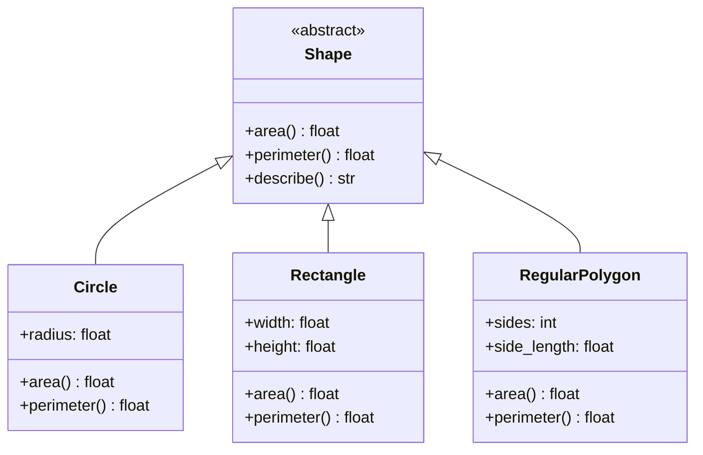

# :material-shield-half-full: Abstract Base Class (ABC) Idiom

!!! abstract "At a Glance"
    **Intent / Purpose:** Define interface contracts that concrete subclasses must honour, and prevent instantiation of incomplete (abstract) classes.
    **C++ Equivalent:** Pure virtual classes with `= 0` methods, pure abstract interfaces, `std::enable_if` trait checks
    **Category:** Python Idiom / Interface Contracts

<div class="grid cards" markdown>
- :material-lightbulb-on: **Core Concept** — `@abstractmethod` on a method means any subclass *must* override it, or instantiation raises `TypeError`
- :material-snake: **Python Way** — `abc.ABC`, `@abstractmethod`, `@abstractclassmethod`, `__subclasshook__` for virtual subclasses
- :material-alert: **Watch Out** — Duck typing already works without ABCs; use ABCs when you want *enforced* contracts, not just conventions
- :material-check-circle: **When to Use** — Framework/library APIs where third-party implementations must follow a strict interface
</div>

---

## :material-lightbulb-on: Intuition

!!! info "Core Idea"
    Python is duck-typed: if an object has the right methods, it works — no formal declaration required.
    But sometimes you want *enforcement*: "everyone who calls themselves a `Shape` **must** implement
    `area()` and `perimeter()`, or I refuse to create them." That is exactly what `abc.ABC` provides.

    ```python
    from abc import ABC, abstractmethod

    class Shape(ABC):
        @abstractmethod
        def area(self) -> float: ...

    s = Shape()   # TypeError: Can't instantiate abstract class Shape
                  # with abstract method area
    ```

    ABCs also play a deeper role in Python's **collections.abc** module — `Sequence`, `Mapping`,
    `Iterable`, etc. These ABCs define what it means to *be* a sequence or mapping, provide default
    implementations for many methods once you implement the required ones, and let you register
    third-party classes as "virtual subclasses" without modifying their source.

!!! success "Python vs C++"
    C++ pure virtual classes are resolved at compile time — you get a linker error if a pure virtual
    is not implemented. Python's ABC check happens at *instantiation* time (when `__call__` is invoked
    on the metaclass `ABCMeta`). This means you can define an incomplete subclass, pass its *class object*
    around, and only hit the error when you try to create an instance. Type checkers like mypy catch
    missing abstract methods at static analysis time, bridging the gap.

---

## :material-sitemap: ABC Hierarchy



---

## :material-book-open-variant: Implementation

### Core ABC — Shape with `area()` and `perimeter()`

```python
from __future__ import annotations
from abc import ABC, abstractmethod
import math


class Shape(ABC):
    """
    Abstract base class for geometric shapes.
    Subclasses must implement area() and perimeter().
    describe() is a concrete method provided by the ABC.
    """

    @abstractmethod
    def area(self) -> float:
        """Return the area of the shape."""
        ...

    @abstractmethod
    def perimeter(self) -> float:
        """Return the perimeter of the shape."""
        ...

    # Concrete method — inherited by all subclasses for free
    def describe(self) -> str:
        return (
            f"{type(self).__name__}: "
            f"area={self.area():.4f}, "
            f"perimeter={self.perimeter():.4f}"
        )

    def __repr__(self) -> str:
        return self.describe()


class Circle(Shape):
    def __init__(self, radius: float) -> None:
        if radius <= 0:
            raise ValueError("Radius must be positive")
        self.radius = radius

    def area(self)      -> float: return math.pi * self.radius ** 2
    def perimeter(self) -> float: return 2 * math.pi * self.radius


class Rectangle(Shape):
    def __init__(self, width: float, height: float) -> None:
        self.width  = width
        self.height = height

    def area(self)      -> float: return self.width * self.height
    def perimeter(self) -> float: return 2 * (self.width + self.height)


class RegularPolygon(Shape):
    def __init__(self, sides: int, side_length: float) -> None:
        self.sides       = sides
        self.side_length = side_length

    def area(self) -> float:
        return (self.sides * self.side_length ** 2) / (4 * math.tan(math.pi / self.sides))

    def perimeter(self) -> float:
        return self.sides * self.side_length


# Demonstration
shapes: list[Shape] = [
    Circle(5),
    Rectangle(4, 6),
    RegularPolygon(6, 3),
]

for shape in shapes:
    print(shape.describe())

# Incomplete subclass — TypeError at instantiation
class BrokenShape(Shape):
    def area(self) -> float: return 0.0
    # forgot perimeter()

try:
    b = BrokenShape()
except TypeError as e:
    print(f"\n{e}")
    # Can't instantiate abstract class BrokenShape with abstract method perimeter
```

### Abstract Class Methods and Properties

```python
from abc import ABC, abstractmethod


class Serializable(ABC):
    """Demonstrates abstract classmethod and abstract property."""

    @property
    @abstractmethod
    def schema_version(self) -> int:
        """Version of the serialisation schema this class uses."""
        ...

    @classmethod
    @abstractmethod
    def from_dict(cls, data: dict) -> Serializable:
        """Deserialise from a dictionary."""
        ...

    @abstractmethod
    def to_dict(self) -> dict:
        """Serialise to a dictionary."""
        ...


class UserRecord(Serializable):
    schema_version = 2   # satisfies abstract property

    def __init__(self, name: str, age: int) -> None:
        self.name = name
        self.age  = age

    @classmethod
    def from_dict(cls, data: dict) -> UserRecord:
        return cls(data["name"], data["age"])

    def to_dict(self) -> dict:
        return {"name": self.name, "age": self.age, "_v": self.schema_version}


u = UserRecord.from_dict({"name": "Alice", "age": 30})
print(u.to_dict())   # {'name': 'Alice', 'age': 30, '_v': 2}
```

### `__subclasshook__` — Virtual Subclass Registration

```python
from abc import ABC, abstractmethod


class Drawable(ABC):
    """
    __subclasshook__ makes isinstance() / issubclass() checks structural:
    any class with a .draw() method is considered a Drawable,
    even if it does not inherit from Drawable.
    """

    @abstractmethod
    def draw(self) -> None: ...

    @classmethod
    def __subclasshook__(cls, subclass) -> bool:
        if cls is Drawable:
            # Structural check: does the class have a concrete draw() method?
            return any(
                "draw" in klass.__dict__
                for klass in subclass.__mro__
            )
        return NotImplemented   # let the normal mechanism handle it


class LegacyWidget:
    """Third-party class — cannot be modified to inherit from Drawable."""
    def draw(self) -> None:
        print("LegacyWidget drawing itself")


class ModernButton(Drawable):
    """Explicit subclass."""
    def draw(self) -> None:
        print("ModernButton rendering")


# Without modifying LegacyWidget, isinstance() still returns True
print(isinstance(LegacyWidget(), Drawable))   # True  — via __subclasshook__
print(isinstance(ModernButton(), Drawable))   # True  — via direct inheritance

# You can also register explicitly:
class ExternalShape:
    def draw(self) -> None: print("external drawing")

Drawable.register(ExternalShape)
print(issubclass(ExternalShape, Drawable))   # True
```

### `collections.abc` — Built-In ABCs

```python
from collections.abc import (
    Sequence, MutableMapping, Iterable, Iterator, Callable
)


# Implement a custom Mapping by inheriting from MutableMapping
class FixedKeysDict(MutableMapping):
    """
    A mapping that only allows keys declared at construction time.
    Inherit from MutableMapping and implement the 5 required methods;
    get 30+ other methods (keys(), values(), items(), update(), etc.) for free.
    """

    def __init__(self, *allowed_keys: str) -> None:
        self._allowed = set(allowed_keys)
        self._data: dict = {}

    # ── Required abstract methods (5) ────────────────────────────────────────
    def __getitem__(self, key: str):
        return self._data[key]

    def __setitem__(self, key: str, value) -> None:
        if key not in self._allowed:
            raise KeyError(f"Key {key!r} not allowed. Allowed: {self._allowed}")
        self._data[key] = value

    def __delitem__(self, key: str) -> None:
        del self._data[key]

    def __iter__(self):
        return iter(self._data)

    def __len__(self) -> int:
        return len(self._data)


d = FixedKeysDict("x", "y", "z")
d["x"] = 10
d["y"] = 20

# All of these come free from MutableMapping:
print(list(d.keys()))         # ['x', 'y']
print(dict(d.items()))        # {'x': 10, 'y': 20}
d.update({"z": 30})
print(d.get("missing", -1))   # -1

try:
    d["w"] = 99
except KeyError as e:
    print(e)   # "Key 'w' not allowed."

# isinstance check works with built-in types too
print(isinstance({}, MutableMapping))   # True
print(isinstance([], Sequence))         # True
print(isinstance("hello", Sequence))    # True
```

---

## :material-alert: Common Pitfalls

!!! warning "Forgetting `@property` before `@abstractmethod` for Abstract Properties"
    To declare an abstract property, both decorators are required in this order:
    ```python
    @property
    @abstractmethod
    def value(self) -> int: ...
    ```
    Using `@abstractmethod` alone creates an abstract *method*, not a *property*. A subclass that
    provides a plain attribute (not a property) will satisfy an abstract method but not an abstract property.

!!! warning "`__subclasshook__` Applies to All `isinstance` Checks"
    Once defined, `__subclasshook__` affects *every* `isinstance` and `issubclass` call for that ABC.
    Overly broad structural checks can cause false positives — a class that happens to have a `draw`
    method for unrelated reasons will be considered a `Drawable`. Be precise in your structural check.

!!! danger "Instantiation Check Happens at `__call__`, Not at Class Definition"
    You can define an incomplete subclass without error. The `TypeError` only fires when you call the
    class to create an instance. In a large codebase, this means incomplete classes can be imported,
    stored in variables, and passed around — the bug only surfaces when someone finally tries to instantiate.
    Combine ABCs with a mypy strict check (`--disallow-untyped-defs`) to catch this at analysis time.

!!! danger "`ABCMeta` Conflicts with Other Metaclasses"
    `ABC` uses `ABCMeta` as its metaclass. If you also want a custom metaclass, your metaclass must
    inherit from `ABCMeta`:

    ```python
    from abc import ABCMeta

    class MyMeta(ABCMeta):
        def __new__(mcs, name, bases, namespace):
            # custom logic here
            return super().__new__(mcs, name, bases, namespace)

    class MyABC(metaclass=MyMeta):
        ...
    ```

---

## :material-help-circle: Flashcards

???+ question "What happens if a concrete subclass does not implement every abstract method?"
    Python raises `TypeError` at instantiation time: `Can't instantiate abstract class X with abstract
    method(s) y, z`. The class *object* can still be created (stored in a variable, passed around) —
    only instantiation is blocked. Type checkers like mypy catch this earlier, at static analysis time.

???+ question "What is the difference between `Drawable.register(ExternalShape)` and `__subclasshook__`?"
    `register()` is an explicit, one-off declaration that a specific class should be considered a virtual
    subclass of the ABC, without structural checks. `__subclasshook__` is a classmethod that runs on
    every `isinstance`/`issubclass` call and makes the decision *structurally* — any class satisfying
    the structural test is automatically recognised. `register()` is opt-in per class; `__subclasshook__`
    is automatic and applies to all matching classes.

???+ question "Why inherit from `collections.abc.MutableMapping` instead of implementing a mapping from scratch?"
    `MutableMapping` provides 30+ methods (`get`, `keys`, `values`, `items`, `update`, `pop`,
    `setdefault`, `__contains__`, `__eq__`, etc.) as mixin implementations derived from the 5 required
    abstract methods. You implement 5 methods and get a fully compliant mapping for free. It also ensures
    your class passes all `isinstance(x, MutableMapping)` checks used by libraries.

???+ question "How do you declare an abstract property and what does a subclass need to provide?"
    ```python
    @property
    @abstractmethod
    def name(self) -> str: ...
    ```
    The subclass can satisfy this with either a `@property` returning the value, or a plain class/instance
    attribute of the same name (the descriptor protocol means a plain attribute satisfies the property
    contract for read access). For full property semantics (setter, deleter), the subclass must use `@property`.

---

## :material-clipboard-check: Self Test

=== "Question 1"
    Design a `DataSource` ABC for a plugin system that must support three operations:
    `connect() -> None`, `read(query: str) -> list[dict]`, and `close() -> None`.
    Add a concrete `execute(query)` method that calls all three in sequence.
    Then write a `CSVDataSource` implementation.

=== "Answer 1"
    ```python
    from abc import ABC, abstractmethod

    class DataSource(ABC):

        @abstractmethod
        def connect(self) -> None: ...

        @abstractmethod
        def read(self, query: str) -> list[dict]: ...

        @abstractmethod
        def close(self) -> None: ...

        # Concrete template method
        def execute(self, query: str) -> list[dict]:
            self.connect()
            try:
                return self.read(query)
            finally:
                self.close()


    import csv
    import io

    class CSVDataSource(DataSource):
        def __init__(self, csv_content: str) -> None:
            self._content = csv_content
            self._reader  = None

        def connect(self) -> None:
            print("CSVDataSource: opened")
            self._file = io.StringIO(self._content)

        def read(self, query: str) -> list[dict]:
            reader = csv.DictReader(self._file)
            col, val = query.split("=", 1)
            return [row for row in reader if row.get(col.strip()) == val.strip()]

        def close(self) -> None:
            self._file.close()
            print("CSVDataSource: closed")


    src = CSVDataSource("name,age\nAlice,30\nBob,25\nAlice,28")
    print(src.execute("name=Alice"))
    # [{'name': 'Alice', 'age': '30'}, {'name': 'Alice', 'age': '28'}]
    ```

=== "Question 2"
    A third-party library provides `class Vector2D` with `__add__`, `__mul__`, `__len__`, and `__iter__`
    but does not inherit from `collections.abc.Sequence`. Write a `__subclasshook__` on a custom
    `VectorLike` ABC so that `isinstance(Vector2D(), VectorLike)` returns `True`.

=== "Answer 2"
    ```python
    from abc import ABC, abstractmethod

    class VectorLike(ABC):
        """Structural ABC: any class with __add__, __mul__, __len__, __iter__ qualifies."""

        @abstractmethod
        def __add__(self, other): ...

        @abstractmethod
        def __mul__(self, scalar): ...

        @classmethod
        def __subclasshook__(cls, subclass) -> bool:
            if cls is VectorLike:
                required = {"__add__", "__mul__", "__len__", "__iter__"}
                return all(
                    any(attr in klass.__dict__ for klass in subclass.__mro__)
                    for attr in required
                )
            return NotImplemented


    class Vector2D:
        def __init__(self, x, y): self.x, self.y = x, y
        def __add__(self, other): return Vector2D(self.x + other.x, self.y + other.y)
        def __mul__(self, s):     return Vector2D(self.x * s, self.y * s)
        def __len__(self):        return 2
        def __iter__(self):       return iter((self.x, self.y))


    print(isinstance(Vector2D(1, 2), VectorLike))   # True — no inheritance needed
    print(isinstance([1, 2], VectorLike))            # False — list has no __mul__ as vector mult
    ```

---

## :material-check-circle: Summary

!!! success "Key Takeaways"
    - `abc.ABC` + `@abstractmethod` enforces interface contracts at instantiation time; mypy enforces them at static analysis time.
    - Abstract properties require `@property` *and* `@abstractmethod`, in that order.
    - `__subclasshook__` enables structural (duck-type) subtype checking: no inheritance required for `isinstance` to return `True`.
    - `Drawable.register(ExternalShape)` is the explicit, non-structural alternative for virtual subclass registration.
    - `collections.abc` ABCs (`Sequence`, `MutableMapping`, `Iterable`, etc.) provide free mixin implementations — implement the required abstract methods and get the rest for free.
    - Use ABCs for **framework APIs** and **plugin contracts** where third-party implementors must satisfy a precise interface; for internal code, duck typing is often sufficient.
