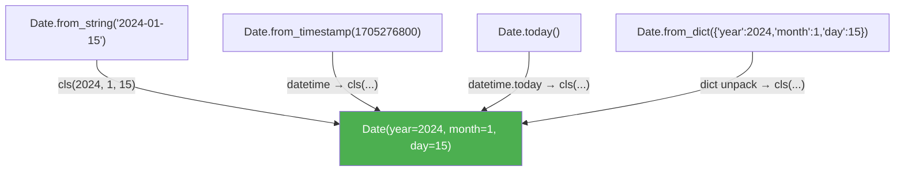

# :material-factory: Classmethod Factory Idiom

!!! abstract "At a Glance"
    **Intent / Purpose:** Provide named constructors — alternative ways to create objects from different input formats without overloading `__init__`.
    **C++ Equivalent:** Named constructor idiom (`Circle::fromRadius()`, `Circle::fromDiameter()`), static factory methods, `std::make_shared`/`std::make_unique`
    **Category:** Python Idiom / Creational

<div class="grid cards" markdown>
- :material-lightbulb-on: **Core Concept** — `@classmethod` receives the *class* as its first argument (`cls`), enabling it to call `cls(...)` and work correctly with subclasses
- :material-snake: **Python Way** — `Date.from_string("2024-01-15")`, `Date.today()`, `Color.from_hex("#ff0000")` — self-documenting named constructors
- :material-alert: **Watch Out** — Using `ClassName(...)` hard-coded inside a classmethod breaks subclass inheritance; always use `cls(...)`
- :material-check-circle: **When to Use** — Multiple valid input formats for the same object, or when constructor arguments would be ambiguous without context
</div>

---

## :material-lightbulb-on: Intuition

!!! info "Core Idea"
    Python's `__init__` is a single entry point. When a class can be created from multiple different
    inputs — a string, a timestamp, a dict, a file — you have two bad options and one good one:

    - **Bad:** one `__init__` with many optional parameters and `isinstance` branches — fragile and unreadable.
    - **Bad:** many module-level functions that return instances — they do not inherit, and callers must import them separately.
    - **Good:** `@classmethod` factory methods — named, self-documenting, inheritable, and keep all construction logic inside the class.

    ```python
    # Ambiguous:
    Date(2024, 1, 15)

    # Clear intent:
    Date.from_iso_string("2024-01-15")
    Date.from_timestamp(1705276800)
    Date.today()
    ```

    Each classmethod is a *named constructor* — it describes **why** or **from what** the object is
    being created, not just **how**.

!!! success "Python vs C++"
    C++ achieves named constructors via private `__init__` and public static factory methods (e.g.,
    `static Circle fromRadius(double r)`). Python's `@classmethod` is more powerful: `cls` is the
    *actual class* at call time, so `Date.from_string(...)` returns a `Date`, but `ExtendedDate.from_string(...)`
    returns an `ExtendedDate` — subclasses get the factory for free. In C++, you must re-implement
    every factory in every subclass, or use CRTP.

---

## :material-sitemap: Multiple Entry Points → One Class



---

## :material-book-open-variant: Implementation

### `Date` Class with Four Named Constructors

```python
from __future__ import annotations
from datetime import datetime, date, timezone
import re


class Date:
    """
    Immutable date value object with four named constructors.
    All classmethods use `cls(...)` so subclasses inherit them correctly.
    """

    def __init__(self, year: int, month: int, day: int) -> None:
        self._validate(year, month, day)
        self.year  = year
        self.month = month
        self.day   = day

    # ── Validation ────────────────────────────────────────────────────────────
    @staticmethod
    def _validate(year: int, month: int, day: int) -> None:
        if not (1 <= month <= 12):
            raise ValueError(f"Invalid month: {month}")
        if not (1 <= day <= 31):
            raise ValueError(f"Invalid day: {day}")

    # ── Named constructors ────────────────────────────────────────────────────

    @classmethod
    def from_iso_string(cls, date_str: str) -> Date:
        """Parse an ISO-8601 date string: '2024-01-15' or '20240115'."""
        date_str = date_str.replace("-", "")
        if not re.fullmatch(r"\d{8}", date_str):
            raise ValueError(f"Expected YYYYMMDD or YYYY-MM-DD, got {date_str!r}")
        return cls(int(date_str[:4]), int(date_str[4:6]), int(date_str[6:8]))

    @classmethod
    def from_timestamp(cls, ts: float) -> Date:
        """Construct from a POSIX timestamp (seconds since epoch)."""
        dt = datetime.fromtimestamp(ts, tz=timezone.utc)
        return cls(dt.year, dt.month, dt.day)

    @classmethod
    def today(cls) -> Date:
        """Construct today's date in local time."""
        d = date.today()
        return cls(d.year, d.month, d.day)

    @classmethod
    def from_dict(cls, data: dict) -> Date:
        """Construct from a dictionary with 'year', 'month', 'day' keys."""
        try:
            return cls(data["year"], data["month"], data["day"])
        except KeyError as e:
            raise ValueError(f"Missing required key: {e}") from e

    # ── Dunder methods ────────────────────────────────────────────────────────
    def to_iso_string(self) -> str:
        return f"{self.year:04d}-{self.month:02d}-{self.day:02d}"

    def __repr__(self) -> str:
        return f"{type(self).__name__}({self.year}, {self.month}, {self.day})"

    def __eq__(self, other: object) -> bool:
        if not isinstance(other, Date):
            return NotImplemented
        return (self.year, self.month, self.day) == (other.year, other.month, other.day)

    def __lt__(self, other: Date) -> bool:
        return (self.year, self.month, self.day) < (other.year, other.month, other.day)


# ── Usage ─────────────────────────────────────────────────────────────────────
d1 = Date(2024, 1, 15)
d2 = Date.from_iso_string("2024-01-15")
d3 = Date.from_iso_string("20240115")
d4 = Date.from_timestamp(1705276800.0)
d5 = Date.today()
d6 = Date.from_dict({"year": 2024, "month": 1, "day": 15})

print(d1, d2, d3)          # all equal
print(d1 == d2)            # True
print(d5.to_iso_string())  # today's date


# ── Subclass inherits all classmethods ────────────────────────────────────────
class FiscalDate(Date):
    """Example subclass — inherits all named constructors."""

    @property
    def fiscal_quarter(self) -> int:
        return (self.month - 1) // 3 + 1

    def __repr__(self) -> str:
        return f"FiscalDate({self.year}, {self.month}, {self.day}, Q{self.fiscal_quarter})"


fd = FiscalDate.from_iso_string("2024-07-01")
print(fd)               # FiscalDate(2024, 7, 1, Q3) — correct type!
print(type(fd))         # <class '__main__.FiscalDate'>
```

### `Color` from Hex, RGB, or Name

```python
from __future__ import annotations


class Color:
    """Immutable colour value object with multiple construction paths."""

    # Named colour palette
    _NAMED: dict[str, tuple[int, int, int]] = {
        "red":   (255, 0,   0),
        "green": (0,   255, 0),
        "blue":  (0,   0,   255),
        "white": (255, 255, 255),
        "black": (0,   0,   0),
    }

    def __init__(self, r: int, g: int, b: int) -> None:
        for channel, val in (("r", r), ("g", g), ("b", b)):
            if not 0 <= val <= 255:
                raise ValueError(f"Channel {channel} out of range: {val}")
        self.r, self.g, self.b = r, g, b

    @classmethod
    def from_hex(cls, hex_str: str) -> Color:
        """Parse #RRGGBB or RRGGBB hex strings."""
        hex_str = hex_str.lstrip("#")
        if len(hex_str) != 6:
            raise ValueError(f"Expected 6 hex digits, got {hex_str!r}")
        r, g, b = (int(hex_str[i:i+2], 16) for i in (0, 2, 4))
        return cls(r, g, b)

    @classmethod
    def from_rgb_string(cls, rgb: str) -> Color:
        """Parse 'rgb(255, 128, 0)' CSS-style strings."""
        import re
        m = re.fullmatch(r"rgb\(\s*(\d+)\s*,\s*(\d+)\s*,\s*(\d+)\s*\)", rgb.strip())
        if not m:
            raise ValueError(f"Invalid rgb() string: {rgb!r}")
        return cls(int(m.group(1)), int(m.group(2)), int(m.group(3)))

    @classmethod
    def from_name(cls, name: str) -> Color:
        """Construct from a named colour."""
        name = name.lower()
        if name not in cls._NAMED:
            raise ValueError(f"Unknown colour name: {name!r}. Known: {list(cls._NAMED)}")
        return cls(*cls._NAMED[name])

    @classmethod
    def from_hsv(cls, h: float, s: float, v: float) -> Color:
        """Convert HSV (h: 0-360, s: 0-1, v: 0-1) to RGB Color."""
        import colorsys
        r, g, b = colorsys.hsv_to_rgb(h / 360, s, v)
        return cls(round(r * 255), round(g * 255), round(b * 255))

    def to_hex(self) -> str:
        return f"#{self.r:02X}{self.g:02X}{self.b:02X}"

    def __repr__(self) -> str:
        return f"{type(self).__name__}(r={self.r}, g={self.g}, b={self.b})"


# All four construction paths:
c1 = Color(255, 128, 0)
c2 = Color.from_hex("#FF8000")
c3 = Color.from_rgb_string("rgb(255, 128, 0)")
c4 = Color.from_hsv(30, 1.0, 1.0)   # orange
c5 = Color.from_name("red")

print(c1, c2, c3, c4)
print(c2.to_hex())   # #FF8000
```

### `Config` from File, Environment, or Dictionary

```python
from __future__ import annotations
import json
import os
from pathlib import Path


class Config:
    """Application configuration loaded from multiple sources."""

    DEFAULTS: dict = {
        "debug":    False,
        "host":     "localhost",
        "port":     8080,
        "log_level": "INFO",
    }

    def __init__(self, settings: dict) -> None:
        self._settings = {**self.DEFAULTS, **settings}

    def get(self, key: str, default=None):
        return self._settings.get(key, default)

    def __getattr__(self, name: str):
        try:
            return self._settings[name]
        except KeyError:
            raise AttributeError(f"Config has no setting {name!r}")

    @classmethod
    def from_dict(cls, data: dict) -> Config:
        """Construct directly from a dictionary (e.g., in tests)."""
        return cls(data)

    @classmethod
    def from_json_file(cls, path: str | Path) -> Config:
        """Load configuration from a JSON file."""
        with open(path, encoding="utf-8") as f:
            data = json.load(f)
        return cls(data)

    @classmethod
    def from_environment(cls, prefix: str = "APP_") -> Config:
        """Load configuration from environment variables."""
        data: dict = {}
        for key, value in os.environ.items():
            if key.startswith(prefix):
                setting_key = key[len(prefix):].lower()
                # Simple type coercion
                if value.lower() in ("true", "false"):
                    data[setting_key] = value.lower() == "true"
                elif value.isdigit():
                    data[setting_key] = int(value)
                else:
                    data[setting_key] = value
        return cls(data)

    @classmethod
    def from_toml_file(cls, path: str | Path) -> Config:
        """Load configuration from a TOML file (Python 3.11+)."""
        import tomllib
        with open(path, "rb") as f:
            data = tomllib.load(f)
        return cls(data)

    def __repr__(self) -> str:
        return f"Config({self._settings!r})"


# Test usage
cfg_test = Config.from_dict({"debug": True, "port": 9000})
print(cfg_test.debug)   # True
print(cfg_test.port)    # 9000

# Environment usage (set APP_DEBUG=true, APP_PORT=5000)
os.environ["APP_DEBUG"] = "true"
os.environ["APP_PORT"]  = "5000"
cfg_env = Config.from_environment("APP_")
print(cfg_env.debug)    # True
print(cfg_env.port)     # 5000
```

### `__init_subclass__` for Subclass Configuration

```python
class Plugin:
    """
    @classmethod factory + __init_subclass__ to auto-register subclasses.
    """

    _registry: dict[str, type] = {}

    def __init_subclass__(cls, name: str | None = None, **kwargs) -> None:
        super().__init_subclass__(**kwargs)
        plugin_name = name or cls.__name__.lower()
        Plugin._registry[plugin_name] = cls

    @classmethod
    def create(cls, name: str, **kwargs) -> Plugin:
        """Factory: look up subclass by registered name and instantiate."""
        if name not in cls._registry:
            raise KeyError(f"Unknown plugin: {name!r}. Available: {list(cls._registry)}")
        return cls._registry[name](**kwargs)


class JsonPlugin(Plugin, name="json"):
    def __init__(self, indent: int = 2) -> None:
        self.indent = indent

class YamlPlugin(Plugin, name="yaml"):
    def __init__(self, default_flow: bool = False) -> None:
        self.default_flow = default_flow


p = Plugin.create("json", indent=4)
print(type(p).__name__, p.indent)   # JsonPlugin 4

p2 = Plugin.create("yaml")
print(type(p2).__name__)            # YamlPlugin
```

---

## :material-alert: Common Pitfalls

!!! warning "Hard-Coding the Class Name Instead of Using `cls`"
    The most common mistake breaks subclass inheritance:

    ```python
    # WRONG — always returns Date, even when called on FiscalDate
    @classmethod
    def from_string(cls, s: str) -> Date:
        return Date(int(s[:4]), int(s[4:6]), int(s[6:8]))  # ← hard-coded!

    # CORRECT — returns the actual subclass type
    @classmethod
    def from_string(cls, s: str) -> Date:
        return cls(int(s[:4]), int(s[4:6]), int(s[6:8]))   # ← uses cls
    ```

!!! warning "Overloading `__init__` Instead of Using Named Constructors"
    ```python
    # Hard to read — what does the second argument mean?
    Date(2024, 1)        # month + day? year + month?
    Date("2024-01-15")   # string mode?
    Date(1705276800)     # timestamp mode?
    ```
    Named constructors make the intent unambiguous and the code self-documenting.

!!! danger "Mutable Default Values in Classmethods"
    ```python
    @classmethod
    def from_dict(cls, data: dict = {}) -> MyClass:  # BUG — shared mutable default
        ...
    ```
    Use `None` as default and replace inside the method:
    ```python
    @classmethod
    def from_dict(cls, data: dict | None = None) -> MyClass:
        data = data or {}
        ...
    ```

!!! danger "Classmethods That Access Instance State"
    A `@classmethod` receives `cls` (the class), not `self` (an instance). Accessing `self.x` inside
    a classmethod is always a `NameError`. If you need access to instance state, use a regular method
    or `@staticmethod` + explicit instance parameter.

---

## :material-help-circle: Flashcards

???+ question "What is the key difference between `@classmethod`, `@staticmethod`, and a regular method?"
    - **Regular method** — receives `self` (instance); can access and mutate instance state.
    - **`@staticmethod`** — receives no implicit first argument; logically related to the class but needs neither class nor instance.
    - **`@classmethod`** — receives `cls` (the class itself); can call `cls(...)` to create instances and accesses class-level attributes. Inheritable: `SubClass.factory()` receives `SubClass` as `cls`, not the base class.

???+ question "Why does a classmethod factory use `cls(...)` instead of `ClassName(...)`?"
    Because `cls` is bound to the *actual* class at call time. If `FiscalDate.from_iso_string(...)` is
    called, `cls` is `FiscalDate`, so `cls(...)` creates a `FiscalDate` instance — the correct type.
    Using `Date(...)` hard-codes the base class and returns a `Date` even when called on a subclass,
    breaking the Liskov Substitution Principle.

???+ question "What is the named constructor idiom and why is it preferred over `__init__` with many optional parameters?"
    Named constructors are `@classmethod` factory methods with descriptive names that make the source
    of the data explicit (`from_hex`, `from_timestamp`, `today`). They are preferred because:
    (1) each constructor has a focused, clear signature; (2) `__init__` stays simple with one canonical
    set of arguments; (3) new construction paths can be added without changing `__init__` or existing code.

???+ question "How does `@classmethod` interact with `__init_subclass__` for plugin registration?"
    `__init_subclass__` runs at class definition time and registers the subclass in a dict. The base
    class's `@classmethod` factory (`create(name)`) looks up the subclass in that dict and calls
    `cls(**kwargs)` to instantiate it. Together they form a self-registering plugin system: adding a
    new plugin requires only defining a new subclass — no manual registry update needed.

---

## :material-clipboard-check: Self Test

=== "Question 1"
    Write a `Temperature` class with `__init__(self, celsius: float)` and three named constructors:
    `from_fahrenheit`, `from_kelvin`, and `from_string` (parses `"100°C"`, `"212°F"`, or `"373.15K"`).

=== "Answer 1"
    ```python
    from __future__ import annotations
    import re

    class Temperature:
        def __init__(self, celsius: float) -> None:
            if celsius < -273.15:
                raise ValueError(f"Below absolute zero: {celsius}°C")
            self.celsius = celsius

        @classmethod
        def from_fahrenheit(cls, f: float) -> Temperature:
            return cls((f - 32) * 5 / 9)

        @classmethod
        def from_kelvin(cls, k: float) -> Temperature:
            return cls(k - 273.15)

        @classmethod
        def from_string(cls, s: str) -> Temperature:
            m = re.fullmatch(r"(-?\d+\.?\d*)([°]?)([CFK])", s.strip())
            if not m:
                raise ValueError(f"Cannot parse temperature: {s!r}")
            value, _, unit = float(m.group(1)), m.group(2), m.group(3)
            if unit == "C": return cls(value)
            if unit == "F": return cls.from_fahrenheit(value)
            if unit == "K": return cls.from_kelvin(value)

        @property
        def fahrenheit(self) -> float: return self.celsius * 9 / 5 + 32

        @property
        def kelvin(self) -> float: return self.celsius + 273.15

        def __repr__(self) -> str:
            return f"Temperature({self.celsius:.2f}°C)"


    t1 = Temperature(100)
    t2 = Temperature.from_fahrenheit(212)
    t3 = Temperature.from_kelvin(373.15)
    t4 = Temperature.from_string("212°F")

    print(t1, t2, t3, t4)        # all ~100°C
    print(t1 == t2)               # False (not implemented) — add __eq__ for True
    print(Temperature.from_string("0K").celsius)   # -273.15
    ```

=== "Question 2"
    Explain why the following classmethod is broken for subclasses and write the corrected version.

    ```python
    class Animal:
        def __init__(self, name: str, sound: str) -> None:
            self.name  = name
            self.sound = sound

        @classmethod
        def silent(cls, name: str) -> "Animal":
            return Animal(name, "")   # BUG
    ```

=== "Answer 2"
    **Bug:** `Animal(name, "")` always creates an `Animal` instance even when `silent` is called on a
    subclass. `Dog.silent("Rex")` returns an `Animal`, not a `Dog`.

    **Corrected version:**
    ```python
    class Animal:
        def __init__(self, name: str, sound: str) -> None:
            self.name  = name
            self.sound = sound

        @classmethod
        def silent(cls, name: str) -> Animal:
            return cls(name, "")   # use cls, not Animal

    class Dog(Animal):
        def speak(self) -> str:
            return self.sound or "*wag*"

    d = Dog.silent("Rex")
    print(type(d).__name__)   # Dog — correct!
    print(d.speak())          # *wag*
    ```
    Using `cls(...)` instead of `Animal(...)` is the fundamental rule for all classmethod factories.

---

## :material-check-circle: Summary

!!! success "Key Takeaways"
    - `@classmethod` receives `cls` (the class) as first argument, enabling it to create instances of the exact subclass being called on.
    - **Named constructors** (`from_string`, `from_timestamp`, `today`) are self-documenting alternatives to overloaded `__init__`.
    - Always use `cls(...)` inside classmethods — never hard-code the base class name.
    - Combine with `__init_subclass__` for self-registering plugin systems.
    - `@staticmethod` has no `cls`/`self` — use it for utility functions logically tied to the class but not needing instance or class state.
    - Named constructors keep `__init__` simple (one canonical parameter set) while supporting many input formats cleanly.
    - Subclasses inherit all `@classmethod` factories for free, which is the key advantage over module-level factory functions.
