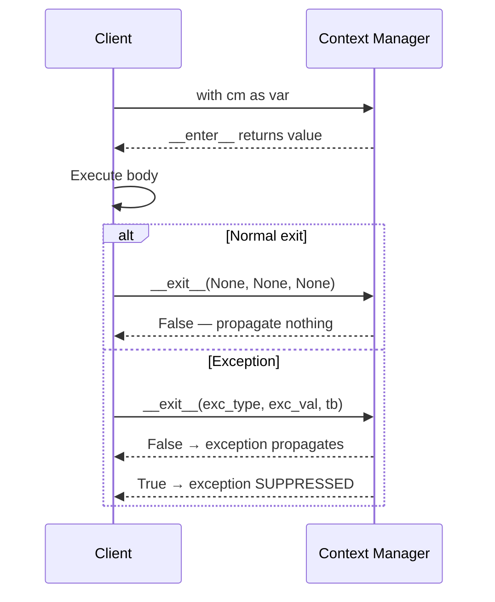

# :material-shield-lock: Context Manager Idiom

!!! abstract "At a Glance"
    **Goal:** Guarantee resource cleanup regardless of success or failure — Python's RAII.
    **C++ Equivalent:** RAII — Resource Acquisition Is Initialization with automatic destructors.

<div class="grid cards" markdown>

- :material-lightbulb-on: **Core Concept** — `__enter__` acquires the resource; `__exit__` always releases it
- :material-snake: **Python Way** — Class form or `@contextmanager` generator; both are equally valid
- :material-alert: **Watch Out** — `__exit__` returning `True` suppresses exceptions
- :material-check-circle: **When to Use** — Files, locks, DB connections, temp dirs, mocks, timers

</div>

## :material-lightbulb-on: Intuition

!!! info "Core Idea"
    Python's garbage collector is non-deterministic — you cannot rely on `__del__` for timely
    cleanup. The context manager protocol (`with` statement) provides **deterministic cleanup**:
    `__exit__` is guaranteed to run when the `with` block exits, whether normally or via exception.

!!! success "Python vs C++ RAII"
    | C++ RAII | Python Context Manager |
    |---|---|
    | Constructor acquires | `__enter__` acquires |
    | Destructor releases (deterministic) | `__exit__` releases (deterministic within `with`) |
    | `std::lock_guard lk(mutex)` | `with lock:` |
    | `std::unique_ptr<File>` | `with open("f") as f:` |

## :material-chart-timeline: Context Manager Lifecycle



## :material-table: Class Form vs `@contextmanager`

| Feature | Class Form | `@contextmanager` |
|---|---|---|
| Syntax | `__enter__` / `__exit__` | Generator with `yield` |
| Exception handling | Via `__exit__` params | `try/except` around `yield` |
| Async support | `__aenter__` / `__aexit__` | `@asynccontextmanager` |
| State management | `self.attributes` | Local variables |
| Base class support | Yes | No |
| Best for | Complex state, inheritance | Simple setup/teardown |

## :material-book-open-variant: Class Form

```python
import time
from types import TracebackType

class Timer:
    def __init__(self, label: str = "") -> None:
        self.label = label
        self.elapsed: float = 0.0

    def __enter__(self) -> "Timer":
        self._start = time.perf_counter()
        return self

    def __exit__(
        self,
        exc_type: type[BaseException] | None,
        exc_val: BaseException | None,
        exc_tb: TracebackType | None,
    ) -> bool:
        self.elapsed = time.perf_counter() - self._start
        if self.label:
            print(f"[{self.label}] elapsed={self.elapsed:.4f}s")
        return False   # never suppress exceptions

with Timer("query") as t:
    result = sum(range(1_000_000))
print(f"Result={result}, Time={t.elapsed:.4f}s")
```

## :material-function-variant: `@contextmanager` Form

```python
from contextlib import contextmanager

@contextmanager
def temp_directory():
    import tempfile, shutil
    path = tempfile.mkdtemp()
    try:
        yield path            # body of 'with' executes here
    finally:
        shutil.rmtree(path)   # ALWAYS runs — even on exception

@contextmanager
def suppress_and_log(*exc_types):
    try:
        yield
    except exc_types as e:
        print(f"[SUPPRESSED] {type(e).__name__}: {e}")

with temp_directory() as td:
    import os; os.makedirs(f"{td}/subdir")
# temp dir deleted here

with suppress_and_log(FileNotFoundError):
    open("missing.txt").read()   # suppressed!
```

!!! warning "Always `try/finally` in `@contextmanager`"
    Without `try/finally`, the cleanup code after `yield` is **not called** if an exception
    occurs in the `with` block. The `finally` clause guarantees cleanup regardless.

## :material-layers: `contextlib.ExitStack`

```python
from contextlib import ExitStack

def process_files(paths: list[str]) -> None:
    """Open a dynamic number of files simultaneously."""
    with ExitStack() as stack:
        files = [stack.enter_context(open(p)) for p in paths]
        # All files are open here; all closed when with-block exits
        for f in files:
            print(f.readline())

def conditional_lock(mutex, needs_lock: bool) -> None:
    with ExitStack() as stack:
        if needs_lock:
            stack.enter_context(mutex)
        do_work()   # mutex held only if needs_lock is True
```

## :material-table: Real-World Examples

| Use Case | Context Manager |
|---|---|
| File I/O | `open("file.txt")` |
| Thread lock | `threading.Lock()` |
| SQLite transaction | `sqlite3.connect(...)` |
| Temporary directory | `tempfile.TemporaryDirectory()` |
| Suppress exceptions | `contextlib.suppress(ErrType)` |
| Redirect stdout | `contextlib.redirect_stdout(f)` |
| Mock patch | `unittest.mock.patch("mod.attr")` |
| Pytest assertion | `pytest.raises(ValueError)` |

## :material-alert: Common Pitfalls

!!! warning "Using `__del__` instead of context manager"
    `__del__` is called by the GC non-deterministically. Files may stay open, locks held,
    connections dangling. Always use `with` for resource management.

!!! danger "Not re-raising in `@contextmanager`"
    ```python
    @contextmanager
    def bad():
        try:
            yield
        except Exception as e:
            log(e)
            # forgot 'raise' — exception is SILENTLY SWALLOWED
    ```

## :material-help-circle: Flashcards

???+ question "What are the three arguments passed to `__exit__`?"
    `__exit__(self, exc_type, exc_val, exc_tb)` receives the exception type, exception instance,
    and traceback — all `None` if no exception occurred. Return `True` to suppress the exception;
    return `False` or `None` to propagate it. Suppressing is almost always wrong.

???+ question "What is `contextlib.suppress()` and when should you use it?"
    `suppress(*exc_types)` is a context manager that silently ignores the specified exception
    types. Use it when you expect a specific exception and want to handle it by doing nothing:
    `with suppress(FileNotFoundError): os.remove(path)`. It is cleaner than `try/except: pass`.

???+ question "How do you write an async context manager?"
    Class form: `async def __aenter__` and `async def __aexit__`. Generator form:
    `@asynccontextmanager` from `contextlib` with `async def` and `yield`. Use `async with`.

???+ question "What does `ExitStack.callback()` do?"
    `stack.callback(func, *args, **kwargs)` registers a function to be called when the `ExitStack`
    exits — even if no exception occurs. Unlike `enter_context`, it does not require a context
    manager. Useful for cleanup functions that are not context managers.

## :material-clipboard-check: Self Test

=== "Question 1"
    Implement a `transaction` context manager that commits on success and rolls back on exception.

=== "Answer 1"
    ```python
    from contextlib import contextmanager

    @contextmanager
    def transaction(conn):
        try:
            yield conn
            conn.commit()
        except Exception:
            conn.rollback()
            raise   # re-raise so caller knows it failed
    ```

=== "Question 2"
    What is the difference between `contextlib.suppress(ValueError)` and `try/except ValueError: pass`?

=== "Answer 2"
    Both are equivalent in behaviour. `suppress()` is more readable for simple "ignore this error"
    patterns. The `try/except` form is more flexible (you can add logging, retry, etc.).
    Use `suppress()` when you explicitly want to communicate "this exception is expected and safe to ignore".
    Never use `except: pass` without specifying the exception type.

## :material-check-circle: Summary

!!! success "Key Takeaways"
    - Context managers guarantee deterministic cleanup via `with` statement.
    - Class form uses `__enter__`/`__exit__`; generator form uses `@contextmanager` + `yield`.
    - Always `try/finally` in `@contextmanager` to guarantee cleanup on exceptions.
    - `ExitStack` handles dynamic and conditional context managers.
    - Return `False` from `__exit__` (almost always). Suppressing exceptions is rarely correct.
    - Never rely on `__del__` for resource cleanup — it is non-deterministic.
