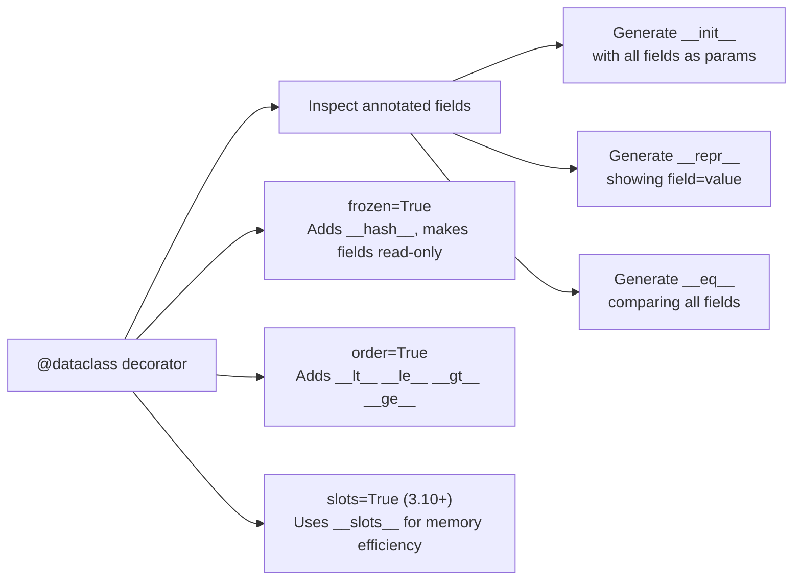

# :material-table-row: Dataclass Idiom

!!! abstract "At a Glance"
    **Goal:** Auto-generate boilerplate class methods from annotated field declarations.
    **C++ Equivalent:** C++ Rule of Zero — compiler-generated special members; `struct` aggregate initialisation.

<div class="grid cards" markdown>

- :material-lightbulb-on: **Core Concept** — Declare fields with annotations; `@dataclass` generates the rest
- :material-snake: **Python Way** — `@dataclass`, `frozen=True`, `slots=True`, `field()`, `__post_init__`
- :material-alert: **Watch Out** — Mutable defaults must use `field(default_factory=callable)`
- :material-check-circle: **When to Use** — Value objects, DTOs, configuration, any data-holding class

</div>

## :material-lightbulb-on: Intuition

!!! info "Core Idea"
    `@dataclass` is Python's Rule of Zero. You declare what data your class holds, and the
    decorator generates `__init__`, `__repr__`, `__eq__`. Optional flags add ordering,
    hashing, immutability, and memory-efficient slots.

!!! success "Python vs C++ Rule of Zero"
    ```cpp
    // C++ Rule of Zero — compiler generates everything
    struct Point { int x, y; };
    ```
    ```python
    # Python @dataclass — decorator generates everything
    from dataclasses import dataclass

    @dataclass
    class Point:
        x: int
        y: int

    p = Point(1, 2)
    print(p)              # Point(x=1, y=2)
    print(p == Point(1,2))  # True
    ```

## :material-chart-timeline: Dataclass Generation



## :material-book-open-variant: Comprehensive `@dataclass` Example

```python
from dataclasses import dataclass, field, fields, asdict, astuple, replace
from typing import ClassVar

@dataclass(order=True)
class Employee:
    sort_index: float = field(init=False, repr=False)  # for ordering

    name: str
    department: str
    salary: float
    tags: list[str] = field(default_factory=list)  # mutable default!

    company: ClassVar[str] = "Acme Corp"  # class variable, not a field

    def __post_init__(self) -> None:
        if self.salary < 0:
            raise ValueError(f"Salary cannot be negative: {self.salary}")
        object.__setattr__(self, "sort_index", self.salary)

alice = Employee("Alice", "Engineering", 95_000.0, ["python", "rust"])
bob = Employee("Bob", "Marketing", 75_000.0)

print(alice)                           # Employee(name='Alice', ...)
print(alice == Employee("Alice", "Engineering", 95_000.0, ["python", "rust"]))  # True
print(sorted([alice, bob]))            # sorted by salary (sort_index)

# Serialise
print(asdict(alice))                   # dict
print(astuple(alice))                  # tuple

# Immutable copy with changes
senior_alice = replace(alice, salary=120_000.0)
print(senior_alice.name, senior_alice.salary)  # Alice 120000.0
print(alice.salary)                    # 95000.0 — unchanged!

# Introspect fields
for f in fields(alice):
    print(f.name, f.type, getattr(alice, f.name))
```

## :material-snowflake: Frozen and Slots

```python
@dataclass(frozen=True)
class ImmutablePoint:
    x: float
    y: float

p = ImmutablePoint(1.0, 2.0)
# p.x = 3.0   # FrozenInstanceError!
s = {ImmutablePoint(0, 0), ImmutablePoint(1, 1)}  # hashable!

# slots=True (Python 3.10+) — memory efficient
@dataclass(slots=True)
class SlottedPoint:
    x: float
    y: float
    # No __dict__ — saves ~50-100 bytes per instance
```

## :material-compare: `@dataclass` vs `NamedTuple` vs `TypedDict` vs Manual

| Feature | `@dataclass` | `NamedTuple` | `TypedDict` | Manual class |
|---|---|---|---|---|
| Mutable | Yes (default) | No | Yes (dict) | Yes |
| Tuple indexing | No | Yes | No | No |
| `__init__` generated | Yes | Yes | N/A | No |
| `__repr__` generated | Yes | Yes | N/A | No |
| `__eq__` by value | Yes | Yes (all fields) | No | No |
| `__hash__` | With `frozen=True` | Yes | No | No |
| Memory efficient | With `slots=True` | Yes | Dict overhead | Medium |
| Type annotations | Yes | Yes | Yes (required) | Yes |
| `__post_init__` | Yes | No | No | `__init__` body |
| Inheritance | Yes | Limited | No | Yes |
| When to use | Most data classes | Tuple interop | JSON/dict typing | Complex logic |

## :material-cog: `__post_init__` Validation Pattern

```python
from dataclasses import dataclass, field
from datetime import date

@dataclass
class DateRange:
    start: date
    end: date
    label: str = ""

    def __post_init__(self) -> None:
        if self.end < self.start:
            raise ValueError(
                f"end ({self.end}) must not be before start ({self.start})"
            )
        if not self.label:
            # Set computed default based on other fields
            object.__setattr__(self, "label", f"{self.start}..{self.end}")

    def duration_days(self) -> int:
        return (self.end - self.start).days

dr = DateRange(date(2024, 1, 1), date(2024, 3, 31))
print(dr.label)           # "2024-01-01..2024-03-31"
print(dr.duration_days()) # 90

DateRange(date(2024, 3, 1), date(2024, 1, 1))  # ValueError!
```

## :material-factory: `@classmethod` Named Constructors

```python
@dataclass
class Config:
    host: str = "localhost"
    port: int = 8080
    debug: bool = False

    @classmethod
    def from_env(cls) -> "Config":
        import os
        return cls(
            host=os.environ.get("HOST", "localhost"),
            port=int(os.environ.get("PORT", "8080")),
            debug=os.environ.get("DEBUG", "false").lower() == "true",
        )

    @classmethod
    def development(cls) -> "Config":
        return cls(debug=True)

    @classmethod
    def production(cls, host: str) -> "Config":
        return cls(host=host, debug=False)

dev = Config.development()
prod = Config.production("api.example.com")
```

## :material-alert: Common Pitfalls

!!! warning "Mutable default raises `TypeError`"
    ```python
    @dataclass
    class Bad:
        items: list = []   # TypeError: mutable default not allowed!

    @dataclass
    class Good:
        items: list = field(default_factory=list)   # correct
        config: dict = field(default_factory=dict)
    ```

!!! danger "Inheriting frozen from non-frozen"
    ```python
    @dataclass
    class Base:
        x: int

    @dataclass(frozen=True)
    class Child(Base):
        y: int
    # TypeError: cannot override frozen dataclass from non-frozen one
    # All classes in hierarchy must agree on frozen
    ```

## :material-help-circle: Flashcards

???+ question "What is `__post_init__` used for?"
    `__post_init__` is called automatically after the generated `__init__`. Use it for:
    validation (raise `ValueError` if data is invalid), computing derived fields,
    and type coercion. For `frozen=True` dataclasses, use `object.__setattr__(self, 'field', value)`.

???+ question "What is the difference between `field(default=...)` and `field(default_factory=...)`?"
    `default=value` sets the same literal value for all instances (safe for immutable types).
    `default_factory=callable` calls the callable once per instance — required for mutable types
    like `list`, `dict`, `set`. Always use `default_factory` for mutable defaults.

???+ question "When would you choose `NamedTuple` over `@dataclass`?"
    Choose `NamedTuple` when: tuple unpacking is needed, the object should be hashable without
    `frozen=True`, the object needs tuple interoperability (CSV row, function return tuple),
    or you want the smallest memory footprint. Choose `@dataclass` for mutability, complex
    `__post_init__` logic, or inheritance.

???+ question "What does `dataclasses.replace()` do?"
    `replace(obj, field=value)` creates a shallow copy of the dataclass with specified fields
    changed. It is essential for frozen dataclasses (which cannot be mutated). It enables
    an immutable update pattern: `new = replace(old, x=5)` — `old` is unchanged.

## :material-clipboard-check: Self Test

=== "Question 1"
    Design a frozen `Money` dataclass with `amount` (Decimal) and `currency` (str), plus an `add` method.

=== "Answer 1"
    ```python
    from dataclasses import dataclass
    from decimal import Decimal

    @dataclass(frozen=True)
    class Money:
        amount: Decimal
        currency: str

        def __post_init__(self) -> None:
            if not isinstance(self.amount, Decimal):
                object.__setattr__(self, "amount", Decimal(str(self.amount)))
            if self.amount < 0:
                raise ValueError(f"Amount must be non-negative: {self.amount}")

        def add(self, other: "Money") -> "Money":
            if self.currency != other.currency:
                raise ValueError(f"Currency mismatch: {self.currency} vs {other.currency}")
            return Money(self.amount + other.amount, self.currency)

        def __str__(self) -> str:
            return f"{self.amount:.2f} {self.currency}"

    m1 = Money(Decimal("10.00"), "USD")
    m2 = Money(Decimal("5.50"), "USD")
    print(m1.add(m2))   # 15.50 USD
    ```

=== "Question 2"
    Explain the purpose of `ClassVar` in a dataclass.

=== "Answer 2"
    `ClassVar[T]` marks an attribute as a class variable (not an instance field). The
    `@dataclass` decorator will NOT include it in `__init__`, `__repr__`, or `__eq__`.
    It is shared by all instances and accessed as `ClassName.attr`.

    ```python
    @dataclass
    class Counter:
        total: ClassVar[int] = 0   # shared, not in __init__
        value: int = 0             # per-instance field

        def __post_init__(self):
            Counter.total += 1

    a = Counter(1)
    b = Counter(2)
    print(Counter.total)  # 2
    ```

## :material-check-circle: Summary

!!! success "Key Takeaways"
    - `@dataclass` auto-generates `__init__`, `__repr__`, `__eq__` from annotated fields.
    - `frozen=True` makes instances immutable and adds `__hash__`.
    - `slots=True` (Python 3.10+) replaces `__dict__` with `__slots__` for memory efficiency.
    - Mutable defaults must use `field(default_factory=callable)`.
    - `__post_init__` runs after `__init__` — use for validation and derived fields.
    - `dataclasses.replace()` creates immutable copies with specific field changes.
    - `NamedTuple` for tuple interop; `@dataclass` for everything else.
