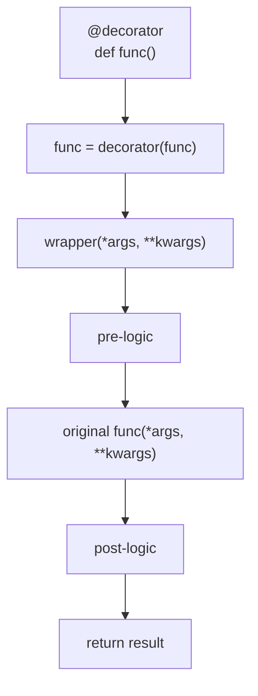

# :material-gift: Decorator Function Idiom

!!! abstract "At a Glance"
    **Purpose:** Wrap a function or class to modify its behaviour without changing its source code. Python's `@decorator` syntax is syntactic sugar for higher-order functions.
    **C++ Equivalent:** CRTP, policy classes, `std::function` wrappers, template decorators
    **Category:** Python Idiom

<div class="grid cards" markdown>

- :material-lightbulb-on: **Core Concept** — A decorator is a callable that takes a function and returns a replacement function
- :material-snake: **Python Way** — `@functools.wraps` preserves metadata; parameterised decorators use a factory
- :material-alert: **Watch Out** — Forgetting `@functools.wraps` breaks `__name__`, `__doc__`, `help()`
- :material-check-circle: **When to Use** — Cross-cutting concerns: logging, caching, retry, validation, timing, auth

</div>

## :material-lightbulb-on: Intuition

!!! info "Core Idea"
    A decorator is gift-wrapping for functions. You hand in your function (the gift), the decorator adds the wrapping paper (extra behaviour), and returns the wrapped package. The caller sees the package and uses it just like the original — but with extras.

!!! success "Python vs C++"
    | Aspect | C++ | Python |
    |---|---|---|
    | Apply extra behaviour | CRTP, policy class, wrapper struct | `@decorator` syntax |
    | Compose behaviours | Template specialisation | Stack multiple decorators |
    | Preserve interface | Compile-time checked | `@functools.wraps` at runtime |
    | Parameterise | Template parameters | Decorator factory (function returning decorator) |
    | Built-in examples | N/A | `@property`, `@classmethod`, `@staticmethod`, `@lru_cache` |

## :material-vector-polyline: Anatomy



## :material-book-open-variant: Implementation

### Basic Decorator

```python
from __future__ import annotations
import functools
from typing import Callable, TypeVar, ParamSpec

P = ParamSpec("P")
R = TypeVar("R")


def log_calls(func: Callable[P, R]) -> Callable[P, R]:
    """Log function entry and exit."""

    @functools.wraps(func)  # preserves __name__, __doc__, __annotations__
    def wrapper(*args: P.args, **kwargs: P.kwargs) -> R:
        print(f"→ Calling {func.__name__}({args}, {kwargs})")
        result = func(*args, **kwargs)
        print(f"← {func.__name__} returned {result!r}")
        return result

    return wrapper


@log_calls
def add(x: int, y: int) -> int:
    """Add two numbers."""
    return x + y

# add(3, 4) prints:
# → Calling add((3, 4), {})
# ← add returned 7
```

### Parameterised Decorator (Factory)

```python
def retry(max_attempts: int = 3, exceptions: tuple[type[Exception], ...] = (Exception,)) -> Callable:
    """Retry on failure — decorator factory."""

    def decorator(func: Callable[P, R]) -> Callable[P, R]:
        @functools.wraps(func)
        def wrapper(*args: P.args, **kwargs: P.kwargs) -> R:
            last_exc: Exception | None = None
            for attempt in range(1, max_attempts + 1):
                try:
                    return func(*args, **kwargs)
                except exceptions as e:
                    last_exc = e
                    print(f"Attempt {attempt}/{max_attempts} failed: {e}")
            raise RuntimeError(f"All {max_attempts} attempts failed") from last_exc
        return wrapper

    return decorator


@retry(max_attempts=3, exceptions=(ConnectionError, TimeoutError))
def fetch_data(url: str) -> str:
    # Simulate flaky network
    import random
    if random.random() < 0.7:
        raise ConnectionError("Network error")
    return f"data from {url}"
```

### Timer Decorator

```python
import time


def timer(func: Callable[P, R]) -> Callable[P, R]:
    """Measure execution time."""

    @functools.wraps(func)
    def wrapper(*args: P.args, **kwargs: P.kwargs) -> R:
        start = time.perf_counter()
        result = func(*args, **kwargs)
        elapsed = time.perf_counter() - start
        print(f"{func.__name__} took {elapsed:.4f}s")
        return result

    return wrapper
```

### Class-Based Decorator

```python
class RateLimit:
    """Class-based decorator for rate limiting."""

    def __init__(self, calls_per_second: float) -> None:
        self._min_interval = 1.0 / calls_per_second
        self._last_call = 0.0

    def __call__(self, func: Callable[P, R]) -> Callable[P, R]:
        @functools.wraps(func)
        def wrapper(*args: P.args, **kwargs: P.kwargs) -> R:
            now = time.monotonic()
            wait = self._min_interval - (now - self._last_call)
            if wait > 0:
                time.sleep(wait)
            self._last_call = time.monotonic()
            return func(*args, **kwargs)
        return wrapper


@RateLimit(calls_per_second=2.0)
def api_call(endpoint: str) -> str:
    return f"response from {endpoint}"
```

### Stacking Decorators

```python
@log_calls          # applied last (outermost)
@timer              # applied second
@retry(max_attempts=2)  # applied first (innermost)
def process(data: str) -> str:
    return data.upper()

# Execution order: log_calls → timer → retry → process
```

### Built-in Decorators

```python
import functools


class DataCache:
    _data: list[int] = []

    @staticmethod
    def validate(value: int) -> bool:
        return value >= 0

    @classmethod
    def from_list(cls, values: list[int]) -> "DataCache":
        obj = cls()
        obj._data = [v for v in values if cls.validate(v)]
        return obj

    @property
    def total(self) -> int:
        return sum(self._data)

    @functools.cached_property
    def sorted_data(self) -> list[int]:
        """Computed once, cached forever."""
        print("Computing sorted_data...")
        return sorted(self._data)


@functools.lru_cache(maxsize=128)
def fibonacci(n: int) -> int:
    if n <= 1:
        return n
    return fibonacci(n - 1) + fibonacci(n - 2)
```

## :material-alert: Common Pitfalls

!!! warning "Forgetting @functools.wraps"
    Without `@functools.wraps`, the wrapper replaces `__name__`, `__doc__`, and `__annotations__`:
    ```python
    def bad_decorator(func):
        def wrapper(*args, **kwargs):   # __name__ = 'wrapper' ← WRONG
            return func(*args, **kwargs)
        return wrapper

    def good_decorator(func):
        @functools.wraps(func)          # __name__ = original function name ✓
        def wrapper(*args, **kwargs):
            return func(*args, **kwargs)
        return wrapper
    ```

!!! danger "Decorator Order Matters"
    Decorators apply bottom-up but execute top-down:
    ```python
    @A  # outermost wrapper — runs first
    @B  # runs second
    @C  # innermost — closest to original function
    def func(): ...
    # Equivalent to: func = A(B(C(func)))
    # Call order: A.wrapper → B.wrapper → C.wrapper → func
    ```
    Getting the order wrong with `@retry` and `@log_calls` can cause misleading logs.

## :material-help-circle: Flashcards

???+ question "What does `@functools.wraps` do and why is it essential?"
    `@functools.wraps(func)` copies the wrapped function's `__name__`, `__qualname__`, `__doc__`, `__dict__`, `__module__`, and `__annotations__` onto the wrapper. Without it:

    - `help(my_func)` shows the wrapper's docstring instead of the original's
    - `my_func.__name__` returns `'wrapper'` instead of the real name
    - Introspection tools (debuggers, Sphinx docs, pytest) get confused

???+ question "What is the difference between a decorator and a decorator factory?"
    - **Decorator**: takes a function, returns a function. Used as `@my_decorator`.
    - **Decorator factory**: takes parameters, returns a decorator. Used as `@my_decorator(param=value)`.

    ```python
    # Decorator (no args)
    @log_calls
    def func(): ...

    # Decorator factory (with args)
    @retry(max_attempts=3)
    def func(): ...
    # Equivalent to: func = retry(max_attempts=3)(func)
    ```

???+ question "When should you use a class-based decorator instead of a function-based one?"
    Use a **class-based decorator** when you need to maintain state between calls (e.g., call count, last call time, cached values). The class's `__init__` stores the state and `__call__` implements the wrapping logic.

    Use a **function-based decorator** for stateless cross-cutting concerns (logging, timing, validation).

???+ question "What are `ParamSpec` and `TypeVar` for in typed decorators?"
    `ParamSpec` captures the parameter specification of a callable (argument names, types, defaults), allowing the type checker to verify that the wrapper has the same signature as the original. `TypeVar` captures the return type. Without them, the type checker loses track of the wrapped function's signature and marks calls as errors.

## :material-clipboard-check: Self Test

=== "Question 1"
    Write a `@validate_positive` decorator that raises `ValueError` if any integer argument is negative.

=== "Answer 1"
    ```python
    import functools
    from typing import Callable

    def validate_positive(func: Callable) -> Callable:
        @functools.wraps(func)
        def wrapper(*args, **kwargs):
            for arg in args:
                if isinstance(arg, int) and arg < 0:
                    raise ValueError(f"Negative argument: {arg}")
            for key, val in kwargs.items():
                if isinstance(val, int) and val < 0:
                    raise ValueError(f"Negative argument {key}={val}")
            return func(*args, **kwargs)
        return wrapper

    @validate_positive
    def area(width: int, height: int) -> int:
        return width * height

    area(3, 4)    # 12
    area(-1, 4)   # raises ValueError
    ```

=== "Question 2"
    What is the execution order when three decorators are stacked: `@A`, `@B`, `@C`?

=== "Answer 2"
    Decorators are **applied bottom-up** (C first, then B, then A) but **execute top-down** when the function is called:

    ```python
    @A   # applied 3rd — outermost
    @B   # applied 2nd
    @C   # applied 1st — innermost
    def func(): ...

    # Application: func = A(B(C(func)))
    # Call flow:   A.wrapper → B.wrapper → C.wrapper → original func → C returns → B returns → A returns
    ```

    Think of it like Russian nesting dolls — the outermost `@A` is the first thing a caller sees and the last thing to return.

## :material-check-circle: Summary

!!! success "Key Takeaways"
    - A decorator is a function that takes a function and returns a (usually enhanced) function
    - Always use `@functools.wraps` to preserve the wrapped function's metadata
    - Parameterised decorators are factories: `@retry(3)` returns a decorator which is then applied
    - Class-based decorators are ideal for stateful decoration (rate limiting, call counting)
    - Decorators apply bottom-up but execute top-down — order matters
    - Built-ins `@property`, `@classmethod`, `@staticmethod`, `@lru_cache` are all decorators
