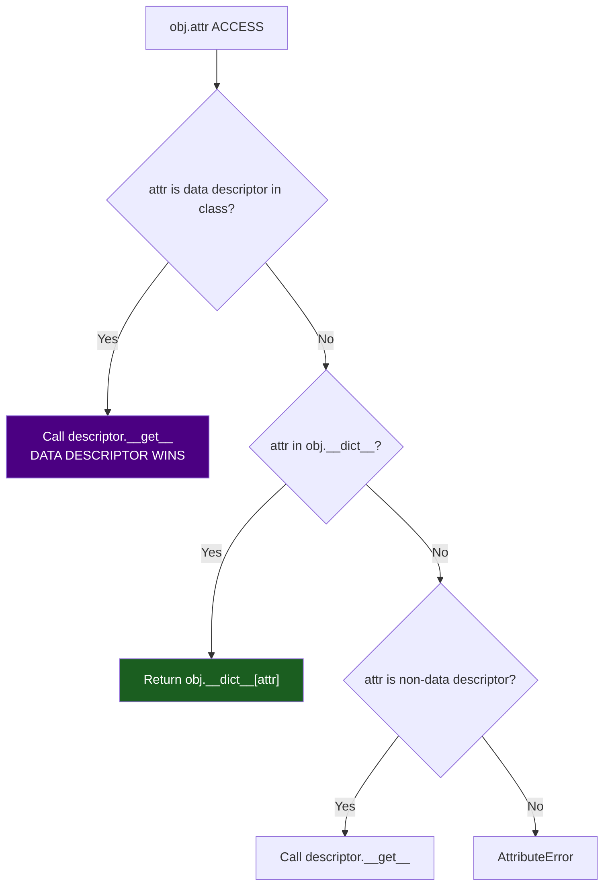

# :material-database-cog: Descriptor Idiom

!!! abstract "At a Glance"
    **Goal:** Customise attribute access for any class by implementing the descriptor protocol.
    **C++ Equivalent:** Overloaded assignment operators, property accessor methods.

<div class="grid cards" markdown>

- :material-lightbulb-on: **Core Concept** — Descriptors control how attribute get/set/delete works on any class
- :material-snake: **Python Way** — `__get__`, `__set__`, `__delete__` + `__set_name__`
- :material-alert: **Watch Out** — Data descriptors (with `__set__`) take priority over instance `__dict__`
- :material-check-circle: **When to Use** — Validation, caching, ORM fields, type-checked attributes

</div>

## :material-lightbulb-on: Intuition

!!! info "Core Idea"
    When you write `obj.attr`, Python does not just look in `obj.__dict__`. It checks if the
    attribute is a **descriptor** in the class. If it is, Python calls `__get__`/`__set__`/`__delete__`.
    This is how `@property`, `classmethod`, and `staticmethod` are implemented.

!!! success "Python vs C++ Access Control"
    | C++ | Python Descriptor |
    |---|---|
    | `int& get_x()` getter | `__get__` method |
    | `void set_x(int v)` with validation | `__set__` with validation |
    | No equivalent for self-naming | `__set_name__` hook |

## :material-chart-timeline: Descriptor Lookup Priority



## :material-book-open-variant: Data Descriptor — Validated Attribute

```python
from __future__ import annotations
from typing import Any

class Validated:
    """Data descriptor with validation."""

    def __set_name__(self, owner: type, name: str) -> None:
        # Called automatically when assigned in a class body
        self._name = name
        self._private = f"_{name}"

    def __get__(self, obj: Any, objtype: type | None = None) -> Any:
        if obj is None:
            return self   # accessed from class — return descriptor itself
        return getattr(obj, self._private, None)

    def __set__(self, obj: Any, value: Any) -> None:
        validated = self.validate(value)
        setattr(obj, self._private, validated)

    def __delete__(self, obj: Any) -> None:
        delattr(obj, self._private)

    def validate(self, value: Any) -> Any:
        return value   # base: no validation

class PositiveFloat(Validated):
    def validate(self, value: Any) -> float:
        v = float(value)
        if v <= 0:
            raise ValueError(f"{self._name} must be positive, got {v}")
        return v

class NonEmptyStr(Validated):
    def validate(self, value: Any) -> str:
        v = str(value).strip()
        if not v:
            raise ValueError(f"{self._name} must not be empty")
        return v

class Product:
    name = NonEmptyStr()
    price = PositiveFloat()
    quantity = PositiveFloat()

    def __init__(self, name: str, price: float, quantity: float) -> None:
        self.name = name       # calls NonEmptyStr.__set__
        self.price = price     # calls PositiveFloat.__set__
        self.quantity = quantity

p = Product("Widget", 9.99, 100)
print(p.name, p.price)   # Widget 9.99

try:
    p.price = -5.0   # ValueError: price must be positive
except ValueError as e:
    print(e)
```

## :material-cached: Non-Data Descriptor — Lazy Cached Property

```python
class LazyProperty:
    """Non-data descriptor: computes once, cached in instance __dict__."""

    def __init__(self, func) -> None:
        self.func = func
        self.__doc__ = func.__doc__

    def __set_name__(self, owner, name):
        self._name = name

    def __get__(self, obj, objtype=None):
        if obj is None:
            return self
        # Store result in instance __dict__ — bypasses descriptor on next access
        value = self.func(obj)
        obj.__dict__[self._name] = value
        return value

class Circle:
    def __init__(self, radius: float) -> None:
        self.radius = radius

    @LazyProperty
    def area(self) -> float:
        """Computed once, then cached."""
        import math
        print("Computing area...")
        return math.pi * self.radius ** 2

c = Circle(5)
print(c.area)   # "Computing area..." then 78.54
print(c.area)   # No "Computing area..." — from __dict__ cache
```

!!! info "Use `functools.cached_property` (Python 3.8+)"
    The built-in `@functools.cached_property` works exactly like `LazyProperty` above.
    Use it instead of rolling your own.

## :material-tag: `__set_name__` Hook

```python
class TypedAttribute:
    """Descriptor that enforces a specific type, auto-names via __set_name__."""

    def __init__(self, expected_type: type) -> None:
        self._type = expected_type
        self._name: str = ""

    def __set_name__(self, owner: type, name: str) -> None:
        self._name = name   # descriptor learns its own name!

    def __get__(self, obj, objtype=None):
        if obj is None:
            return self
        return obj.__dict__.get(self._name)

    def __set__(self, obj, value):
        if not isinstance(value, self._type):
            raise TypeError(
                f"{self._name!r} expects {self._type.__name__}, "
                f"got {type(value).__name__}"
            )
        obj.__dict__[self._name] = value

class Config:
    host = TypedAttribute(str)
    port = TypedAttribute(int)
    debug = TypedAttribute(bool)

    def __init__(self, host: str, port: int, debug: bool = False) -> None:
        self.host = host
        self.port = port
        self.debug = debug

cfg = Config("localhost", 8080)
try:
    cfg.port = "9000"   # TypeError: port expects int, got str
except TypeError as e:
    print(e)
```

## :material-table: Descriptor Use Cases

| Use Case | Descriptor Type | Built-in Example |
|---|---|---|
| Getter/setter with validation | Data descriptor | `@property` |
| Lazy computed attribute | Non-data descriptor | `@functools.cached_property` |
| ORM field definition | Data descriptor | SQLAlchemy `Column` |
| Type-checked attribute | Data descriptor | `attrs` validators |
| Class method binding | Non-data descriptor | `classmethod` |
| Static method | Non-data descriptor | `staticmethod` |

## :material-alert: Common Pitfalls

!!! warning "Instance `__dict__` beats non-data descriptor"
    ```python
    class NonData:
        def __get__(self, obj, objtype=None): return "descriptor"
        # No __set__ — NON-data descriptor

    class Foo:
        x = NonData()

    foo = Foo()
    foo.__dict__["x"] = "instance"   # store directly
    print(foo.x)   # "instance" — instance __dict__ wins over non-data descriptor!
    ```

!!! danger "Infinite recursion in `__set__`"
    ```python
    class BadDescriptor:
        def __set__(self, obj, value):
            obj.x = value   # INFINITE RECURSION — calls __set__ again!

    # CORRECT: use obj.__dict__ directly
    def __set__(self, obj, value):
        obj.__dict__[self._name] = value
    ```

## :material-help-circle: Flashcards

???+ question "What is the difference between a data and non-data descriptor?"
    A **data descriptor** implements `__set__` (and optionally `__delete__`). It takes priority
    over the instance `__dict__`. A **non-data descriptor** only implements `__get__`. The
    instance `__dict__` takes priority over it. `property` is a data descriptor.
    `classmethod` and `staticmethod` are non-data descriptors.

???+ question "What is `__set_name__` and why was it added?"
    `__set_name__(owner, name)` is called when a descriptor is assigned in a class body.
    It tells the descriptor its own attribute name — before Python 3.6, you had to pass
    the name explicitly: `x = TypedAttr(int, "x")`. Now: `x = TypedAttr(int)` and the
    descriptor receives `"x"` automatically via `__set_name__`.

???+ question "How does `@property` work as a descriptor?"
    `property` is a built-in data descriptor. `@property` creates a `property` object with
    `fget`. `@x.setter` creates a new `property` with both `fget` and `fset`. When you access
    `obj.x`, Python calls `property.__get__(obj, type(obj))` which calls `fget(obj)`.
    The data descriptor priority ensures the property always takes precedence over `__dict__`.

???+ question "Why does `functools.cached_property` not work with `__slots__`?"
    `cached_property` caches by writing to `obj.__dict__`. Classes with `__slots__` do not have
    a `__dict__` by default, so the write fails with `AttributeError`. To use caching with
    `__slots__`, either include `"__dict__"` in `__slots__`, or implement your own caching
    descriptor that stores in a slot.

## :material-clipboard-check: Self Test

=== "Question 1"
    Implement a `Clamped` descriptor that ensures a float stays within `[min_val, max_val]`.

=== "Answer 1"
    ```python
    class Clamped:
        def __init__(self, min_val: float, max_val: float) -> None:
            self.min_val = min_val
            self.max_val = max_val

        def __set_name__(self, owner, name):
            self._name = name

        def __get__(self, obj, objtype=None):
            if obj is None:
                return self
            return obj.__dict__.get(self._name, self.min_val)

        def __set__(self, obj, value: float) -> None:
            clamped = max(self.min_val, min(self.max_val, float(value)))
            obj.__dict__[self._name] = clamped

    class Volume:
        level = Clamped(0.0, 100.0)
        def __init__(self, level: float) -> None:
            self.level = level

    v = Volume(50.0)
    v.level = 120.0
    print(v.level)    # 100.0
    v.level = -10.0
    print(v.level)    # 0.0
    ```

=== "Question 2"
    Explain why `@functools.cached_property` is a non-data descriptor and why that enables caching.

=== "Answer 2"
    `cached_property` only implements `__get__` (no `__set__`), making it a non-data descriptor.
    On the first access, `__get__` computes the value and writes it to `obj.__dict__[name]`.
    On subsequent accesses, Python finds the value in `__dict__` first (instance dict wins
    over non-data descriptor) and returns it directly without calling `__get__`.
    This is the caching mechanism — if it were a data descriptor, `__get__` would always be called.

## :material-check-circle: Summary

!!! success "Key Takeaways"
    - Descriptors control attribute access by implementing `__get__`, `__set__`, `__delete__`.
    - Data descriptors (with `__set__`) take priority over instance `__dict__`.
    - Non-data descriptors (only `__get__`) are overridden by instance `__dict__`.
    - `__set_name__` gives descriptors their own attribute name automatically (Python 3.6+).
    - `@property` is a built-in data descriptor; `functools.cached_property` is non-data.
    - Use descriptors for reusable validation, type enforcement, and ORM-style field definitions.
    - Always store values in `obj.__dict__[name]` directly to avoid infinite recursion.
